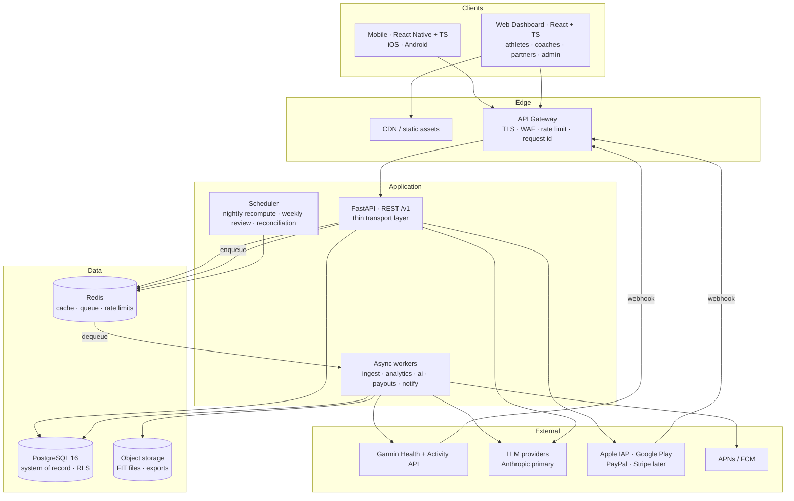
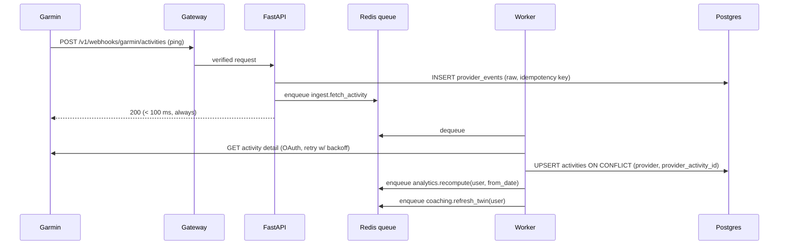

# 01 — Architecture Plan

**Status:** awaiting review · **Owner:** platform · **Supersedes:** nothing

This is the document to approve before service implementation begins. It answers:
what are the modules, how do they talk, what runs synchronously versus in a
queue, where does state live, and how does each piece grow from 1,000 to
1,000,000 athletes without a rewrite.

---

## 1. Guiding decisions

| # | Decision | Why |
|---|---|---|
| 1 | **Modular monolith first, service boundaries drawn from day one** | Eight network services for a pre-launch product buys distributed-systems failure modes and pays for them in velocity. We define the eight modules as hard in-process boundaries with their own schemas, and extract any one to its own deployable when its scaling profile actually diverges. Extraction is then a deployment change, not a redesign. See ADR-001. |
| 2 | **The analytics engine is a pure library, not a service** | It is CPU-only, has no I/O, and every other module needs it. As a library it is callable from the API, the worker, and the ML scripts with no network hop. Already built: `backend/algorithms/`. |
| 3 | **Every heavy path is a queued job, never a request** | Garmin ingest, full analytics recompute, AI weekly reviews, notifications, payout processing. A provider webhook must return in <100 ms or the provider retries and we duplicate work. |
| 4 | **Postgres is the system of record; Redis is never the system of record** | Redis holds cache, rate-limit counters and the job queue. Anything in Redis must be reconstructible from Postgres. |
| 5 | **Derived data is stored, not recomputed on read** | Readiness, CTL/ATL, efficiency and risk are written to `daily_metrics` by the worker. A dashboard read is one indexed row fetch, not 90 days of maths. |
| 6 | **Money is a double-entry ledger, never a mutable balance column** | Wallet balance is derived from immutable ledger entries. See §7 and `docs/02-database-design.md` §6. |

---

## 2. System context



---

## 3. Module decomposition

Each module owns a **schema namespace** in Postgres and exposes a **service
interface** (a Python protocol). Cross-module access goes through that interface
— never by importing another module's ORM models or querying its tables. This is
the rule that makes later extraction mechanical.

```
backend/
├── algorithms/              # ✅ BUILT — pure analytics library, stdlib only
├── core/                    # config, security primitives, errors, logging, tenancy context
├── modules/
│   ├── identity/            # Authentication Service + User Service
│   ├── training/            # Training Data Service (activities, wellness, metrics)
│   ├── coaching/            # AI Engine Service (context, chat, plans, digital twin)
│   ├── billing/             # Payment Service (subscriptions, receipts, entitlements)
│   ├── rewards/             # Rewards Service (wallet ledger, points, payouts)
│   ├── partners/            # Partner Service (marketplace, offers, commissions)
│   ├── community/           # groups, challenges, feed
│   └── notifications/       # Notification Service (push, email, digests)
├── integrations/            # provider adapters — garmin, apple_health, coros, polar…
├── api/                     # FastAPI routers, dependencies, schemas (transport only)
├── workers/                 # queue consumers + scheduled jobs
└── database/                # session/engine, base model, RLS helpers
```

Each module directory has the same internal shape:

```
modules/<name>/
├── __init__.py       # exports the public service interface only
├── models.py         # SQLAlchemy models (this module's tables only)
├── schemas.py        # Pydantic DTOs at the module boundary
├── repository.py     # all SQL for this module; enforces tenant scoping
├── service.py        # business rules; the only thing other modules may call
└── events.py         # domain events this module publishes
```

### Module responsibilities and why each boundary exists

| Module | Owns | Extract to its own service when |
|---|---|---|
| **identity** | users, credentials, sessions/refresh tokens, roles, consents, organisations | Almost never — auth is latency-critical and low-volume. Extract only for compliance isolation. |
| **training** | activities, streams, wellness, `daily_metrics`, provider connections | Write volume from provider ingest is the first thing to outgrow a shared deployment. **Likely first extraction.** |
| **coaching** | conversations, context packets, plans, athlete digital twin, model runs | LLM calls are slow and bursty; isolating them stops a provider slowdown from starving HTTP workers. **Likely second extraction.** |
| **billing** | subscriptions, receipts, provider webhooks, entitlements | Extract for PCI/audit scope reduction if we ever touch card data directly (we do not plan to). |
| **rewards** | wallet ledger, points rules, redemptions, payouts | Extract when payout volume justifies an independent audit boundary. |
| **partners** | partner accounts, offers, attributed conversions, commissions | Extract when partners get their own API surface (§9, Phase 5). |
| **community** | groups, memberships, challenges, achievements | Extract if the social feed becomes read-heavy enough to need its own cache tier. |
| **notifications** | device tokens, delivery log, preferences, quiet hours | Extract early if fan-out volume grows — it is trivially stateless. |

### The dependency rule

```
api ──▶ modules ──▶ algorithms
 │         │  └────▶ integrations
 │         └───────▶ core, database
workers ──▶ modules
```

Enforced in CI by an import-linter contract (`make lint-arch`):
`algorithms` may import nothing from the project; `modules/*` may not import
each other's internals, only `modules.<other>.service`; `api` may not import
`repository` or `models` directly.

---

## 4. Request paths

### 4.1 Synchronous — dashboard read (target p95 < 150 ms)

```
GET /v1/metrics/readiness/today
  → gateway: auth (JWT verify, ~0.1 ms, no DB hit)
  → API: resolve tenant context, set RLS session vars
  → Redis: GET metrics:{user}:{date}          # hit ~90%
  → miss: one indexed SELECT on daily_metrics, SET with 15-min TTL
  → serialise
```

No analytics computation happens in a request. If `daily_metrics` has no row for
today, the API returns the last computed row with `stale_as_of` set and enqueues
a recompute — it does not block the athlete's dashboard on a 90-day CTL walk.

### 4.2 Asynchronous — Garmin ingest



**Why a raw-event table first:** the provider is the source of truth and its
payloads change. Persisting the raw payload before parsing means a parser bug is
replayable rather than a permanent data loss, and a schema change on Garmin's
side is a backfill, not an incident.

**Idempotency:** `(provider, provider_activity_id)` is unique. Garmin retries
pings; every consumer is written to be safely re-runnable.

### 4.3 Asynchronous — AI coach message

Streaming response, but all data assembly happens before the model is called —
see `docs/05-ai-architecture.md` for the context packet and tool surface.

---

## 5. Cache design (Redis)

| Key | Contents | TTL | Invalidated by |
|---|---|---|---|
| `metrics:{user_id}:{date}` | serialised daily metrics row | 15 min | analytics recompute for that date |
| `twin:{user_id}` | athlete digital twin snapshot | 6 h | new activity, new wellness day |
| `ctx:{user_id}:{date}` | AI context packet (also the LLM cache prefix) | 24 h | recompute, profile edit |
| `ent:{user_id}` | entitlements (tier, sensor unlocks, quotas) | 5 min | subscription webhook, admin change |
| `zones:{user_id}` | computed training zones | 24 h | threshold change |
| `rl:{scope}:{id}:{window}` | rate-limit counters | window | — |
| `feed:{group_id}:page1` | community feed head | 60 s | new post |

Rules: every cached value carries the schema version in its key prefix, so a
deploy that changes a shape cannot read a stale shape. Nothing user-authorising
is cached longer than 5 minutes (entitlements) so a cancelled subscription loses
access promptly. Cache misses must always be correct and never fatal.

**Stampede protection:** single-flight lock per key (`SET NX` with a short TTL);
losers wait briefly then read the filled key.

---

## 6. Queue design

Redis-backed job queue (**arq** — asyncio-native, so it shares the API's async
stack; Celery is the alternative if we later need its ecosystem — ADR-006).

| Queue | Jobs | Concurrency | Retry | Notes |
|---|---|---|---|---|
| `ingest` | fetch activity, fetch dailies, backfill window, deregistration | high | 5, exp backoff + jitter | Rate-limited per provider; a backfill is chunked into windows. |
| `analytics` | recompute metrics from date, rebuild baselines | medium | 3 | Coalesced: many activities for one athlete in a minute collapse into one job. |
| `ai` | weekly deep review, twin refresh, eval runs | low | 2 | Weekly reviews go through the Batch API (50% cheaper, not latency-sensitive). |
| `notify` | push, email, digest fan-out | high | 3 | Respects quiet hours and per-user preferences. |
| `billing` | receipt validation, subscription reconciliation | medium | 5 | Idempotent on provider transaction id. |
| `payout` | eligibility check, payout execution | low | manual | **Never auto-retried on ambiguous failure** — a duplicated payout is worse than a delayed one. Requires an operator decision. |

**Dead-letter queue** per queue, with an admin surface. A job exhausting retries
alerts rather than disappearing.

**Job idempotency:** every job takes a deterministic key; handlers are written so
running twice equals running once. This is a review requirement, not a hope.

---

## 7. Money and ledger architecture

Two separate concerns that are commonly and dangerously conflated:

1. **Subscription entitlement** — did this athlete pay for Premium? Source of
   truth is the provider (Apple/Google/PayPal), mirrored locally with a
   reconciliation job. We never grant access from a client-side claim.
2. **Rewards wallet** — what has this athlete earned and what may they spend?
   Source of truth is our own **append-only double-entry ledger**.

```
wallet_ledger_entries (immutable, append-only)
  id, wallet_id, account, direction (debit|credit), amount_minor,
  currency, reason_code, reference_type, reference_id,
  reward_policy_version, created_at, created_by

balance(wallet, account) := SUM(credits) - SUM(debits)   -- derived, never stored as truth
```

Every earn, redemption, reversal and payout is one balanced transaction of two or
more entries. Consequences that matter:

* A bug can never "lose" a balance — entries are never updated or deleted, only
  offset by a compensating entry.
* Every balance is explainable to the athlete and auditable by us.
* Reward split percentages (the spec requires them to be changeable) live in a
  versioned `reward_policies` table, and every entry records which version
  applied. Changing the policy never retroactively rewrites history.

**Payout safety:** eligibility (KYC state, minimum balance, account age, fraud
score, cooling-off period) is evaluated as a gate that produces an auditable
decision record. Payout execution is single-attempt with an idempotency key held
against the provider; ambiguous results park in a manual-review state.

---

## 8. Security architecture (summary — full review in `docs/06-security-privacy.md`)

* **Authentication:** short-lived access JWT (10 min, asymmetric ES256) + opaque
  rotating refresh token stored hashed, with reuse detection that revokes the
  whole family. Web keeps the refresh token in an `HttpOnly; Secure;
  SameSite=Strict` cookie with CSRF double-submit; mobile uses
  Keychain/Keystore. Access tokens are never persisted client-side.
* **Authorisation:** RBAC (`athlete`, `coach`, `partner`, `admin`, `support`)
  plus per-resource grants. A coach sees an athlete's data only via an explicit,
  scoped, expiring, athlete-revocable `data_access_grants` row.
* **Tenant isolation:** enforced twice. Application-level scoping in every
  repository method, and Postgres **row-level security** keyed on
  `app.current_user_id` / `app.current_org_id` session variables, with the
  application connecting as a role that has neither `BYPASSRLS` nor superuser. A
  missed `WHERE user_id = …` becomes an empty result set, not a data leak.
* **Health data at rest:** provider OAuth tokens and payout identifiers are
  encrypted at the column level (AES-256-GCM, envelope-encrypted with a KMS key,
  key id stored alongside the ciphertext for rotation). Full-disk encryption is
  assumed but not treated as sufficient.
* **No card data ever touches our servers** — provider-hosted flows only.

---

## 9. Scaling path

Sized against the actual growth constraint: ingest write volume and analytics
recompute, not HTTP reads.

| Stage | Athletes | Shape | The constraint that forces the next step |
|---|---|---|---|
| 0 | < 1k | 1 API container, 1 worker, managed Postgres, managed Redis | — |
| 1 | 1k–25k | 2–4 API containers behind the gateway; workers scaled per queue; Postgres read replica for dashboards/analytics | Worker backlog during the evening ingest peak |
| 2 | 25k–150k | `training` extracted to its own deployable + its own DB; `activity_streams` on object storage with only summaries in Postgres; monthly partitioning on high-volume tables | Table size on `activities` / `activity_streams`; recompute duration |
| 3 | 150k–500k | `coaching` extracted; Redis cluster; per-tenant connection pooling (pgBouncer); nightly recompute sharded by user id | Postgres write throughput; LLM concurrency |
| 4 | 500k+ | Horizontal shard of athlete-scoped data by `user_id`; analytics reads served from a columnar store fed by CDC | Single-primary write ceiling |

Designed in from day one so the above is incremental:

* Every athlete-scoped table carries `user_id` as the natural shard key.
* No cross-athlete transactions anywhere in the domain — the one exception,
  group challenges, aggregates asynchronously.
* All ids are UUIDv7 (time-ordered, so index locality is good and shard splits
  do not hot-spot; no sequence to coordinate across shards).
* High-volume time-series tables are created **partition-ready** (declarative
  range partitioning on the time column, monthly) so partitioning is a migration
  rather than a redesign.

---

## 10. Observability

| Concern | Approach |
|---|---|
| **Logs** | Structured JSON (`structlog`), one event per line, always carrying `request_id`, `user_id` (never email/name), `route`, `latency_ms`, `outcome`. A PII scrubber runs in the logging pipeline, not at call sites — a call site can be forgotten. |
| **Traces** | OpenTelemetry across gateway → API → worker → DB → LLM. The AI path is the one we most need traces for: "why was that answer slow" is otherwise unanswerable. |
| **Metrics** | RED per route (rate/errors/duration); per-queue depth, age of oldest job, retry rate; DB pool saturation; cache hit ratio; LLM tokens, cost and latency per route and per model. |
| **Errors** | Sentry with release tagging and PII stripping. |
| **Health** | `/healthz` (liveness, no dependencies) and `/readyz` (DB + Redis reachable). Separated so a Redis blip does not roll every pod. |
| **Alerts** | Paging: error rate, ingest queue age > 30 min, payout job failure, auth failure spike, DB replica lag. Non-paging: cost anomaly, cache hit-rate drop, eval-score regression. |
| **Audit log** | Append-only `audit_events` for every read of another person's health data, every admin action, every entitlement or wallet change. Required by §8 and by GDPR accountability. |

---

## 11. Reliability and disaster recovery

* **Backups:** managed Postgres with PITR; retention 30 days. Restore is
  **rehearsed quarterly** into a scratch environment and the restore time
  recorded — an untested backup is not a backup.
* **Targets:** RPO ≤ 5 min (WAL shipping), RTO ≤ 4 h for full region loss.
* **Degradation ladder:** LLM provider down → coach chat returns the
  deterministic analytics summary and says the coach is unavailable. Garmin down
  → ingest queues drain when it returns; the app shows last-sync time. Redis down
  → cache misses fall through to Postgres, rate limiting fails closed on
  auth/AI routes and open on reads.
* **Data integrity jobs:** nightly reconciliation of subscription state against
  each provider; daily ledger trial balance (every transaction sums to zero);
  weekly orphaned-record sweep. Each writes a report an operator reads.

---

## 12. Environments and delivery

| Environment | Purpose | Data |
|---|---|---|
| local | development | Docker Compose; synthetic athletes from `ml/` generators |
| ci | tests | ephemeral Postgres + Redis per run |
| staging | pre-release, store review builds | anonymised or synthetic only — never production health data |
| production | live | real |

Pipeline: lint → typecheck → arch-contract → unit → integration → security tests
→ migration dry-run (`--sql` output diffed, applied to a scratch DB) → build →
deploy staging → smoke → manual gate → production.

**Database migrations are never applied automatically by the pipeline.** Per
project policy every schema or data change ships as a reviewed SQL file in
`database/migrations/` and is executed by a developer. See `database/README.md`.

---

## 13. What this document deliberately does not do

* It does not adopt gRPC, GraphQL, Kubernetes, Kafka or a service mesh. Each is
  justifiable later; none is justifiable before the first thousand athletes, and
  each would slow the MVP measurably.
* It does not decide the cloud provider — nothing here depends on one. Managed
  Postgres + Redis + object storage + a container runtime exist on all three.
* It does not build the ML training infrastructure. Until we have labelled
  outcomes there is nothing to train; see `docs/09-testing-and-model-governance.md`.

---

## 14. Open questions for review

1. **Cloud provider** — AWS, GCP or Azure? Affects managed-service choices only.
2. **Garmin Developer Program** — approval is a gating dependency with a lead
   time measured in weeks and must start now, before any code depends on it.
3. **Israeli Privacy Protection Law (Amendment 13)** — health data is sensitive
   information; confirm whether a DPO appointment and database registration are
   required at our expected scale, with counsel.
4. **Coach role in MVP?** The spec lists coaches; carrying the grant/permission
   model into Phase 1 costs roughly a week. Recommendation: build the schema now,
   ship the UI in Phase 4.
5. **Reward payout legality** — converting in-app points to cash or credit has
   consumer-protection and tax implications in Israel. Needs counsel before
   Phase 4, and the ledger is designed so this can be answered late.
