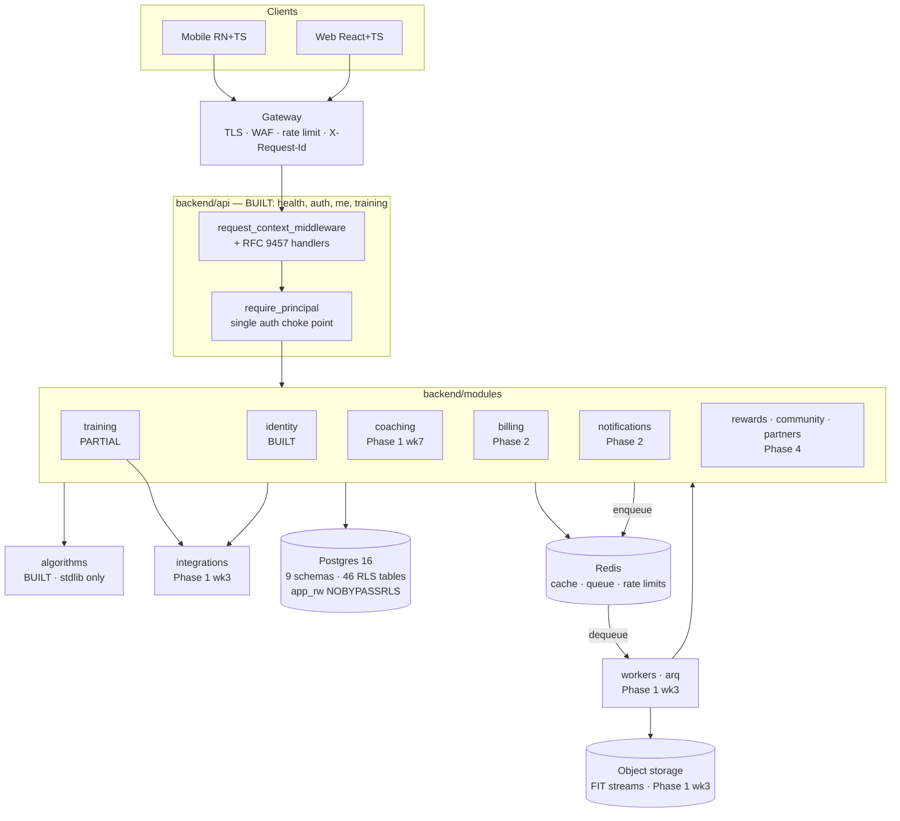

# 11 — Architecture Update After Phase 1

**Status:** awaiting review · **Owner:** platform · **Extends:** `docs/01-architecture.md`
(does not supersede it) · **Constraint:** ADR-001 stands — modular monolith, one
deployable, hard boundaries.

`docs/01` was written before any infrastructure existed. This document records what
building Phase 1 **proved**, what it **corrected**, and the architectural decisions
Phase 2 cannot start without. It is a delta: where `docs/01` is still right, this
document says so and stops.

---

## 1. What Phase 1 actually established

### 1.1 Inventory

| Layer | Path | Status | Verifiable evidence |
|---|---|---|---|
| Analytics engine | `backend/algorithms/` | **BUILT** | 9 modules; **209 tests** pass under bare `python3 -m unittest discover -s tests/algorithms -t .`, zero third-party packages installed |
| Core primitives | `backend/core/` | **BUILT** | `config` (production-safety validators), `errors` (RFC 9457), `context` (`Principal`/`RequestContext`), `security` (Argon2id, ES256 + algorithm allowlist), `logging` (structlog PII scrub), `ids` (UUIDv7), `etag` |
| DB access | `backend/database/` | **BUILT** | `Database.session(principal)` — one transaction, RLS context via parameterised `set_config(..., true)`; `SYSTEM_PRINCIPAL`; `apply_principal()` for mid-transaction re-scoping |
| identity | `backend/modules/identity/` | **BUILT** | register, login, refresh rotation with reuse detection + family revoke, logout/logout-all, consent, sessions, audit |
| training | `backend/modules/training/` | **PARTIAL** | profiles, goals, personal bests, computed zones (calls `algorithms.zones`). Activities, wellness, ingest not built |
| api | `backend/api/` | **PARTIAL** | app factory + lifespan `AppServices`, `request_context_middleware`, RFC 9457 handlers, routers `health`/`auth`/`me`/`training` |
| Schema | `database/migrations/0001–0010` | **BUILT & APPLIED** | 9 schemas + `app`; `app_rw`/`app_ro` are `NOSUPERUSER NOBYPASSRLS`; **46** RLS-enabled tables in `0009` (32 by loop + 14 explicit) |
| Contracts | `pyproject.toml` `[tool.importlinter]` | **BUILT** | 4 contracts, run by `make lint-arch` in CI |
| Tests | `tests/` | **BUILT** | algorithms + integration + `tests/security/` (tenant-isolation matrix, RLS enforcement), `-m security` gate |

### 1.2 Assumptions from `docs/01` that building validated

* **RLS fails closed as designed** (ADR-005). Unset context ⇒
  `app.current_user_id()` is NULL ⇒ every predicate filters every row.
  `tests/security/test_rls_enforcement.py` asserts it against a real database built
  from the reviewed migration files, not from ORM metadata.
* **`SET LOCAL`, not `SET`** — transaction scoping is what makes a pooled connection
  safe to reuse. Necessary, not merely tidy.
* **The engine-as-library call is free** (ADR-003). `training.service` imports
  `algorithms.zones` directly; `api → modules → algorithms` needed no adapter.
* **`None` never becomes `0` across the boundary.** Thresholds stay nullable; a
  missing FTP degrades the load source and says so. `asdecimal=False` on every
  `NUMERIC` is load-bearing — a `Decimal` from the driver would meet a float in a
  physiology formula.
* **Isolation tests before endpoint volume** (roadmap 1.5) was the right order: the
  matrix was written against two endpoints, not twenty.

### 1.3 Assumptions that needed adjustment

These are architectural, not incidental. Each is now a rule.

1. **RLS has a chicken-and-egg problem `docs/01` did not anticipate.** Login looks up
   a user by email and refresh looks up a token by hash — both *before* a principal
   exists, against tables whose policy is `USING (id = app.current_user_id())`.
   Rejected: giving the app `BYPASSRLS` (discards the whole backstop for two
   queries); exempting `identity.users` and `identity.refresh_tokens` from RLS
   (those tables are exactly what the backstop is for). Adopted in **migration
   0010**: three narrow `SECURITY DEFINER` functions —
   `identity.lookup_user_for_authentication`, `identity.lookup_refresh_token`,
   `identity.revoke_token_family` — each with one lookup key, a fixed column list,
   no dynamic SQL, `search_path` pinned, `EXECUTE` granted only to `app_rw`, and no
   email/name/profile column returned, so none is an exfiltration primitive.
   **Rule: these are the only sanctioned RLS holes. A fourth one is an architecture
   review, not a migration.**
2. **The RLS context changes *within* a request.** `docs/01` implied one context set
   once per request. Three flows learn the principal after the transaction is open:
   registration (the `WITH CHECK (id = app.current_user_id())` policy on
   `identity.users` requires the context to already name the new id), login and
   refresh. Hence `Database.apply_principal()` and the explicit, greppable
   `SYSTEM_PRINCIPAL` — there is no implicit unscoped mode.
3. **Some flows must commit a side effect and then fail.** A failed login must
   persist the incremented attempt counter and still return `401`; raising inside
   the transaction rolls the counter back and makes lockout unenforceable. The
   pattern: record the outcome, exit the transaction cleanly, raise afterwards.
   `docs/01` §4 described request paths but never named this discipline. **Rule: any
   flow that both counts an abuse signal and denies the request uses it, and says so
   in a docstring.**
4. **ETags are content hashes, not row versions.** `updated_at` has clock
   granularity and depends on a trigger firing; `xmin` is a real row version but
   freezing can rewrite it, after which two unrelated rows share a tag. A SHA-256 of
   the served JSON is what RFC 9110 §8.8.3 describes a strong validator as being,
   needs no column, and cannot go stale. The less obvious half: **`If-Match` is
   compared inside the service transaction, not in the router** — comparing in
   transport reopens the lost-update race the header exists to close.
5. **`import-linter`'s `independence` contract is stricter than `docs/01` §3 says.**
   `docs/01` and ADR-001 describe the rule as "cross-module calls go through
   `modules.<other>.service` only". The contract in force forbids
   `backend.modules.identity` and `backend.modules.training` from importing each
   other **at all**, `service` included. Phase 1 never noticed: the two modules do
   not call each other, and the one place they compose — profile and goals sitting
   beside identity under `/v1/me` — is composed in the `api` layer by mounting two
   routers under one prefix. Phase 2 breaks this (§3). Two related warts:
   `independence` has no optional-module syntax, so a new module directory silently
   escapes the contract; and the reviewer note in `pyproject.toml` points at a drift
   check in `tests/architecture/` **which does not exist**.
6. **`events.py` is specified but unbuilt.** `docs/01` §3 puts it in every module's
   internal shape; no module has one, because no domain event has been needed. §3
   defines what it becomes before anyone writes the first one.
7. **"One schema per module" is already not literal.** Nine schemas exist for eight
   modules: `analytics` holds `daily_metrics` and `data_quality_flags` (which
   `docs/02` §2 attributes to the **training** module) plus the governance tables.
   Restated rule: *every table has exactly one owning module*, and a module may own
   tables in the shared `analytics` schema. Proposed ownership — `daily_metrics`,
   `data_quality_flags`, `prediction_records`, `prediction_outcomes` → **training**;
   `eval_runs` → **coaching**; `algorithm_versions` and `experiment_assignments` →
   platform configuration, written by migration or the admin surface, read by both.
   Rejected: a ninth `analytics` module — it would own no behaviour the worker does
   not already own. Documentation only; no schema change.

---

## 2. Updated module map

| Module | Schema(s) owned | Status | Lands |
|---|---|---|---|
| **identity** | `identity` | **BUILT** | MFA activation (`mfa_credentials` exists, empty) Phase 2; grants UI Phase 4 |
| **training** | `training`, part of `analytics` | **PARTIAL** | ingest + wellness + `daily_metrics` Phase 1 wk 3–6; twin inputs Phase 3 |
| **coaching** | `coaching`, `analytics.eval_runs` | **PLANNED Phase 1 wk 7–8** | Batch deep review Phase 2; digital twin Phase 3 |
| **billing** | `billing` | **PLANNED Phase 2** | 2.1–2.3 |
| **notifications** | `notifications` | **PLANNED Phase 2** | 2.4 |
| **rewards** | `rewards` | **PLANNED Phase 4** | 4.1–4.2, 4.8 |
| **community** | `community` | **PLANNED Phase 4** | 4.3–4.4 |
| **partners** | `partners` | **PLANNED Phase 4** | 4.5–4.7 |

Supporting layers: `algorithms` **BUILT** · `core` **BUILT** · `database` **BUILT**
· `api` **PARTIAL** · `integrations` **PLANNED Phase 1 wk 3** · `workers`
**PLANNED Phase 1 wk 3**.

Two clarifications Phase 1 forced onto the dependency rule: `integrations` is reached
**only** from `modules` (never from `api`, never from `workers` directly), and
`workers` is a **second entry point into the same module services**, not a parallel
implementation.

---

## 3. Cross-module orchestration — the decision Phase 2 is blocked on

### 3.1 The problem, concretely

Three real Phase 2 flows cross module lines, and today's `independence` contract
forbids the import each would need:

| Flow | Needs |
|---|---|
| Gated sensor analyzer (roadmap 2.5) | `training` must ask `billing` "is this athlete entitled to `sensor.running_dynamics`?" — a **synchronous read on the request path** |
| AI message quota (1.20, 2.1) | `coaching` must ask `billing` for tier and remaining quota before calling a model |
| Daily readiness push (2.4) | recompute finishing in `training` must reach `notifications` — a **write, fan-out, must not block or fail the recompute** |

### 3.2 Options

| Option | Mechanism | Cost |
|---|---|---|
| **A — relax to service-only imports** | Replace `independence` with per-module `forbidden` contracts banning every other module's `models`/`repository` | Loses cycle detection. A `training ↔ coaching` cycle is exactly what stops the Phase-5 extraction from being mechanical |
| **B — keep strict independence, add an event bus** | All cross-module traffic becomes events over arq | Forces request/reply over a queue for a synchronous entitlement read. That is a distributed system inside one process — the precise cost ADR-001 declined to pay |
| **C — hybrid (recommended)** | Direction-aware: synchronous reads by direct `service` import under a **module-level `layers` order**; fan-out by domain event | One more contract to maintain, and a rule reviewers must know |

### 3.3 Recommendation — Option C

Replace the flat `independence` contract with two contracts:

1. A **`layers` contract over `backend.modules.*`** fixing an explicit module DAG,
   lowest first: `identity` → `billing` → `training` → `coaching` → `rewards` →
   `partners` → `community` → `notifications`. A module may import a *lower*
   module's `service`; never a higher one.
2. One **`forbidden` contract per module** naming that module's `models` and
   `repository` as forbidden to all other modules — preserving the property ADR-001
   actually cares about: the boundary is the DTO surface, not the ORM.

Why this and not the alternatives:

* **The layer order *is* the extraction order read backwards.** A module that only
  imports downward is extracted by swapping those imports for an HTTP client. A
  cycle cannot be. This makes roadmap 5.4 mechanical, which is ADR-001's whole
  premise; a flat `forbidden` matrix (Option A alone) does not.
* **Events are wrong for reads.** "Is this athlete premium?" must be answered before
  the response is serialised. Modelling it as an event means correlation ids,
  timeouts and a partial-failure mode on the dashboard read path.
* **Direct calls are wrong for fan-out.** `notifications` sits at the top of the
  DAG on purpose: everything wants to notify, and nothing may import it. That
  inversion is the signal that says "use an event". Same for `rewards`.
* **`layers` supports the `(parenthesised)` optional syntax that `independence`
  lacks**, which removes the maintenance wart recorded in §1.3 item 5: all eight
  modules can be named now, parenthesised until they exist, so a new module
  directory is inside the contract from its first commit.

Also close the gap the `pyproject.toml` comment already promises: add the
**`tests/architecture/` drift check** asserting that every directory under
`backend/modules/` appears in both contracts. A contract that silently omits a
module is worse than no contract.

### 3.4 The three sanctioned patterns

| Pattern | Use when | Mechanism |
|---|---|---|
| **Direct downward `service` call** | Synchronous read, caller needs the answer, callee is lower in the DAG | Import `modules.<lower>.service` only |
| **API-layer orchestration** | A client-facing operation spans two modules and neither should depend on the other | The router calls service A, then service B, and composes. Already in production: `/v1/me` mounts the `identity` and `training` routers under one prefix. **Rule: the router may sequence service calls; it may never contain a business rule or a cross-module transaction** |
| **Domain event** | Fan-out, upward direction, or the publisher must not block on or fail with the consumer | Publisher's `events.py` defines the payload; the arq queue delivers; consumers are jobs in `workers` calling module services |

`events.py` becomes a real contract: a frozen dataclass per event carrying
`user_id`, an event id, an `occurred_at`, and derived values only — never an ORM
object, never health values in a payload that will be logged. Consumers live in
`workers`, never in the publishing module.

**Transactional correctness.** Redis is not in the Postgres transaction, so a naive
enqueue can publish an event for a transaction that then rolls back. Two tiers:

* **Advisory events** (twin refresh, cache invalidation, recompute-requested) —
  enqueue after commit. Losing one is self-healing on the next recompute.
* **Consequential events** (reward earned, entitlement changed, payout state) —
  written to a **transactional outbox table in the publishing module's own schema**
  and drained by a worker, giving at-least-once delivery with idempotent consumers.
  This is a new table per publishing module: **described here, sequenced in
  `docs/19` (Database Evolution)**, applied by a human per ADR-012.

---

## 4. New architectural components in Phase 2+

| Component | Sits | May import | May **not** import | Status |
|---|---|---|---|---|
| `backend/integrations/` | Between `modules` and external providers | `core` only (+ provider SDKs) | any `modules.*`, `api`, `workers`, `database` — an adapter never touches our schema | **PLANNED Phase 1 wk 3** (Garmin), Phase 5 (Apple Health, Coros, Polar, Suunto) |
| `backend/workers/` | Second entry point, above `modules` | `modules.*.service`, `core`, `database`; NumPy/Pandas permitted in the batch path per ADR-004 | `api`, any module's `repository`/`models` | **PLANNED Phase 1 wk 3**; `make worker` target already exists |
| Object storage | Beside Postgres | Reached from `training.service` (write path) and `api` (signed-URL read) | Never the system of record. `activity_streams` holds key + sample count + checksum only | **PLANNED Phase 1 wk 3** |
| Entitlements read path | `billing.service`, one layer above `identity` | — | Never a client claim. `ent:{user_id}` cached ≤ 5 min so a cancellation loses access promptly (`docs/01` §5) | **PLANNED Phase 2** |
| AI provider layer | Inside `coaching`, behind the `LLMProvider` protocol (ADR-011, `docs/05` §7) | `core`, the Anthropic SDK | any `modules.*`, `database` — it takes a built context packet and returns a completion; it never reads the database, so a prompt injection has no data path | **PLANNED Phase 1 wk 7** |

Two rules that hold for all five: **the adapter layer is reached from a service, not
from transport**, and **a provider outage degrades rather than fails** — the
degradation ladder in `docs/01` §11 is the contract each adapter is tested against.

---

## 5. Module contract blocks

Only the four modules whose *architecture* changes most. API and schema detail
belong to `docs/12`+ and `docs/19`; this is the architectural delta.

### training — **PARTIAL → the first module with two writers**

* **Purpose.** Own everything an athlete did and every metric derived from it.
* **Responsibilities.** Provider connections; raw event capture; normalised
  activities, laps, stream pointers, wellness; materialised `analytics.daily_metrics`.
  It becomes the first module written by both `api` (manual entry, RPE edits) and
  `workers` (ingest, recompute), so **every write must be idempotent and
  order-independent**, not merely correct.
* **Database changes.** Activation of existing tables from `0003`
  (`provider_connections`, `provider_events`, `activities`, `activity_laps`,
  `activity_streams`, `provider_activity_map`, `daily_wellness`) and `0004`
  (`daily_metrics`, `data_quality_flags`); ORM models plus an outbox table. No base
  schema is invented. **Sequenced in `docs/19` (Database Evolution).**
* **APIs required.** `GET/POST/PATCH/DELETE /v1/activities…`,
  `GET /v1/activities/{id}/streams`, `GET /v1/metrics/{readiness,training-load,acwr,injury-risk,efficiency,predictions,summary}`,
  `GET/POST/DELETE /v1/integrations/{provider}…`, `POST /v1/webhooks/garmin/*`.
* **Dependencies.** `integrations` (Garmin); `billing.service` for gated analyzers
  (downward, allowed under §3.3); `algorithms`. Publishes `activity.ingested`,
  `metrics.recomputed`.
* **Security.** RLS `owner_all` already on all seven tables. `provider_events` is
  deliberately **not** RLS-scoped (written with no user context) and has no
  user-facing read path — recorded in `0010`. OAuth tokens column-encrypted, KMS
  envelope, `key_id` stored. Webhooks: verify → persist → enqueue → `200`; an
  unverified signature is persisted `signature_verified=false` and **never acted on**
  (OWASP A08). Stream URLs short-lived and signed, never a public bucket path.
* **Testing.** Recorded-payload contract tests for the adapter (also the mock that
  unblocks development before Garmin approval); idempotency test replaying every
  ingest job twice; a tenant-isolation matrix row per new endpoint; `422
  readiness_insufficient_data` below data-quality 0.35.

### coaching — **PLANNED Phase 1 wk 7 → the module with a non-Postgres dependency**

* **Purpose.** Turn derived metrics into decisions.
* **Responsibilities.** Context packet assembly, deterministic router, model calls,
  tool execution, plans and adaptations, cost accounting. It is the first module
  whose latency is dominated by a third party — which is exactly why it is
  extraction candidate #2.
* **Database changes.** Activate `0005` (`ai_conversations`, `ai_messages`,
  `ai_message_feedback`, `ai_usage_counters`, `training_plans`, `plan_sessions`,
  `plan_adaptations`, `athlete_twin_snapshots`). **Sequenced in `docs/19`.**
* **APIs required.** `GET/POST /v1/coach/conversations`,
  `GET/POST /v1/coach/conversations/{id}/messages` (SSE, `Idempotency-Key`),
  `POST /v1/coach/messages/{id}/feedback`, `GET/POST /v1/training-plans…`.
* **Dependencies.** `training.service` and `billing.service` (both downward);
  Anthropic via `LLMProvider`. Consumes `metrics.recomputed`; publishes `plan.adapted`.
* **Security.** Tools are read-only, server-scoped, execute under the caller's
  identity and **take no user-id parameter**, so a fully successful injection has no
  argument through which to ask for another athlete's data; every result is
  RLS-filtered. The packet carries an age **band**, no name/email/GPS/raw streams.
  Check `stop_reason` before reading content. Record provider, `model_id`,
  `prompt_version`, tokens and micro-USD on every message row.
* **Testing.** 40-case golden eval with grounding and safety assertions; a numeric
  grounding test asserting every number in an answer appears in the packet; a
  prompt-cache test asserting `cache_read_input_tokens > 0` on turn two; quota
  enforcement integration test.

### billing — **PLANNED Phase 2 → the module everything reads**

* **Purpose.** Mirror provider subscription truth and resolve entitlements.
* **Responsibilities.** Receipt validation, webhook ingest, nightly reconciliation,
  the entitlement read path. Placed **second-lowest in the DAG** because `training`,
  `coaching` and `community` all read it and it reads only `identity`.
* **Database changes.** Activate `0006` (`subscription_plans`, `subscriptions`,
  `payments`, `payment_webhook_events`, `entitlements`) + an outbox table.
  **Sequenced in `docs/19`.**
* **APIs required.** `GET /v1/subscription`, `GET /v1/subscription/plans`,
  `POST /v1/subscription/receipts/{apple,google}`,
  `POST /v1/subscription/paypal/agreement`, `POST /v1/subscription/cancel`,
  `GET /v1/entitlements`, `POST /v1/webhooks/{apple-iap,google-play,paypal}`.
* **Dependencies.** `identity.service`; Apple/Google/PayPal. Publishes
  `entitlement.changed` (consequential ⇒ outbox).
* **Security.** No card data ever reaches our servers — provider-hosted flows only,
  keeping us out of PCI-DSS scope **by construction**. Never trust a client
  entitlement claim (the commonest IAP bypass). Replay protection via
  `UNIQUE (provider, provider_event_id)`. `Idempotency-Key` required on every
  money-moving non-GET. Entitlement changes write `identity.audit_events`.
* **Testing.** Property test on every money path (`amount_minor` + currency, never a
  float); replayed-webhook test; forged-signature test asserting persist-without-act;
  a reconciliation test where local and provider state disagree.

### notifications — **PLANNED Phase 2 → the module nothing may import**

* **Purpose.** Deliver, respecting consent and quiet hours.
* **Responsibilities.** Device tokens, per-kind preferences, quiet hours, delivery
  log, fan-out. **Top of the DAG**: reached only by domain events, which keeps it
  trivially extractable (`docs/01` §3) and stops a push-provider outage from failing
  a recompute.
* **Database changes.** Activate `0008` (`device_tokens`, `notification_preferences`,
  `notification_deliveries`). **Sequenced in `docs/19`.**
* **APIs required.** `GET/PUT /v1/me/notification-preferences`,
  `POST/DELETE /v1/me/devices`.
* **Dependencies.** APNs/FCM; consumes `metrics.recomputed`, `plan.adapted`,
  `entitlement.changed`. Imports nothing from `modules`.
* **Security.** Notification **bodies carry no health values** — a lock-screen
  preview is visible to anyone holding the phone, and the delivery log is queryable.
  A body is a template id plus a band, never a number. Tokens are athlete-scoped
  under RLS and deleted on logout-all. Quiet hours and opt-out are enforced in the
  service, not the client.
* **Testing.** Quiet-hours boundary tests across a DST change; opt-out honoured per
  kind; a fan-out test asserting one event yields exactly one delivery per active
  device; tenant-isolation matrix rows for both endpoints.

---

## 6. Deployment topology

| | Now (Stage 0–1) | At extraction (Stage 2–3) | True across both |
|---|---|---|---|
| Processes | 1 API container (`uvicorn`), 1 arq worker, 1 scheduler | + `training` deployable, later `coaching` | Same image, different entrypoint. `make run` / `make worker` today |
| Data | 1 managed Postgres (9 schemas), 1 Redis, 1 bucket | `training` gets its own database via `pg_dump --schema`; Redis cluster; read replica | Postgres is the only system of record (ADR-002) |
| Auth | ES256 JWT verified in-process | Same token verified by each deployable — public key only, no auth round trip | `require_principal` stays the single choke point |
| Isolation | RLS + repository scoping in one database | RLS + repository scoping in each database | `app_rw` never gains `BYPASSRLS`; **never** an admin or support exemption |
| Cross-module | Import or event, in-process | HTTP/RPC or event, over the network | The **call graph does not change** — only the transport. That is what §3.3's DAG buys |
| Migrations | Reviewed SQL in `database/migrations/`, applied by a human (ADR-012) | Per-database, same rule | Never applied by the app, CI or the deploy pipeline |

---

## 7. Open architectural questions

1. **Adopt Option C in §3.3?** It is a `pyproject.toml` change plus a drift test,
   and it blocks Phase 2. Decide before 2.1.
2. **Is the proposed module DAG order right?** Specifically: does `community`
   (Phase 4 challenges) need to read `training.service` for progress, which the
   order permits, or should it consume `activity.ingested` only? Recommendation:
   events only, so leaderboard aggregation cannot slow an ingest.
3. **Outbox per module, or one shared `app.domain_events` table?** Per module keeps
   the extraction clean; shared is less schema. Recommendation: per module.
4. **A fourth `SECURITY DEFINER` function for password reset?** The reset-token
   lookup has the same pre-authentication shape as login. It should follow the
   `0010` pattern rather than invent a new mechanism — confirm at review.
5. **Does `workers` get its own settings validation?** A worker that starts with a
   `app_migrator` connection string would be a silent RLS bypass. Recommendation:
   the `core.config` production validators must be asserted in the worker
   entrypoint too, not only the API's.
6. Still open from `docs/01` §14: cloud provider, Garmin Developer Program lead
   time, Amendment 13 / DPO obligation, payout legality.
