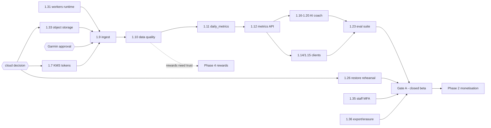
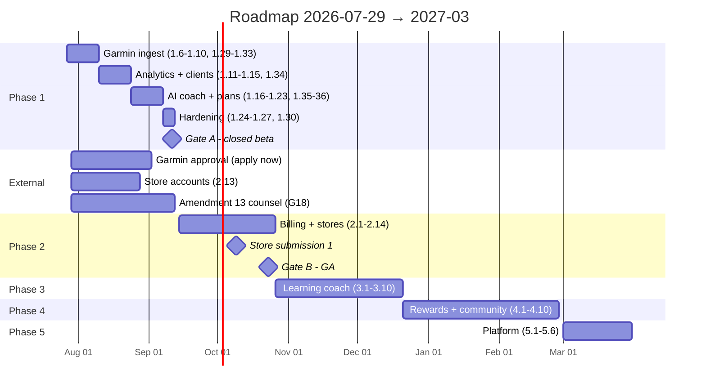

# 12 — Complete Roadmap: MVP to Production

**Status:** awaiting review · **Supersedes:** `docs/07` §Phase 1–5 at finer grain ·
**Anchor date:** 2026-07-29 (Wednesday of project week 3)

`docs/07` is the shape of the plan. This document is the plan you can run: every
remaining task carries a dependency, an estimate, an **exit criterion**, and a
**slip trigger** — the specific thing that will make it late. It also adds the
production-readiness gates `docs/07` implies but never enumerates, and the eight
Phase-1 tasks that only became obvious once Phase 1 started.

Any schema or data change named below is **deferred to reviewed SQL in `docs/19`
(Database Evolution)** and applied by a human. No migration numbers are assigned
here.

---

## 1. Where we are

**Phase 1 weeks 1–2 (tasks 1.1–1.5) are complete.** **BUILT** and on `main`:

| Area | State |
|---|---|
| `backend/algorithms/` | 9 modules, **209 tests**, zero dependencies |
| `backend/core/` | config (production validators), errors (RFC 9457), context, security (Argon2id, ES256), logging (PII scrub), ids (UUIDv7), etag |
| `backend/database/` | RLS-scoped async session, `SYSTEM_PRINCIPAL`, `apply_principal` |
| `backend/modules/identity/` | register, login, refresh rotation + reuse detection, logout-all, consent, sessions, audit |
| `backend/modules/training/` | Phase-1 subset — `athlete_profiles`, `athlete_goals`, `personal_bests` |
| `backend/api/` | app, deps, `health`/`auth`/`me`/`training` routers |
| `tests/` | algorithms + `integration/` (4 files) + `security/` (isolation matrix, RLS enforcement) |
| `database/migrations/` | `0001–0010` applied to dev; 46 RLS tables; `app_rw`/`app_ro` verified non-bypassing |
| CI | 4 jobs: analytics (zero-dep), quality (lint/types/arch contract), tests + security suite, dependency & secret audit |

**Remaining in Phase 1:** tasks **1.6–1.28** (23 tasks, ~53 engineer-days across
two engineers) plus **1.29–1.36** below. Two directories the plan assumes do not
exist yet: `backend/integrations/` (expected — lands weeks 3–4) and
**`backend/workers/`** (not expected — `make worker` already points at
`backend.workers.main.WorkerSettings`, which is nothing). `apps/` contains a
README and no client code.

Three guardrails have quietly decayed and are cheap to fix now, expensive later:

* `python3 -m unittest discover -s tests -t .` — the zero-dependency invariant in
  `CLAUDE.md` — now exits **FAILED (errors=6)**: unittest discovery reaches
  `tests/integration/` and `tests/security/`, which `import pytest`. The 209
  algorithm tests still pass; the *command that proves they need nothing* does not.
* CI's `quality` job runs `mypy --strict backend/algorithms` only. `make types`
  and `CLAUDE.md` also require `backend/modules` — so modules are unchecked in CI.
* `.secrets.baseline` is absent, so the secret scan's `|| detect-secrets scan`
  fallback means that step cannot fail. The **migration drift check** specified in
  `docs/09` §8 is also not in `ci.yml`.

One open decision from `docs/01` §14 is now blocking: **the cloud provider**. It
gates object storage (1.33), backup/PITR and the restore rehearsal (1.26), and the
observability stack (1.27). It must be answered this week.

---

## 2. Phase 1 remaining — weeks 3–9 (2026-07-27 → 2026-09-11)

### Week 3–4 · Garmin ingest (2026-07-27 → 2026-08-07)

| # | Task | Est | Depends | Exit criterion | Slip trigger |
|---|---|---|---|---|---|
| 1.6 | Provider adapter interface + Garmin impl behind it | 3d | 1.2 | Contract test passes against recorded fixtures; `import-linter` shows no `modules` → Garmin import | Garmin's flow is ambiguous — OAuth 1.0a **and** 2.0 PKCE both exist in the wild (`.env.example` flags this). Building the wrong one costs 2d |
| 1.7 | OAuth connect/disconnect; KMS envelope token storage | 3d | 1.6, cloud decision | Token round-trips through KMS; `key_id` recorded; revoke on disconnect | `KMS_PROVIDER` still `local` because the cloud provider is undecided |
| 1.8 | Webhook receiver → raw persist → enqueue | 2d | 1.31 | p99 < 100 ms measured; unsigned payload persists with `signature_verified=false` and mutates nothing | Signing scheme differs from assumed HMAC; or the 100 ms budget forces persist off-request |
| 1.9 | Ingest worker: fetch, normalise, upsert, backfill chunking | 4d | 1.8, 1.31, 1.33 | Redelivery of the same event is a no-op; 12-month backfill completes without queue starvation | **Idempotency must live in the small unpartitioned `training.provider_activity_map`** — `activities` is partition-ready and carries no business `UNIQUE` across partitions. Getting this wrong duplicates activities and corrupts every downstream metric |
| 1.10 | Data-quality checks; `data_quality_flags`; trust scoring | 3d | 1.9 | Every rejected/down-weighted record has a flag row with a reason | Trust thresholds want real data to calibrate. **Mitigation:** ship the flags in week 4, defer the score weights to beta data |
| **1.31** | **`backend/workers/` runtime** — arq `WorkerSettings`, queues (`ingest`, `analytics`, `ai`, `maintenance`), retry/backoff, dead-letter, cron scheduler, SIGTERM drain, worker liveness | 3d | 1.1 | `make worker` starts; a poisoned job lands in the DLQ, not a retry loop; `workers → modules` contract row added to `import-linter` | Nothing. **This blocks 1.9 and 1.11 and does not exist** — it is the highest-priority item in week 3 |
| **1.32** | Redis client + rate-limit classes (`docs/03` §1) | 2d | 1.1 | Limits fail **closed** on auth/AI, **open** on reads, per the `docs/01` §11 ladder; survives a Redis flush | Lockout semantics interact with 1.3's existing auth tests |
| **1.33** | Object storage for `training.activity_streams` — bucket, SSE-KMS, lifecycle, private-only with short-TTL signed reads, checksum verify, `user_id/` key prefix, erasure path | 2d | cloud decision | A stream writes, reads back with matching checksum, and is unreachable without a signed URL | The cloud provider decision. Also: key layout must be `user_id`-prefixed or GDPR erasure becomes a scan |
| **1.29** | Guardrail repair: scope zero-dep discovery to `tests/algorithms`, extend `mypy --strict` to `backend/modules` in CI, commit `.secrets.baseline`, drop the `||` fallback | 1d | — | `make test-algorithms` green with no deps installed; CI secret scan can fail | None. Do it in week 3 while it is one day |

> **1.31 before 1.9 and 1.11.** `docs/07` describes an "ingest worker" and an
> "analytics worker" without a task that creates the worker process. Every heavy
> path in `docs/01` §6 is a queued job; there is currently no queue consumer.

### Week 5–6 · Analytics service and dashboard (2026-08-10 → 2026-08-21)

| # | Task | Est | Depends | Exit criterion | Slip trigger |
|---|---|---|---|---|---|
| 1.11 | Analytics worker → `daily_metrics`; coalesced recompute | 4d | 1.10, 1.31 | A 12-month backfill produces one recompute per athlete-day, not one per activity | Coalescing correctness. Naive invalidation turns a backfill into a recompute storm |
| 1.12 | Metrics API with drivers, `data_quality` gating, `422` below threshold | 3d | 1.11 | Every composite score returns drivers; insufficient data returns `422`, never a plausible number | The "insufficient data" threshold is a product decision, not an engineering one — get it decided in week 5 |
| 1.13 | Redis caching + invalidation | 2d | 1.12, 1.32 | Dashboard p95 < 150 ms; a new activity invalidates only the affected athlete-days | |
| 1.14 | Mobile: onboarding, profile, Garmin connect, dashboard | 6d | 1.12, 1.34 | Connect → activity → readiness with drivers, on a device | **`apps/` is empty.** RN toolchain, signing certs and two store accounts are lead-time items before line one. Hebrew RTL is not a late polish pass |
| 1.15 | Web: same, plus deeper charts | 4d | 1.12, 1.34 | Same journey in a browser | Shares the single mobile/web engineer with 1.14 |
| **1.34** | OpenAPI 3.1 export + TS client generation in CI | 2d | 1.12 | CI regenerates the client and **fails on an uncommitted diff**; no hand-written client exists | Deferring it. `docs/03` §1 makes generated clients a convention; two weeks of hand-written calls is two weeks of drift |

### Week 7–8 · AI coach and plans (2026-08-24 → 2026-09-04)

| # | Task | Est | Depends | Exit criterion | Slip trigger |
|---|---|---|---|---|---|
| 1.16 | Context packet builder + prompt-cache layout | 3d | 1.11 | Packet contains no name/email/GPS/raw stream and an age **band**; sorted keys; prefix ≥ **512 tokens** so Opus 5 will cache it | A packet under the 512-token minimum silently caches nothing and the cost model quietly fails |
| 1.17 | `LLMProvider` protocol; Anthropic impl; streaming | 3d | 1.16 | `stop_reason` checked **before** content; `temperature`/`top_p` never sent; depth via `output_config.effort`, not `budget_tokens` | Passing rejected params is a hard API error, not a warning |
| 1.18 | Router: deterministic answers vs model; read-only tool surface | 3d | 1.12, 1.17 | Tools take **no user-id parameter** and execute under the caller's identity; ≥ 35% of golden questions answered with zero model cost | Under-shooting the deterministic share breaks `docs/10` §4 control #1 — the largest single cost lever |
| 1.19 | Guardrails: injection delimiting, medical red flags, numeric grounding | 2d | 1.18 | Injection corpus produces no cross-tenant tool call; ungrounded-number rate **0** | |
| 1.20 | Quota + cost accounting per message | 2d | 1.17 | Every `ai_messages` row carries provider, `model_id`, `prompt_version`, tokens, cost in micro-USD | **Skipping this makes R1 unmeasurable.** Not optional |
| 1.21 | Plan generation + daily adaptation endpoints | 2d | 1.11 | Every adaptation writes a `plan_adaptations` row with its reason | Engine is built; this is transport and persistence |
| 1.22 | Coach chat UI (mobile + web) | 5d | 1.18, 1.22 deps on 1.14 | Streaming answer with cited numbers, Hebrew included | Client engineer is the constraint from week 5 onward |
| 1.23 | AI eval suite — 40 golden cases | 3d | 1.19 | Grounding + safety green; **Hebrew cases reviewed by a native speaker** | R9. The reviewer is a person to book, not a task to start |
| **1.35** | **Staff MFA activation** — `identity.mfa_credentials` (already in `0002`), admin/support auth surface | 2d | 1.3 | No staff account can authenticate without a second factor; every staff action writes an `audit_events` row | **Pulled forward from 2.7.** Closed beta (1.28) is the first moment a staff account can reach a real athlete's health data. Athlete-optional MFA stays in 2.7. Column/index changes sequenced in `docs/19` |
| **1.36** | GDPR / Amendment 13 data-subject endpoints — `GET /v1/me/export`, `DELETE /v1/me` (queued, audited) | 3d | 1.31, 1.33 | Export completes for a real account; erasure removes rows **and** object-storage keys; both audited | Missing from `docs/07` entirely. Apple requires in-app account deletion for any app with account creation, so it also gates 2.10 |

### Week 9 · Hardening and closed beta (2026-09-07 → 2026-09-11)

| # | Task | Est | Depends | Exit criterion | Slip trigger |
|---|---|---|---|---|---|
| 1.24 | Load test ingest; queue backpressure | 2d | 1.9 | Webhook p99 < 100 ms under 10× expected burst; queue drains, never drops | |
| 1.25 | Security suite complete; dependency audit | 2d | all endpoints | Isolation matrix row for **every** athlete-scoped route, exemptions commented; `pip-audit` clean | A route added in week 8 without a matrix row fails the build — by design |
| 1.26 | Backup restore rehearsal | 1d | cloud decision | Restore completed into a scratch environment with the **time recorded in the DR runbook** | Cannot be done at all without managed Postgres + PITR, i.e. the cloud decision |
| 1.27 | Observability: dashboards, alerts, runbooks | 2d | 1.31 | Paging alerts armed; a test asserts no email or health value appears in a log sample | |
| **1.30** | Migration drift check in CI (ORM metadata vs scratch DB built from `0001–0010`) | 1d | 1.2 | CI fails when `models.py` diverges from the reviewed SQL | The guard that makes human-applied migrations safe. Without it, drift is discovered in production |
| 1.28 | Closed beta, 20–50 athletes | — | **Gate A** | See §4 | Gate A, not a date |

---

## 3. Phases 2–5

### Phase 2 — Monetisation and retention · weeks 10–15 (2026-09-14 → 2026-10-23)

| # | Task | Est | Depends | Exit criterion |
|---|---|---|---|---|
| 2.1 | Subscription plans, entitlement resolution, feature gating | 4d | Gate A | A client entitlement claim is never trusted; gating reads `billing.entitlements` only |
| 2.2 | Apple IAP + Google Play: server-side receipt validation, webhooks, reconciliation | 6d | 2.1, 2.13 | Unverified webhook mutates nothing; replay blocked by `UNIQUE (provider, provider_event_id)` |
| 2.3 | PayPal subscriptions (web) | 4d | 2.1 | No card data reaches our servers — provider-hosted flow only |
| 2.4 | Notifications: device tokens, preferences, quiet hours, daily readiness push | 4d | 1.11, 1.31 | Quiet hours respected in the athlete's `local_date`; no health value in a push payload |
| 2.5 | Advanced sensor analyzers as gated features | 4d | 2.1 | Gated by entitlement; unvalidated metrics labelled as such |
| 2.6 | Weekly deep review via **Batch API** | 3d | 1.20 | Runs overnight at high `effort`; −50% recorded on the message row |
| 2.7 | Athlete-optional MFA (staff MFA shipped in 1.35) | 1d | 1.35 | Enrolment and recovery both tested |
| 2.8 | Adaptive UI: beginner vs advanced density | 4d | 1.14 | |
| 2.9 | Product analytics: activation, retention, AI usage, conversion | 3d | 2.1 | The nine `docs/10` §9 metrics all have a live number |
| 2.10 | **Store submission**: privacy manifests, health-data disclosures, review prep | 5d | 1.36, 2.13 | Submitted. **Budget one rejection round** |
| **2.11** | Nightly reconciliation jobs — subscription state vs each provider; orphan sweep | 2d | 2.2, 1.31 | Discrepancy report an operator reads; provider remains source of truth |
| **2.12** | Cost-control instrumentation + alerts vs `docs/10` §9 | 2d | 1.20 | Cache hit rate > 80%, deterministic share > 35%, cost/subscriber < $0.48 — all alerting, not just charted |
| **2.13** | Store account lead time: developer accounts, App Store Connect, health-data questionnaires | 2d | — | **Start in week 3.** Account approval is weeks, not days |
| **2.14** | External penetration test; triage; close criticals | 5d | Gate A | R7 mitigation. Report on file before GA |

### Phase 3 — The learning coach · weeks 16–23 (2026-10-26 → 2026-12-18)

| # | Task | Est | Depends | Exit criterion |
|---|---|---|---|---|
| 3.1 | Athlete Digital Twin v1 — per-athlete recovery half-life, load tolerance, fatigue exponent | 6d | 3.2, ≥8 weeks beta data | Per-athlete parameters beat population defaults on held-out data, or they do not ship |
| 3.2 | `algorithm_versions` + `experiment_assignments` wired end to end | 4d | GA | Two versions run side by side; every output records the version that produced it |
| 3.3 | Prediction accuracy loop — record, score at horizon, report calibration | 4d | 3.2 | `prediction_outcomes` populated; calibration is a number, not a claim |
| 3.4 | Injury-label collection: in-app injury and pain reporting | 3d | GA | Labels accumulating. **Ships before 3.5, without exception** |
| 3.5 | Injury risk v1 — trained model vs `heuristic-v0` | 6d | 3.4 + ≥3 months labels | Ships **only** if it beats the heuristic on held-out data; otherwise `is_clinically_validated=false` stands |
| 3.6 | Performance prediction refinement from per-athlete history | 4d | 3.1 | Per-athlete Riegel exponent outperforms the population value |
| 3.7 | Continuous improvement: feedback → prompt/algorithm iteration behind eval gates | 4d | 1.23, 3.2 | No prompt reaches production without an eval run recorded in `eval_runs` |
| 3.8 | Efficiency trend analytics and weakness detection | 4d | 3.1 | |
| **3.9** | Model governance runtime — promotion gate (`docs/09` §6.5) and rollback path | 3d | 3.2 | A regressing version is rolled back by configuration, not a deploy |
| **3.10** | Premium tier (30–50 ₪): higher quota, deeper analytics | 3d | 2.1, 2.12 | Priced against measured AI cost per tier, not guessed |

### Phase 4 — Club, rewards and community · weeks 24–33 (2026-12-21 → 2027-02-26)

| # | Task | Est | Depends | Exit criterion |
|---|---|---|---|---|
| 4.1 | Wallet + double-entry ledger + reward policy engine | 6d | GA | Property tests green: every transaction sums to zero; no negative withdrawable balance |
| 4.2 | Reward earning rules; fraud gating on trust score | 4d | **1.10**, 4.1 | No earn event without a trust score above threshold |
| 4.3 | Groups, memberships, activity sharing under privacy constraints | 5d | GA | Sharing never exposes a health value outside a `data_access_grants` scope |
| 4.4 | Challenges and leaderboards, incl. sponsored | 5d | 4.3 | |
| 4.5 | Partner accounts, offers, redemption vouchers | 6d | 4.1 | Voucher redemption is idempotent under `Idempotency-Key` |
| 4.6 | Partner portal (web) — aggregate reporting only | 5d | 4.5 | Isolation matrix proves **no** athlete health data is reachable from a partner token |
| 4.7 | Conversion attribution and commission accounting | 4d | 4.5 | Commission in basis points, money as `BIGINT` minor units |
| 4.8 | Payout: eligibility gates, admin approval queue, PayPal Payouts | 6d | 4.1 + **counsel clearance** | Ships behind `FEATURE_PAYOUTS_ENABLED`; every payout carries an `eligibility_snapshot` and a human decision record |
| 4.9 | Admin panel: users, revenue, payouts, fraud, data-quality review | 6d | 1.35 | MFA required; every action audited; **no RLS exemption for admin or support** |
| **4.10** | Daily ledger trial balance + `wallet_unbalanced_transactions` alert | 2d | 4.1 | View empty every day, alerting when not |

**Blocking dependency, unchanged:** points-to-cash has consumer-protection and tax
implications in Israel. Counsel clears 4.8 before it is enabled; the ledger is
designed so **partner-credit-only ships first** and cash payout later.

### Phase 5 — Platform · weeks 34+ (from 2027-03-01)

| # | Task | Depends | Exit criterion |
|---|---|---|---|
| 5.1 | Coach portal and marketplace (schema exists, awaiting activation) | 4.x | Every coach read passes a scoped grant and writes an audit row |
| 5.2 | Additional providers: Apple Health, Coros, Polar, Suunto | 1.6 | Each is an adapter + contract test, no core change |
| 5.3 | Public partner API (`/partner/v1`, OAuth2 client credentials) | 4.6 | Separate audience and scopes; no athlete health data in any response |
| 5.4 | Service extraction: `training`, then `coaching` | measured | Trigger is a measured scaling divergence (`docs/01` §9), never a date |
| 5.5 | Table partitioning migration | ~50M rows | Rehearsed on a restored copy first; sequenced in `docs/19` |
| 5.6 | Desktop (Tauri) if web proves insufficient | — | Deliberately deferred |

### Module activation schedule

Every module's base tables already exist in `0002–0008`. Phase 2+ **activates and
extends**; the table inventory is `docs/02` §2 and the paths are `docs/03` — not
repeated here. Each delta is reviewed SQL, **sequenced in `docs/19`**, human-applied.

| Module | Activates | Delta scope | Gate-relevant must-have |
|---|---|---|---|
| training (ingest) | **P1 w3–6** | `provider_connections`, `provider_events`, `activities`, `activity_streams`, `daily_metrics`, `data_quality_flags` + ingest indexes | Idempotency in `provider_activity_map`; signature before any write; matrix row per activity route |
| identity (staff MFA) | **1.35, w8** | `mfa_credentials` + encrypted-secret `key_id` | Staff MFA mandatory; every staff action audited; no RLS exemption |
| coaching | **P1 w7–8**, ext. P3 | `ai_conversations`, `ai_messages`, `ai_usage_counters`, `training_plans`, `plan_adaptations`, `athlete_twin_snapshots` | Tools read-only with **no user-id param**; cost on every message row; injection corpus; eval cases |
| billing | **P2** | `subscription_plans`, `subscriptions`, `payments`, `payment_webhook_events`, `entitlements` | No card data; server-side receipts; unverified webhook mutates nothing; money property tests |
| notifications | **P2** | `device_tokens`, `notification_preferences`, `notification_deliveries` | No health value in a payload; quiet hours in `local_date` |
| rewards | **P4** | wallet + append-only ledger (`forbid_mutation()` **and** `REVOKE`), `reward_policies`, `reward_events`, `redemptions`, `payouts`, `fraud_signals` | Trust gate before earn; human payout approval; ledger property tests; `Idempotency-Key` on every money move |
| partners | **P4** | `partners`, `partner_offers`, `partner_conversions` | Separate audience; aggregate-only; matrix row proving zero health-data reach |
| community | **P4** | `groups`, `group_members`, `challenges`, `challenge_participants`, `activity_shares`, `achievements` | Sharing bounded by `data_access_grants`; no absolute health values on a leaderboard |

---

## 4. Production-readiness gates

Two gates, because the risks arrive at different times. **Gate A** is when a real
athlete's health data first enters the system (closed beta, 1.28). **Gate B** is
when real money does (GA on both stores). Launch-adjacent items are real work that
does not block either gate.

| # | Item | Evidence required | Gate |
|---|---|---|---|
| G1 | Security suite green, zero skips | `pytest -q -m security` in CI, no override label, no `--no-verify` | **A** |
| G2 | Isolation matrix covers **every** athlete-scoped route | List derived from the router; each exemption commented | **A** |
| G3 | RLS enforced at the database | Unset context → 0 rows on all 46 tables, run as `app_rw`, bypassing the app; `rolsuper`/`rolbypassrls` both false | **A** |
| G4 | Backup restore rehearsed | Restore into scratch completed, **time recorded** in the runbook; RPO ≤ 5 min / RTO ≤ 4 h evidenced | **A** |
| G5 | Migration review process live | Every file second-human reviewed, dry-run rolled back, drift check (1.30) green, **no `make db-migrate` target exists** | **A** |
| G6 | Observability + alerts armed | RED per route, queue age, pool saturation, LLM cost/latency; paging on error rate, ingest queue age > 30 min, auth-failure spike, replica lag | **A** |
| G7 | PII never logged | A test greps a captured log sample for emails, names and health values and finds none | **A** |
| G8 | DR runbook written and walked through | Region loss, LLM outage, Garmin outage, Redis loss, key rotation — each with a named owner | **A** (walkthrough) / **B** (game-day) |
| G9 | Secrets hygiene | `.secrets.baseline` committed and scan gating; `KMS_PROVIDER ≠ local` in staging/prod; config validator asserts `app_rw` | **A** |
| G10 | Data-subject rights live | Export and erasure (1.36) work end to end on a real account, including object-storage keys, both audited | **A** |
| G11 | Medical disclaimer + age gate in product | Visible before first use; "not medical advice" stated | **A** |
| G12 | **Garmin Developer Program production approval** | Written approval on file. The mock adapter unblocks *development*, never a beta — a beta on fixtures proves nothing | **A** |
| G13 | Privacy notice + versioned consent capture | `identity.consents` rows written, withdrawal is a new row | **A** |
| G14 | AI cost measured against budget | Cost/active subscriber recorded from `ai_messages`; cache hit > 80%, deterministic share > 35%, **ungrounded-number rate 0** | **A** (measured) / **B** (targets met) |
| G15 | Performance targets | Dashboard p95 < 150 ms; webhook p99 < 100 ms, under load (1.24) | **A** |
| G16 | Rate limits armed | Fail-closed on auth and AI routes, verified after a Redis flush | **A** |
| G17 | Hebrew coach quality signed off | Native reviewer sign-off on the Hebrew golden set | **A** |
| G18 | **Israeli Privacy Protection Law Amendment 13 determination** | Written counsel memo on DPO appointment and database registration at our expected scale (`docs/01` §14 Q3) — dated before beta opens | **A** (memo) / **B** (obligations discharged) |
| G19 | External penetration test | Report on file, criticals closed, highs triaged with owners (2.14) | **B** |
| G20 | Payment integrity | No card data on our servers; receipts validated server-side; unverified webhook mutates nothing; replay `UNIQUE` in place | **B** |
| G21 | Store review passed | Privacy manifests, health-data disclosures, in-app account deletion, both stores approved | **B** |
| G22 | Commercial terms published | ToS, privacy policy, refund policy, subscription cancellation path | **B** |
| G23 | Reconciliation jobs running | Nightly subscription reconciliation reporting a discrepancy count an operator reads | **B** |
| G24 | Points-to-cash counsel clearance | Written opinion. Gates **4.8 only** — partner-credit ships without it | *launch-adjacent* |
| G25 | Ledger integrity in production | Daily trial balance; `wallet_unbalanced_transactions` empty | *launch-adjacent* (blocks Phase 4) |
| G26 | Quarterly restore rehearsal cadence | Second rehearsal scheduled with an owner | *launch-adjacent* |
| G27 | Partitioning rehearsed | Dry run on a restored copy before it is needed (5.5) | *launch-adjacent* |

---

## 5. Critical path and sequencing rules

Non-negotiable, each with the failure it prevents.

1. **Data quality precedes rewards** (1.10 → 4.2). Paying for workouts before
   trust scoring exists is paying for fabricated workouts, and the ledger is
   append-only, so the money cannot be un-paid.
2. **Labels precede models** (3.4 → 3.5). Without injury reports there is nothing
   to train on. Until then the heuristic is shipped honestly labelled.
3. **Isolation tests precede endpoint volume** (1.5, done). Retrofitting at twenty
   endpoints means auditing twenty endpoints instead of two.
4. **Garmin approval starts immediately.** It is the only Phase-1 dependency with a
   multi-week lead time we do not control, and G12 means it gates the beta, not
   just the code.
5. **Store submission is a phase, not a step** (2.13 in week 3, 2.10 in Phase 2,
   one rejection round budgeted). Health-data review is strict.
6. **The worker runtime precedes every queued path** (1.31 → 1.9, 1.11, 1.36, 2.4).
   It does not exist today.
7. **Object storage precedes stream ingest** (1.33 → 1.9), and its key layout must
   be `user_id`-prefixed or erasure (1.36) becomes a bucket scan.
8. **Staff MFA precedes the first real athlete** (1.35 → 1.28). Beta is the first
   time a staff credential can reach real health data.
9. **Erasure precedes acquisition** (1.36 → 1.28, 2.10). Amendment 13 and Apple's
   account-deletion requirement both make it an obligation, not a feature.
10. **Cost instrumentation precedes AI general availability** (1.20 → 2.12). You
    cannot repair a cost model you never measured.
11. **The cloud provider decision precedes DR** (→ 1.7, 1.26, 1.27, 1.33). Open
    since `docs/01` §14. Due this week.

---

## 6. Milestones

Project week 3 begins Mon 2026-07-27; today is its Wednesday. Weeks run Mon–Fri.

| # | Milestone | Date | Gate / note |
|---|---|---|---|
| M0 | Phase 1 weeks 1–2 complete (1.1–1.5) | **2026-07-29** | done |
| M1 | Cloud provider decided · Garmin application filed · store accounts opened · counsel engaged | **Fri 2026-07-31** | four decisions, one week. Everything downstream waits on them |
| M2 | Worker runtime + guardrail repair landed (1.31, 1.29) | Fri 2026-07-31 | unblocks all queued work |
| M3 | Ingest end-to-end on the recorded-fixture adapter | Fri 2026-08-07 | proves the pipeline, not the partnership |
| M4 | First **real** Garmin activity ingested in staging | Fri 2026-08-14 | **contingent on approval**; otherwise the first week after it lands |
| M5 | Readiness dashboard reading `daily_metrics` with drivers | Fri 2026-08-21 | |
| M6 | Coach answers with cited numbers; plan adapts | Fri 2026-09-04 | |
| M7 | **Gate A green → closed beta opens (20–50 athletes)** | **Fri 2026-09-11** | G1–G18 |
| M8 | Entitlements + IAP validating in sandbox | Fri 2026-10-02 | |
| M9 | Store submission #1 filed | Fri 2026-10-09 | deliberately mid-phase, to absorb a rejection |
| M10 | **Gate B green → GA on both stores** | **Fri 2026-10-23** | realistically **2026-11-06** with one rejection round |
| M11 | Prediction accuracy loop reporting calibration | Fri 2026-11-27 | |
| M12 | Injury risk v1 decision: ship, or stay heuristic | Fri 2026-12-18 | Phase 3 exit. "Stay heuristic" is a valid outcome |
| M13 | Rewards live, **partner-credit only** | Fri 2027-01-29 | |
| M14 | Payout enabled, counsel-cleared | Fri 2027-02-26 | Phase 4 exit; G24 |
| M15 | Phase 5 begins | Mon 2027-03-01 | |

> **Calendar risk not in `docs/07`:** for an Israel-based team the Tishrei holiday
> cluster falls across project weeks 9–12 (Rosh Hashanah, Yom Kippur, Sukkot,
> mid-September to early October 5787 — verify against the calendar). That lands on
> Gate A hardening and the opening of Phase 2, and is worth roughly two weeks of
> effective capacity. Either M7 moves to **Fri 2026-09-18**, or weeks 3–8 absorb
> the compression. Decide deliberately rather than discovering it in week 9.

---

## 7. Risk register update

### Retired or downgraded because Phase 1 shipped

| `docs/10` ref | Was | Now |
|---|---|---|
| "the analytics engine might be wrong" | the central technical unknown | **retired.** 209 tests, hand-computed anchors, undefined cases returning `None`, zero dependencies |
| Auth foundation weakness | high, unbuilt | **retired.** Refresh rotation with reuse detection and family revoke, ES256 with an explicit algorithm allowlist, Argon2id — all tested |
| Architecture drift into a distributed monolith | medium | **retired by machine.** `import-linter` contract in CI; a cross-module `models` import fails the build |
| R7 health-data breach | L / **Critical** | **downgraded to residual.** Dual-layer isolation exists and is tested across 46 RLS tables with `app_rw` verified non-bypassing. The risk changes shape: no longer "will we build it" but "will it stay green as endpoints multiply" — which G2 and the build-failing matrix now own. **Impact stays Critical.** External pen test (2.14) closes the remainder |

### Now top of the register

| # | Risk | L | I | Why it moved | Mitigation |
|---|---|---|---|---|---|
| **R2′** | **Garmin approval is now the zero-slack critical path** | **H** | **H** | Every remaining Phase-1 task from week 3 sits behind it, and G12 means the mock adapter — which unblocks code — cannot satisfy Gate A. There is no longer a parallel path to buy time with | File this week; escalate at day 14; keep the fixture adapter as the contract test; if approval slips past 2026-08-21, M7 moves and Phase 2 starts on 2.13/2.1 rather than waiting |
| **R1′** | **AI cost model is unvalidated, not merely unmitigated** | **H** | **H** | `docs/10` is arithmetic on assumed token counts. **Zero `ai_messages` rows have ever been written**, so cache hit rate, deterministic share and output length are all still estimates. A 512-token packet prefix would silently cache nothing | 1.20 lands with the first message, never after; 2.12 alerts rather than charts; assert the ≥ 512-token prefix in a test; Sonnet 5 head-to-head on the golden set as the standing fallback |
| **R12** | **The client is 0% started against a hard Gate-A date** (new) | **H** | **H** | `apps/` is a README. 1.14/1.15/1.22 are ~15 engineer-days for one engineer inside six weeks, on the Gate-A critical path, plus RN toolchain, signing, two store accounts and Hebrew RTL — and the Tishrei cluster hits week 9 | 2.13 starts week 3; 1.34 removes hand-written client work; web (1.15) can trail mobile past Gate A if beta is mobile-only; otherwise move M7 to 2026-09-18 |
| **R13** | Guardrails decay silently (new) | M | M | Already happened: the zero-dependency invariant is red, modules are unchecked by `mypy` in CI, the secret scan cannot fail, and the drift check is unimplemented | 1.29 and 1.30 in week 3. Every invariant gets a CI job that fails, or it is not an invariant |
| **R14** | Ingest idempotency in the wrong place (new) | M | **H** | `training.activities` is partition-ready and deliberately carries **no** business `UNIQUE` across partitions. Duplicate activities corrupt CTL/ATL/TSB, ACWR and monotony for every affected athlete-day, and the downstream ledger is append-only | Idempotency lives in the small unpartitioned `training.provider_activity_map`; the contract test replays every recorded fixture twice and asserts no new row |
| R11′ | Amendment 13 obligations | M | M | Unchanged and now dated: G18's memo is Gate-A blocking | Counsel engaged by 2026-07-31 |

`R3` (store rejection), `R4` (injury model never validates), `R5` (reward
economics gamed), `R6` (points-to-cash blocked), `R8` (price floor), `R9` (Hebrew
quality) and `R10` (single AI provider) stand as written in `docs/10` §8.
