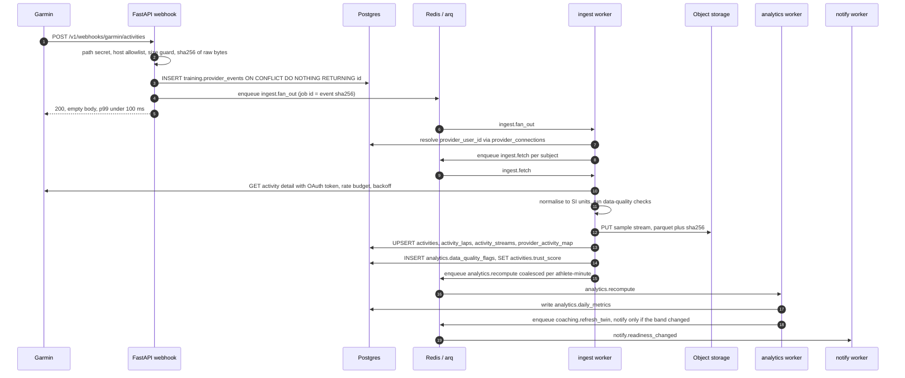

# 13 — Provider Integration: Garmin, and the Adapter Contract

**Status:** awaiting review

Extends `01-architecture.md` §4.2 (ingest sequence) and §6 (queues), `03-api-design.md`
§4 (integration + webhook routes), `06-security-privacy.md` §5 (token protection) and
§7 (workout spoofing). The tables are **BUILT** — `database/migrations/0003_training_data.sql`
is ground truth for every column named here. The ingest pipeline itself is
**PLANNED (Phase 1**, roadmap 1.6–1.10**)**; additional providers are **PLANNED (Phase 5**,
roadmap 5.2**)**.

This document does not restate the queue table or the RLS model. It specifies the
delta: exact Garmin data types, the adapter contract that makes provider number two
cheap, and the failure modes that make provider number one honest.

---

## 1. Data flow



### 1.1 Garmin data types we consume, and where each lands

Garmin exposes two products. We use both. Column names below are real columns in
migration `0003`.

| Garmin API | Type | Lands in | Notes |
|---|---|---|---|
| Activity | `activities` (summary) | `training.activities` | start/duration/distance/HR/power/cadence/elevation/calories, `provider='garmin'`, `provider_activity_id` |
| Activity | `activityDetails` (samples) | `training.activity_streams` pointer + `training.activities.first_half`/`second_half` | Half splits are stored, not recomputed, so decoupling survives stream archival |
| Activity | laps inside `activityDetails` | `training.activity_laps` | `UNIQUE (activity_id, lap_index)` |
| Activity | `activityFiles` (FIT) | Object storage; `activity_streams.format='fit'` | Richest source; preferred over JSON samples when both exist |
| Activity | `manuallyUpdatedActivities` | Re-UPSERT of the existing `activities` row | A Garmin-side edit, not a new session |
| Activity | `moveIQActivities` | **Not ingested** | Auto-detected, unconfirmed by the athlete; ingesting it inflates load |
| Health | `dailies` | `training.daily_wellness.resting_hr` | Steps / active kcal have **no column today** — see §9 |
| Health | `sleeps` | `sleep_total_min`, `sleep_deep_min`, `sleep_rem_min`, `sleep_light_min`, `sleep_awake_min`, `sleep_efficiency_pct` | |
| Health | `hrv` | `hrv_rmssd_ms` | **Only if the value is RMSSD-comparable** — see §8 |
| Health | `stressDetails` | **Nothing today** | `daily_wellness.stress` is a subjective Hooper 1–5 field. Writing Garmin's 0–100 device score into it silently destroys the subjective signal. Needs its own column, §9 |
| Health | `bodyComps` | `body_weight_kg` | Body-fat / muscle mass have no column, §9 |
| Health | `pulseOx`, `respiration` | `spo2_pct`, `respiration_rate` | |
| Health | `userMetrics` (VO2max) | `training.athlete_profiles.vo2max` + `threshold_sources.vo2max='garmin'` | Never overwrites an athlete-tested value |
| Health | `epochs` | Object storage only, if at all | Highest-volume type in the API and unnecessary for every Phase-1 metric. Putting 15-minute epochs in Postgres would dwarf `activities` |

`daily_wellness.source` records provenance. Wellness rows are keyed `(user_id, day)`
on the athlete's **local** calendar day, not UTC.

### 1.2 The sub-100 ms webhook budget

The handler does four things and no others.

| Step | Budget | Why it is cheap |
|---|---|---|
| Path secret + host/IP guard | < 1 ms | Constant-time compare, no DB, no DNS |
| Body size guard (reject > 1 MiB) | < 1 ms | Before anything touches the bytes |
| `event_key` = SHA-256 of the raw body | < 2 ms | **No JSON parse** |
| `INSERT provider_events … ON CONFLICT DO NOTHING RETURNING id` | 3–8 ms | One row, one round trip, one index probe |
| `arq` enqueue, job id = `event_key` | 1–3 ms | One Redis round trip |
| `200`, empty body | < 1 ms | |

**Forbidden in the request path:** parsing the payload, resolving `provider_user_id`,
any outbound HTTP, any per-subject loop, any log line containing the body. The body
holds health values and `06` §5 forbids logging them; we log `provider`, `event_type`,
`provider_event_id`, subject count and duration only.

Empty `RETURNING` means the provider retried a payload we already hold: return `200`
without enqueueing. Malformed JSON (the `::jsonb` cast fails) returns `400`, alerts,
and quarantines the raw bytes to object storage — off the hot path, but never a silent
drop. Alarm threshold on the handler is **60 ms p99**, giving 40 ms of headroom before
Garmin's retry logic engages.

`03` §3 already sets the webhook limiter at 1000/min/provider. Garmin batches many
athletes per delivery, so that limiter counts **requests, never subjects**, and it must
reject with `429` + `Retry-After` rather than accepting-and-dropping. A dropped ping is
lost data; a `429` is a retry.

### 1.3 Ping versus push, and the one SSRF rule that matters

Garmin offers *ping* (a pointer plus a `callbackURL` you fetch) and *push* (the full
payload inline). **We use ping** for activities and dailies: it keeps the hot path
small and it means the authoritative read always happens over our own authenticated
connection.

That makes `callbackURL` **attacker-controlled input in the ingest worker** (OWASP
A10). Rules, non-negotiable:

* Scheme must be `https`; host must match an allowlist of Garmin API domains held in
  config, not derived from the payload.
* DNS result must be a public address — reject private, loopback, link-local and
  IPv6-mapped equivalents, re-checked after resolution.
* Redirects are **not followed**.
* Query parameters are re-derived from our own record of the subject and time window,
  not copied verbatim.

Under ping, the payload body is never a source of truth for anything: we re-fetch. This
is how "never act on an unverified webhook" is satisfied even where the provider does
not sign (§2.1, §8).

---

## 2. Authentication

### 2.1 The OAuth flow

Garmin's developer programme has historically used **OAuth 1.0a** (HMAC-SHA1, request
token → user authorisation → non-expiring access token) and has since published an
**OAuth 2.0 + PKCE** flow with short-lived access tokens and refresh tokens.
**Which flow our approved application is issued must be confirmed against Garmin's
developer portal at implementation time** — it depends on programme, region and
onboarding date, and guessing it wrong is a week of rework.

The design is therefore flow-agnostic and both shapes fit the same columns:

| | OAuth 1.0a | OAuth 2.0 + PKCE |
|---|---|---|
| `access_token_ct` | access token | access token |
| `refresh_token_ct` | token **secret** | refresh token |
| `token_expires_at` | `NULL` (no expiry) | issued expiry |
| Refresh worker | no-op for this connection | rotates before expiry |
| Adapter `auth_style` | `"oauth1a"` | `"oauth2_pkce"` |

`refresh()` returning `None` is a legal answer meaning "this provider does not expire
tokens" — not an error, and not a fake future expiry (`None` means unknown, never a
plausible fake).

**CSRF on account linking.** `POST /v1/integrations/garmin/authorize` mints a
single-use `state` nonce stored in Redis (`oauth_state:{state}` → `{user_id, provider,
pkce_verifier}`, TTL 10 min, `DEL` on use). `POST /v1/integrations/garmin/callback`
resolves the athlete **from the nonce, never from the request body**. Without this, an
attacker's authorisation code redeemed in a victim's session links the attacker's
Garmin account to the victim's athlete — their data lands in someone else's history.
`UNIQUE (provider, provider_user_id)` on `provider_connections` is the structural
backstop: a Garmin account cannot be attached to two of our athletes at all.

### 2.2 Token storage

Per `06` §5, these are the highest-value secrets in the database. Plaintext AES-256-GCM
data key, envelope-encrypted under a KMS key; ciphertext in
`training.provider_connections.access_token_ct` / `refresh_token_ct` (`BYTEA`);
`kms_key_id` **per row** so a key rotation is a lazy re-wrap on next use rather than a
maintenance window. AAD binds the ciphertext to `(id, user_id, provider, column)`, so a
row copied between athletes fails to decrypt instead of working.

Plaintext exists only inside the frame that performs a provider call: never in a log,
never in an exception message, never in a Pydantic response model, never in
`provider_connections.last_error`. Adapter errors are passed through a redactor before
being persisted — provider error bodies routinely echo the token that failed.

### 2.3 Refresh, expiry, and revocation

`workers` runs `ingest.refresh_tokens` on a schedule, selecting active connections
whose `token_expires_at` is inside a refresh horizon (target: 25% of the token lifetime
remaining, minimum 15 minutes). Also refreshed opportunistically on a `401` from a
fetch. Outcomes:

| Outcome | `provider_connections.status` | Effect |
|---|---|---|
| Refreshed | `active` | `token_expires_at` advanced |
| `invalid_grant` / revoked upstream | `revoked` | Tokens **zeroed**, athlete notified once, no retry loop |
| Transient 5xx | `active` | Backoff; `error` only after the retry budget |
| Repeated failure | `expired` | Reconnect prompt in the UI, sync stops |

A `401` never triggers a blind retry — that is how an account gets locked upstream.

### 2.4 The mobile callback

Per **RFC 8252 (OAuth 2.0 for Native Apps)**: the authorisation URL opens in the system
browser (`ASWebAuthenticationSession` / Chrome Custom Tabs), **never an embedded
WebView** — a WebView can read the athlete's Garmin credentials. The redirect is an
**HTTPS Universal Link / App Link** first (claimed, so it cannot be hijacked by a
sibling app) with a custom scheme (`harel://integrations/garmin/callback`) as fallback
for devices where claiming fails. Because the PKCE verifier and the athlete identity
live server-side against the `state` nonce, a hijacked custom-scheme redirect yields a
code the attacker cannot redeem.

### 2.5 Deregistration and disconnect

Two directions, both mandatory:

* **Provider → us.** `POST /v1/webhooks/garmin/deregistration` (Garmin requires the
  endpoint to exist). Same sub-100 ms path; the worker sets `status='revoked'`, zeroes
  both ciphertext columns and `kms_key_id`, and **retains already-ingested activities**
  — the athlete's history is theirs, not the connection's. Deletion is the separate
  GDPR erasure path in `06` §10.
* **Us → provider.** `DELETE /v1/integrations/garmin` calls the adapter's `revoke()`
  first, then zeroes locally. If the provider call fails we still revoke locally and
  queue a retry: leaving a live token behind because a remote endpoint was down is the
  worse failure. Response is `204` and idempotent.

Garmin may also emit a **user-permission-change** notification. We plan
`POST /v1/webhooks/garmin/permissions` for it — **existence and exact name to be
confirmed against Garmin's docs (§8)** — which re-reads granted scopes and re-derives
the degraded-capability set in §3.

---

## 3. Permissions

We request the **minimum the product actually computes with**, and no more. Every extra
scope is an extra sentence in the App Store health disclosure and an extra thing to
justify in a privacy review.

| Garmin permission (names to verify, §8) | Requested | What breaks without it |
|---|---|---|
| `ACTIVITY_EXPORT` | Yes, required | Everything. No activities → no load, CTL/ATL/TSB, ACWR, efficiency |
| `HEALTH_EXPORT` | Yes, strongly recommended | Readiness loses HRV, sleep and resting HR — its three primary drivers |
| Workout / course **import** | **No** | We do not push workouts to the watch in Phase 1. Not requested |

Mapping to our own consent ledger (`identity.consents`, append-only, `0002`):

| Provider grant | `identity.consents.purpose` | Gate |
|---|---|---|
| `ACTIVITY_EXPORT`, `HEALTH_EXPORT` | `health_data_processing` | An explicit `granted=true` row must exist **before** `authorize` returns a URL |
| Neither | `partner_data_sharing` | Provider connection never implies partner sharing |

The permission screen names the data classes in plain Hebrew/English ("your workouts",
"sleep, HRV and resting heart rate"), states the retention window, and links revocation
in both places — ours and Garmin's. Withdrawal writes a new `granted=false` consent row
and triggers §2.5.

**Partial grants degrade honestly.** Granted scopes are read back from the provider
after connect (`granted_scopes()`), stored in `provider_connections.scopes`, and turned
into a capability set. If `HEALTH_EXPORT` is absent:

* Readiness returns `None`, not a number computed from load alone. `GET
  /v1/metrics/readiness/today` answers `422` with the existing
  `meta.data_quality` / `meta.required` shape from `03` §2.
* `GET /v1/integrations` reports `degraded_capabilities` and the exact missing
  provider permission, so the UI can offer a one-tap fix instead of a shrug.
* Nothing is estimated to fill the hole. `06` §7 and the analytics rule are the same
  rule: a plausible fake readiness score is worse than no score.

---

## 4. Sync architecture

**Primary: webhook push.** **Fallback: polling reconciliation.** `ingest.reconcile`
runs per active connection on a cadence (target: hourly for connections with
`last_sync_at` older than 6 h, daily otherwise, ordered by the existing
`provider_connections_sync_idx` partial index) and asks the provider for the last 48 h.
Anything it finds that `provider_activity_map` does not know about is a webhook we lost.
The count of such recoveries is a monitored metric — if it is not near zero, the webhook
path is broken and we want to know before athletes do.

**Backfill** (`POST /v1/integrations/{provider}/backfill`, `202`, `Idempotency-Key`
**required** because a double-tap double-spends rate budget) is chunked into windows
sized to the provider's documented maximum, walking backwards from today and recording
progress in `provider_connections.backfilled_from` so a resumed backfill never repeats a
window. Garmin's backfill is **asynchronous** — the request is acknowledged and the data
arrives over the same webhook — so the job's completion means "requested", not
"ingested", and `GET /v1/integrations/jobs/{job_id}` must say so honestly.

**Rate-limit budgeting.** One Redis token bucket per provider, shared by every worker
(`rl:provider:garmin:{window}`, matching the `01` §5 key convention) — a per-worker limit
is not a limit. Backfill draws from a **reserved slice capped at 30% of the app budget**,
so no backfill can starve live webhook-driven fetches. `429` from the provider honours
`Retry-After` and refills the bucket to zero rather than merely retrying.

**Idempotency.** `training.provider_activity_map` — `PRIMARY KEY (provider,
provider_activity_id)`, which is the unique constraint the ingest depends on. It lives in
its own small unpartitioned table precisely so `activities` stays partitionable later
(`02`; a partitioned table's UNIQUE must include the partition key). Ingest is
`INSERT … ON CONFLICT` on the map; the mapped `activity_id` is then updated in place.
Running the job twice equals running it once, which is a review requirement.

**Coalesced recompute.** Each ingest writes `min(local_date)` into
`recompute:{user_id}` in Redis and enqueues `analytics.recompute` with
`_job_id = recompute:{user_id}:{floor(now, 60s)}` and `_defer_by=60s`. Twenty backfilled
activities in one minute produce **one** recompute from the earliest affected date. Twin
refresh (`coaching.refresh_twin`) coalesces on a longer window matching the 6 h
`twin:{user_id}` TTL. A push fires only when the readiness **band** changes — nobody
wants a notification that says "sync complete".

**Retry.** `ingest` queue: 5 attempts, exponential backoff with **full jitter**
(`sleep = random(0, min(600s, 2s · 2^attempt))`, per AWS's "Exponential Backoff and
Jitter" — jitter matters because Garmin batches, so all our workers fail and retry in
lockstep otherwise). Classified, not uniform: `5xx`/timeout retry; `429` retries on
`Retry-After` outside the attempt budget; `401` refreshes the token once then stops;
other `4xx` dead-letters immediately, because retrying a permanent error is just noise.

**Dead letter.** `ingest:dlq` per `01` §6, plus `provider_events.process_attempts` and
`last_error` (redacted) on the raw row. A dead-lettered event is **replayable** from its
stored payload — that is the whole reason `provider_events` exists — surfaced in the
admin data-quality queue (`03` §9, `/v1/admin/data-quality/review`). Exhausting retries
alerts; it never disappears.

**Last sync in the UI.** `GET /v1/integrations` returns `last_sync_at`, `status`, a
machine `last_error_code` (never the raw provider string), `scopes`,
`degraded_capabilities` and `backfilled_from`. "Synced 4 minutes ago" is the single
highest-value trust signal in the product; a spinner that never resolves is the lowest.

**Conflict resolution across providers.** `provider_activity_map` dedupes *within* a
provider only. For the same session arriving from two providers, dedupe on a
**session fingerprint**: same `user_id`, same `sport`, `start_time` within **±180 s**,
`duration_s` within **5%**, and `distance_m` within **5%** when both report distance.
Those tolerances were chosen against watch-versus-phone clock skew plus provider
timestamp rounding, and typical 1–3% GPS distance disagreement between two devices on
one run; they must be re-tuned against a dual-recorded fixture set before a second
provider ships, not after.

Precedence, richest first-party evidence wins:
`garmin > polar > suunto > coros > samsung_health > apple_health / health_connect >
strava > manual`. Aggregators rank below devices because their data is someone else's
data relayed.

The loser is **not** inserted as a second `activities` row. Its
`(provider, provider_activity_id)` is inserted into `provider_activity_map` pointing at
the **same** `activity_id` — legal today, since `activity_id` is a plain FK — so future
webhooks about the loser resolve to the canonical row, and an `analytics.data_quality_flags`
row with `check_code='duplicate_record'`, `resolution='accepted'` records the fingerprint
and the decision. Cross-provider dedupe needs **zero new tables**; it wants one
`dedupe_key` column and a partial index for efficiency (§9).

Wellness collides differently: `daily_wellness` is `PRIMARY KEY (user_id, day)`, one row
per day, and `source` is a single column. Per-field precedence is the correct merge, but
per-field provenance is not expressible today (§9). Until it is, one provider owns a
given day's wellness and the losing provider's day is flagged, not silently blended —
mixing two vendors' HRV in one baseline invalidates the Plews smallest-worthwhile-change
gate that readiness depends on.

**Streams to object storage.** Samples never enter Postgres. The worker writes
parquet (or the original FIT) to `s3://{bucket}/{user_id}/{activity_id}/{channel_set}.parquet`
and records only the pointer in `training.activity_streams`: `storage_bucket`,
`storage_key`, `format`, `channels[]`, `sample_count`, `sample_interval_s`, `size_bytes`,
`checksum_sha256`. `channels[]` lets a consumer know a power analysis is possible without
downloading anything. `checksum_sha256` is verified on read (OWASP A08). Athletes reach
streams only through a short-lived signed URL from `GET /v1/activities/{id}/streams`,
after the RLS-scoped row check — the object key is never guessable-and-sufficient.

---

## 5. Polar, Suunto, Samsung — and the adapter contract

### 5.1 The `ProviderAdapter` protocol (specification, not an implementation)

Lives in `backend/integrations/base.py`. Provider-agnostic DTOs
(`NormalisedActivity`, `NormalisedWellnessDay`, `StreamBlob`) live in
`backend/integrations/types.py` — **not** in `modules/training`, because the dependency
rule is `modules → integrations` and never the reverse.

```python
Capability = Literal[
    "activity_summary", "activity_laps", "activity_samples", "activity_file",
    "daily_summary", "sleep", "hrv", "device_stress", "body_composition",
    "spo2", "respiration", "vo2max",
]
AuthStyle      = Literal["oauth1a", "oauth2_pkce", "oauth2_code", "on_device"]
Delivery       = Literal["webhook_ping", "webhook_push", "poll_only", "client_push"]
WebhookVerdict = Literal["signed_valid", "unsigned_by_design", "signature_invalid"]

class ProviderAdapter(Protocol):
    provider: ClassVar[str]                        # == provider_connections.provider
    auth_style: ClassVar[AuthStyle]
    delivery: ClassVar[Delivery]
    capabilities: ClassVar[frozenset[Capability]]
    rate_limit: ClassVar[RateLimitPolicy]
    max_backfill_window_days: ClassVar[int]

    # --- authorisation -------------------------------------------------------
    def authorize(self, *, redirect_uri: str,
                  scopes: Sequence[str]) -> AuthorizeChallenge: ...
    async def exchange(self, *, params: Mapping[str, str],
                       challenge: AuthorizeChallenge) -> ProviderTokens: ...
    async def refresh(self, *, tokens: ProviderTokens) -> ProviderTokens | None: ...
    async def revoke(self, *, tokens: ProviderTokens) -> None: ...
    async def granted_scopes(self, *, tokens: ProviderTokens) -> frozenset[str]: ...

    # --- inbound: pure, no I/O, runs inside the <100 ms budget ---------------
    def verify_webhook(self, *, headers: Mapping[str, str],
                       body: bytes) -> WebhookVerdict: ...
    def event_key(self, *, headers: Mapping[str, str], body: bytes) -> str: ...
    def subjects(self, *, body: bytes) -> Sequence[EventSubject]: ...
    def plan_fetches(self, *, subject: EventSubject) -> Sequence[FetchTask]: ...

    # --- outbound: the only place provider HTTP is allowed to happen ---------
    async def fetch(self, *, task: FetchTask,
                    tokens: ProviderTokens) -> RawPayload: ...
    def backfill_tasks(self, *, since: date, until: date) -> Sequence[FetchTask]: ...
    async def commit(self, *, cursor: SyncCursor | None,
                     tokens: ProviderTokens) -> None: ...

    # --- normalisation: pure. No I/O, no clock, no network. ------------------
    def normalise_activity(self, payload: RawPayload) -> NormalisedActivity | None: ...
    def normalise_wellness(self,
                           payload: RawPayload) -> Sequence[NormalisedWellnessDay]: ...
    def extract_stream(self, payload: RawPayload) -> StreamBlob | None: ...
```

Three deliberate choices. `verify_webhook` returns a **verdict, not a bool**, so
"this provider does not sign its webhooks" is representable and distinct from "this
signature is wrong": `signature_invalid` persists with `signature_verified=false` and
**does not enqueue**; `unsigned_by_design` persists with `signature_verified=false` and
enqueues a **re-fetch only**, never trusting a body value. `normalise_activity` returns
`Optional` because a payload we cannot turn into a meaningful session must yield `None`,
not a zero-filled row. `commit()` is a no-op for Garmin and load-bearing for Polar
(§5.3). All `normalise_*` are pure, so the entire provider surface is testable from
recorded fixtures with no network — which is also the mock that unblocks development
while Garmin approval is pending (roadmap 1.6 note).

### 5.2 Capability matrix

Everything in this table for a provider other than Garmin is **planning-grade and must
be confirmed against that vendor's current developer documentation before its adapter is
scheduled.**

| Provider | Auth | Delivery | Activity summary | Laps | Samples / file | Dailies | Sleep | HRV |
|---|---|---|---|---|---|---|---|---|
| **Garmin** | `oauth1a` or `oauth2_pkce` (§8) | `webhook_ping` | Yes | Yes | JSON samples + FIT | Yes | Yes | Yes (§8) |
| **Polar** (AccessLink) | `oauth2_code` | `webhook_push` + transactional pull | Yes | Yes | FIT / samples | Partial | Yes | Partial |
| **Suunto** | `oauth2_code` | `webhook_push` | Yes | Yes | FIT | Limited | Limited | Limited |
| **Samsung Health** | `on_device` (Health Connect) | `client_push` | Yes | No | No | Yes | Yes | Vendor-dependent |
| **Apple Health** | `on_device` (HealthKit) | `client_push` | Yes | No | Route/HR only | Yes | Yes | Yes (SDNN, **not** RMSSD) |
| **Google / Health Connect** | `on_device` | `client_push` | Yes | No | No | Yes | Yes | Vendor-dependent |
| **Strava** | `oauth2_code` | `webhook_push` | Yes | Yes | Streams | No | No | No |

### 5.3 What each provider needs that Garmin does not

* **Polar** — a **transaction lifecycle**. AccessLink hands out data inside a
  transaction that must be listed, fetched and then *committed*; uncommitted data is
  re-offered, committed data is gone. This is why the protocol carries an opaque
  `SyncCursor` and a `commit()` hook. Committing before the UPSERT succeeds loses an
  athlete's workout permanently, so `commit()` is called **after** the database
  transaction, and only then.
* **Suunto** — thinner wellness coverage; its adapter's `capabilities` set is small and
  §3's honest degradation does the rest. Expect FIT-only detail, so `extract_stream`
  carries the weight.
* **Samsung** — no third-party server-to-server API we can rely on; it is an
  **on-device** provider reached through Android **Health Connect**. Server-side access,
  if it exists at all for our programme tier, must be verified before anything is
  promised.
* **Strava** — an aggregator, so it lands at the bottom of the §4 precedence list and is
  a dedupe source far more often than a data source.

### 5.4 Apple Health and Health Connect — the on-device special case

There is no server webhook and no server-side pull. **The mobile app is the adapter's
transport.** iOS registers `HKObserverQuery` background delivery, reads only the
HealthKit types matching granted permissions, normalises **on the device using the same
DTO shape**, and posts batches to `POST /v1/integrations/apple-health/batch` with an
`Idempotency-Key` (mobile networks retry; a duplicated batch must be free). Server-side
the batch is treated exactly like a provider payload: raw-persisted to
`provider_events`, enqueued, normalised, dedupe-fingerprinted, trust-scored.

Two consequences that must not be papered over:

1. **Anything can write to HealthKit / Health Connect** — including manual entry and
   third-party apps. HealthKit exposes `HKMetadataKeyWasUserEntered` and the writing
   `sourceRevision`/`device`. The adapter must forward that provenance, and §7 caps the
   trust score accordingly. An on-device aggregator is the weakest evidence we accept.
2. **`last_sync_at` means "last time the phone told us"**, which iOS may delay for
   hours. The UI must say that rather than implying live sync.

`provider_connections.provider`'s `CHECK` already permits `apple_health`; `samsung_health`
and `health_connect` are **not** in the list (§9).

### 5.5 Why adding a provider changes zero lines of `modules/training/service.py`

`training.service` depends on the **Protocol and the registry**, never a concrete
adapter: `integrations.registry.get(provider) -> ProviderAdapter`, keyed on the same
string stored in `provider_connections.provider`. Its ingest entry point takes a
`NormalisedActivity` / `NormalisedWellnessDay` and knows nothing about who produced it.
All provider-shaped weirdness — auth style, delivery style, transaction semantics, unit
conversion, missing capabilities — is absorbed inside the adapter, which is exactly what
the adapter is *for*.

So adding Polar is: one directory under `backend/integrations/polar/`, one registry
entry, one recorded-fixture contract-test set, one capability-matrix row, and one
reviewed migration widening a `CHECK`. To keep the claim true rather than aspirational,
`make lint-arch` gains a **forbidden-module contract**: `backend.modules.*` may import
`backend.integrations` and `backend.integrations.types`, and may **not** import
`backend.integrations.<any concrete provider>`. A future PR that reaches for
`integrations.garmin` from a service fails CI rather than review.

---

## 6. Module contract

### `training`

* **Purpose** — own the athlete's training reality: activities, laps, stream pointers,
  wellness, provider connections, and the trust score every downstream module reads.
* **Responsibilities** — accept normalised records from any adapter; enforce ingest
  idempotency; run data-quality checks (§7); emit `activity.ingested` /
  `wellness.updated`; expose connection state. It does **not** speak any provider's
  protocol.
* **Database changes** — all deferred to reviewed SQL, **sequenced in `docs/19`
  (Database Evolution)**, applied by a human, never by the app or CI (ADR-012). See §9.
* **APIs required** — `GET /v1/integrations` · `POST /v1/integrations/{provider}/authorize`
  · `POST /v1/integrations/{provider}/callback` · `POST /v1/integrations/{provider}/sync`
  · `POST /v1/integrations/{provider}/backfill` · `DELETE /v1/integrations/{provider}`
  · `GET /v1/integrations/jobs/{job_id}` · `POST /v1/integrations/apple-health/batch`
  · `GET|POST|PATCH|DELETE /v1/activities…` (`03` §5) · webhooks
  `POST /v1/webhooks/garmin/{activities,dailies,deregistration,permissions}`.
* **Dependencies** — `integrations` (Protocol + registry only), `identity.service`
  (consent state, athlete existence), `core`, `database`. External: Garmin Activity +
  Health APIs, object storage, KMS.
* **Security** — RLS `owner_all` on every table touched (`0009`); repositories scope by
  `user_id` regardless (belt and braces); `UNIQUE (provider, provider_user_id)` prevents
  cross-athlete account attachment; OWASP A01 (webhook cannot name a `user_id`; the
  worker runs under the resolved athlete's principal), A02 (§2.2), A08 (stream checksum),
  A09 (payload never logged), A10 (§1.3). **`training.provider_events` currently has no
  RLS policy — see §9.**
* **Testing** — contract tests per adapter over recorded fixtures (byte-identical
  payload in, expected DTO out, including the malformed and partial cases); a
  **tenant-isolation matrix row for every new endpoint above**, or the build fails;
  idempotency tests replaying one webhook 3× and asserting exactly one `activities` row
  and one recompute; dedupe tests over a dual-provider fixture pair; an ingest test
  asserting a rejected value never reaches the analytics engine.

### `integrations`

* **Purpose** — be the only place that knows any provider exists.
* **Responsibilities** — auth flows, signature/verdict, event keys, fetch planning,
  rate-limit policy declaration, normalisation to SI-unit DTOs. **No database access, no
  business rules, no queue access.**
* **Database changes** — none. It owns no schema, by design.
* **APIs required** — none. It is a library, not a transport.
* **Dependencies** — `core` (config, errors, logging) and the provider HTTP APIs. It may
  **not** import `modules.*` or `database` — enforced by `make lint-arch`.
* **Security** — SSRF allowlisting (§1.3); no token or payload in any log or exception;
  outbound TLS verification with no opt-out; response size caps so a hostile or broken
  provider cannot exhaust worker memory.
* **Testing** — pure-function unit tests on every `normalise_*`, with the anchor case,
  the undefined case (asserting `None`, not `0`) and one hand-computed value; a
  `verify_webhook` test per verdict; a `Protocol` conformance test that every registered
  adapter satisfies, so a partially implemented adapter cannot be registered.

---

## 7. Data quality and anti-spoofing

`06` §7 names the threat: rewards are the incentive to fake training. The checks run in
the **ingest worker, before `analytics.recompute` is enqueued**, so a rejected value
never reaches the engine.

| Check | `analytics.data_quality_flags.check_code` | Signal |
|---|---|---|
| Provenance class | `suspected_spoofing` (info at worst) | Hardware device + FIT > provider-manual > on-device user-entered > our manual entry |
| Speed/power beyond the athlete's own Critical Speed/Power envelope | `out_of_physiological_range`, `power_spike` | Per-athlete from `algorithms.performance`, not a population constant |
| GPS displacement inconsistent with elapsed time; distance/GPS mismatch | `gps_distance_mismatch` | |
| HR flatline during a claimed hard effort | `hr_flatline` | |
| Future start, overlapping sessions, `duration ≠ end − start` | `timestamp_inconsistent` | |
| Same session under a second account; device shared across accounts | `duplicate_record` | `UNIQUE (provider, provider_user_id)` already makes the simplest version structurally impossible |
| PB jump no training history supports | `impossible_progression` | |
| Burst of manual entries | `suspected_spoofing` | |
| Sensor dropout, missing required field | `sensor_dropout`, `missing_required_field` | |

`training.activities.trust_score` (`NUMERIC(4,3)`, 0–1) starts at the provenance ceiling
and takes a multiplicative penalty per fired check. **Its drivers are the
`data_quality_flags` rows themselves** — one row per check that fired, carrying
`severity`, `resolution`, `field_name`, `observed_value`, `expected_range` — which
satisfies "every composite score returns its drivers" and gives an athlete asking "why
did this not count?" a real answer instead of a number.

`resolution` is load-bearing: `excluded` means the value never reached the engine;
`accepted_downweighted` means it did, at reduced weight.

**`trust_score IS NULL` means "not yet computed" and rewards must treat it as
not-eligible.** Fail-closed. A `NULL` read as `1.0` is a paid-for fabricated workout.

**Why this precedes rewards** — roadmap sequencing rule 1 and `06` §7: paying for
workouts before trust scoring exists is paying for fabricated workouts, and once a
ledger entry is written it is append-only and cannot be quietly reversed. `rewards`
reads the trust score through `modules.training.service`, never by querying
`training.activities`.

---

## 8. To verify against Garmin's real developer documentation before build

Listed, not guessed. Each is a design fork we have kept open rather than assumed.

1. **OAuth flow issued to our application** — 1.0a vs 2.0 + PKCE, and whether a
   migration path applies. §2.1 fits either; the adapter's `auth_style` is the switch.
2. **Webhook authentication.** Garmin's ping/push notifications are, to our knowledge,
   **not HMAC-signed**. If confirmed, `verify_webhook` returns `unsigned_by_design`,
   `signature_verified` stays `false`, and trust comes entirely from the high-entropy
   path secret, the host/IP allowlist, and the fact that we **re-fetch every value over
   our own authenticated connection** (§1.3). If Garmin does provide a signature, we
   verify it and the verdict becomes `signed_valid`. Design does not change either way.
3. **Whether a ping payload carries a stable provider event id.** If not,
   `provider_events.provider_event_id` is the SHA-256 of the canonical raw body — which
   dedupes retries correctly, since a retry is byte-identical.
4. **Provider retry policy and give-up threshold** for a non-2xx ping — this sets our
   error budget and the `60 ms` alarm.
5. **Exact permission scope names and the permission-change notification** (name,
   payload, existence). §3's table uses the names we believe current.
6. **Whether Garmin's HRV value is RMSSD-comparable.** `daily_wellness.hrv_rmssd_ms`
   and the Plews smallest-worthwhile-change gate assume RMSSD. If Garmin's nightly
   average is a different statistic, it must go in its own column rather than be written
   into an RMSSD field — a wrong unit here corrupts readiness for every athlete.
7. **Rate limits** (per app, per user, evaluation vs production tier) — the §4 bucket
   sizes and the 30% backfill slice are placeholders until these are real numbers.
8. **Backfill maximums** — window length per request and how far back history is
   available; drives `max_backfill_window_days` and `backfilled_from`.
9. **FIT availability** per activity type and how long files stay fetchable.
10. **Deregistration payload shape**, and whether deregistration and permission-removal
    are one notification or two.

Non-Garmin equivalents (Polar's transaction semantics, Suunto's coverage, Samsung's
server-access availability, Google Fit's shutdown state relative to Health Connect) are
verified when that adapter is scheduled, not now.

---

## 9. Schema deltas — described, not applied

Every item below is a reviewed SQL file **sequenced in `docs/19` (Database Evolution)**,
applied by a human as `app_migrator`. No migration numbers are assigned here, and
nothing in this document is auto-applied by the app, CI or the deploy pipeline (ADR-012).

| # | Delta | Why |
|---|---|---|
| 1 | **RLS on `training.provider_events`** | It is not in the `0009` owner-only list and has no policy, yet it holds raw health payloads. `user_id` is nullable (a batched ping spans athletes), so the standard `owner_all` policy cannot be used as-is: it needs a system-write / athlete-no-read policy. **Highest-priority item in this table.** |
| 2 | Forbid `UPDATE` of `payload`, `provider`, `provider_event_id`, `received_at`, `signature_verified` on `provider_events` | The existing trigger blocks `DELETE` only, deliberately, because processing bookkeeping must stay writable. The raw payload must not be. |
| 3 | Widen `provider_connections.provider` `CHECK` to add `samsung_health`, `health_connect` | The cost of ADR-008 (TEXT + CHECK) — and the **only** schema change adding a provider requires. `activities.provider` and `daily_wellness.source` have no CHECK, so they need nothing. |
| 4 | `daily_wellness`: device-derived stress (0–100), body-fat %, steps, active kcal | Garmin `stressDetails`, `bodyComps`, `dailies` have nowhere to land. Reusing the subjective Hooper `stress` column for a device score would destroy the subjective signal. |
| 5 | Per-field wellness provenance (`source_by_field JSONB` or a sources table) | `source` is one column, but a merged day has several origins (§4). |
| 6 | `activities.dedupe_key` + partial index | Makes cross-provider fingerprint lookup a probe rather than a scan. |
| 7 | `provider_connections.granted_scopes_checked_at`, `last_error_code` | Distinguish "scopes verified recently" from "scopes at connect time", and give the UI a stable machine code instead of a provider string. |
