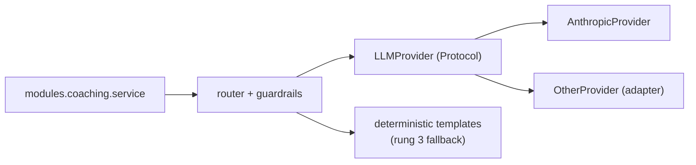

# 14 — AI Coaching Architecture

**Status:** awaiting review · **Extends** `docs/05` (AI architecture) and `docs/10`
(cost model). This is the implementation-level delta — provider contract, packet
builder, twin fitting, guardrail mechanisms — plus corrections where `05`/`10`
state a provider fact the current Claude API contradicts. Rules in `05` stand.

**Phase:** everything here is **PLANNED (Phase 1, roadmap 1.16–1.23)** except the
batch weekly review (**Phase 2, 2.6**) and the twin (**Phase 3, 3.1**).
`backend/algorithms` — every number the coach talks about — is **BUILT**.

---

## 0. Corrections to `docs/05` / `docs/10`

Three of these change money or an SLO.

| # | Stated | Correct |
|---|---|---|
| C1 | `05` §8 / `10` §4.3: write ≈1.25×, "break-even is two messages", with a **1-hour** TTL | 1.25× is the **5-minute** write; 1-hour is **2×**, so break-even is **three** messages (2× + 0.2× vs 3×), not two. Ship the packet breakpoint on 5-min TTL; move to 1-hour only if measured session length justifies it |
| C2 | `10` §4.2: effort tuning gives "−30–50% output tokens" | True of **thinking** tokens only. On Opus 5 `effort` does not reliably shorten visible prose; an explicit conciseness instruction does (~20%). Both bill as output — keep both levers, but don't expect `effort` alone to shorten answers |
| C3 | `05` §6: "server-side fallback configured" | Fallbacks are **opt-in**, **Claude-API-only**, and **rejected on the Batch API**. On Opus 5 use `fallbacks: "default"` with beta `server-side-fallback-2026-07-01` (category-routed; cyber declines land on `claude-opus-4-8`) rather than a pinned list we would then own migrating |
| C4 | `05` §3 and the `0005` cost columns | When a fallback runs, top-level `usage` covers **only the attempt that produced the answer**. Cost must sum `usage.iterations`, and the model recorded must be `response.model` — who answered, not who was asked. Otherwise a rescued turn under-reports tokens and mis-attributes the model |
| C5 | `05` §10 / `09` §5: "first token p95 < 2 s" | Adaptive thinking is on by default and `thinking.display` defaults to `"omitted"`, so thinking blocks stream with **empty text** — the first *text* delta can be many seconds out. Redefined in §1.4 |
| C6 | implied "routine chat at low effort" | `thinking: {"type": "disabled"}` returns **400 above effort `high`** on Opus 5, and when disabled the model may emit a tool call as plain text (it silently never runs) or leak `<thinking>` tags. The cheap route is **thinking on at `low`/`medium`**, never off |
| C7 | `05` §5 tool loop | A cache breakpoint looks back at most **20 content blocks**. A turn adding more than 20 misses the previous cache — the loop needs an intermediate breakpoint (§1.10) |

Not corrections, but consequential: Opus 5 has a **separate rate-limit bucket** from
the Opus 4.x pool, as does the fallback model (a rate-limited fallback returns the
original refusal plus `stop_details.recommended_model`); `effort` **errors** on Haiku
4.5, which uses the old `budget_tokens` form and a 4096-token cache minimum, so the
classifier prompt never caches — fine at ~$0.0001; **fast mode** on Opus 5
(`speed: "fast"`, 2.5× output rate) costs $10/$50 per MTok and is **rejected** — it
quadruples the dominant cost line to buy latency that streaming buys cheaper.

---

## 1. Model integration

### 1.1 Provider contract

The only surface any module above the provider layer may touch:

```python
class LLMProvider(Protocol):
    name: str
    async def complete(self, req: CompletionRequest) -> CompletionResponse: ...
    def stream(self, req: CompletionRequest) -> AsyncIterator[StreamEvent]: ...
    async def submit_batch(self, reqs: Sequence[BatchItem]) -> BatchHandle: ...
    async def poll_batch(self, h: BatchHandle) -> BatchResult | None: ...
    async def count_input_tokens(self, req: CompletionRequest) -> int: ...
    def price(self, usage: Usage) -> int                    # micro-USD, exact int

class CompletionResponse(Protocol):
    text: str | None            # None when stop_reason == 'refusal'
    stop_reason: Literal['end_turn','max_tokens','tool_use','pause_turn',
                         'refusal','model_context_window_exceeded','stop_sequence']
    refusal_category: str | None                # meaningful only on 'refusal'
    served_by_model: str                        # response.model (C4)
    usage: Usage                                # summed across attempts (C4)
    tool_calls: Sequence[ToolCall]
```

Deliberately absent: `temperature`, `top_p`, `budget_tokens` — all rejected by Opus
5, and modelling a parameter we cannot send invites someone to try it. Depth is
`effort`. Token counting is on the protocol because quota pre-flight must never use
a foreign tokenizer.

### 1.2 Anthropic implementation

| Concern | Setting |
|---|---|
| Model | `claude-opus-5` (1M context, $5/$25 per MTok) |
| Thinking | omitted ⇒ adaptive (on by default); `display` stays `"omitted"` |
| Depth | `output_config.effort` — `low`/`medium` chat, `high` deep review |
| `max_tokens` | sized for **thinking + text together**; always streaming, so 8–16 k headroom carries no HTTP-timeout risk |
| Structured parts | `output_config.format` (JSON schema) for blocks rendered as UI, prose for the rest — not the deprecated top-level `output_format`. It is incompatible with the API's own `citations` feature; our `citation` events (§1.4) are server-derived from the grounding check, so no conflict — and nobody should wire the API feature in |
| Tools | `strict: true`, `additionalProperties: false` (§5) |
| Operator turns | mid-conversation `{"role": "system"}` messages (Opus 5, no beta header) — delivers a mid-session notice **without** rewriting the cached system prefix, and is a channel content cannot forge |

### 1.3 Routing is configuration, not code

One hot-reloadable table keyed by route:
`{provider, model_id, effort, max_tokens, thinking, prompt_id, tool_ids[], cache_ttl, timeout_ms, batch}`.
No route decision, model id or effort level appears in a Python literal. `10` §5
depends on this: moving chat to Sonnet 5 must be a config change with an eval run
behind it, not a deploy. The config is versioned and its hash recorded per message.

### 1.4 Streaming

`POST /v1/coach/conversations/{id}/messages` (`Idempotency-Key` required, `03` §7)
returns `text/event-stream`. Ours is **not** a passthrough: the provider stream is
consumed server-side and re-emitted, which is what puts the guardrails in the path.
Events extend `03` §7 by two — `thinking` (fired on the provider's first thinking
block; a progress signal only, `display` stays `"omitted"` so no reasoning text
ever reaches the athlete, and thinking bills identically either way) and `notice`
(guardrail intervention or degradation). Existing: `routing`, `delta`, `citation`,
`done` (message id, summed usage, `cost_micro_usd`, `grounded`, `served_by_model`).

**SLO restated (C5):** `routing` p95 < 300 ms (no model in the path), `thinking`
p95 < 1.5 s, first `delta` p95 < 4 s at `low` effort. "First token < 2 s" is
reachable only by disabling thinking, which C6 forbids.

### 1.5 `stop_reason` before content; refusal

`stop_reason` is read before `content`, always — a refusal is HTTP 200 with empty
or partial content, so touching `content[0]` on the happy path is a live bug. Branch
on `stop_reason`, **never** on `stop_details`: it is `null` for every other stop
reason and its `category` can be `null` even on a refusal.

Order: server-side `fallbacks: "default"` re-serves inside the same call (a decline
before output is unbilled; a mid-stream decline bills the streamed partial, which we
discard). If the whole chain refuses, `safety_flags` records
`provider_refusal:<category>` and the athlete gets the deterministic analytics
summary plus an explicit "the coach could not answer this one" — never a silent
empty bubble. Because fallbacks are rejected on Batch (C3), a refused weekly review
is re-queued as one non-batch call at full price.

### 1.6 Retries, timeouts, circuit breaker

| Layer | Setting |
|---|---|
| SDK retries | **`max_retries=0`** — the default of 2 multiplies wall-clock by up to 3× against our timeout; one retry policy, not two |
| Our retry | 429 (honour `Retry-After`), 5xx, 529, connection errors: 2 attempts, jittered. Never 400/404 — those are our bug |
| Timeout | per route: 20 s chat, 120 s deep review. Streaming means the timeout guards silence, not length |
| Breaker | per provider; opens at 50% errors over 20 calls or 5 consecutive timeouts, half-open probe after 30 s. While open, no call is attempted |

### 1.7 Degradation ladder

Every rung is entered automatically and **announced**. An athlete told the coach is
unavailable keeps trusting the product; one given a vaguer answer with no
explanation does not.

| Rung | Trigger | Behaviour |
|---|---|---|
| 1 | quota spent or org cost breaker tripped | deterministic route only; `429` + `Retry-After` + quota problem code — never a silent downgrade to a cheaper model (`03` §7) |
| 2 | provider p95 breach | drop `effort` one level, shorten history window |
| 3 | breaker open / provider 5xx | **deterministic analytics summary** from `analytics.daily_metrics` — readiness with drivers, load, today's adapted session and its reason — plus a `notice`: *the coach is unavailable; here is what your numbers say*. No model call, no fabricated narrative |
| 4 | Postgres degraded | read-only cached packet, no new messages accepted |

Rung 3 is why the deterministic router is a first-class route rather than an
optimisation: the fallback path is code we run 40% of the time anyway, so it cannot
rot.

### 1.8 Prompt versioning

Prompts are content-addressed files in the repo; `prompt_id@semver` + content hash
resolves to exact bytes, stored in `ai_messages.prompt_version` (BUILT). A prompt
version with no passing `analytics.eval_runs` row cannot be promoted (`09` §6.5). A
queryable prompt registry table is a nice-to-have, **sequenced in `docs/19`
(Database Evolution)**.

### 1.9 Per-message cost accounting

Every turn writes one `coaching.ai_messages` row using columns that already exist in
`0005`: `provider`, `model_id`, `prompt_version`, `context_hash`, `route`,
`input_tokens`, `output_tokens`, `cache_read_tokens`, `cache_write_tokens`,
`cost_micro_usd` (BIGINT micro-USD, never a float), `latency_ms`, `finish_reason`,
`safety_flags`, `grounded`. Cost comes from the config price table, so a price change
is a config change. `route='deterministic'` rows are written too, at zero cost — the
share of zero-cost rows *is* a `10` §9 metric. `coaching.ai_usage_counters` is
incremented in the same transaction; Redis holds the hot counter and is reconciled
against that table, as its comment specifies.

Four additions, **deferred to reviewed SQL, sequenced in `docs/19`**: `effort` and
`config_hash` (attribution after a routing change), `twin_snapshot_id` (§2.4 —
without it the packet is not reproducible), `served_by_model` +
`fallback_from_model` (C4), and `batch_id`.

### 1.10 Prompt cache layout

Render order is fixed by the API: `tools` → `system` → `messages`.

```
[ tool definitions ]        sorted by name, deterministic      ─┐ breakpoint A (5-min)
[ system prompt @version ]  stable for weeks                   ─┘
[ athlete context packet ]  stable for a calendar day          ─── breakpoint B (5-min, C1)
[ conversation history ]    grows                              ─── breakpoint C (tool loop only, C7)
[ this question ]           volatile — nothing cached below
```

Three breakpoints against a limit of four. A unit test renders the prefix twice and
asserts byte equality; that test is what enforces no `now()`, no request id, no
UUID, no unsorted `json.dumps`, no per-user string above B, and **no
mid-conversation tool-set change** (tools sit at position 0, so adding one
invalidates everything; the beta that makes it cache-safe needs `defer_loading` and
is not worth taking in Phase 1). Break-even is A on message two, B on message three
(C1). Pre-warming B with a `max_tokens: 0` request is available but bounded by the
TTL — worth it immediately before the morning push fan-out, never hours ahead.

---

## 2. Data pipeline — the Athlete Context Packet builder

### 2.1 Source map — exactly what is read, and nothing else

| Packet field | Source | Note |
|---|---|---|
| `athlete.age_band`, `sex`, `level`, `training_age_years`, `thresholds`, `threshold_sources` | `training.athlete_profiles` | `birth_date` → band; the raw date never leaves the repository |
| `goals[]` (+ `weeks_out`) | `training.athlete_goals` where `status='active'`, by `priority` | `weeks_out` computed server-side from `race_date` |
| `personal_bests[]` | `training.personal_bests` | `source` carried through: a `race` best and an `estimated` best are not the same evidence |
| `today.readiness` + ordered `drivers`, `data_quality` | `analytics.daily_metrics.readiness_score/_band/_drivers/_quality` | stored drivers, never recomputed — coach and chart must explain the number identically |
| `today.load` | `analytics.daily_metrics` `ctl`,`atl`,`tsb`,`acwr`,`acwr_reliable`,`monotony`,`ramp_pct` | plus `load_source`/`load_confidence`, so the coach hedges on RPE-derived load |
| `today.injury_risk` | `analytics.daily_metrics.injury_risk/_band/_drivers/injury_model_version` | always with `is_clinically_validated: false` |
| `today.plan` | `coaching.plan_sessions` ⋈ latest `coaching.plan_adaptations` | `action` + the athlete-visible `reason` verbatim |
| `twin` | latest `coaching.athlete_twin_snapshots` | §3 |
| `recent_sessions[]` | `training.activities` summaries, 14 days | duration, sport, load, load source, efficiency delta. No streams, no GPS |
| `trends` | windowed `analytics.daily_metrics` aggregates | 7 v 28 day, 28-day change |
| `predictions[]` | `analytics.prediction_records`, latest per metric | with interval and confidence |
| `data_gaps[]` | `analytics.data_quality_flags` (`excluded`, `accepted_downweighted`) + null-metric detection | §2.3 |

Cross-module reads go through `modules.training.service` and
`modules.analytics.service`; the builder never touches another module's repository.

### 2.2 Determinism, `schema_version`, hashing

Sorted keys, fixed field order, fixed decimal places per field (`NUMERIC` rendering
must not drift), UTC `YYYY-MM-DD` dates, and nothing above the cache breakpoint that
varies per request. `schema_version` is the first field; bumping it invalidates every
cache entry by design and requires an eval run, because packet shape is a prompt
input.

`context_hash` = SHA-256 of the serialised bytes (BUILT column). With
`schema_version`, `daily_metrics.engine_version`, `twin_version`, the twin snapshot
id and `prompt_version`, any past answer is reproducible without storing a second
copy of health data. Persisting packets is **rejected**: it duplicates the most
sensitive data in the system to obtain a property the hash already gives.

### 2.3 `data_gaps` — honesty as a field

Two producers: values the Data Quality System excluded or down-weighted, and metrics
that are `None` because they are genuinely uncomputable. Since a function that
cannot compute a meaningful answer returns `None` and never `0`, absence is
information and is stated — *"no power data on the bike"*, *"HRV missing
2026-07-24"*. The system prompt requires naming the gap rather than reasoning around
it.

### 2.4 Redis caching

Key `ctx:{user_id}:{local_date}`, value = packet + hash, TTL to end of the athlete's
local day. Invalidated when the analytics worker rewrites that day's `daily_metrics`
row or a new twin snapshot lands. Redis is cache only — Postgres is the system of
record (ADR-002) and a cold key is a rebuild, never an error. Because a twin
snapshot can change within a day, the message row must record which snapshot the
packet embedded (§1.9).

### 2.5 Privacy filter

A single **allowlist serialiser**, not a redaction pass — a denylist fails open the
first time someone adds a column. Excluded by construction: name, email, phone,
`birth_date`, GPS coordinates, route polylines, raw sample streams, device serials,
free-text notes (§4 explains why excluded rather than delimited), provider tokens,
and any id resolving to a person. Age is a **band**. A contract test asserts a
fully-populated fixture yields a packet containing none of these. `06` §5 governs.

### 2.6 The deterministic router

| Class | Examples | Decided by | Cost |
|---|---|---|---|
| **Red flag** | chest pain, syncope, severe unexplained symptoms | pattern set, Hebrew + English, **before** any model call | zero |
| **Metric lookup** | "what is my readiness / CTL / TSB", "how much did I train this week", "what is today's session" | intent match on a closed metric vocabulary | zero — templated from the same `daily_metrics` row the chart renders |
| **Out of scope** | supplement dosing, medication, diagnosis | scope pattern set | zero |
| **Thin data** | any interpretive question while `readiness_quality < 0.35` | packet inspection, pre-routing | zero |
| `llm_chat` | "why was I flat", "should I rest", "what should I improve" | fallthrough | one call |
| `tool_loop` | "compare today's run to the same route last month" | drill-down / comparison intent | one call + tool round trips |
| `llm_deep_review` | weekly narrative | scheduler, not a question | one batched call (−50%) |

Deterministic-first: rules over normalised text (Hebrew and English) resolve the
zero-cost classes; only ambiguous input reaches a Haiku 4.5 classifier at ~$0.0001,
and only its *label* is used — it never answers. Target ≥35% zero-cost, measured
from `ai_messages.route`, not assumed. Rejected alternative: routing with the same
Opus call that answers — elegant, and it spends the money we are trying to save.

---

## 3. Personalization engine — the Athlete Digital Twin

**PLANNED (Phase 3, 3.1).** Replace a population default with something learned
about *this* athlete, and be honest about how well it is known.

| Parameter (`athlete_twin_snapshots`) | Fitted from | Replaces | Method | Trusted after |
|---|---|---|---|---|
| `recovery_half_life_d` | readiness recovery after sessions of known load, matched on intensity band | fixed 7-day ATL constant | least-squares exponential decay fit over (days-since-load, readiness-recovered) | ≥40 days, ≥12 qualifying sessions |
| `load_tolerance` | ramp rates absorbed without setback (setback = readiness band drop sustained ≥3 days, or an injury report) | fixed 8% weekly ramp cap | athlete's 90th-percentile survived ramp ÷ population cap, shrunk toward 1.0 by observation count | ≥60 days, ≥3 loading blocks |
| `fatigue_exponent` | `training.personal_bests`, race-sourced weighted above estimated | Riegel's 1.06 | log-log regression of time on distance | ≥3 distinct distances, ≥1 race-sourced |
| `aerobic_capacity`, `improvement_rate` | efficiency at matched intensity over time | nothing — new capability | robust linear trend | ≥8 weeks |
| `strengths` / `weaknesses` | per-sport efficiency and durability percentiles vs the athlete's own history | nothing | percentile bands, only where the sport has ≥10 sessions | per sport |

Fitting lives in `backend/algorithms` — stdlib only, so the twin stays testable with
nothing installed. Per-parameter fit diagnostics (sample count, residual, window) go
in the existing `attributes` JSONB: **no migration needed**, which is what that
column is for.

**Confidence.** `confidence` (0–1) and `observation_days` are stored and exposed on
`GET /v1/coach/twin`. Below a parameter's window the population default is used and
reported as defaulted, not learned. A twin with `observation_days < 42` is labelled
**provisional** in the UI and in the packet, and the coach must hedge accordingly —
"on three weeks of data this is a first estimate", not a confident personal claim.

**Storage.** Insert-only; never `UPDATE`. Showing a trend and answering "did the twin
get better at predicting you?" both need history, and an overwritten row can do
neither. Making that structural — `app.forbid_mutation()` plus
`REVOKE UPDATE, DELETE FROM app_rw` — is a schema change **sequenced in `docs/19`**.

**Refresh trigger.** A queued arq job, never a request path: on the weekly analytics
rollup, plus when a race-sourced personal best lands or a loading block closes. Each
run writes one snapshot with `twin_version`. A twin version is promoted only against
`analytics.eval_runs` and the prediction-accuracy loop (`09` §6.4) — a twin that
predicts worse than the population default is a regression, however personalised it
feels.

**Feedback into the product**, two narrow paths:

1. **Plan engine** — `recovery_half_life_d` sets the ATL time constant,
   `load_tolerance` sets `training_plans.ramp_cap_pct`, `fatigue_exponent` sets
   race-pace targets. `generator_version` + `request_params` make a plan built on a
   provisional twin identifiable afterwards.
2. **Coach tone** — `confidence` drives hedging, not content. High: *"your recovery
   runs about two days."* Low: *"based on three weeks, provisionally about two
   days."* The coach never states a learned parameter without its confidence showing
   in the phrasing; the eval suite has cases for exactly this.

---

## 4. Safety limits

| Guardrail | Mechanism |
|---|---|
| **Numeric grounding** | Every numeric token is matched against an allowlist built from the packet and tool results — values plus derived forms (rounding, unit conversion, differences of two allowed values). Streaming forces the check to run at sentence boundaries: a failing number is delivered but tagged, `done` carries `grounded:false`, `ai_messages.grounded` is set false and the row enters the flagged review queue. If the number is safety-relevant (injury risk, a medical figure) the stream is aborted and replaced by the deterministic summary. Buffering the whole answer to validate first was **rejected** — it destroys time-to-first-token. Eval gate **100%**, so any production occurrence is a correctness incident (`10` §9), not a tolerated rate |
| **Prompt injection** | Activity titles and notes are attacker-controlled. Free-text notes are excluded from the packet entirely (§2.5); titles, which we need, are wrapped in delimited untrusted blocks with a standing data-not-instructions rule, and delimiter sequences are stripped from the content. Operator instructions travel as mid-conversation `{"role":"system"}` messages — a channel content cannot forge — not as text inside a user turn. **The real defence is §5:** tools take no user-id parameter, so a fully successful injection has no argument through which to ask for another athlete's data, and every tool result is RLS-filtered besides |
| **Medical red flags** | Chest pain, syncope, severe or unexplained symptoms → detected **inbound**, deterministically, before any model call. Advise medical attention, suppress all training advice for that turn, record in `safety_flags`. Never diagnose; never contradict a clinician — a stated clinician instruction is a constraint on advice, not a claim to argue with |
| **Injury-risk honesty** | Always rendered with `model_version` and `is_clinically_validated:false`, drivers named. Never "you will get injured" — the permitted form is a band with its drivers. `heuristic-v0` stands until a trained model beats it on held-out labelled data; labels precede models (3.4 before 3.5) |
| **Scope** | Nutrition prescription, medication, diagnosis, anything needing a licence: declined with a pointer to a professional, as an explicit `notice` — not a vague answer |
| **Thin data** | `readiness_quality < 0.35` → say what is missing instead of interpreting noise, matching the `422 readiness_insufficient_data` the metrics router already returns (`03` §6) |
| **Rate / quota** | Free 5/month, Premium 100 — from `billing` entitlements, never a client claim. Redis fast path reconciled against `ai_usage_counters`; over limit → `429` + `Retry-After` + quota problem code |
| **Cost circuit-breaker** | Per-athlete monthly quota; per-athlete daily soft cap that drops `effort`; org-wide daily spend ceiling that forces rung 1 of §1.7 and pages. All three read `cost_micro_usd` sums — driven by measured spend, not a request-count proxy |
| **Refusal** | `stop_reason` before content; `fallbacks: "default"`; §1.5 |

**AI cost management.** Controls: deterministic routing (largest lever), per-route
`effort`, prompt caching, Batch for the weekly review, tier quotas, response caching
on identical (question, `context_hash`) pairs, Haiku classification. C1/C2 do not
change `10` §4's conclusion — 30 messages ≈ $0.33 against a $0.48 budget — because
the dominant term is output tokens, not the cached prefix.

Monitored with alerts: **`cache_read_tokens = 0` across a session → page** (a silent
invalidator entered the prefix and the cost model is void — the highest-value AI
alert we have); cost per active subscriber > $0.48; deterministic share of `route`
< 35%; **any** `grounded = false`; `safety_flags` rate by flag; provider refusal rate
by category; p95 cost per message by route and `config_hash` (catches a regression
right after a config change).

---

## 5. Tool surface

Read-only, server-scoped, `strict: true`, executed under the authenticated caller's
identity, **no user-id parameter on any of them**.

| Tool | Purpose |
|---|---|
| `get_activity_detail(activity_id)` | drill into one session — summary and derived metrics only, never streams |
| `get_metric_series(metric, from, to)` | fetch a window the packet omitted, capped at 180 days |
| `compare_efforts(activity_id, comparison)` | like-for-like comparison at matched intensity |
| `get_plan_week(week_index)` | plan detail beyond today |
| `get_personal_bests(sport)` | PB list, with `source` |

Why no user id: the caller's identity comes from the request context and is applied
as the RLS session principal, so the tool has no way to express "another athlete" —
the parameter does not exist to be poisoned. An `activity_id` belonging to someone
else resolves to zero rows under RLS and returns not-found, not their data. The
injection corpus asserts this deterministically at **100%** (`09` §3.7); adding a
`user_id` parameter to any tool must fail the build.

---

## 6. Module contract — `coaching`

**Purpose.** Own the AI coach and training plans: packet construction, routing,
provider calls, guardrails, cost accounting, the digital twin, plan generation and
daily adaptation.

**Responsibilities.** Packet builder · deterministic router · `LLMProvider`
implementations · streaming bridge · guardrail chain · twin fitting jobs · plan
generation and adaptation · quota and cost accounting. **Not** responsible for
computing any metric (`algorithms` via `analytics`), entitlement truth (`billing`),
or notification delivery (`notifications`).

**Database changes.** Base tables exist in `0005` — `ai_conversations`,
`ai_messages`, `ai_message_feedback`, `ai_usage_counters`, `athlete_twin_snapshots`,
`training_plans`, `plan_sessions`, `plan_adaptations`. Phase 2+ **activates and
extends**. Every change is a reviewed SQL file in `database/migrations/`, applied by
a human, never by the app, CI or the deploy pipeline (ADR-012), and **sequenced in
`docs/19` (Database Evolution)**: the `ai_messages` columns in §1.9; the
`forbid_mutation()` trigger + `REVOKE` on `athlete_twin_snapshots`; the optional
prompt registry (§1.8). New enumerations are `TEXT` + `CHECK` (ADR-008); ids are
UUIDv7 (ADR-009). Every added column sits on an existing athlete-scoped table that
already carries `user_id` with an RLS policy from `0009`, so no new policy is
required — and no new table may be added without one.

**APIs required.** As `03` §7, unchanged: `GET|POST /v1/coach/conversations` ·
`GET /v1/coach/conversations/{id}/messages` ·
`POST /v1/coach/conversations/{id}/messages` (SSE, `Idempotency-Key`) ·
`POST /v1/coach/messages/{id}/feedback` · `GET /v1/coach/quota` ·
`GET /v1/coach/weekly-review` · `GET /v1/coach/twin`. Plans per `03` §8. `api/`
stays transport-only: validate → service → serialise.

**Dependencies.** `modules.training.service` (profile, goals, PBs, activity
summaries) · `modules.analytics.service` (daily metrics, predictions, quality flags)
· `modules.billing.service` (quota entitlement) · `modules.identity.service`
(principal, audit) · `integrations.llm.*` · `core` · `database` · `workers` (arq:
twin fitting, batch review, packet warm). External provider: Anthropic Claude API.

**Security considerations.** RLS on every table keyed on `app.current_user_id()`,
fail-closed, plus belt-and-braces `user_id` scoping in every repository query.
OWASP: A01 via RLS + the tool design (§5); A03 via the §4 injection chain; A04 via
the no-user-id rule; A08 integrity via append-only twin snapshots and
`context_hash`; A09 logging — `user_id` only, never a health value, name, email or
packet contents, scrubbed by the logging-pipeline processor rather than per call
site. PII: age band not birth date; packets never persisted. Fraud: quota is not
raisable by a client claim. Audit: any cross-athlete read (coach portal) requires a
scoped, expiring, revocable `identity.data_access_grants` row and writes
`identity.audit_events`. **No RLS exemption for admin or support, ever** — including
for AI incident forensics, which works from `context_hash` and metadata, not from
the data.

**Testing strategy.**

| Layer | What |
|---|---|
| Unit (`mypy --strict`) | Packet determinism (render twice, assert byte equality) · privacy allowlist against a fully-populated fixture · classifier over a labelled question corpus, Hebrew and English · grounding matcher including near-misses (rounded, unit-converted, differenced) |
| Algorithm | Each twin parameter gets the required three: anchor case, undefined case (below the window → population default, never a fabricated fit), one hand-computed value. No randomness in fixtures |
| Integration | Real Postgres, real RLS: every repository method; Redis↔`ai_usage_counters` reconciliation; the fallback cost path asserting summed `usage.iterations` |
| Provider contract | Recorded fixtures for every response shape: refusal (pre-output and mid-stream), fallback-served, `max_tokens`, `pause_turn`, 429 with `Retry-After`, 529, mid-answer stream drop. Tool inputs parsed with `json.loads`, never string-matched — escaping differs by model |
| Tenant isolation | A matrix row per coach endpoint; a new endpoint without one **fails the build**. Plus a standing assertion that no tool signature accepts a user id |
| Property | Cost arithmetic in micro-USD integers with no float path, `cost == price(usage)` over random usage vectors; quota decrement exactly-once under concurrent requests sharing an `Idempotency-Key` |
| **Eval cases** | The gate for every prompt, model, packet-shape, config or twin change. Each case is `(context_packet, question, assertions)`, checked into the repo, deterministic. Gates per `09` §5 — grounding **100%**, safety **100%**, injection **100%**, driver fidelity ≥90%, scope ≥95%, helpfulness ≥4.0/5, cost and latency in budget. ~40 cases at launch: Hebrew included, at least one per §4 guardrail, one per degradation rung, and provisional-twin hedging. Results land in `analytics.eval_runs`; a version with no passing run must not be activated. Every thumbs-down in `ai_message_feedback` that reveals a real defect becomes a case — that is how the feedback loop improves something rather than collecting sentiment |

---

## 7. Multi-provider and model replacement

A model or vendor swap touches **only** the provider layer and one config table.
Nothing above `integrations.llm` names a vendor, a model id or an effort level.



**Procedure.** Register the candidate as a shadow route · verify its capabilities
from the provider's models endpoint rather than from documentation (context window,
output cap, effort support) · re-baseline token counts with the provider's own
counter, never a foreign tokenizer, because a tokenizer change moves both cost and
the context budget · run the full eval suite head-to-head on the golden set with cost
and latency recorded · flip one route's config value · watch the per-route
dashboards · roll back by reverting the value. No deploy at any step.

**What makes a regression attributable.** Every `ai_messages` row carries `provider`,
`model_id`, `served_by_model`, `prompt_version`, `config_hash`, `effort`,
`context_hash`, `route`, token counts, `cost_micro_usd`, `latency_ms`, `grounded`
and `safety_flags`; `ai_message_feedback` joins on `message_id`. So "thumbs-up rate
fell after Tuesday" resolves to a specific model, prompt version and config hash
rather than to a hypothesis. `analytics.eval_runs` already stores `prompt_version`
and `model_id` beside its scores, which is what lets a promotion decision be
reconstructed months later.

**Re-check per swap, never assume** — each differs across current models: thinking
configuration (adaptive vs token budget vs disabled, and whether disabling is even
legal at the effort we use), sampling-parameter acceptance, prefill support, the
cacheable-prefix minimum (512 tokens on Opus 5, 1024 on Sonnet 5, 4096 on Haiku 4.5
— **not monotonic** across generations), whether server-side refusal fallbacks exist
on that provider at all, rate-limit pool separation, and tokenizer drift. The
adapter owns every one of them. That containment is the whole value of the
abstraction, and it costs about a day.
