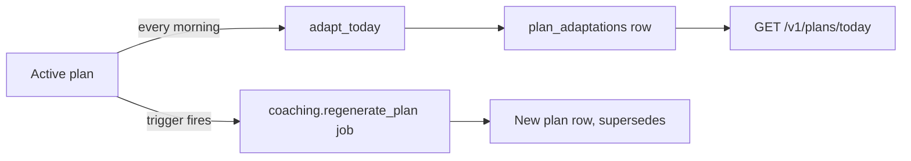

# 15 — Training Engine Specification

**Status:** awaiting review

Scope: the deterministic training engine — what `backend/algorithms/` actually
computes today, and the forward plan for each area. This document is the **delta**
on `docs/04` (formulas and evidence), `docs/09` (versioning, promotion gates,
accuracy loop), `docs/03` (API conventions) and `docs/02` (tables). It does not
restate them.

Every capability below is marked **BUILT** (Phase 1, in `backend/algorithms/`,
209 tests, standard library only) or **PLANNED (Phase N)** against `docs/07`.
No schema is defined here: every table or column change is **described** and
**sequenced in `docs/19` (Database Evolution)**, to be applied by a human from a
reviewed SQL file (ADR-012). §9 records corrections to `docs/04` found while
reading the source.

Two invariants constrain everything that follows:

1. **The anchor is sacred.** One hour at threshold = 100, on every source, in
   every sport. Verified by execution: `power_tss(3600, 250, 250)`,
   `hr_tss(60, lthr, …)`, `pace_tss(3600, 240, 240)`, `swim_tss(3600, 95, 95)` and
   `session_rpe_load(60, 7)` all return exactly `100.0`. Any Phase 2 feature that
   would rescale a load score by sport, terrain or fatigue is rejected — it breaks
   CTL, ACWR, monotony and every plan target at once. Asymmetries go in a
   **parallel series**, never into the load score (§2.2).
2. **`algorithms/` imports nothing.** Registry-driven parameters therefore arrive
   as arguments from the service layer; the engine never reads a database
   (ADR-003, §6.2).

---

## 1. Endurance

### 1.1 Per-session load — BUILT

`training_load.training_load(activity, profile) -> TrainingLoadResult(score,
source, confidence, detail)`. It walks the sport's precedence list and returns the
first source with sufficient data; it never raises on missing data.

| Sport | Precedence (`_PRECEDENCE`) | Threshold anchor |
|---|---|---|
| bike | power → heart_rate → rpe | `ftp_watts` |
| run | power → **heart_rate** → pace → rpe | `run_threshold_power_w`, then LTHR |
| swim | **pace** → heart_rate → rpe | `css_s_per_100m` |
| strength / other | heart_rate → rpe | LTHR |

Run puts HR above pace because we have no grade-adjusted pace; swim puts pace
above HR because wrist optical HR is unreliable in water. Cycling FTP is never
applied to running power — separate profile columns, separate branch, regression
test.

`load_confidence` is `_SOURCE_CONFIDENCE`: power `0.95`, pace `0.80`, heart rate
`0.75`, RPE `0.45`, none `0.0`. RPE calibration is `RPE_LOAD_CALIBRATION =
100/420` (60 min at RPE 7 = one threshold hour). An unscoreable session returns
`LoadSource.NONE` with score `0.0` — rendered as "needs a perceived effort", never
as a zero-effort session. **`load_source` and `load_confidence` travel to every
API response and into the AI context packet**; a client showing a load number
without them is misrepresenting it.

### 1.2 Load over time — BUILT

* `fitness_fatigue(loads, start, end, seed_ctl=, seed_atl=)` → `LoadPoint(day,
  load, ctl, atl)` with `.tsb = ctl − atl`. Banister EWMA, `CTL_TIME_CONSTANT_DAYS
  = 42.0`, `ATL_TIME_CONSTANT_DAYS = 7.0`, `α = 1 − e^(−1/τ)` (0.02353 / 0.13312)
  — *not* the finance `2/(N+1)` convention. Seeds let a recompute resume from
  stored state instead of walking an athlete's whole history.
* `acwr(loads, ref_day, acute_days=7, chronic_days=28, method="rolling"|"ewma")` →
  `AcwrResult(ratio, acute_daily, chronic_daily, method, days_of_history)`, ratio
  of *daily averages*. `zone`: `<0.80` undertraining · `≤1.30` sweet_spot ·
  `≤1.50` elevated · else danger.
  **EWMA seeding correctness:** both averages are seeded with the window mean, not
  zero. Seeded at zero the 28-day average is only ~63% converged after 28 samples
  while the 7-day one is ~98%, inflating the ratio to ~1.55 on a perfectly
  constant load. The regression test is "constant load → ratio exactly 1.0".
  **Evidence caveat, which must reach the UI copy:** the coupled rolling form is
  contested (Impellizzeri et al. — mathematically prone to spurious association).
  ACWR is surfaced as *one driver among several* and is never the sole input to
  injury risk.
* `monotony_strain(loads, ref_day, window_days=7)` → Foster monotony (mean/SD) and
  strain (weekly load × monotony). A flat week has zero dispersion → `(None,
  None)`, never a fabricated number.
* `weekly_ramp_pct(loads, ref_day)` → week-over-week percentage, `None` from a
  zero baseline (a restart is not an infinite ramp).

**Caller contract (must be specified, because it is currently implicit).**
`days_of_history` counts *keys present in the loads mapping*, while
`daily_load_series` emits only days that had an activity. A four-sessions-a-week
athlete therefore yields `days_of_history == 16` and `is_reliable == False`
forever, which silently drops the ACWR term from readiness and from injury risk.
The analytics service **must** pass a calendar-dense day→load map with rest days
as explicit `0.0` from the athlete's first activity onward. Enforced by a service
test, not by hope. See §9.1.

### 1.3 Zones — BUILT

`zones.hr_zones` (Friel 5-zone on measured LTHR; %HRmax 5-zone fallback),
`power_zones` (Coggan 7-zone on FTP: 0.56 / 0.76 / 0.91 / 1.06 / 1.21 / 1.51),
`pace_zones` (5 bands on threshold *speed*, converted to s/km where the ordering
inverts — compare via `zone_for_value`), `zone_seconds`,
`intensity_distribution` (low Z1–2 / moderate Z3 / high Z4+; `is_polarised`
requires low ≥75% and high ≥ moderate), `default_zones_for_sport`.

**Anchor transparency rule.** Every zone carries `Zone.anchor` (`lthr`, `hr_max`,
`ftp`, `threshold_pace`) and `GET /v1/me/zones` returns it. HRmax falls back to
Tanaka `208 − 0.7 × age`, not `220 − age`. An estimated anchor is labelled as
estimated: `hr_zones` deliberately uses the %HRmax band model when LTHR is only
*derivable* rather than measured, because an LTHR estimated from HRmax adds no
information over %HRmax bands and pretending otherwise implies precision we do
not have.

### 1.4 Efficiency — BUILT today, trending PLANNED

BUILT: `running_efficiency_index` (m/min per bpm), `cycling_efficiency_factor`
(NP/bpm), `stroke_index`, `swolf` (lower is better),
`decoupling_pct(first_half, second_half)` with
`GOOD_DECOUPLING_THRESHOLD_PCT = 5.0`, `estimated_1rm` (Epley **and** Brzycki plus
their mean; `reliable = 0.0` above 12 reps), `compare_to_baseline` (signed so
positive always means better) and `session_efficiency`.

**PLANNED (Phase 3.8) — efficiency trending and weakness detection.** Per-sport,
per-metric recency-weighted trend over intensity-matched sessions, reusing
`performance.progression_forecast` rather than a second fitting path. Matching is
the hard part and belongs in the service: bucket by zone of the session's average
intensity, exclude sessions with `load_source ∈ {rpe, none}`, require ≥6 sessions
in a bucket before reporting a trend, otherwise `422`. Weakness detection is
defined as *disagreement between independent estimators*, not as a vibe: a
distance-specific weakness is a ≥5% divergence between the VDOT and Riegel legs
of `equivalent_times`; a durability weakness is decoupling that exceeds 5% at a
duration the athlete's CTL says they should sustain; a technique weakness is
stroke index falling while pace holds.

**PLANNED (Phase 2.5) — durability / decoupling as a gated entitlement.**
Multi-window decoupling (per-third rather than per-half), late-session power or
pace retention, and per-sensor analyzers (running dynamics, cycling pedal
balance, swim stroke-type breakdown) are Premium or individually-unlocked
features. The engine functions are already dependency-free and unit-tested; the
Phase 2 work is entitlement resolution and the sample-stream read path, not new
maths. Gating rules: entitlement is resolved **server-side** from
`billing.entitlements` (never from a client claim), a locked analyzer returns
`403 entitlement_required` with the feature key, and the metric is absent from
`GET /v1/metrics/summary` rather than present-and-blanked, so a client bug cannot
leak it.

---

## 2. Triathlon plans — the least-built area

### 2.1 What exists — BUILT

`plan.generate_plan(request, profile)` from `PlanRequest(goal, primary_sport,
start_date, weeks, sessions_per_week, level, current_ctl, secondary_sports,
race_date)` → `TrainingPlan(weeks, primary_sport, goal, ramp_cap_pct)` of
`WeekPlan(week_index, phase, target_load, sessions, is_recovery_week)` of
`SessionPlan(day_offset, sport, title, target_load, duration_min, intensity,
is_key_session, notes)`.

Weekly load starts at `max(current_ctl × 7, _STARTING_WEEKLY_LOAD[level])`
(150/300/500) and ramps within `RAMP_CAP_BY_LEVEL` (beginner 5%, intermediate 8%,
advanced 10%). Recovery week every 4th at `0.65`. Taper factors `(0.70, 0.50)` of
peak. Session duration is derived from target load through `LOAD_PER_HOUR`
(recovery 36, easy 49, tempo 72, threshold 96, vo2max 117 — i.e. `100 × IF²` at
that band's representative IF), which is what makes a compliant session record the
load the plan predicted. `_spread_day` places sessions proportionally across the
week. Multi-sport support today is `_rotate_sports`: the primary sport takes every
even slot, secondaries interleave.

That is a competent single-sport periodiser with sport labels. It is **not** a
triathlon planner. The gaps, all PLANNED (Phase 2 unless noted):

### 2.2 Splitting weekly load across three sports + strength

The generator gains a load-allocation step between "week target" and "session
template". Shares are on **load**, not time, with the implied hours per sport
returned alongside so an athlete can check the plan against their week.

| Race | swim | bike | run | strength (absolute) |
|---|---|---|---|---|
| Sprint | 22% | 43% | 35% | ≤8% of week, 2 sessions in base |
| Olympic | 20% | 45% | 35% | ≤8%, 2 in base / 1 in build & peak |
| 70.3 | 15% | 55% | 30% | ≤6%, 1–2 |
| Full | 13% | 57% | 30% | ≤5%, 1 |

Shares are **registry parameters**, not code constants (§6). Strength enters the
load model through `_PRECEDENCE[STRENGTH]` (HR → RPE), so a gym session without HR
still scores from RPE at confidence 0.45.

**Sport-specific recovery-cost asymmetry.** A hard run costs more than an
equivalent bike TSS, because of eccentric and impact loading. Two candidate
designs; one is rejected:

* *Rejected:* scale ATL by sport. TSB would become the difference of two different
  units and every stored `daily_metrics` row would change meaning.
* **Adopted:** keep load, CTL, ATL and TSB exactly as built, and compute a
  **parallel fatigue-weighted series** `strain_load = load × recovery_cost_weight`
  used only for (a) allocating load across sports in the generator, (b) an
  additional injury-risk feature, and (c) the readiness load component's monotony
  term. Prior weights, to be registered and then validated: run 1.00, strength
  0.85, bike 0.75, swim 0.60.

Acceptance test: for a single-sport athlete the new series is proportional to the
old one and no CTL/ATL/TSB value changes. The weights are priors from the
eccentric-loading literature, explicitly not fitted — they graduate to fitted
per-athlete values with the digital twin (Phase 3.1) and are labelled as priors
until then.

### 2.3 Brick sessions

`SessionPlan` carries a single `sport`, so a brick cannot be expressed today. Two
changes:

* engine: `SessionPlan` gains an optional `segments` tuple (sport, intensity,
  duration_min, target_load); `sport` remains the dominant segment for
  backwards-compatible rendering. Session load is the sum of segments, so the
  IF²-derived duration relationship holds per segment.
* schema: `coaching.plan_sessions` needs `brick_group_id` and `segment_index`
  (nullable), so two rows can also represent a bike→run brick when the athlete's
  watch records them as two activities — **sequenced in `docs/19`**.

Placement rules: bricks appear in build and peak only, at most one per week,
always the week's bike key session, and are never scheduled the day after a
threshold or vo2max run. Compliance for a brick is satisfied by either one
multisport activity or two activities on the same `local_date` in segment order.

### 2.4 Race-specific taper

`_TAPER_FACTORS` is fixed at two weeks for plans ≥8 weeks and is distance-blind.
PLANNED replacement, keyed on race distance, keeping the built taper *shape* (one
threshold key session plus easy volume — intensity and frequency maintained,
volume cut, per the Mujika/Bosquet taper meta-analyses):

| Race | Taper weeks | Factors of peak |
|---|---|---|
| Sprint | 1 | 0.75 |
| Olympic | 1 | 0.70 |
| 70.3 | 2 | 0.80, 0.55 |
| Full | 3 | 0.85, 0.65, 0.45 |

Race week gains the `TrainingPhase.RACE` phase, which the enum already defines but
the generator can never currently emit (§9.4): race week is openers plus the race,
not a third taper week.

### 2.5 A/B/C race prioritisation

Read from `training.athlete_goals` — `race_date`, `primary_sport`,
`target_distance_m`, `priority` (SmallInteger, already present). Mapping:
`priority = 1 → A`, `2 → B`, `3 → C`.

* **A race:** full distance-specific taper, a recovery week after, and the plan's
  peak is aligned to it.
* **B race:** 3–5 day mini-taper (last loading week × 0.80), no peak realignment,
  2–3 recovery days after.
* **C race:** trained through as the week's key session; no taper, no post-race
  reduction.
* Validation: at most one A race inside any 12-week window and no A race inside
  another A race's taper → `422 conflicting_race_priorities`. Two A races six
  weeks apart is not a plan, it is two plans.

### 2.6 Periodisation model

`TrainingPhase` (base/build/peak/taper/race/recovery) is BUILT and unchanged.
`_phase_for_week` allocates taper (2 weeks ≥8, 1 week ≥4), peak (2 weeks ≥12, 1
week ≥6), then 45% of the remainder to base and the rest to build; no race date
means base→build and no taper. PLANNED: emit `RACE` for race week, fix the
sub-4-week-with-race case that currently never tapers (§9.6), and make
`sessions_per_week` sport-aware (a triathlete's 9 sessions are 3/3/2 + 1 strength,
not 9 slots in rotation).

### 2.7 Generator contract, determinism, `generator_version`

| Aspect | Specification |
|---|---|
| Inputs | `PlanRequest` + `AthleteProfile` + resolved goal set + registry parameter row. Nothing else. No clock read inside the engine — all offsets are relative to `start_date`. |
| Outputs | `TrainingPlan`; persisted as one `coaching.training_plans` row (which already records `generator_version` and the input params per `docs/02`) plus `coaching.plan_sessions` rows. |
| Determinism | Pure function. No randomness, no I/O, no dict-ordering dependence in output (weeks and sessions are sorted by `day_offset`). |
| Reproducibility | `(generator_version, serialised PlanRequest, parameter row)` regenerates a byte-identical plan. Asserted by test, and it is the reason parameters live in the registry rather than in module constants. |
| Versioning | `generator_version` is the `analytics.algorithm_versions` row for `plan_generator`. A plan is never silently upgraded: an active plan keeps its generator until regenerated. |

**`profile` is currently accepted and ignored** (§9.5). Phase 2 uses it for
sport-specific durations and zone-anchored session prescriptions; until then the
parameter stays for signature stability and is documented as unused rather than
implying personalisation we do not do.

### 2.8 Regeneration vs daily adaptation

Adaptation is per-day, **never mutates the plan**, and is recorded in
`coaching.plan_adaptations` (input readiness/risk, action, reason). Regeneration
writes a new plan row and supersedes the old one; the old plan and its sessions are
retained for history.

Regeneration triggers: goal or race-date change · `weekly_compliance` outside
0.70–1.30 for 3 consecutive weeks · measured CTL drifting >20% from the plan's
assumption · a new injury report of moderate or worse severity · ≥14 days with no
activity data. Rate limit: at most one **automatic** regeneration per 7 days
(manual is always allowed) — plan churn destroys trust faster than a slightly
stale plan.

### 2.9 Compliance measurement

`plan.weekly_compliance(planned_load, actual_load)` is BUILT (clamped 0–2) and
already documented as feeding the next block's ramp. What is missing is the
linkage: `coaching.plan_sessions` needs the completed-activity link
(`activity_id`, `link_source` ∈ manual|auto, `status`) — **sequenced in
`docs/19`**. `POST /v1/plans/sessions/{id}/complete` is the manual path; the
auto-linker matches same `local_date` + same sport + (duration within 30% **or**
load within 40%), writes `link_source='auto'`, and never overwrites a manual link.
Session-level compliance is reported as three numbers, because one ratio hides the
interesting failure: load ratio, session-count ratio, and key-session completion
rate. An athlete at 95% load but 40% key sessions is not compliant.

---

## 3. Recovery

### 3.1 BUILT

`recovery.readiness(profile, wellness_history, loads, ref_day) ->
ReadinessResult(score, band, drivers, data_quality)`.

| Component | `COMPONENT_WEIGHTS` | Method |
|---|---|---|
| hrv | 0.30 | z-score of `ln(rMSSD)` vs a 28-day personal baseline (`BASELINE_WINDOW_DAYS = 28`, `MIN_BASELINE_POINTS = 7`) |
| sleep | 0.25 | duration vs `DEFAULT_SLEEP_NEED_MIN` (480), efficiency, and deep+REM share vs `DEEP_REM_TARGET_FRACTION = 0.45` |
| training_load | 0.20 | TSB freshness (`+5` → 100, `−30` → 0), ACWR safety (≤1.30 → 100, else `100 − (ratio − 1.30) × 200`), monotony penalty (`100 − max(0, m − 1.5) × 60`) |
| resting_hr | 0.15 | inverted z-score vs the same window |
| subjective | 0.10 | Hooper index (soreness, mood, stress, fatigue; 1 best, 5 worst) |

z-scores map to 0–100 saturating at ±2 SD — an athlete 3 SD and one 5 SD below
baseline need the same advice.

**HRV noise gate.** If today's rMSSD deviates from the 28-day *raw* mean by less
than `stats.smallest_worthwhile_change` (= 0.5 × within-athlete CV, Plews et al.),
the component returns exactly `50.0` — neutral, not a signal. Without this gate the
score jitters daily on noise and the athlete stops believing it.

**Why one night is refused.** The HRV and resting-HR components require
`MIN_BASELINE_POINTS = 7` prior days and return `None` below that; a `None`
component is dropped and its weight is not counted. `data_quality` is the **sum of
the weights actually present** (so HRV+sleep only = 0.55), and weights are
renormalised over what is present — missing is never zero. With no usable input at
all the result is a neutral `50.0` with `data_quality = 0.0`, and the API refuses
to render it (`422 readiness_insufficient_data` below 0.35, `docs/03` §6).

**Drivers reconstruct the score exactly.** `contribution = normalised_weight ×
(component_score − 50)`, so contributions sum to `score − 50` — a tested
invariant, because the AI layer's sentence must match the number on screen.
Drivers are sorted by `abs(contribution)`. Bands: `<25` compromised · `<50`
limited · `<70` moderate · `<85` good · else prime.

### 3.2 PLANNED

* **Phase 3.1 — learned `recovery_half_life_days` replaces the fixed ATL
  constant.** `ATL_TIME_CONSTANT_DAYS = 7.0` is a population prior. The twin fits
  a per-athlete half-life by choosing the τ that best predicts next-day readiness
  from load history, constrained to 3–14 days, requiring ≥90 days of paired
  load/readiness data, and shrunk toward 7.0 in proportion to fit quality. It is
  registered as an `algorithm_versions` parameter override per athlete, stored on
  the twin snapshot, and **CTL's 42 days is not fitted** — a per-athlete fitness
  constant is unidentifiable from the data we have, and pretending otherwise is
  how a "personalised" model becomes an overfitted one.
* **Readiness → adaptation.** `plan.adapt_today(session, readiness, risk)` is
  BUILT: `≥70` as planned · `50–69` key session down one `_DOWNGRADE` band (and
  −10% duration) or −20% volume · `25–49` `EASY_ONLY` (−40% duration, load halved)
  · `<25` `REST` · very-high injury risk caps a vo2max/threshold session at tempo
  even on a green day. Below `_MIN_DATA_QUALITY_TO_ADAPT = 0.35` the plan is left
  **as written** with the reason saying so — silently downgrading a session because
  a watch failed to sync loses the athlete's trust in every later recommendation.
  Phase 2 adds sport-aware downgrades (a swim's "one band down" is not a run's)
  and multi-day rescheduling: today's moved key session must land somewhere, which
  the current single-day gate does not decide.

---

## 4. Injury risk

### 4.1 `heuristic-v0` — BUILT

`injury_risk.assess(profile, loads, wellness_history, ref_day) ->
RiskResult(probability, band, drivers, model_version="heuristic-v0",
is_clinically_validated=False)`. Logistic index over ten features, each expressed
in "risk units" and clamped to `_FEATURE_CAP = 3.0` so one extreme input cannot
saturate the model.

| Feature | Coefficient | Trigger |
|---|---|---|
| `prior_injury` | +0.85 | `injuries_last_12m ≥ 1` (most replicated predictor) |
| `low_chronic_load` | +0.55 | CTL below 30, scaled by `(30 − CTL)/30` |
| `acwr_excess` | +0.45 | `(ratio − 1.30)/0.20`, only when `is_reliable` |
| `sleep_debt_h` | +0.35 | hours/night below 8 over the trailing week |
| `ramp_excess` | +0.30 | `(ramp% − 10)/10` |
| `hrv_suppression` | +0.30 | suppressed days (z < −1.0) in 14, in units of 7 |
| `monotony_excess` | +0.25 | `(monotony − 1.80)/0.50` |
| `resting_hr_elevation` | +0.20 | SDs above the 28-day baseline |
| `age_over_40` | +0.15 | `(age − 40)/10` |
| `training_age` | **−0.40** | protective, `min(years, 5)/5` |
| `INTERCEPT` | −2.60 | ~6.9% four-week base rate with no pattern present |

Coefficient signs and relative magnitudes follow the consensus direction of effect
in the sports-medicine literature; **the magnitudes are priors, not fitted
estimates**, and that sentence is part of the spec, not a caveat.

**Log-odds attribution.** `Driver.contribution = coefficient × feature`, and the
contributions plus `INTERCEPT` sum to the logit. Log-odds are additive where
probability contributions are not, so this is the only arithmetically honest
decomposition; a test reconstructs the probability from the drivers alone. Bands:
`<0.10` low · `<0.20` moderate · `<0.35` high · else very_high.

**The unvalidated label must survive to the UI.** `is_clinically_validated=False`
and `model_version` are required fields on `GET /v1/metrics/injury-risk`, on the
`metrics/summary` payload, in the AI context packet, and in the rendered mobile and
web components. A client that renders the probability without the label fails its
contract test. The AI layer may never phrase risk as a diagnosis.

**The seam.** `extract_features` produces a plain `dict[str, float]`; `predict`
consumes it. A trained model replaces `predict` only. Consequence for Phase 1
operations: **log the feature vector on every assessment** so the features we
train on later are exactly the features we shipped — the storage column is
described in `docs/19`.

### 4.2 The Phase 3 path

1. **Phase 3.4 — labels first, and this ordering is not negotiable.** In-app pain
   and injury reporting: body region, onset date, severity, whether training was
   missed, resolution date, and whether it was clinician-assessed. Free-text is
   captured but never sent to the model layer. Injury reports are special-category
   health data: athlete-scoped RLS, `identity.audit_events` on every cross-athlete
   read via a grant, never logged, and excluded from any aggregate export that
   could re-identify. Tables and columns **sequenced in `docs/19`**.
2. **Phase 3.5 — a trained model, gated.** Trained offline in `ml/` on the logged
   feature vectors joined to labels, with a time-based split (never a random split
   — leakage across an athlete's adjacent days would manufacture accuracy), and
   held-out athletes, not just held-out days.
3. **Promotion gate** (`docs/09` §6.5, restated here as the concrete checklist):
   eval suite passes · MAE not worse on held-out data · interval calibration within
   tolerance · no safety regression · no engagement harm in the variant experiment.
   Additionally, for this model only: no worse calibration in the highest-risk
   decile, because that is the decile that changes advice.
4. **If the trained model does not beat `heuristic-v0`, the heuristic stays.**
   Shipping an unvalidated-but-honest heuristic is better than shipping a fitted
   model that is worse. `is_clinically_validated` flips to `true` only on clinical
   validation, which a held-out MAE win is not.

---

## 5. Performance prediction

### 5.1 BUILT

| Model | Function | Detail |
|---|---|---|
| Riegel | `riegel_predict`, `fit_riegel_exponent` | `T₂ = T₁ × (D₂/D₁)^k`; `DEFAULT_RIEGEL_EXPONENT = 1.06`; fitted per athlete by log-log OLS from ≥3 PBs, returned with r², clamped to 1.00–1.20 (outside that range the inputs are inconsistent, not the physiology exotic) |
| Daniels VDOT | `vdot_from_race`, `predict_time_from_vdot` | Daniels/Gilbert oxygen cost and %VO₂max; inverted by bisection (monotone, no closed form). Verified: 20:00 5 km → VDOT 49.81, round-trips to 1200.0 s |
| Critical speed / power | `critical_speed`, `critical_power` | Two-parameter model; returns `(CS, D′)` and `(CP, W′)`. Use 3–20 minute efforts |
| FTP | `ftp_from_20min_test` | 0.95 × 20-minute mean power |
| Trend | `progression_forecast` | Recency-weighted OLS (60-day half-life), 95% interval from `LinearFit.prediction_sd` including leverage, so extrapolation widens honestly. `None` below 3 observations |
| PB probability | `probability_of_beating` | Normal CDF over the forecast's own interval — a wide interval yields ~0.5, not false precision |
| Triathlon | `triathlon_prediction` | Segment sum + explicit `transition_allowance_s = 240` |

**Never a bare point estimate.** `equivalent_times` returns `low`/`high` as the
min/max of the VDOT and Riegel legs and a confidence of `max(0.2, 1 − 5 ×
spread/blended)`; agreement within 2% is high confidence, 10% apart means a real
distance-specific strength worth naming. That interval is a **model-spread
interval, not a statistical one**, and the API must label it as such — only
`progression_forecast` returns a true 95% prediction interval.
`triathlon_prediction` currently returns no interval at all and a hardcoded
confidence of 0.6 (§9.3): PLANNED (Phase 2) is to compose it from the three
segment forecasts' intervals in quadrature plus a transition-time distribution,
and until then it must not be presented as a race-time prediction.

### 5.2 The accuracy loop — PLANNED (Phase 3.3)

Every prediction shown to an athlete is written to `analytics.prediction_records`
(immutable; `UPDATE`/`DELETE` revoked) with metric, value, `low`, `high`, method,
confidence, horizon date, the `algorithm_versions` id and the input hash. A
scheduled job (`analytics` queue) scores each record when its horizon passes,
writing `analytics.prediction_outcomes` with the actual value, signed error,
absolute error and `within_interval`. Both tables exist (migration 0004).

Reported per metric and per version: **MAE** and **interval coverage**. A
well-formed 95% interval contains the actual ~95% of the time; measured coverage of
60% is over-confidence, which is far more actionable than a raw error figure. This
is how "our predictions are good" becomes a number — `GET
/v1/metrics/predictions/accuracy` for the athlete's own history, and the same
aggregate as the first criterion of the promotion gate. Scoring an athlete's
prediction requires a comparable actual: a race result or an equivalent-effort
time trial, not any faster training run, or the loop measures nothing.

---

## 6. Algorithm governance — the Scientific Algorithm Development System

PLANNED (Phase 3.2), on tables that already exist (migration 0004). Five verbs,
each with a concrete mechanism.

### 6.1 Version

`analytics.algorithm_versions`: name, semver, **every tunable parameter as JSONB**,
active window, notes. A unique partial index enforces at most one active version
per algorithm — in the database, not by deploy order. Registered algorithm names:
`training_load`, `fitness_fatigue`, `acwr`, `readiness`, `injury_risk`,
`performance_prediction`, `plan_generator`, `zones`.

### 6.2 The parameter seam (required change)

Today the constants are module-level (`COMPONENT_WEIGHTS`, `COEFFICIENTS`,
`INTERCEPT`, the time constants, `LOAD_PER_HOUR`, `RAMP_CAP_BY_LEVEL`,
`_TAPER_FACTORS`). A registry that cannot change them is decoration. The engine
therefore gains a frozen parameters dataclass per algorithm, passed in by the
service, **defaulting to exactly today's values** so the seeded v1 row reproduces
current output bit-for-bit — asserted by a test that runs the golden fixtures with
defaults and with the seeded row and compares. The engine still performs no I/O:
the service reads the row (cached, 15 min) and passes it down (ADR-003 holds).

### 6.3 Compare

`analytics.experiment_assignments` maps user → variant, **stickily**: assignment is
a deterministic hash of `(user_id, experiment_key)`, written on first evaluation
and never recomputed. An athlete flipping between a v1 and v2 readiness model day
to day makes both the athlete and the experiment uninterpretable. Comparison
criteria in order (`docs/09` §6.3): prediction accuracy (MAE + calibration) →
athlete outcome → engagement (thumbs-up rate, plan compliance).

### 6.4 Verify accuracy

§5.2's loop, plus `analytics.eval_runs` for the deterministic algorithm eval suite.
**A version with no passing `eval_run` must not be activated.**

### 6.5 History and rollback

Change history is the `algorithm_versions` rows themselves plus an
`identity.audit_events` row for every activation and deactivation (actor, version,
reason, request id) — activation is a staff action, so it is MFA-required and
audited, and there is no RLS exemption for support.

**Rollback is data, not a deploy:** set `active_to` on the current version, clear
`active_to` on the previous one, then enqueue `analytics.recompute` for the
affected athletes. Because `training.daily_metrics.engine_version` is stored per
row, the sweep is targetable ("every row not on the active version") instead of a
full rebuild. Rollback must be exercised, not assumed: a staging drill that
activates v2, recomputes, rolls back, and asserts every metric row returns to its
v1 value is part of the Phase 3.2 exit criteria.

---

## 7. APIs required

`/v1`, RFC 9457 problem+json, cursor pagination, SI-suffixed units, `null` never
zero (`docs/03`).

| Surface | Endpoint | State |
|---|---|---|
| Zones | `GET /v1/me/zones?sport=` — bands + `anchor` | **BUILT** |
| Metrics | `GET /v1/metrics/{summary,readiness/today,readiness,training-load,acwr,injury-risk,efficiency,predictions}` | PLANNED (1.x, specified in `docs/03` §6) |
| Metrics | `GET /v1/metrics/intensity-distribution?from=&to=` | PLANNED (2) |
| Metrics | `GET /v1/metrics/efficiency/trend?sport=&metric=&from=&to=` | PLANNED (3.8) |
| Metrics | `GET /v1/metrics/durability?sport=` — decoupling and late-session retention | PLANNED (2.5, entitlement-gated) |
| Metrics | `GET /v1/metrics/predictions/accuracy` — per-metric MAE + interval coverage | PLANNED (3.3) |
| Plans | `GET /v1/plans/current`, `POST /v1/plans`, `GET /v1/plans/{id}`, `POST /v1/plans/{id}/activate`, `GET /v1/plans/today`, `POST /v1/plans/sessions/{id}/complete`, `POST /v1/plans/sessions/{id}/skip`, `GET /v1/plans/{id}/compliance`, `GET /v1/plans/adaptations?from=&to=` | PLANNED (1.x, `docs/03` §8) |
| Plans | `POST /v1/plans?dry_run=true` — generate without persisting | PLANNED (2) |
| Plans | `POST /v1/plans/{id}/regenerate` — explicit, `If-Match` on the plan ETag | PLANNED (2) |
| Injury | `POST /v1/injury-reports`, `GET /v1/injury-reports`, `POST /v1/injury-reports/{id}/resolve` | PLANNED (3.4) |
| Governance | `GET /v1/admin/algorithm-versions`, `POST /v1/admin/algorithm-versions/{id}/activate`, `POST /v1/admin/algorithm-versions/{id}/rollback` | PLANNED (3.2) — staff only, MFA, audited |

**Honest failure, and the distinction matters.** Where a number would become
*advice*, thin data is a refusal: `422` with a stable machine code —
`readiness_insufficient_data` (`data_quality` < 0.35),
`forecast_insufficient_history` (<3 observations), `efficiency_trend_insufficient_history`
(<6 matched sessions), `plan_insufficient_profile` (no threshold anchor for the
primary sport). Where a number is merely *descriptive*, it degrades instead:
`GET /v1/metrics/acwr` returns `200` with `is_reliable: false` and
`days_of_history`, and load responses always carry `load_source` /
`load_confidence`. `403 entitlement_required` for a locked analyzer;
`422 conflicting_race_priorities` for two A races.

---

## 8. Module contracts

### 8.1 `training`

* **Purpose.** Own the athlete's physiological truth: profile, thresholds, goals,
  PBs, activities, wellness, and the materialised `daily_metrics` the dashboard
  reads. It is the only module that calls the endurance, recovery, injury and
  zone algorithms.
* **Responsibilities.** Normalise provider data into `ActivitySummary` /
  `DailyWellness`; build the **calendar-dense** day→load map (§1.2); compute and
  persist load, CTL/ATL/TSB, ACWR, monotony, readiness + drivers, injury risk +
  feature vector, `data_quality` and `engine_version`; serve zones with their
  anchor; own `data_quality_flags`.
* **Database changes** (all **sequenced in `docs/19`**, reviewed SQL, human-applied):
  injury/pain report tables; a persisted injury-risk feature vector; per-sport
  `recovery_cost_weight` in the registry parameter row (no new column); the
  efficiency-baseline columns needed for intensity-matched trends. Every table is
  athlete-scoped with `user_id` and an RLS policy; nothing gets an admin exemption.
* **APIs.** `/v1/me/profile`, `/v1/me/zones`, `/v1/me/goals`,
  `/v1/me/personal-bests`, `/v1/activities/**`, `/v1/metrics/**`,
  `/v1/injury-reports/**`.
* **Dependencies.** `algorithms` (direct); `integrations` (Garmin, later
  Polar/Suunto/Samsung); `identity.service` for principal and grant checks;
  `billing.service` for entitlement resolution on gated analyzers. Never imports
  another module's `models` or `repository`.
* **Security.** RLS on every table keyed on `app.current_user_id()`, fail-closed;
  repository queries also scoped by `user_id` (belt and braces). Health values,
  names and emails never logged — `user_id` only. Cross-athlete reads only through
  `identity.data_access_grants`, each writing an `identity.audit_events` row.
  OWASP: A01 (the isolation matrix), A03 (parameterised queries only), A04
  (insecure design — thin-data refusal and the unvalidated label are design
  controls), A08 (immutable prediction/audit tables), A09 (audit on every
  cross-athlete read).
* **Testing.** Analytics unit tests (§8.3) · repository integration tests against
  real Postgres with RLS · a **tenant-isolation matrix row for every new endpoint,
  or the build fails** · a contract test asserting `is_clinically_validated` and
  `model_version` are present on every injury-risk response shape · a service test
  asserting the dense-day-map contract (an athlete with rest days still gets
  `is_reliable == true` after 28 calendar days).

### 8.2 `coaching` (plan and twin side)

* **Purpose.** Turn metrics into decisions: generate plans, adapt daily, hold the
  athlete digital twin, and record every decision for explainability and
  evaluation.
* **Responsibilities.** `plan_generator` invocation and persistence with
  `generator_version` + input params; daily `adapt_today` gating written to
  `plan_adaptations`; regeneration triggers and the 7-day automatic cooldown;
  session↔activity linking and the three compliance ratios; twin snapshots
  including the fitted `recovery_half_life_days` and Riegel exponent.
* **Database changes** (**sequenced in `docs/19`**): `plan_sessions.activity_id`,
  `link_source`, `status`, `brick_group_id`, `segment_index`; per-sport load-share
  and taper parameters live in the registry row, not in new columns.
* **APIs.** `/v1/plans/**`, `/v1/coach/twin`, and the governance admin surface.
* **Dependencies.** `training.service` (profile, CTL, readiness, risk, goals —
  never `training.models`); `algorithms.plan`; `billing.service` for tier limits;
  `notifications.service` for the daily readiness push. LLM providers are not
  involved in plan generation at all — it is deterministic and free, which is what
  keeps it inside the $2.41/subscriber constraint.
* **Security.** Plans and adaptations are athlete-scoped with RLS. A coach reads a
  plan only through a scoped, expiring, revocable grant, audited. Entitlement is
  resolved server-side; a client claiming Premium gets nothing. The AI layer
  receives the *adapted session and its reason*, never raw streams, and takes no
  user-id parameter.
* **Testing.** Plan determinism (same request + version → identical plan) ·
  regeneration trigger table driven by fixtures with a frozen clock · isolation
  matrix rows for all plan endpoints · an eval case asserting the coach's
  explanation of today's session names the actual top readiness driver.

### 8.3 Algorithm testing strategy

Per `CLAUDE.md`: every algorithm gets three tests minimum, and every one of them
runs with no dependencies installed (`python3 -m unittest discover -s tests -t .`).

| Algorithm | Anchor case | Undefined case | Hand-computed value |
|---|---|---|---|
| `training_load` | all five sources = 100.0 at one threshold hour | no usable input → `LoadSource.NONE`, score 0 | `power_tss(3600, 250, 250) = 100.0`; `session_rpe_load(60, 7) = 100.0` |
| `fitness_fatigue` | constant load → CTL → that daily load | reversed range raises | `α = 1 − e^(−1/42) = 0.023528` |
| `acwr` | constant load → ratio exactly 1.0 | no chronic load → `ratio is None`, zone `unknown` | 14 dense days at 100 then 14 at 0 → measurable, asserted exactly |
| `monotony_strain` | — | flat week → `(None, None)` | 7 days, one 100 and six 0 → monotony 0.378 |
| `readiness` | all components 50 → score 50, drivers sum 0 | no inputs → 50 with `data_quality 0.0` | contributions sum to `score − 50` |
| `injury_risk` | no patterns → `predict({}) = 0.0691` | absent inputs contribute 0, coverage reported | drivers + `INTERCEPT` reconstruct the logit |
| `performance` | 20:00 5 km → VDOT 49.81, round-trips to 1200.0 s | <3 observations → `None` | `ftp_from_20min_test(300) = 285.0`; `critical_speed(1000, 200, 3000, 660) = (4.3478, 130.4)` |
| `plan_generator` | ramp never exceeds the level cap across loading weeks | 0 weeks raises | `LOAD_PER_HOUR['threshold'] = 96` → a 96-load threshold session is 60 min |
| `zones` | LTHR anchor reported as `lthr` | neither LTHR nor HRmax → `()` | Coggan Z4 on FTP 250 = 227.5–265.0 W |

**No randomness in any fixture.** A flaky physiology test is worse than no test.
Money paths get property tests; there are none in this engine, which is why there
are none here.

---

## 9. Corrections to `docs/04` found in the source

Recorded rather than silently fixed, because `docs/04` is an approved artefact.

1. **ACWR reliability is caller-dependent.** `docs/04` §2 says `is_reliable` is
   false "below 28 days of history"; the code counts *keys in the loads mapping*,
   and `daily_load_series` emits only training days. Verified: 14 sessions across
   28 days → `days_of_history = 14`, `is_reliable = False`; the same data densified
   → 28, `True`. The ratio is unaffected. Consequence: the ACWR term silently drops
   out of readiness and injury risk for any athlete who rests. The suite passes
   because its fixtures are calendar-dense. Fix is the §1.2 service contract (a
   spec obligation, not a code change here).
2. **SWOLF never receives a baseline.** `docs/04` §4 claims every efficiency metric
   including SWOLF carries a signed delta; `session_efficiency` passes an empty
   baseline for SWOLF (correctly — the single `baseline_values` argument belongs to
   the sport's primary metric), so `delta_pct` is always `None` there.
3. **`triathlon_prediction` is undocumented** in `docs/04` §6, returns no interval,
   and hardcodes `confidence = 0.6` — the one place the engine breaks the "never a
   bare point estimate" rule (§5.1).
4. **`TrainingPhase.RACE` is unreachable.** `_phase_for_week` emits only
   BASE/BUILD/PEAK/TAPER (plus the RECOVERY override); `_session_template`'s
   "PEAK / RACE" branch is only ever entered as PEAK.
5. **`generate_plan(request, profile)` ignores `profile` entirely**, and
   `request.goal` only travels through to the result — the goal does not currently
   influence the plan. `plan.py`'s own docstring ("from the athlete's goal, level
   and current chronic load") overstates this.
6. **Two taper edge cases.** `_taper_position` accepts `has_race` and never uses
   it; and with a race date on a plan shorter than 4 weeks, `taper_weeks = 0`, so
   the plan never tapers.
7. **Public surface gaps.** `plan.weekly_compliance` and
   `zones.default_zones_for_sport` are absent from their modules' `__all__`
   although both are needed by the service layer.
8. **Adaptation table understates the effects.** `docs/04` §7 omits that the 25–49
   branch also halves `target_load`, and that the 50–69 key-session branch also
   trims duration 10%.
9. **Coggan band boundaries are rounded** in `docs/04` §1 (55/75/90/105/120/150%)
   versus the code (56/76/91/106/121/151% of FTP).
