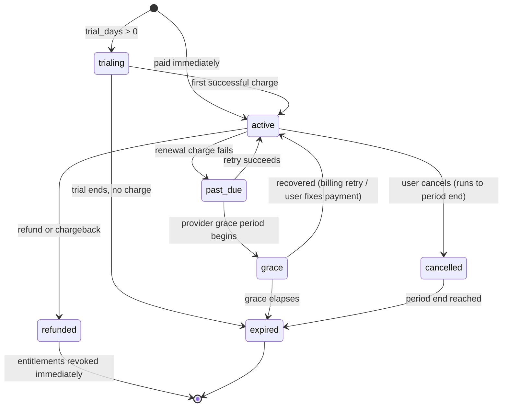

# 17 — Payments, Subscriptions, Rewards and Partner Revenue

**Status:** awaiting review · **Phase:** 2 (subscriptions) and 4 (rewards, partners)
· **Supersedes:** nothing · **Extends:** `docs/01` §7, `docs/02` §6, `docs/06` §§6–7

Topic 7 of the Phase 2+ specification. The tables described here **already exist**
in `database/migrations/0006` and `0007`; this document specifies the behaviour
that will be built on top of them, the gaps that activation exposes, and the
invariants that may never be violated. Every schema change is deferred to the
ledger in `docs/19` — migration numbers are assigned there and nowhere else.

Two things are conflated in most products and are kept rigorously separate here:

| | Source of truth | Consequence of being wrong |
|---|---|---|
| **Subscription entitlement** — did this athlete pay for Premium? | The **provider** (Apple / Google / PayPal), mirrored locally and reconciled nightly | Someone gets free access, or a payer loses access |
| **Rewards wallet** — what has this athlete earned, what may they spend? | **Our own append-only double-entry ledger** | We owe real money and cannot say how much |

The first is a cache of someone else's fact. The second is a financial record we
are solely accountable for. They get different machinery.

---

## Part 1 — Subscriptions

### 1.1 Plans and the price problem

`billing.subscription_plans` is the catalogue: `code` (PK, lowercase-enforced),
`price_minor BIGINT`, `currency CHAR(3)`, `interval`, `trial_days`,
`features TEXT[]`, `limits JSONB`.

Free and Premium at launch. Premium is 15 ₪/month — `price_minor = 1500`,
`currency = 'ILS'`.

`limits JSONB` carries the tier's AI message quota, which is the single most
economically important number in the schema. `docs/10` establishes that at 15 ₪,
net of VAT and store commission, roughly **$2.41/subscriber/month** arrives, and
that AI inference is therefore the binding constraint on the entire design. The
quota lives in the plan row so it is tunable without a deploy.

**The store-versus-web price problem.** Apple and Google take ~30% (15% under the
small-business programmes). PayPal on web takes ~3%. The same 15 ₪ therefore
yields materially different net revenue depending on where it was bought, and
`payments.fee_minor` exists so net revenue is *known* rather than estimated.

Three options, and a recommendation:

| Option | Effect | Verdict |
|---|---|---|
| Same price everywhere | Simple; web subscribers are ~27pp more profitable | **Recommended for launch.** One price is honest and simple, and Apple's anti-steering rules constrain what we may say in-app anyway. |
| Cheaper on web | Better blended margin; risks store policy friction and confuses pricing | Revisit once web conversion is measurable |
| Higher in-store to offset | Legal, common, and reads as a penalty to the majority of users | No |

`billing.plan_prices` (per-currency price + `store_product_id`) is required
before either store can be wired at all — Apple and Google product identifiers
have nowhere to live today. Sequenced as **0018** in `docs/19`.

### 1.2 Provider integration

`subscriptions.provider ∈ (apple_iap, google_play, paypal, stripe, manual)`.
Stripe is in the CHECK constraint but not implemented in Phase 2 — the constraint
admitting it now means enabling it later is not a migration under pressure.
`manual` exists for support-granted comps, and every use writes an audit event.

**No card data, ever.** Every flow is provider-hosted. There is deliberately no
column in this schema capable of holding a PAN, CVV or bank password, which keeps
us out of PCI-DSS scope *by construction rather than by policy*. This is a
schema-level property, and any migration proposing such a column must be rejected
in review.

`provider_account_ref` holds Apple's `original_transaction_id` or Google's
purchase token — the stable identity of a subscription **across renewals**. A
renewal is not a new subscription, and keying on the per-transaction id instead
produces a new row every month and a duplicated entitlement.

### 1.3 Receipt validation and the trust boundary

**A client claim of Premium is never trusted.** The flow:

```
client completes purchase in the store's own UI
  → client sends the receipt / purchase token to POST /v1/billing/receipts
  → server validates it AGAINST THE STORE, server-to-server
  → on success: upsert subscriptions, resolve entitlements, return the new state
  → on failure: 402, audit event, no entitlement change
```

The receipt is an assertion by an untrusted party until the store confirms it.
This is threat T-Ent in `docs/18` — entitlement forgery — and server-side
validation is the whole of the control.

### 1.4 Webhooks

```
POST /v1/webhooks/apple-iap
POST /v1/webhooks/google-play
POST /v1/webhooks/paypal
```

Every one, without exception:

1. **Verify the signature.** Apple `signedPayload` JWS, Google Pub/Sub message
   signature, PayPal transmission signature.
2. **Persist raw** to `billing.payment_webhook_events` with the verification
   result recorded in `signature_verified`.
3. **Enqueue** and return `200` — parsing never happens inline.

> **An event with `signature_verified = false` MUST NOT change entitlement
> state.** Accepting an unsigned "subscription active" callback is a
> free-subscription vulnerability, and it is the kind that gets found and shared.
> The unverified row is kept for forensics, and the partial index
> `payment_webhook_unverified_idx` exists so a spike is visible rather than
> buried.

Replay protection is `UNIQUE (provider, provider_event_id)`. Providers retry;
every consumer must be safely re-runnable.

Activation needs `signature_algorithm`, `key_id` and `verification_error` on the
event row — a verification failure must be inspectable *per signing key*, because
"the signature failed" and "the signature failed for the key they rotated to at
09:00" are different incidents. Sequenced as **0018**.

### 1.5 Entitlements — the read path for every gated feature

`billing.entitlements` is authoritative. `feature_code` is a closed CHECK set of
13 values covering tier features (`ai_coach_basic`, `ai_coach_advanced`,
`analytics_basic`, `analytics_advanced`, `plan_adaptive`, `community`,
`export_data`) and the **individually unlockable sensors** (`sensor_running`,
`sensor_swimming`, `sensor_cycling`, `sensor_strength`, `sensor_recovery`,
`sensor_injury`).

This is how the specification's "digital sensors as purchasable capabilities"
requirement is satisfied without a second mechanism: a sensor unlock is an
entitlement row with `source = 'one_time_purchase'` sitting beside the
subscription-sourced rows, and the gate that reads it does not care which is
which.

`source ∈ (subscription, one_time_purchase, promotion, admin_grant,
partner_perk, trial)`. `UNIQUE (user_id, feature_code) WHERE revoked_at IS NULL`
means one live grant per feature.

**Entitlements expire.** Every subscription-sourced row carries
`expires_at = period_end + grace`. The reason is specific and load-bearing: if
reconciliation silently dies, a `NULL` expiry becomes **permanent free access**,
whereas a set expiry degrades to *loss* of access. The failure mode is chosen
deliberately — annoying a paying customer is recoverable, giving away the product
forever is not.

Cached in Redis under `ent:{user_id}` for **5 minutes maximum** (`docs/01` §5) so
a cancellation or refund takes effect promptly. Nothing user-authorising is
cached longer.

### 1.6 Lifecycle state machine



`subscriptions_one_live_idx` — `UNIQUE (user_id) WHERE status IN (live states)` —
means an athlete cannot hold two live subscriptions. Without it, a
resubscribe-after-cancel race grants two overlapping entitlement sets and
double-bills.

**Refunds and chargebacks** revoke entitlements immediately and are recorded as
`payments.kind ∈ ('refund','chargeback')` rather than by deleting the original
payment. A refund is an event, not an erasure — the original charge happened.

**Where a refund meets rewards:** if an athlete earned reward value from a
subscription that is subsequently refunded, the earn must be reversed by a
compensating transaction (§2.6). This cross-module interaction is the one that
most reliably goes wrong in products of this shape, and it is why
`wallet_transactions.reverses_transaction_id` exists in the schema from day one.

### 1.7 Reconciliation

A nightly job re-verifies **every active subscription** against its provider.
Store subscriptions expire, get refunded and get revoked without necessarily
sending a webhook we successfully processed.

`billing.reconciliation_runs(provider, checked_count, drift_count, outcome)` is
required, because today `subscriptions.last_verified_at` records that a
subscription *was* checked but nothing records that a **run happened**. A
silently dead reconciliation job is indistinguishable from a clean one — every
subscription simply keeps its old `last_verified_at`, and no alert fires. That is
the failure this table exists to make impossible. Sequenced as **0018**.

A stale `last_verified_at` **alerts** rather than continuing to grant access.

---

## Part 2 — Rewards and the wallet

This is where a bug costs real money, so the controls are deliberately heavier
than anywhere else in the system.

### 2.1 The ledger, concretely

Three tables and two views, all already in `0007`:

```
wallets                    -- one per user per currency. HOLDS NO BALANCE.
wallet_transactions        -- groups entries. Must net to zero.
wallet_ledger_entries      -- IMMUTABLE double-entry lines.

wallet_balances            -- VIEW: SUM(credit) - SUM(debit) per (wallet, account)
wallet_unbalanced_transactions  -- VIEW: any row returned is a paging incident
```

Accounts: `house`, `earned`, `promotional`, `redeemable`, `withdrawable`,
`spent`, `expired`, `reversed`.

`amount_minor BIGINT CHECK (amount_minor > 0)` — **always positive**, with
`direction` carrying the sign. A signed amount *plus* a direction column would be
two sources of truth for one fact, and they will eventually disagree.

Reads go through the `wallet_balances` view so **no caller invents its own
arithmetic**. There is no mutable balance column and there never will be; if the
aggregate becomes slow the answer is a periodic snapshot row summed with entries
after it (**0030** in `docs/19`), which is a different thing from a balance
column because it is derived and reconstructible.

### 2.2 Versioned reward policies — the configurable-percentage requirement

The specification requires the split percentages to be changeable. They are, and
changing them **never rewrites history**.

`rewards.reward_policies` is keyed by `version TEXT` and carries:

| Column | Meaning |
|---|---|
| `earn_rules JSONB` | points per rule code |
| `points_per_minor_unit NUMERIC(12,6)` | conversion rate to currency |
| `redeemable_share_bps` | share routed to partner credit |
| `withdrawable_share_bps` | share routed to cash-out eligibility |
| `min_payout_minor` | payout gate, default 5000 (50 ₪) |
| `payout_cooling_off_days` | payout gate, default 30 |
| `expiry_months` | points expiry, nullable |
| `active_from` / `active_to` | validity window |

Two constraints do the real work:

```sql
CHECK (redeemable_share_bps + withdrawable_share_bps = 10000)
```
A split that does not account for 100% of the value is **unrepresentable**. Basis
points, not percentages, so integer arithmetic avoids float drift on money.

```sql
CREATE UNIQUE INDEX reward_policies_one_active_idx ON reward_policies ((true))
    WHERE active_from IS NOT NULL AND active_to IS NULL;
```
Exactly one active version at a time, **enforced by the database rather than by
convention**. The `((true))` expression index is the idiom for "at most one row
matching this predicate across the whole table".

And the mechanism that makes changes safe: every `wallet_transactions` row
carries `reward_policy_version` as an FK. Each entry therefore records the policy
that governed it. Changing the split creates a **new version**; it closes the old
one with `active_to` and never touches a single historical entry.

Activation adds `superseded_by`, `approved_by`, `approved_at` — a change to
reward economics is a decision with an owner, not an anonymous `UPDATE`.
Sequenced as **0025**.

### 2.3 A worked example

Earning 100 ₪ of reward value under a policy splitting 50/50:

| account | direction | amount_minor |
|---|---|---|
| `house` | debit | 10000 |
| `redeemable` | credit | 5000 |
| `withdrawable` | credit | 5000 |

Credits 10000, debits 10000, nets to zero. The `house` account is the
counterparty — reward value comes from somewhere (partner commission, marketing
budget), and double-entry forces us to name it. A single-entry "credit the user
5000" hides the funding source, and at scale nobody can answer what the rewards
programme actually cost.

A **reversal** of that earn is a new, mirrored transaction with
`reverses_transaction_id` set — never an edit:

| account | direction | amount_minor |
|---|---|---|
| `redeemable` | debit | 5000 |
| `withdrawable` | debit | 5000 |
| `reversed` | credit | 10000 |

### 2.4 Immutability, enforced three ways

1. `app.forbid_mutation()` trigger on `wallet_ledger_entries` for `UPDATE` and
   `DELETE`.
2. `REVOKE UPDATE, DELETE` from `app_rw` — the trigger alone is defence in depth,
   not the whole control. **0011** in `docs/19` closes a real gap here:
   `wallet_transactions` is trigger-guarded but **not** privilege-guarded today.
3. A `DEFERRABLE INITIALLY DEFERRED CONSTRAINT TRIGGER` asserting
   `SUM(credit) = SUM(debit)` per `transaction_id` **at commit time** — making an
   unbalanced transaction *impossible to commit* rather than merely detectable the
   next morning. Sequenced as **0025**, and it must be preceded by a clean
   `wallet_unbalanced_transactions` run, since a constraint trigger validates new
   rows only.

Until 0025 lands, balance-to-zero is enforced by a nightly view, property tests,
and hope. The nightly trial balance stays regardless — a deferred trigger cannot
catch a row inserted before it existed.

### 2.5 Earning, and its two hard requirements

`rewards.reward_events` records an earn event *before* it becomes ledger entries.
`rule_code` is a closed CHECK set: `workout_completed`, `streak_maintained`,
`goal_achieved`, `challenge_completed`, `friend_invited`, `content_created`,
`partner_purchase`, `profile_completed`.

**Requirement 1 — idempotency.** `UNIQUE (user_id, rule_code, reference_type,
reference_id)` on `reward_events`, and a matching partial dedupe index on
`wallet_transactions (wallet_id, kind, reason_code, reference_type,
reference_id) WHERE reference_id IS NOT NULL`. One workout cannot be paid twice
even if the job runs twice — and queue jobs *do* run twice.

**Requirement 2 — the trust gate. Data quality precedes rewards.** This is
sequencing rule 1 in `docs/12`, and it is not negotiable: paying for workouts
before trust scoring exists is paying for fabricated workouts.

Consequences, in order:

1. Low trust → `reward_events.status = 'held_for_review'` and **no ledger entry
   is written at all**. No balance ever reflects a suspect session. This ordering
   matters: crediting first and clawing back later means the athlete has already
   seen the number, and taking it away is a support incident.
2. Manual activities earn at a reduced rate and cannot win sponsored challenges.
3. Confirmed spoofing → wallet `status = 'frozen'`: earning continues to accrue,
   redemption and payout are blocked, pending review.

Activation snapshots `trust_score` **and** `trust_threshold` onto the event.
Storing only the score means that raising the threshold later silently rewrites
why a past event was held. Sequenced as **0026**.

### 2.6 Redemption, expiry, reversal

- **Redemption** debits `redeemable`, credits `spent`, and issues a voucher.
  `redemptions_voucher_idx` makes `voucher_code` globally unique.
- **Expiry** (if `expiry_months` is set) debits the earning account and credits
  `expired`, oldest-first. Expiry is a transaction like any other, so an athlete
  can see exactly what expired and when.
- **Reversal** mirrors the original as in §2.3.

### 2.7 Payout — the highest-risk path in the system

`rewards.payouts`. Provider ∈ `paypal`, `bank_transfer`, `partner_credit`.

**Destination references are encrypted** — `destination_ref_ct BYTEA` with
`kms_key_id` per row. Never a raw bank account in plaintext, and per-row key id
makes rotation possible without downtime.

**Gates are evaluated and frozen** into `eligibility_snapshot JSONB`: minimum
balance, account age, cooling-off period, KYC state, open fraud signals, payout
velocity. Frozen, because "why was this approved in March?" must be answerable in
September, when the policy has changed twice.

**A human approves.**

```sql
CHECK (status <> 'approved' OR decided_by IS NOT NULL)
```

An unapproved payout is **unrepresentable**. Automation proposes; a person
decides.

**One attempt**, with `idempotency_key TEXT NOT NULL UNIQUE` held against the
provider.

**An ambiguous provider response parks in `needs_manual_reconciliation` and is
NEVER auto-retried.** A delayed payout is recoverable; a duplicated one is not.
The queue configuration in `docs/01` §6 already marks the `payout` queue as
manual-retry-only for this reason.

Activation adds `kyc_state`, `cooling_off_expires_at`, and `second_approver_id`
with a CHECK requiring **two distinct approvers above a threshold amount**. A
single approver on cash-out is one compromised staff account away from loss.
Sequenced as **0026**.

### 2.8 A finding: wallets block GDPR erasure

`wallets.user_id` is `ON DELETE RESTRICT`, as are `wallet_transactions.wallet_id`
and `wallet_ledger_entries.wallet_id`. Meanwhile `payments.user_id` is
`ON DELETE SET NULL`.

This is correct — a financial record legally cannot be deleted on request, and
`docs/02` §7 sets 7-year retention on ledger entries and payouts. But it means
**erasing an athlete who has ever had a wallet will fail** on the foreign key.

The erasure procedure must therefore close and anonymise the wallet rather than
delete it, replacing the subject id with a tombstone while leaving the ledger
arithmetic intact. This compounds the defect `docs/19` found independently for
**0020**: hard-deleting a `users` row already fails today because cascade
referential actions fire `app.forbid_mutation()` on append-only tables. Both must
be fixed in the same reviewed procedure, and `DELETE /v1/me` cannot work until
they are.

---

## Part 3 — Partner revenue

### 3.1 The model

`partners.commission_rate_bps INTEGER CHECK (BETWEEN 0 AND 10000)` — basis
points, so 750 = 7.5%. Integer arithmetic throughout; no float ever touches
money.

Partner commission is what **funds the rewards club**. The club is a
customer-acquisition mechanism, not a revenue line (`docs/00`), and the ledger's
`house` account is where that funding enters. This is the economic loop:

```
athlete buys from partner  →  partner reports conversion
  →  we book commission (revenue)
  →  a share funds reward value credited to the athlete (house → redeemable/withdrawable)
  →  athlete redeems with a partner  →  drives more partner sales
```

If commission revenue does not cover credited reward value, the programme is
losing money, and the ledger makes that measurable rather than inferred.

### 3.2 Conversions and attribution

`partners.partner_conversions`: `partner_order_ref` is the partner's own order
identifier and the **idempotency key for their reports** —
`UNIQUE (partner_id, partner_order_ref)`. Partners re-send reports.

`commission_rate_bps` is **copied onto each conversion row**, not read from the
partner at settlement time. Renegotiating a partner's rate must not retroactively
change what we owe on last quarter's sales — the same versioning principle as
`reward_policy_version` on the ledger.

Status flow: `reported → confirmed → paid`, with `rejected` and `reversed` as
terminal alternatives. Reward value is credited on **`confirmed`**, not
`reported`: a partner-reported sale that later cancels would otherwise have
already paid the athlete.

Attribution mechanism and window are a genuine open question — click-through with
a signed, expiring token is the least-worst default, and the window (30 days is
conventional) should be set per partner contract. Flagged in §6.

### 3.3 The partner portal reaches no health data

Partner staff are `identity.users` with role `partner`, linked via
`partners.owner_user_id`. The portal exposes **aggregate reporting only**:
conversions, commission, offer performance. No athlete-level health data is
reachable through any partner route.

**This is the weakest boundary in the schema today**, and it is worth stating
plainly: partner isolation is currently enforced at the route layer only. It is
the one tenant boundary with **no database backstop** — every other tenancy
boundary in the system has RLS underneath it.

**0027** in `docs/19` fixes this: `partner_users(partner_id, user_id, role)`, an
`app.current_partner_id()` helper set as a transaction-local, and real RLS
policies on `partners`, `partner_offers` and `partner_conversions` keyed on it.
Until then, every partner route needs an explicit test in the isolation matrix,
and that dependency is called out in `docs/18`.

### 3.4 Sponsored challenges and the coach marketplace

**Sponsored challenges** join `community.challenges` to a partner and fund a
prize pool. Reward credits from a sponsored challenge use the same ledger
machinery with a distinct `reason_code`, so their cost is separable in reporting.
Manual activities cannot win them (§2.5).

**The coach marketplace** (Phase 5) needs `coach_profiles`, `plan_products`,
`plan_purchases`. `docs/02` §2 lists these as "schema only" — **they do not
actually exist** in migrations 0001–0010. `docs/19` records the gap and sequences
them as **0029**; `docs/02` §2 should be amended to match reality.

The money model absorbs the marketplace without reshaping: a plan purchase is a
`payment` with `kind = 'one_time'`, the coach's share is a commission computed in
basis points exactly as a partner's is, and payout to a coach uses the same
`payouts` machinery with the same human-approval gate.

---

## Part 4 — Money-handling invariants

These are review-blocking. A change violating any of them is rejected, not
discussed.

1. **Money is `BIGINT` minor units plus an explicit currency column.** Never a
   float, never a decimal string, never a currency-less number.
2. **Every transaction nets to zero.** Verified nightly by
   `wallet_unbalanced_transactions`; enforced at commit by the deferred trigger
   from 0025. Any row returned by that view is a paging incident.
3. **No mutable balance column exists anywhere.** Balance is derived. If it is
   slow, snapshot it (0030) — do not cache it in a column.
4. **Ledger entries are immutable**, enforced by trigger *and* revoked
   privileges. Corrections are compensating transactions.
5. **Every earn is idempotent** on `(user_id, rule_code, reference_type,
   reference_id)`.
6. **Rates and policies are versioned and snapshotted** at the point of use —
   `reward_policy_version`, `commission_rate_bps`, `trust_threshold`. A future
   policy change may never rewrite a past decision.
7. **No column may hold card data.** PCI scope is avoided by construction.
8. **Percentages are basis points**, integer, summing to exactly 10000.

**Multi-currency: ILS only at launch.** The schema supports more (`currency` on
every money table), and it should stay unused until there is a reason. Multiple
currencies in a wallet introduces an FX-rate-at-what-moment question on every
earn, redemption and payout, and getting that wrong is a class of bug that is
very hard to unwind through an append-only ledger. `docs/02` §8 open question 1 is
hereby answered: **ILS only**, revisited when there is non-Israeli revenue worth
the problem.

---

## Part 5 — Legal and compliance gates

| Gate | Blocks | Status |
|---|---|---|
| **Points-to-cash counsel clearance** | Payout via `paypal` / `bank_transfer` | **Launch-blocking for cash payout.** Consumer-protection and tax implications in Israel. |
| VAT treatment and invoicing | Any paid subscription | Required for Phase 2 |
| Apple/Google rules on rewarding real-world value | Reward club visibility in-app | Needs review during store submission |
| KYC/AML threshold determination | Payout above a threshold | Before payout enablement |
| Partner contracts (commission, attribution window, data terms) | Partner onboarding | Per partner |

**The ledger is deliberately designed so `partner_credit`-only ships first and
cash payout ships later.** `payouts.provider` already includes `partner_credit`,
and the `withdrawable` account can accumulate without a cash-out route being
open. If counsel blocks points-to-cash entirely, Phase 4 loses one payout
provider and nothing else — no schema change, no ledger rework. That optionality
was the point of designing it this way, and it means the legal question can be
answered late without holding up the rest of the phase.

---

## Part 6 — Module contracts

### `billing`

| | |
|---|---|
| **Purpose** | Mirror the provider's subscription truth locally and resolve it into entitlements the rest of the system can read cheaply. Deliberately not: a payment processor, a card vault, or the rewards ledger. |
| **Responsibilities** | Plan catalogue; receipt validation; webhook ingestion and verification; subscription lifecycle; entitlement resolution and expiry; nightly reconciliation; revenue recording with fees and tax. **Not** this module's job: reward value (`rewards`), AI quota *counting* (`coaching` owns `ai_usage_counters`; billing only supplies the limit). |
| **Database** | Owns schema `billing`: `subscription_plans`, `subscriptions`, `payments`, `payment_webhook_events`, `entitlements`. Phase 2 additions (`plan_prices`, `reconciliation_runs`, signature/verification columns) sequenced as **0018** in `docs/19`. `payment_webhook_events` is append-only and intentionally non-RLS (provider-scoped, no `user_id` at arrival) — registered in `app.rls_exemptions` by **0011**. |
| **APIs** | `GET /v1/billing/plans` · `GET /v1/billing/subscription` · `POST /v1/billing/receipts` · `POST /v1/billing/checkout` (PayPal) · `DELETE /v1/billing/subscription` · `GET /v1/me/entitlements` · webhooks `/v1/webhooks/{apple-iap,google-play,paypal}`. All PLANNED (Phase 2). |
| **Dependencies** | `core` (config, errors, logging), `database` (RLS session). Stores/PayPal outbound. Needs `identity` for the acting principal — supplied by the API layer, since the import-linter `independence` contract forbids a direct module import (`docs/11` §3). Publishes `subscription.activated` / `.expired` / `.refunded` events consumed by `notifications` and `rewards` via the queue. |
| **Security** | Owner RLS on `subscriptions`, `payments`, `entitlements`. Signature verification mandatory; unverified events inert. Replay protection unique. No card data columns. Entitlement is never taken from a client claim. Audit events on every entitlement change including `admin_grant`. OWASP A01 (broken access control) and A08 (integrity failures) are the relevant items. |
| **Testing** | Property tests on every money path (`hypothesis`) per `CLAUDE.md`. Webhook-forgery test: a valid body with an invalid signature must change nothing. Receipt-replay test. Reconciliation drift test with a provider fixture. Entitlement-expiry test proving lapse-to-loss rather than lapse-to-free. One isolation-matrix row per endpoint — **or the build fails**. |

### `rewards`

| | |
|---|---|
| **Purpose** | Be the authoritative, auditable record of value earned and owed. Deliberately not: a subscription system, and not a place where a balance is ever stored as a mutable number. |
| **Responsibilities** | Wallet lifecycle; policy versioning; earn evaluation with trust gating; double-entry transaction construction; redemption; expiry; reversal; payout eligibility, approval workflow and execution; fraud signals. **Not** this module's job: computing `trust_score` (`training` computes it at ingest), commission (`partners`). |
| **Database** | Owns schema `rewards`: `reward_policies`, `wallets`, `wallet_transactions`, `wallet_ledger_entries`, `reward_events`, `redemptions`, `payouts`, `fraud_signals`, plus views `wallet_balances` and `wallet_unbalanced_transactions`. Phase 4 additions sequenced as **0025** (deferred balance trigger, policy approval columns, `idempotency_key`), **0026** (trust snapshot, KYC, two-approver payout), **0030** (balance snapshots). |
| **APIs** | `GET /v1/wallet` · `GET /v1/wallet/transactions` (cursor) · `GET /v1/wallet/balance` · `POST /v1/wallet/redemptions` · `GET /v1/wallet/payouts` · `POST /v1/wallet/payouts` (`Idempotency-Key` **required**) · admin `GET/POST /v1/admin/payouts/{id}/decision`. All PLANNED (Phase 4). |
| **Security** | Owner RLS on every athlete-scoped table. `fraud_signals` is non-RLS by design (an athlete must not read their own fraud assessment) and registered in `app.rls_exemptions`. Ledger immutable by trigger and revoked privilege. Human approval structurally required on payout. Destination refs KMS-encrypted. Wallet freeze blocks spend but not accrual. Never log an amount alongside an identity in a way that reconstructs a balance. |
| **Testing** | **Property tests are mandatory** (`CLAUDE.md`): for any transaction, credits equal debits; balance is invariant under replay; a reversal restores the prior balance exactly. Trial-balance invariant test. Idempotency-replay test proving one workout pays once across concurrent job runs. Payout tests: approval required, ambiguous response never retried, two approvers above threshold. Fraud-gate test proving `held_for_review` writes **no** ledger entry. |

### `partners`

| | |
|---|---|
| **Purpose** | Hold partner relationships, offers and attributed commercial outcomes — and expose them to partner staff without ever exposing an athlete. |
| **Responsibilities** | Partner accounts and status; offers with validity and inventory; conversion ingestion and attribution; commission computation; settlement reporting. **Not** this module's job: crediting the athlete (`rewards`), challenge mechanics (`community`). |
| **Database** | Owns schema `partners`: `partners`, `partner_offers`, `partner_conversions`. Phase 4 additions sequenced as **0027** (`partner_users`, `app.current_partner_id()`, real RLS, `partner_settlements`), marketplace as **0029**. |
| **APIs** | Athlete-facing: `GET /v1/offers` · `GET /v1/offers/{id}`. Partner portal: `GET /partner/v1/conversions` · `GET /partner/v1/offers` · `POST /partner/v1/conversions` · `GET /partner/v1/settlements`. All PLANNED (Phase 4); `/partner/v1` is a **separate surface** from the athlete API (ADR-007, Phase 5 §5.3). |
| **Dependencies** | `core`, `database`. Emits `partner.conversion_confirmed`, consumed by `rewards` via the queue — this is the funding path in §3.1 and it is deliberately asynchronous and idempotent. |
| **Security** | **Currently the weakest boundary: route-layer isolation only, no RLS backstop until 0027.** Until then every partner route carries an explicit isolation-matrix row. Aggregate-only exposure; no join from a partner route to any health table is permitted, and this is a review rule as much as a schema one. Partner-reported conversions are untrusted input: validate amounts, enforce the unique order ref, and never let a partner set `commission_rate_bps`. OWASP A01 is the dominant risk. |
| **Testing** | Cross-partner isolation tests: partner A must not read partner B's conversions, offers or settlements — before *and* after 0027 enables RLS, since enabling RLS on a populated table changes results. A test asserting no partner endpoint can reach a health-data table. Commission arithmetic property test in basis points. Conversion-replay idempotency test. |

---

## Part 7 — Open questions for review

1. **Attribution mechanism and window.** Signed expiring click token is the
   recommended default; the window should be contractual per partner. Needs a
   decision before the first partner is onboarded.
2. **KYC provider and threshold.** Which provider, and at what cumulative payout
   amount does identity verification become mandatory? Needs counsel plus a
   vendor choice.
3. **Reward funding rate.** What share of partner commission funds reward value?
   This is a business decision that sets the programme's cost, and the ledger
   measures the outcome either way.
4. **Points expiry.** `expiry_months` is nullable, so "no expiry" is
   representable. Expiry improves unit economics and is disliked by users;
   recommend launching without it and revisiting with data rather than adding it
   later, which reads as a takeaway.
5. **Small-business programme enrolment** for Apple and Google (15% versus 30%)
   materially changes the margin in `docs/10`. Confirm eligibility.
6. **Free-tier reward eligibility.** Can a non-subscriber earn? Recommend yes for
   acquisition, with a lower cap — but it widens the fraud surface, so it depends
   on trust scoring being live first.
