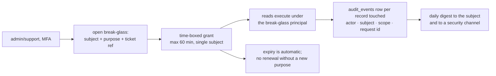

# 18 — Security and Privacy Requirements (Phase 2+)

**Status:** awaiting review · **Extends:** `docs/06` (approved Phase 1 security
review) · **Schema deltas:** sequenced in `docs/19` (Database Evolution)

`docs/06` remains in force and is not restated here. It reviewed the surfaces that
exist today: authentication, tenant isolation, the grant model, and the *designed*
payment and payout controls. This document is the **forward delta** — what each
Phase 2+ surface adds, and the requirement that must be met before that surface
ships. Nothing here relaxes `docs/06`.

Two org rules bind every section and are repeated rather than assumed: **every
schema or data change is a reviewed SQL file in `database/migrations/`, applied by
a human** (ADR-012 — no auto-apply from app, CI or deploy), and **no RLS exemption
is ever added for admin or support**.

---

## 1. What Phase 1 established (BUILT — verified inventory)

| Control | Where it lives | How it is verified |
|---|---|---|
| Argon2id password hashing + dummy-verify timing equalisation | `backend/core/security.py` `PasswordService.verify_dummy` | Auth negative tests; the equalisation exists specifically to close the T9 existence oracle |
| ES256 access tokens, **explicit algorithm allowlist**, required claims (`sub`,`exp`,`iat`,`iss`,`aud`,`role`), role validated against the five RBAC roles | `TokenService.decode_access_token` | Algorithm-confusion and tampering tests |
| Opaque 32-byte refresh tokens stored as SHA-256 digests; rotation with `family_id` reuse detection and family revoke | `generate_refresh_token`, `identity.revoke_token_family(UUID, TEXT)` (0010) | Refresh-reuse test revokes the family |
| Fail-closed RLS on **46 tables**; `app_rw`/`app_ro` confirmed neither `SUPERUSER` nor `BYPASSRLS`, and `app_rw` owns no table | `0009_row_level_security.sql` + its post-apply verification queries | `make db-verify-rls` after every migration; `tests/security/test_rls_enforcement.py` |
| Transaction-local context via `set_config('app.current_user_id', …, true)` — bound, never interpolated; `SYSTEM_PRINCIPAL` is the only greppable unscoped mode | `backend/database/session.py` | Unset context returns zero rows, asserted |
| Exactly **three** narrow `SECURITY DEFINER` pre-auth lookups — `identity.lookup_user_for_authentication(CITEXT)`, `identity.lookup_refresh_token(BYTEA)`, `identity.revoke_token_family(UUID, TEXT)` — fixed column lists, pinned `search_path`, no dynamic SQL | `0010` | Reviewed as the only RLS holes in the schema |
| `app.has_grant(target_user_id, required_scope)` as the sole cross-athlete read path | `0009` | Grant-lifecycle tests |
| PII-scrubbing log pipeline (`user_id` only; never email, name or health values) | `backend/core/logging.py` | Scrubber is pipeline-level, not per-call-site |
| Tenant-isolation matrix: cross-tenant read → empty/404, cross-tenant write → **404, never 403** | `tests/security/test_tenant_isolation.py`; `make test-security` | Hard CI gate, no override |
| Append-only enforcement doubled: `app.forbid_mutation()` trigger **and** `REVOKE UPDATE, DELETE … FROM app_rw` | `0002`, `0006`, `0007` | Ledger and audit mutation tests |

### 1.1 Residual gaps Phase 1 knowingly left

| Gap | Why it was left | Closing requirement |
|---|---|---|
| Email verification is a column (`users.email_verified_at`) and an endpoint (`POST /v1/auth/email/verify`), with no mail delivery | Enumeration resistance on `/auth/register` and `/auth/password/forgot` depends on a transactional mail provider that Phase 1 did not have | Phase 2: verified sender + token delivery. Until then registration must not gate anything on verification, or the gate becomes the enumeration oracle the padding was built to prevent |
| `identity.mfa_credentials` exists as empty schema; MFA is inactive | Deliberate — enabling MFA under incident pressure must not be a migration (`docs/02` §2) | Phase 2 (roadmap 2.7): TOTP for athletes, **mandatory for `admin` and `support` from the day those roles are issued** |
| Grant *creation* has an endpoint (`POST /v1/me/data-access`) but no consumer | The coach portal is Phase 5; a grant with nobody to grant to is untested surface | Phase 5: grant UI ships with the coach portal, not before |
| `identity.audit_events` is intentionally **not** RLS-protected | It is the record of access, including denied and cross-tenant access, written with the actor's context and read by nobody through an athlete route. An owner policy keyed on `user_id` has no meaning: the row has an `actor_user_id` **and** a `subject_user_id`, and a policy on either would let a suspect filter their own trail | Requirement: no athlete-facing read route over `audit_events`; the only reads are the admin/support break-glass path (§4.3) and the DSAR export, which selects `subject_user_id = <self>` in the service with an explicit predicate |
| `billing.payment_webhook_events` and `rewards.fraud_signals` are likewise outside RLS, but that omission is **not** recorded in the `0010` non-RLS list | Oversight in documentation, not in design — neither has an athlete read route | `fraud_signals` carries `user_id` and must get an owner-**deny** posture before the admin panel ships: RLS enabled with **no** athlete policy, so it is reachable only via break-glass. Sequenced in `docs/19`; the `0010` comment block must be amended in the same reviewed file |

---

## 2. Threat model extension — T11…T22

`docs/06` §1 defines T1–T10. These are the Phase 2+ additions. Where a row
sharpens an existing threat rather than introducing a new one, it says so.

| # | Threat | Surface | Likelihood | Impact | Control | Where the control lives |
|---|---|---|---|---|---|---|
| T11 | Provider OAuth tokens exfiltrated and replayed against Garmin directly (sharpens T7) | integrations | low | critical — the athlete's entire Garmin account | KMS envelope encryption with per-row `kms_key_id`; tokens never logged, never returned by any API; `DELETE /v1/integrations/{provider}` revokes at the provider, not just locally | `training.provider_connections`; §8 |
| T12 | Forged provider or payment webhook (sharpens T4) | `/v1/webhooks/*` | **high** — endpoints are public by necessity | critical — free Premium, or poisoned training data | Signature verified before any parse; unverified events persisted with `signature_verified = false` and **never** allowed to mutate entitlement or write an activity; `UNIQUE (provider, provider_event_id)` | `billing.payment_webhook_events`, `training.provider_events`; §3.2 |
| T13 | Valid receipt replayed against a second account, or a receipt bound to the wrong user | `POST /v1/subscription/receipts/{apple,google}` | medium | high — unbounded free tier | Server-side store validation; the store's original transaction id is bound to exactly one `user_id`, and a second binding attempt is a `409` **and** a `fraud_signals` row | billing service; §3.2 |
| T14 | Coordinated reward farming: multi-account rings, shared devices, manual-entry bursts (sharpens T5) | ingest + rewards | **high** once cash-out exists | high — direct loss | Trust scoring on ingest **before** rewards exist (roadmap 1.10 precedes 4.2); low trust → `reward_events.status='held_for_review'` with **no ledger entry written**; `signal_code` already enumerates `multi_account_same_device`, `device_shared`, `referral_ring` | `analytics.data_quality_flags`, `rewards.fraud_signals`; §3.3 |
| T15 | Account takeover, then payout destination swapped and cashed out | `POST /v1/wallet/payouts` | medium | critical — irreversible | Step-up MFA on payout request and on destination change; cooling-off period after any credential or destination change, frozen into `eligibility_snapshot`; human approval (`CHECK (status <> 'approved' OR decided_by IS NOT NULL)`); one attempt, provider idempotency key | rewards service; §3.3 |
| T16 | Prompt injection in activity names escalating into a tool-call chain (sharpens T6) | AI coach | **high** — the field is attacker-controlled by design | medium, bounded by construction | Untrusted-content delimiting; **tools take no user-id parameter and execute under the caller's identity**, so there is no parameter through which to ask for another athlete; every tool result RLS-filtered; max tool-call depth | `backend/modules/coaching`; §3.1 |
| T17 | AI cost exhaustion as economic DoS | AI coach | medium | **existential at $2.41/subscriber/month** | Per-tier quota in `coaching.ai_usage_counters` + 10/min burst (`ai` rate class); max context size; max tool depth; per-message `cost_micro_usd` recorded on `coaching.ai_messages` with an anomaly alert; deterministic router answers ~40% at zero model cost | §3.1, §9 |
| T18 | Partner re-identifies an individual athlete from "aggregate" reports (small-cohort inference) | partner portal | medium | high — health inference about a named person | Partner routes live on a router with **no dependency able to resolve a health resource**; reports enforce a minimum cohort size and suppress cells below it; no free-form filter that can narrow a cohort to one | §3.4 |
| T19 | Admin or support browses health records, or break-glass is used routinely (sharpens T8) | admin panel | medium | high — and invisible without controls | No RLS exemption, ever. Break-glass is a distinct, time-boxed, purpose-recorded session that writes `audit_events` per record touched; separation of duties (the requester of a payout is never its approver); mandatory MFA | §4.3 |
| T20 | Coach conditions the relationship on all six grant scopes ("over-collection") | grants / coach portal | **high** — social pressure, not a technical flaw | medium — lawful-basis failure, not a breach | Grant request UI presents scopes individually with a stated purpose per scope and a default of the narrowest set; mandatory expiry is already unrepresentable-otherwise in the schema; athlete-visible grant list at `GET /v1/me/data-access` with one-tap revoke | identity service; §5 |
| T21 | Mobile device compromise: Keychain/Keystore extraction, jailbreak, user-installed CA MITM | mobile client | medium | high per-athlete | Refresh token in Keychain/Keystore with device-unlock protection, access token in memory only; certificate pinning; jailbreak/root signal recorded and used to force re-auth for payout and destination changes only (never to block training use) | §3.7 |
| T22 | Insider reach via the analytics role, a warehouse copy, or a restored backup (sharpens T8) | operations | low | critical — bulk sensitive data | `app_ro` is RLS-bound like `app_rw` (verified non-bypassing); no unfiltered health export; restore rehearsals use a scrubbed target; backup keys separate from data keys; access to the KMS key that unwraps provider tokens is a named, audited role | §8, §9 |

---

## 3. Per-surface requirements

Each surface must satisfy all six lines before it ships. "Abuse case" names the
concrete attack the control exists for — a control without one is not a
requirement, it is a preference.

### 3.1 AI / coach surface — PLANNED Phase 2 (batch), Phase 3 (twin)

| | Requirement |
|---|---|
| Authentication | Bearer access token; no anonymous coach access, not even for a demo prompt |
| Authorisation | Entitlement resolved server-side from `billing.entitlements`; a client "I am Premium" claim is never read. Tools are read-only, server-scoped, and accept **no user-id parameter** |
| Rate limits | `ai` class: tier quota (Free 5/month, Premium 100/month) in `coaching.ai_usage_counters` + 10/min burst; `Idempotency-Key` required on `POST /v1/coach/conversations/{id}/messages` so a retry is not a second billed message |
| Input validation | Max message length; max context-packet size; max tool-call depth; untrusted athlete text (activity names, notes, group text) wrapped in delimited blocks marked as data. Context packet carries derived metrics and an **age band** — never birth date, name, email, GPS or raw streams |
| Audit | `coaching.ai_messages` records provider, `model_id`, `prompt_version`, prompt/completion/cached tokens, `cost_micro_usd`, context-packet hash, `stop_reason`, safety flags, `grounded` |
| Abuse case | T16/T17. A crafted activity name asking the coach to "summarise all athletes" cannot succeed, because no tool has a parameter for another athlete; a loop of cheap prompts cannot exceed quota × burst |

`stop_reason` is checked before content is read; `temperature`/`top_p` are
rejected by `claude-opus-5` and are not sent; depth is `output_config.effort`.
Thinking tokens bill as output, so `max_tokens` is sized accordingly — a
mis-sized limit is a cost incident, which is why §9 alerts on it.

### 3.2 Payment / webhook surface — PLANNED Phase 2

| | Requirement |
|---|---|
| Authentication | Athlete token on `/v1/subscription/*`. Webhooks authenticate by **signature**, not by IP or by a shared path secret: Apple JWS chain to the Apple root, Google Pub/Sub OIDC token, PayPal transmission-signature verification |
| Authorisation | Entitlement writes happen only in the billing service, only from a verified event or a validated receipt. No route accepts an entitlement in a request body |
| Rate limits | `webhook` class 1000/min/provider (deliberately generous — providers batch, and dropping events loses money); `write` class on receipt endpoints |
| Input validation | Verify signature → persist raw → enqueue → **return 200 in <100 ms**. Parsing happens in the worker so a parser bug is replayable from `payment_webhook_events`. Reject payloads above a size cap before parsing |
| Audit | Every entitlement transition writes `identity.audit_events`; `signature_verified` recorded per event; the `payment_webhook_unverified_idx` partial index makes an unverified-event spike queryable |
| Abuse case | T12/T13. An unsigned "subscription active" callback is stored and ignored. A replayed event is rejected by `UNIQUE (provider, provider_event_id)`. A receipt already bound to another `user_id` returns `409` and raises a fraud signal |

No card data exists anywhere in the schema — there is no column capable of holding
a PAN, CVV or bank password. That keeps us out of PCI-DSS scope **by
construction**, and any Phase 2+ proposal to accept a card field directly is a
design rejection, not a review comment.

### 3.3 Rewards / payout surface — PLANNED Phase 4

| | Requirement |
|---|---|
| Authentication | Athlete token **plus step-up MFA** for `POST /v1/wallet/payouts` and for any payout-destination change |
| Authorisation | Balance is derived from the append-only ledger, never from a stored total. `UPDATE`/`DELETE` revoked from `app_rw` and blocked by trigger. Human approval is structurally required |
| Rate limits | `write` class, plus a payout-velocity gate evaluated into `eligibility_snapshot` (not re-read at approval time — the gate freezes when the request is made) |
| Input validation | Amount is `BIGINT` minor units + currency; requested amount ≤ withdrawable balance in the same currency; `Idempotency-Key` required |
| Audit | `reward_events` → `wallet_transactions` → `wallet_ledger_entries` with the applying `reward_policy_version`; every payout decision records `decided_by`; nightly trial balance via `wallet_unbalanced_transactions` — any row returned is a paging incident |
| Abuse case | T14/T15. A suspect workout never reaches a balance because no ledger entry is written. An ambiguous provider response parks in `needs_manual_reconciliation` and is **never auto-retried**: a delayed payout is recoverable, a duplicated one is not |

### 3.4 Partner portal — PLANNED Phase 4

| | Requirement |
|---|---|
| Authentication | Separate audience in the access token; `partner` role; MFA required |
| Authorisation | Every query scoped by `partner_id` from the token at the route layer (`partners.*` is partner-scoped, not athlete-scoped, and holds no health data). The partner router has **no injectable dependency** that can resolve a health resource |
| Rate limits | `read`/`write` classes per partner, not per user |
| Input validation | Report filters come from a fixed enum of dimensions — no free-form predicate, no date range finer than a day, and a **minimum cohort size** below which cells are suppressed |
| Audit | Every `POST /v1/partner-portal/conversions` and every report export writes `audit_events` with the partner as actor |
| Abuse case | T18. "Redemptions at my store, women, 25–29, Tuesday, this postcode" must not resolve to one person. Voucher validation returns a code state, never an identity |

### 3.5 Admin panel — PLANNED Phase 4

| | Requirement |
|---|---|
| Authentication | `admin`/`support` role, **MFA mandatory**, short session, separate audience; staff accounts are never also athlete accounts |
| Authorisation | Route-level RBAC only. The role grants a *route*, never a person's data. Health-record access is break-glass only (§4.3). Separation of duties: `GET /v1/admin/payouts/queue` and `POST /v1/admin/payouts/{id}/decide` require different actors for the same payout |
| Rate limits | `read`/`write` classes; a low ceiling on break-glass invocations per actor per day, with the ceiling itself alerting rather than silently blocking |
| Input validation | Every admin mutation is a named action with an enum, a target id and a required free-text reason — no generic "run this update" surface, and no query DSL |
| Audit | Every admin action writes `audit_events` (actor, actor_role, subject, action, resource, outcome, ip, request id). `outcome='denied'` is recorded too — denied attempts are the most interesting rows |
| Abuse case | T19. An admin cannot quietly read HRV: there is no policy that permits it and the break-glass path leaves a row per record |

### 3.6 Community / sharing surface — PLANNED Phase 4

| | Requirement |
|---|---|
| Authentication | Athlete token |
| Authorisation | **Group membership grants nothing.** Sharing is explicit per activity via `community.activity_shares`, whose constraints forbid heart-rate and readiness fields in a public share. `community.groups` visibility is policy-enforced (`public` / `org_only` / member-of) |
| Rate limits | `write` class, plus a per-day cap on group invitations and challenge creation |
| Input validation | Group and challenge text is length-capped, and is treated as untrusted content everywhere it can reach the model (§3.1) or another athlete's screen (output-encoded, never rendered as HTML) |
| Audit | Share creation and revocation are audited; leaderboard reads are not (no cross-athlete health data is exposed) |
| Abuse case | Joining a club must not expose sleep data. A challenge name must not become a coach instruction |

### 3.7 Mobile client — PLANNED Phase 2

| | Requirement |
|---|---|
| Authentication | Refresh token in Keychain/Keystore with device-unlock protection; access token in memory only, never in `AsyncStorage`, never in a log, never in a crash report |
| Authorisation | The client renders entitlement; it never decides it. Feature flags arrive resolved from `GET /v1/entitlements` |
| Rate limits | Client-side backoff honouring `Retry-After`; the server limit is the real one |
| Input validation | TLS 1.3 with certificate pinning; a pin failure is a hard failure, not a downgrade. `min_supported_client_version` from `GET /v1/meta` force-updates clients whose analytics semantics have drifted |
| Audit | Device registration in `notifications.device_tokens`; push payloads carry **no health values and no names** — a lock-screen notification is a public surface |
| Abuse case | T21. A stolen unlocked phone yields one 10-minute access token and a refresh family that `POST /v1/auth/logout-all` kills |

### 3.8 Public partner API — PLANNED Phase 5

| | Requirement |
|---|---|
| Authentication | OAuth2 **client credentials** on a separate base path (`/partner/v1`), separate audience, separate key material; credentials rotatable by the partner without our involvement |
| Authorisation | Scopes are coarse and enumerated (`offers:read`, `conversions:write`, `reports:read`). There is deliberately **no scope that can return athlete health data**, so no future misconfiguration can grant one |
| Rate limits | Per-client quota with published limits and `RateLimit-*` headers; a burst limit low enough that scraping is uneconomic |
| Input validation | Same RFC 9457 problem shape, same cursor pagination, same SI-unit conventions; request signing on write endpoints |
| Audit | Per-client request log plus `audit_events` on every write; token issuance and revocation audited |
| Abuse case | A compromised partner key must be a commercial incident, never a health-data incident. That property comes from the scope list, not from monitoring |

---

## 4. Multi-tenant isolation, hardened

### 4.1 The standing discipline

1. **Every new athlete-scoped table carries `user_id`** (denormalised even when
   derivable) **and gets its RLS policy in the same reviewed migration** that
   creates it. A table created in one file and secured in a later one is
   unprotected in production for the interval between them. Non-negotiable.
2. **Every new endpoint gets a row in the tenant-isolation matrix, or the build
   fails.** Cross-tenant read → empty or `404`; cross-tenant write → `404`, never
   `403`, because `403` confirms the resource exists.
3. **Cross-athlete reads go through `app.has_grant(user_id, '<scope>')` and
   nothing else.** The grant policies in `0009` are `FOR SELECT` only — a coach
   can never write to an athlete's data through them. If the Phase 5 coach portal
   needs plan authoring, that is a **new table with its own policy**, sequenced in
   `docs/19`, not a widened grant policy.
4. **Every new grant scope needs a policy on every table it names.** A scope that
   no policy reads is a promise the database does not keep.

### 4.2 CI checks that make this mechanical

| Check | Gate |
|---|---|
| `make test-security` — isolation matrix, RLS-enforcement, grant lifecycle, auth negatives | Hard gate, **no `--no-verify`, no override label** |
| `make db-verify-rls` — `rolsuper`/`rolbypassrls` false for `app_rw`/`app_ro`; zero tables owned by anything but `app_migrator`; every athlete-scoped table has RLS + ≥1 policy | Run after every migration; the "intentionally global" allowlist lives in `0010`'s comment block and must be amended in the same reviewed file that adds an exception |
| Route-inventory diff — every path in the generated OpenAPI 3.1 document that is not a webhook, `/healthz`, `/readyz` or `/v1/meta` must appear in the matrix | Fails the build on an unmatched route |
| `make lint-arch` (import-linter) — `api` cannot reach repositories or another module's `models`/`repository` | Fails the build; this is what keeps Layer 1 scoping true |
| Grep gate — no string-built SQL, no `except Exception: pass`, no bare `except` | Fails the build |
| Migration drift — ORM metadata versus a scratch DB built from the SQL files | Fails the build; catches a model that assumes a column no reviewed migration created |

### 4.3 What admin gets instead of an exemption

Break-glass is **purpose-limited, single-subject, time-boxed and audited per
record**, and it does not go through an RLS policy exception. It is a distinct
principal whose reads are recorded, and its use is reported — including to the
athlete whose record was opened. A blanket admin policy would make exactly the
access most worth logging invisible. Requesting break-glass is not the same as
being granted it: high-sensitivity categories (`conversations`, `wellness`)
require a second approver.

---

## 5. Health-data permissions by role

Roles are `athlete`, `coach`, `partner`, `admin`, `support` (validated in
`decode_access_token`). **The role grants a route; it never grants a person's
data.** `R` = read, `W` = write, `—` = no access by any path, `BG` = break-glass
only (§4.3).

| Data category | Athlete (own) | Coach | Partner | Admin | Support | Enforcing mechanism |
|---|---|---|---|---|---|---|
| Activities (`training.activities`, laps, streams) | R/W | R **iff** grant scope `activities` | — | BG | BG | `activities_owner` + `activities_granted_read` policies (`0009`) |
| Metrics (`analytics.daily_metrics`) | R | R iff scope `metrics` | — | BG | — | `metrics_owner` + `metrics_granted_read` |
| Wellness (`training.daily_wellness`) | R/W | R iff scope `wellness` | — | BG (2 approvers) | — | `wellness_owner` + `wellness_granted_read` |
| Plans (`coaching.training_plans`, `plan_sessions`) | R/W | R iff scope `plans` | — | BG | — | `plans_*` + `plan_sessions_*` policies; coach **write** requires a new table in `docs/19` |
| Goals (`training.athlete_goals`), PBs | R/W | R iff scope `goals` | — | BG | — | Owner policy today; a `goals` grant-read policy is a `docs/19` delta |
| Conversations (`coaching.ai_conversations`, `ai_messages`) | R/W | R iff scope `conversations` | — | BG (2 approvers) | — | Owner policy; grant-read policy is a `docs/19` delta. Most sensitive category — free text about health |
| Financial (`billing.*`, `rewards.*`) | R own; W only via provider flows | — | R own commission aggregates (`partners.partner_conversions`), scoped by `partner_id` | R + payout decide (**separate actor from requester**) | R status only, no amounts changed | Owner policies; partner route-layer scoping; `CHECK (status <> 'approved' OR decided_by IS NOT NULL)` |
| PII (email, name, `birth_date`) | R/W own | Display name only, if granted | — | BG | BG (email for ticket matching) | `users_self` policy; the pre-auth lookups deliberately return **no** email or display name |

Three properties hold across the whole matrix: **no partner row is anything but
`—` or an aggregate**; **no admin or support cell is a plain `R` for health
data**; and every coach cell is conditional on an unexpired, unrevoked, scoped
grant the athlete created and can revoke at `DELETE /v1/me/data-access/{id}` with
immediate effect at the database layer.

---

## 6. OWASP Top 10 (2021) — Phase 2+ surfaces

`docs/06` §9 covers Phase 1. This is the delta for the surfaces above.

| | Risk | Phase 2+ additional controls |
|---|---|---|
| A01 | Broken access control | Partner router with no health-resolving dependency (§3.4); break-glass instead of exemption (§4.3); separation of duties on payouts; route-inventory diff so a new endpoint cannot exist without an isolation row; `/partner/v1` scope list with no health scope |
| A02 | Cryptographic failures | KMS envelope encryption extended to MFA secrets and payout destination refs; JWT signing-key rotation with overlapping validity (§8); certificate pinning on mobile; push payloads carry no health values |
| A03 | Injection | Same parameter-binding discipline extended to reports: report filters are a fixed dimension enum, never a predicate string. Prompt injection is treated as an authorisation problem, not a filtering problem (§3.1) |
| A04 | Insecure design | Trust scoring precedes rewards (roadmap 1.10 before 4.2); minimum cohort size on partner reports; unrepresentable-by-schema invariants (unapproved payout, open-ended grant, PAN column) |
| A05 | Security misconfiguration | Separate audiences per surface (athlete / partner / admin / `/partner/v1`); CSP tightened for the admin and partner web apps; store privacy manifests and health-data disclosures (roadmap 2.10) reviewed as configuration, not marketing |
| A06 | Vulnerable components | `pip-audit` + `npm audit` gate the build; SBOM (CycloneDX) per image; React Native and its native modules enter the same audit; base images rebuilt weekly |
| A07 | Auth failures | MFA activated (athletes optional, staff mandatory); step-up MFA on payout and destination change; email verification with delivery, without becoming an enumeration oracle; lockout counters on the user row so a Redis flush cannot reset them |
| A08 | Software and data integrity failures | Signature verification on four providers (Apple, Google, PayPal, Garmin); receipt-to-user binding uniqueness; append-only ledger, audit and provider events; migrations reviewed and applied by a human; signed build artefacts |
| A09 | Logging and monitoring failures | Break-glass digest to the subject; alert thresholds in §9; `outcome='denied'` audited, not just successes; AI cost anomaly alerting |
| A10 | SSRF | Unchanged and re-asserted: no user-supplied URL is ever fetched server-side; provider and store endpoints are a fixed allowlist; webhook processing fetches only from that allowlist, never from a URL inside the payload — a webhook body containing a callback URL is the classic Phase 2 SSRF |

---

## 7. Privacy and compliance

### 7.1 Lawful basis per purpose

`identity.consents` already enumerates the purposes; the basis for each is fixed
here so a future feature cannot quietly reinterpret an old consent row.

| Purpose (`consents.purpose`) | Lawful basis | Note |
|---|---|---|
| `terms_of_service`, `privacy_policy` | Contract (Art 6(1)(b)) | Versioned document reference, not a boolean |
| `health_data_processing` | **Explicit consent (Art 9(2)(a))** | Required **before any provider connection**. Withdrawal stops processing and disconnects the provider |
| `ai_training_improvement` | Explicit consent, separate and independently withdrawable | Refusing it must not degrade the coach |
| `partner_data_sharing` | Consent | Never covers health data — only redemption participation |
| `marketing_email` | Consent | Withdrawal is a new append-only row, never an update |
| Fraud prevention, payout eligibility, security logging | Legitimate interests (Art 6(1)(f)) + Art 32 | Documented in the balancing test; not consent, so withdrawal does not disable fraud controls |
| Financial records | Legal obligation (Art 6(1)(c)) | The erasure carve-out in §7.3 |

**Consent versioning.** Each row carries `document_version`; a new document
version requires a new row. Re-consent is required when the *purpose* changes,
not when typography does — that judgement is recorded in the release notes for the
policy version.

### 7.2 DSAR and export

`POST /v1/me/export` → `202`, async, signed archive, machine-readable, delivered
via a single-use expiring link; `GET /v1/me/export/{job_id}` for status. The
export includes the athlete's own `audit_events` rows (`subject_user_id = self`)
because "who looked at my data" is part of a subject access request. Identity is
re-verified before the link is issued — an export endpoint is an exfiltration
endpoint if a stolen access token is enough.

### 7.3 Erasure

`DELETE /v1/me` → `202`, 30-day grace, then a **reviewed SQL procedure applied by
a human** (sequenced in `docs/19`) that:

* **hard-deletes** health and training data (`activities`, laps, stream rows and
  the object-storage objects they point at, `daily_wellness`, `daily_metrics`,
  `athlete_profiles`, goals, PBs, twin snapshots, conversations and messages,
  plans, device tokens, provider connections — with provider-side OAuth
  revocation attempted first);
* **anonymises** community artefacts that other athletes legitimately still see
  (a leaderboard entry becomes a deleted-athlete placeholder);
* **retains, redacted**, the financial ledger, payments, payouts and
  `audit_events`, replacing the identity link with a **tombstone subject id** — a
  one-way keyed derivation of the erased `user_id`, stored in a new
  `subject_tombstone_id` column so audit and ledger chains stay joinable and
  balanceable without re-identifying anyone. Adding that column and nulling the
  FK is a `docs/19` delta.

Why the carve-out is lawful: Art 17(3)(b) — compliance with a legal obligation to
retain accounting and tax records (Israeli VAT and income-tax record-keeping,
which counsel should confirm as the 7-year figure already asserted in the
`audit_events` table comment); Art 17(3)(e) — establishment and exercise of legal
claims for payout disputes and chargebacks; and Art 32 accountability for the
security audit trail, which cannot be a trail if a suspect can erase it. Erasure
of a tombstoned record is not withheld silently: `GET /v1/me/deletion` states
plainly what survives and why.

### 7.4 Retention per data class

| Class | Retention | Enforced by |
|---|---|---|
| Activities, laps, wellness, daily metrics | Life of account, then erasure | Erasure procedure |
| Activity streams (object storage) | 24 months, then thinned to summaries | Scheduled job; lifecycle policy on the bucket |
| AI conversations and messages | 24 months rolling | Scheduled job |
| `provider_events`, `payment_webhook_events` | 90 days raw, then payload dropped, envelope kept | Scheduled job (replayability window) |
| Wallet ledger, payments, payouts | 7 years, redacted on erasure | Legal obligation |
| `audit_events` | 7 years, tombstoned on erasure | Append-only + trigger + `REVOKE` |
| Logs | 30 days, PII-scrubbed at write time | Logging pipeline |
| Backups | 35 days, encrypted with a separate key | Restore rehearsed quarterly (§9) |

Retention is enforced by scheduled jobs, not by intention.

### 7.5 Residency and sub-processors

Primary data residency is a single region; the region is named in the privacy
policy and any change is a policy version bump plus re-notification, never a
silent infrastructure decision. A **sub-processor register** is maintained as a
release artefact, with a signed DPA per entry and SCCs where the transfer leaves
the EEA/adequacy set:

| Sub-processor | Purpose | Data reaching them |
|---|---|---|
| Anthropic | AI inference | Context packet only: derived metrics + **age band**. No name, email, birth date, GPS or raw streams |
| Apple, Google | IAP + push (APNs/FCM) | Purchase tokens; push payloads with no health values or names |
| PayPal | Web subscriptions + payouts | Payout destination reference, amount, currency |
| Garmin (later Polar, Suunto, Samsung, Apple Health) | Source of activity data | OAuth grant; we are the recipient, not the discloser |
| Cloud host / managed Postgres / object storage | Infrastructure | All data at rest, provider-encrypted |
| Error tracking | Diagnostics | Must be configured to receive **no** request bodies and no health values |

### 7.6 Israeli Privacy Protection Law, Amendment 13 — **flag for counsel**

Health and training data is sensitive information ("מידע רגיש") under the PPL,
which is a stricter trigger than under GDPR. Two concrete questions, both
gating public launch rather than development:

1. **DPO appointment.** At what point does the obligation to appoint a privacy
   protection officer attach to us, given that we process sensitive data of
   individuals at scale? The threshold is defined by the number of data subjects
   and the nature of the processing, and we cross thresholds by growing, not by
   changing the design — so the answer needs a date and a trigger metric, not a
   yes/no.
2. **Database registration / notification.** Whether our database falls within
   the registration or notification duty, and what the filing contains.

Neither is a design change. Both are recorded here because "we will ask counsel"
has to be an item with an owner. Also flagged in `docs/01` §14 and `docs/06` §10.

### 7.7 Minors

Under-13 is out of scope and enforced at the profile validator
(`backend/modules/training/schemas.py`, `_plausible_birth_date`: age must be
13–110). This is a validator, not a policy document — a birth date implying an
age under 13 is rejected at the API boundary. Phase 2+ requirement: the same
bound applies to any new intake path (store metadata, provider profile import,
partner onboarding), and 13–16 handling — where local law requires parental
consent — is an open item for counsel alongside §7.6.

---

## 8. Key management and secrets

**Envelope encryption.** Provider OAuth tokens (`training.provider_connections`),
payout destination references (`rewards.payouts`) and TOTP secrets
(`identity.mfa_credentials`) are AES-256-GCM encrypted with a data key wrapped by
a KMS-held master key. Each row records its `kms_key_id`. That per-row key id is
what makes rotation a background re-wrap instead of a maintenance window: new
writes use the current key, old rows are re-wrapped lazily, and no request ever
waits on a rotation. Health metrics are deliberately **not** column-encrypted —
that would defeat the range queries the product is made of; the compensating
controls are RLS, audit and least privilege, and this trade-off is explicit
(`docs/06` §5).

**JWT signing-key rotation.** Phase 1 loads a single ES256 keypair from
`JWT_PRIVATE_KEY_PATH`/`JWT_PUBLIC_KEY_PATH`; ephemeral keys are permitted only
in local and CI by a config validator. Phase 2+ requirement: a **keyset**, not a
key. Tokens carry a `kid`; the signer always uses the newest active key; the
verifier accepts any key in the active window; a retired key stays verifiable for
the access-token TTL (10 minutes) plus clock skew after its last issuance, then
is removed. Rotation therefore never invalidates a live session, and a suspected
key compromise is a rotation plus a `logout-all` sweep, not an outage. This is an
application change, not a migration.

**Secret storage.** Platform secrets manager only. Nothing sensitive in the repo,
the image, or a committed environment file; `.env.example` holds placeholders.
Secret scanning runs **pre-commit and in CI** — pre-commit alone is bypassable
with `--no-verify`, which is precisely when it matters. A positive finding fails
the build and triggers rotation of the exposed credential, because a secret that
reached a remote is compromised whether or not the commit was reverted.

---

## 9. Security operations

**Alerting.** Each alert names the condition, not just the metric:

| Signal | Threshold | Why |
|---|---|---|
| Auth failures per account / per IP | Sustained spike over baseline | Credential stuffing (counters live on the user row, so a Redis flush does not hide it) |
| `signature_verified = false` webhook rate | Any sustained non-zero | Either an attack or a rotated provider secret — both need a human |
| RLS denials / empty-result anomalies on owner-scoped reads | Rate change | A code path that lost its context, or an enumeration attempt |
| Payout failures and `needs_manual_reconciliation` depth | Any growth | Money stuck is an incident even when nothing is lost |
| `wallet_unbalanced_transactions` | **Any row** | Pages immediately |
| AI `cost_micro_usd` per user per day, and per-message token anomalies | Percentile break | T17, and a mis-sized `max_tokens` |
| Break-glass invocations | Any, plus daily digest | §4.3 |

**Incident response.** A runbook with a **72-hour** notification clock under GDPR
Art 33, and the parallel PPL notification duty (scope and timing to be confirmed
per §7.6). The audit trail is what makes scope assessment possible — an incident
where we cannot state who accessed what is a worse incident. Severity 1 includes
any suspected cross-tenant health-data disclosure, regardless of volume.

**Backup restore rehearsal.** Quarterly, into an isolated target, with the
restored data scrubbed before anyone reads it, and the restore time recorded. An
untested backup is a hypothesis.

**Dependency hygiene.** `make audit` (`pip-audit`) and `npm audit` gate the build;
a CycloneDX SBOM is produced per image and retained with the artefact so a future
CVE can be answered with a lookup rather than an investigation.

**Penetration test.** External, before public launch (not before closed beta),
scoped explicitly at **tenant isolation and the payment/payout paths** — the two
places where a finding is unrecoverable. Bug bounty only once there is real user
data to protect, and after the pen-test findings are closed.

---

## 10. Security testing strategy

The suite that cannot be skipped. Every row is a CI gate; the security job has no
override.

| Test | Asserts | Gate |
|---|---|---|
| Tenant-isolation matrix, **per endpoint** | Cross-tenant read → empty/`404`; cross-tenant write → `404`, never `403`. A route absent from the matrix fails the route-inventory diff | `make test-security` |
| RLS enforcement at the database layer | With no context set, every protected table returns zero rows; `app_rw`/`app_ro` non-bypassing; no table owned outside `app_migrator` | `make test-security` + `make db-verify-rls` |
| Authn/authz negatives | Algorithm confusion rejected; tampered signature rejected; expired token rejected; missing required claim rejected; unknown role rejected; refresh reuse revokes the family; role cannot reach another role's routes | `make test-security` |
| Webhook forgery | Invalid signature never mutates entitlement and never writes an activity; the event is still persisted with `signature_verified = false` | `make test-security` |
| Receipt replay | The same store transaction id cannot grant entitlement to a second `user_id`; the attempt raises a fraud signal | `make test-security` |
| Idempotency replay | Replaying a request with the same `Idempotency-Key` returns the first result and creates no second message, ledger entry, redemption or payout | `make test-security` |
| Money-path property tests | No sequence of reward, redemption, reversal and payout operations yields a negative withdrawable balance or an unbalanced transaction | Ledger property job |
| Prompt-injection corpus | A corpus of malicious activity names, notes and group text produces **zero** cross-tenant tool reach and no instruction leak. Zero, not "low" | Security suite; corpus grows with every real attempt observed |
| Erasure verification | After erasure: health tables return no rows for the subject; ledger and audit rows survive with a tombstone id and no identity link; the export of a tombstone yields nothing personal | `make test-security` |
| Grant lifecycle | Read within scope succeeds; outside scope fails; revocation and expiry take effect at the database layer immediately | `make test-security` |
| Break-glass | Access without an open break-glass fails; every record touched writes an `audit_events` row; expiry closes access without a further call | `make test-security` |

Fixtures contain no randomness. A flaky isolation test is not a test to retry — on
a product holding health data it is a failing gate.

---

## 11. Module contracts (security scope)

Functional contracts live in the per-module docs; these are the **security
requirements** each module must satisfy when it activates. All database changes
are reviewed SQL applied by a human, **sequenced in `docs/19`**.

**training** (PLANNED Phase 2 activation of ingest) — *Purpose:* own activity,
wellness and provider data. *Responsibilities:* ingest, normalise, trust-score.
*DB:* activate `activities`, laps, streams, `daily_wellness`,
`provider_activity_map`; all already RLS-policied in `0009`. *APIs:*
`GET/POST /v1/activities`, `GET /v1/activities/{id}/{laps,streams}`,
`POST /v1/integrations/{provider}/{authorize,callback,sync,backfill}`,
`DELETE /v1/integrations/{provider}`, `POST /v1/webhooks/garmin/*`. *Deps:*
`integrations` adapters; Garmin. *Security:* T11/T12/T14 — encrypted tokens with
`kms_key_id`, signature-verified webhooks, `<100 ms` response then queue, trust
scoring **before** rewards exist, stream URLs signed and short-lived. *Tests:*
provider contract tests from recorded payloads; webhook-forgery; isolation rows
per route; ingest idempotency replay.

**coaching** (PLANNED Phase 2–3) — *Purpose:* the AI coach and plans. *DB:*
`ai_*` tables activate as policied; a `conversations` grant-read policy is a
`docs/19` delta. *APIs:* `POST/GET /v1/coach/conversations`,
`POST /v1/coach/conversations/{id}/messages`, `GET /v1/coach/{twin,quota,weekly-review}`,
`POST /v1/coach/messages/{id}/feedback`. *Deps:* `training.service`,
`billing.service` (entitlement), Anthropic. *Security:* T16/T17 — no user-id tool
parameter, derived metrics + age band only, quota + burst, `Idempotency-Key`,
cost recorded per message, medical red-flag routing, numeric grounding. *Tests:*
prompt-injection corpus; grounding evals; quota-exhaustion; isolation rows.

**billing** (PLANNED Phase 2) — *Purpose:* subscriptions and entitlements. *DB:*
`subscriptions`, `payments`, `entitlements` policied; `payment_webhook_events`
intentionally non-RLS, to be recorded as such. *APIs:* `GET /v1/subscription`,
`GET /v1/subscription/plans`, `POST /v1/subscription/receipts/{apple,google}`,
`POST /v1/subscription/paypal/agreement`, `POST /v1/subscription/cancel`,
`GET /v1/entitlements`, `POST /v1/webhooks/{apple-iap,google-play,paypal}`.
*Deps:* Apple, Google, PayPal. *Security:* T12/T13 — never trust a client
entitlement claim, signature-verify before parse, receipt bound to one `user_id`,
entitlements always carry `expires_at`, nightly reconciliation with a stale
`last_verified_at` alert, no card column anywhere. *Tests:* webhook forgery;
receipt replay; reconciliation drift; entitlement-expiry.

**rewards** (PLANNED Phase 4) — *Purpose:* wallet, earning, redemption, payout.
*DB:* ledger tables policied and append-only; `fraud_signals` needs RLS with no
athlete policy (`docs/19`). *APIs:* `GET /v1/wallet{,/transactions,/rewards,/payouts}`,
`POST /v1/wallet/payouts`, `POST /v1/partners/offers/{id}/redeem`,
`GET /v1/admin/payouts/queue`, `POST /v1/admin/payouts/{id}/decide`. *Deps:*
`training.service` (trust score), `partners.service`, PayPal Payouts.
*Security:* T14/T15 — held_for_review writes no ledger entry, step-up MFA,
frozen `eligibility_snapshot`, human approval structurally required, one attempt,
no auto-retry, separation of duties. *Tests:* ledger property tests; payout
idempotency; approval-required; velocity gates.

**partners** (PLANNED Phase 4) — *Purpose:* partner accounts, offers,
conversions. *DB:* `partners.*` is partner-scoped and route-guarded, not
athlete-scoped; conversions carry no health data. *APIs:* `GET /v1/partners`,
`GET /v1/partners/{slug}/offers`, `GET /v1/partner-portal/{offers,reports}`,
`POST /v1/partner-portal/conversions`; Phase 5 `/partner/v1`. *Deps:*
`rewards.service`. *Security:* T18 — router with no health-resolving dependency,
`partner_id` scoping from the token, minimum cohort size, fixed filter enum, MFA,
audited exports. *Tests:* a test that asserts **no** partner route can return a
health field; cohort-suppression; isolation rows per route.

**community** (PLANNED Phase 4) — *Purpose:* groups, challenges, sharing. *DB:*
membership-scoped policies already in `0009`; share constraints forbid HR and
readiness in public shares. *APIs:* `GET/POST /v1/groups`,
`/v1/groups/{id}/members`, `GET/POST /v1/challenges`, `/v1/challenges/{id}/join`,
`/leaderboard`, `GET /v1/achievements`, `POST /v1/activities/{id}/share`.
*Deps:* `training.service`. *Security:* membership grants nothing; sharing is
explicit and revocable; all user text is untrusted content for both the model and
the browser; per-day caps on invitations. *Tests:* share-constraint tests; a
member of a group cannot read a non-shared activity; injection corpus includes
group text.

**notifications** (PLANNED Phase 2) — *Purpose:* device tokens, preferences,
delivery. *DB:* all three tables policied. *APIs:* device registration and
preferences under `/v1/me`; no public route. *Deps:* APNs, FCM. *Security:* push
payloads carry **no health values and no names** — the lock screen is a public
surface; quiet hours and per-kind opt-in enforced server-side; tokens are
credentials and are never logged; delivery log holds references, not content.
*Tests:* a payload-content test asserting no health field can reach a push body;
preference enforcement; isolation rows.

---

## 12. Decisions required before the surfaces they gate

| # | Decision | Gates | Owner |
|---|---|---|---|
| 1 | Amendment 13: DPO appointment trigger and database registration/notification duty (§7.6) | Public launch | Counsel |
| 2 | Payout KYC threshold — the cumulative amount above which identity verification is required; the schema already carries the gate | Roadmap 4.8 | Counsel |
| 3 | 13–16 age band: parental-consent handling under local law | Store submission (2.10) | Counsel |
| 4 | Financial-record retention period (the 7-year figure asserted in the `audit_events` comment) | Erasure procedure in `docs/19` | Counsel |
| 5 | Minimum cohort size for partner reports — a number, not a principle | Roadmap 4.6 | Security + product |
| 6 | Break-glass second-approver list and daily digest recipients | Roadmap 4.9 | Security |
| 7 | External pen-test vendor and window | Public launch | Engineering |

Recorded here rather than in a ticket because each one blocks a surface, and a
blocked surface that nobody knows is blocked ships anyway.
