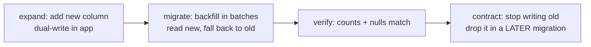

# 19 — Database Evolution Plan

**Status:** awaiting review · **Engine:** PostgreSQL 16 · **Authority:** this document
is the **single place migration numbers are assigned**. Every other doc in this set
describes a schema change and defers the number here. Next free number after this
plan is **0037**.

Extends `02-database-design.md` (principles, inventory §2, indexing §3, partitioning
§4, RLS §5, ledger §6, retention §7) and `database/README.md`. Does not repeat them.

---

## 1. Current state, verified

Read from `database/migrations/0001`–`0010`, not from the design doc.

| Established | Detail |
|---|---|
| **Extensions** | `pgcrypto`, `citext`, `pg_trgm`. No `pgvector`, no `btree_gist`. |
| **Schemas (10)** | `identity`, `training`, `analytics`, `coaching`, `billing`, `rewards`, `partners`, `community`, `notifications`, plus `app` for helpers. All `AUTHORIZATION app_migrator`. No `marketplace` schema exists. |
| **Roles** | `app_migrator` owns every object and is the only role permitted DDL; `app_rw` is the application, asserted `NOSUPERUSER NOBYPASSRLS`; `app_ro` reads. Default privileges are pre-granted per schema, so a new table is reachable without a per-migration `GRANT`. |
| **Tables** | **58** created across `0002`–`0008`. Base tables for **all eight** business modules exist. |
| **RLS** | **46** tables `ENABLE ROW LEVEL SECURITY` in `0009`: 32 via the `owner_all` loop, 5 with an additional `*_granted_read` policy (`activities`, `daily_wellness`, `daily_metrics`, `training_plans`, `plan_sessions`), 6 identity tables, 3 community tables with membership-scoped visibility. Fail-closed via `app.current_user_id()` returning `NULL`. |
| **Cross-athlete reads** | Only through `app.has_grant(user_id, scope)` — `SECURITY DEFINER`, pinned `search_path`, granted to `app_rw`/`app_ro` only. |
| **SECURITY DEFINER surface** | Exactly four functions: `app.has_grant`, `identity.lookup_user_for_authentication`, `identity.lookup_refresh_token`, `identity.revoke_token_family`. `0010` documents why each exists and that they are the only RLS holes. |
| **Append-only** | Six `app.forbid_mutation()` triggers (`consents`, `audit_events`, `provider_events` DELETE-only, `prediction_records`, `payment_webhook_events` DELETE-only, `wallet_ledger_entries`) and **four** privilege-level `REVOKE UPDATE, DELETE` (`consents`, `audit_events`, `prediction_records`, `wallet_ledger_entries`). |
| **Partition-ready shaping** | `activities.start_time`, `ai_messages.created_at`, `audit_events.occurred_at`, `notification_deliveries.created_at`, `wallet_ledger_entries.created_at` are single monotonic keys. `activities` deliberately carries **no** `UNIQUE (provider, provider_activity_id)`; idempotency lives in the small unpartitioned `training.provider_activity_map`. |
| **Money** | `BIGINT` minor units + `CHAR(3) currency` everywhere. Balance is derived (`rewards.wallet_balances` view); no balance column exists. |

### 1.1 Intentionally non-RLS — 12 tables

`58 − 46 = 12`. `0010` documents nine of them. **Three carry a user reference and
are undocumented**, which is a real gap closed by `0011`:

| Table | Why no RLS |
|---|---|
| `identity.organizations` | Tenant directory, no health data. |
| `analytics.algorithm_versions`, `analytics.eval_runs` | Global configuration and global eval results. |
| `billing.subscription_plans` | Public catalogue. |
| `rewards.reward_policies` | Global configuration. |
| `training.provider_events` | Written with no user context by design (the webhook arrives before we know whose it is). No user-facing read path. |
| `partners.partners`, `partners.partner_offers` | Partner-scoped, guarded at the route layer. No athlete health data. |
| `partners.partner_conversions` | **Undocumented.** Carries `user_id`. Route-layer only today. |
| `billing.payment_webhook_events` | **Undocumented.** Same no-user-context argument as `provider_events`, but never stated. |
| `rewards.fraud_signals` | **Undocumented, and deliberately not owner-readable**: an `owner_all` policy would tell a fraudster exactly which detection fired. Staff-only, and staff access is audited, never an RLS exemption. |

Silence is not a decision. `0011` makes each of these a reviewed row in
`app.rls_exemptions` so the CI check in §10 can distinguish "exempt on purpose"
from "forgotten".

---

## 2. The migration process

**ADR-012, restated and sharpened.** Every schema change and every data change is a
hand-written SQL file in `database/migrations/`, reviewed by a developer and executed
by a human. **Nothing applies migrations automatically** — not the application, not
the test suite, not CI, not the deploy pipeline. CI may *apply migrations to a
scratch database it created and will destroy*; that is a test, not a deployment. This
is organisational policy and it is independently correct here: the database holds
health data and a financial ledger, and an auto-applied migration is an unreviewed
production change with no rollback plan.

### 2.1 File conventions

* `NNNN_snake_case_summary.sql`, four digits, gapless, assigned **only by this
  document**. Two branches must never claim the same number; conflicts are resolved
  by renumbering the later branch before merge, never by an `a`/`b` suffix.
* Header block, mandatory, matching `0001`–`0010`:
  `REVIEW REQUIRED. Not executed against any database.` · the role to run as
  (`app_migrator`, except `0001`-class role work) · `Depends on NNNN` · whether it is
  safe inside a single transaction · whether it needs a maintenance window.
* Every table and non-obvious column gets a `COMMENT`. The schema documents itself
  in `psql`.
* A commented-out `-- ROLLBACK:` block at the end, **commented out deliberately**.
* Data changes (seeds, backfills, corrections) are migrations too, with the row
  counts they expect stated in the header.

### 2.2 Reviewer checklist — every box, every migration

1. New athlete-scoped table → does it carry `user_id`, **and** an RLS policy, **and**
   a row in the `0009` list conceptually? If exempt, is there an `app.rls_exemptions`
   row with a written reason?
2. Any enumeration → `TEXT` + `CHECK`, never native `ENUM` (ADR-008)?
3. Any money → `BIGINT` minor units **plus** a currency column? No float, no bare
   `NUMERIC`?
4. Ids → UUIDv7 supplied by the app, `gen_random_uuid()` as DEFAULT only (ADR-009)?
5. Missing data → nullable, never a `DEFAULT 0` that fabricates a value.
6. Append-only table → `app.forbid_mutation()` trigger **and** `REVOKE UPDATE,
   DELETE FROM app_rw`? Both, not either.
7. New index → is there a real query, with an `EXPLAIN` in the review, that needs it?
   (§4)
8. Lock impact → which statements take `ACCESS EXCLUSIVE`, for how long, and against
   what row count? Is `CREATE INDEX CONCURRENTLY` used on every live table?
9. Does anything reference a table that is on the partitioning list (§5) with a
   foreign key? If so, the FK is a future partitioning blocker and must be argued.
10. Does the change alter a `SECURITY DEFINER` function, an RLS policy, or a role
    grant? If yes it is a **security change** and needs the `06` reviewer, not only
    a database reviewer.
11. Never log / never store: no column that could hold a PAN, a CVV, a plaintext
    token, or a health value in a text field intended for logs.

### 2.3 CI dry-run and drift check

Per `docs/09` §8, the pipeline step `migration drift check` does exactly this:

```
create scratch DB → apply 0001..NNNN in order, --single-transaction, ON_ERROR_STOP=on
  → run the RLS verification queries from 0009 (§10 below)
  → reflect SQLAlchemy metadata and diff against the live catalog
  → FAIL on any drift, in either direction
  → destroy scratch DB
```

Drift in either direction is a failure: a model without a migration is an
undeployable feature, a migration without a model is a column nobody reads. This is
the mitigation ADR-012 promised for giving up autogenerate. It runs on every commit
and it never touches staging or production.

### 2.4 Rollback policy — honest version

Reversible changes get an inverse in the `-- ROLLBACK:` block: `ADD COLUMN`,
`CREATE INDEX`, `CREATE TABLE`, `CREATE POLICY`, adding a `CHECK` value.

**Some changes are not reversible, and the file must say so instead of pretending.**
Specifically: dropping a column or table (the data is gone), a `USING` type change
that loses precision, a backfill that overwrote a prior value, the partitioning
migration `0032` (an eight-hour rewrite is not un-run in an incident), the erasure
procedure `0020` (that is the point), and anything that has already been read and
acted on by the application.

For those the file carries a **compensating plan** instead of a rollback block:
what the forward fix is, what the blast radius is if it is applied and then found
wrong, and — for anything touching money or health history — the restore-from-backup
path with a measured RTO from the `1.26`/§10 rehearsal. "Roll back" for a
non-reversible migration means "restore the cluster to a point in time", and the plan
must name who is authorised to make that call.

---

## 3. The migration ledger

Numbers are **dependency order**, not phase order: a Phase-2 migration may sit late
in the sequence when it depends on tables that intermediate migrations activate.
`Risk` describes the lock profile at expected volume for its phase.

| # | Title | Phase | Changes | Why | Depends | Risk | Rev. |
|---|---|---|---|---|---|---|---|
| **0011** | RLS exemption registry + append-only privilege hardening | 2 (prereq) | `app.rls_exemptions(schema_name, table_name, reason, approved_by, approved_at)`, seeded with the 12 non-RLS tables incl. `identity.audit_events` context, `billing.payment_webhook_events`, `rewards.fraud_signals`, `partners.partner_conversions`. `REVOKE DELETE` on `provider_events` and `payment_webhook_events`; `REVOKE UPDATE, DELETE` on `rewards.wallet_transactions` | Closes the §1.1 gap and makes the §10 CI check possible. Three append-only tables are trigger-guarded but not privilege-guarded | 0010 | online-safe; brief `ACCESS EXCLUSIVE` on `REVOKE` | yes |
| **0012** | Email verification + password-reset tokens | 2 | `identity.verification_tokens(user_id, purpose CHECK(email_verify\|password_reset\|email_change), token_hash BYTEA UNIQUE, expires_at, consumed_at, ip_address)`; `users.pending_email CITEXT`; owner RLS + pre-auth `SECURITY DEFINER` lookup by hash | `users.email_verified_at` and `status='pending_verification'` exist with **no way to move between them** | 0011 | online-safe | yes |
| **0013** | MFA activation | 2 | `UNIQUE (user_id, kind) WHERE revoked_at IS NULL` on `mfa_credentials`; `mfa_recovery_codes(credential_id, code_hash, used_at)`; `users.mfa_enforced_at`; `refresh_tokens.amr TEXT[]` so a session records whether MFA was actually satisfied | Table exists as empty schema; roadmap 2.7 mandatory for staff. Without `amr`, a pre-MFA refresh token silently outlives the enrolment | 0012 | online-safe | yes |
| **0014** | Training ingest activation: sync state, backfill, stream integrity | 2 | `training.provider_sync_state(user_id, provider, cursor, window_start, window_end, last_success_at, consecutive_failures)`; `provider_backfill_jobs(chunk_key UNIQUE, status, attempts)`; `activities.source_event_id → provider_events(id)`, `trust_score_version`, `trust_scored_at`; `activity_streams.checksum_verified_at`, `retention_class`, `cold_storage_key`; partial index `activities(user_id, start_time DESC) WHERE trust_score IS NULL` | `0003` has `trust_score` but nothing that computes or versions it, `backfilled_from` but no chunk progress, a checksum but no verification record. Real Garmin volume needs all three | 0011 | `ADD COLUMN` nullable = catalog-only in PG16; indexes `CONCURRENTLY` | yes (drops lose data) |
| **0015** | `analytics.daily_metrics` write path + data-quality flags | 2 | `daily_metrics.inputs_hash` (coalesced-recompute idempotency), `data_quality_score`, `source_activity_count`, `stale_at`; `analytics.recompute_requests(user_id, day, reason, enqueued_at)`; `data_quality_flags.resolved_by/resolved_at` | The worker must not recompute a day whose inputs are unchanged, and a queued recompute must survive a Redis flush — Redis is never the source of truth (ADR-002) | 0014 | online-safe | yes |
| **0016** | Prompt version registry + AI cost/quota activation | 2 | `coaching.prompt_versions(name, version, template_hash, model_id, effort, max_tokens, cache_prefix_tokens, active_from/to, eval_run_id)`; `ai_messages.prompt_version` FK to it, plus `batch_id`, `effort`, `thinking_tokens`, `tool_calls JSONB`; `ai_usage_counters.deep_review_count`, `quota_exceeded_count` | `prompt_version` is free text today, so "did the change regress?" is unanswerable. Opus 5 bills thinking as **output**; unattributed thinking tokens make the §10 cost model wrong. `batch_id` is needed for the −50% overnight path | 0015 | online-safe. Outbound FK from a future-partitioned `ai_messages` is legal | yes |
| **0017** | Plans + digital-twin activation | 2 | `training_plans.revision INTEGER` (drives `If-Match`), `prompt_version`, `superseded_by_plan_id`; `plan_sessions.moved_from_date`; `athlete_twin_snapshots.algorithm_version_id`, `is_current` + `UNIQUE (user_id) WHERE is_current` | `ETag`/`If-Match` on a mutable plan needs a monotonic revision, not `updated_at`. "Current twin" is a hot read that should not be `ORDER BY computed_at DESC LIMIT 1` forever | 0016 | online-safe | yes |
| **0018** | Billing: subscription/entitlement activation + reconciliation | 2 | `billing.plan_prices(plan_code, currency, price_minor, store_product_id)`; `billing.reconciliation_runs(provider, checked_count, drift_count, outcome)`; `subscriptions.reconciliation_state`, `last_drift_at`; `payment_webhook_events.signature_algorithm`, `key_id`, `verification_error`; `entitlements.granted_by`, `note` | Apple/Google product ids have nowhere to live. `last_verified_at` exists but nothing records that a reconciliation **ran**, so a silently dead job looks identical to a clean one. Verification failures must be inspectable per key | 0011 | online-safe; `plan_prices` seed is a reviewed data change | yes |
| **0019** | Notifications activation + localised templates | 2 | `notifications.templates(kind, channel, locale, subject, body, version)`; `notification_deliveries.template_version`, `locale`; `device_tokens.push_provider`, `last_error` | Hebrew-first launch: template text must be a reviewed row, not a Python string, and a delivery must record which version was sent | 0011 | online-safe | yes |
| **0020** | GDPR erasure procedure + `identity.erasure_requests` | 2 (launch gate) | `identity.erasure_requests(user_id, requested_at, grace_until, executed_at, executed_by, tombstone_id)`; `app.erase_user(uuid)` `SECURITY DEFINER` owned by `app_migrator`; `app.forbid_mutation()` extended to permit mutation **only** when an open `erasure_requests` row authorises it for that subject | **Discovered defect:** hard-deleting a `users` row today *fails*. `consents` and `prediction_records` cascade-DELETE into `forbid_mutation()`, and `audit_events`' `ON DELETE SET NULL` fires it as an UPDATE. Referential actions fire row triggers. `DELETE /v1/me` cannot work until this is fixed | 0011–0019 | maintenance-window; per-user, short | **no** — compensating plan: PITR restore |
| **0021** | Retention and archival jobs; `provider_events` made prunable | 2 | Range-partition `training.provider_events` on `received_at` monthly; move its `UNIQUE (provider, provider_event_id)` into a new unpartitioned `training.provider_event_keys` (the `provider_activity_map` pattern); `app.archive_activity_streams()` cold-tier sweep driven by `retention_class` | 90-day pruning is currently **impossible**: a `BEFORE DELETE` trigger blocks `DELETE` for every role. Pruning by `DROP TABLE <partition>` is DDL, fires no row trigger, and takes no long lock. A partitioned table's UNIQUE must include the key, hence the lookup table | 0014, 0011 | table rewrite — do it while the table is small; that is the argument for doing it in Phase 2 | no |
| **0022** | Injury-label collection | 3 | `training.injury_reports(user_id, reported_on, body_region CHECK, side, onset CHECK(acute\|gradual), pain_score 0–10, tissue_type, activity_id, days_missed, status, resolved_on)`; `training.pain_checkins(user_id, day, region, pain_score)`; owner RLS on both | Roadmap sequencing rule 2: **labels precede models.** 3.4 before 3.5. Nothing to train on exists today, and back-filling injury history from memory is not a dataset | 0011 | online-safe | table yes, labels no |
| **0023** | Governance activation: versions, predictions, experiments, evals | 3 | `algorithm_versions.parameters_hash`, `promoted_by`, `eval_run_id`, `rollback_of` + trigger forbidding `active_from` without a passing `eval_runs` row; `analytics.experiment_definitions(name, variants, traffic_bps, algorithm_name)`; `experiment_assignments.assignment_hash`; `prediction_records.context_hash`, `experiment_variant`; `eval_runs.baseline_run_id`, `dataset_hash` | The "no version goes active without a passing eval" gate is a `COMMENT` in `0004`. A gate that is a comment is not a gate | 0011 | online-safe | yes |
| **0024** | Injury model artifact registry + validation flag | 3 | `analytics.model_artifacts(algorithm_version_id, storage_bucket, storage_key, checksum_sha256, framework, training_window_start/end, label_count, holdout_metrics JSONB, is_clinically_validated BOOLEAN NOT NULL DEFAULT false)`; `daily_metrics.injury_risk_validated BOOLEAN NOT NULL DEFAULT false` | 3.5 ships only if it beats `heuristic-v0` on held-out data, which requires the holdout result to be a row. The flag is on `daily_metrics` so the read path renders "unvalidated" with no join | 0022, 0023 | `NOT NULL` + constant `DEFAULT` is catalog-only in PG16 — no rewrite | yes |
| **0025** | Rewards: ledger integrity trigger + policy versioning | 4 | `DEFERRABLE INITIALLY DEFERRED CONSTRAINT TRIGGER` on `wallet_ledger_entries` asserting `SUM(credit)=SUM(debit)` per `transaction_id` at commit; `wallet_transactions.idempotency_key TEXT UNIQUE`; `reward_policies.superseded_by`, `approved_by`, `approved_at` | Balance-to-zero is enforced today by a nightly view, property tests and hope. A deferred constraint trigger makes an unbalanced transaction **impossible to commit**. The existing dedupe index does not cover the client-supplied `Idempotency-Key` the API requires on money paths | 0011 | online-safe; must be preceded by a clean `wallet_unbalanced_transactions` run — the trigger validates new rows only | yes |
| **0026** | Rewards: earn wiring, trust gate, payout four-eyes | 4 | `reward_events.trust_score`, `trust_threshold` (snapshot of the gate that applied), `held_reason`; `payouts.kyc_state`, `cooling_off_expires_at`, `second_approver_id` + `CHECK` requiring two distinct approvers above a threshold amount; `fraud_signals.signal_version`, `assigned_to` | Sequencing rule 1: data quality precedes rewards. The threshold must be *snapshotted*, or changing it later silently rewrites why a past event was held. A single approver on cash-out is one compromised account away from loss | 0025, 0014 | online-safe | yes |
| **0027** | Partners: staff scoping, real RLS, settlements | 4 | `partners.partner_users(partner_id, user_id, role)`; `app.current_partner_id()` helper + `SET LOCAL app.current_partner_id`; RLS on `partners`, `partner_offers`, `partner_conversions` keyed on it; `partners.partner_settlements(period, gross_minor, commission_minor, status, invoice_ref)`; `partner_conversions.settlement_id` | Partner isolation is route-layer-only today — the one place in the schema where a tenant boundary has no database backstop. Removes three rows from `app.rls_exemptions` | 0011 | online-safe; enabling RLS on a populated table changes results — verify with the §10 queries before and after | yes |
| **0028** | Community activation: invitations, leaderboard snapshots | 4 | `community.group_invitations(group_id, invited_email_hash, token_hash, expires_at, accepted_by)` + RLS; `challenge_leaderboard_snapshots(challenge_id, computed_at, rows JSONB)`; `challenge_participants.last_recomputed_at` | `groups.visibility='private'` means invitation-only and there is no invitation table. Email is hashed, never stored plainly, so an unaccepted invite is not a PII store | 0011 | online-safe | yes |
| **0029** | Marketplace schema | 5 | `CREATE SCHEMA marketplace`; `coach_profiles`, `plan_products`, `plan_purchases` with RLS and `BIGINT` money | **`docs/02` §2 lists these as "schema only" but they do not exist** in `0001`–`0010`. Recording the gap here is the correction; `docs/02` §2 should be amended | 0018, 0025 | online-safe | yes |
| **0030** | Wallet balance snapshots | 4/5 (perf) | `rewards.wallet_balance_snapshots(wallet_id, account, as_of, balance_minor, last_entry_id)`; `wallet_balances` view rewritten to sum the snapshot plus entries after `last_entry_id` | `docs/02` §3 anticipated this. Trigger: the balance scan exceeding its latency budget — **not** a mutable balance column, ever | 0025 | online-safe (view swap) | yes |
| **0031** | Index additions from production `EXPLAIN` | 3+ (rolling) | Whatever §4's justification produces. One migration per batch, `CREATE INDEX CONCURRENTLY`, one statement per file section | No index is created for a query we do not yet make (`docs/02` §3) | measured | `CONCURRENTLY`; **cannot run in a transaction block** | yes |
| **0032** | Partitioning migration | 5 | Convert to monthly range partitions: `audit_events(occurred_at)`, `notification_deliveries(created_at)`, `wallet_ledger_entries(created_at)`, then `ai_messages(created_at)` and `activities(start_time)` once §5's FK question is settled | Trigger: ~50M rows on any one table, or disruptive index maintenance (`docs/02` §4, roadmap 5.5) | 0021, 0030 | **table rewrite, hours.** Maintenance window, or expand/migrate/contract per §6 | no |
| **0033** | Partition maintenance + retention detach | 5 | `app.ensure_partitions(months_ahead => 3)`; `app.detach_expired_partitions()` honouring the §7 retention class per table | A partitioned table with no partition for next month rejects every insert at midnight on the 1st | 0032 | online-safe | yes |
| **0034** | `pgvector` for semantic conversation recall | 5, conditional | `CREATE EXTENSION vector`; `coaching.message_embeddings(message_id, user_id, embedding vector(N), model_id)` + owner RLS + HNSW index | `docs/02` §8 open question 3. Ships **only** if keyword + recency recall measurably fails a real athlete need. Embeddings are derived data and inherit the athlete's RLS | 0016 | extension create needs superuser; index build is heavy — `CONCURRENTLY` | yes |
| **0035** | Read-replica / columnar analytics split preparation | 5, conditional | `app_analytics` role (`NOBYPASSRLS`); aggregate-only, athlete-free materialised views for product analytics; replication slot and publication for `analytics.*` | Product analytics must never need row access to health data. Aggregates are the boundary — not an RLS exemption for BI | 0015 | online-safe | yes |
| **0036** | Shard-split preparation | 5+, conditional | Drop or re-home the cross-athlete FKs listed in §8; move `users.email` global uniqueness to a directory table; tag every table `sharded` or `global` | Only if a single primary stops sufficing. Everything cheap was already done in Phase 0 (§8) | 0032 | per-statement; the FK drops are online-safe | partly |

---

## 4. Index evolution

**The rule stands: no index is created for a query we do not yet make.** Every index
is a write amplification on `activities`, `ai_messages` and `daily_metrics` — the
three hottest tables in the system — and the ingest path is the one place where
throughput is load-bearing.

A new index is justified in the migration header by, in order:

1. the exact query, as the repository issues it, with its `user_id` predicate;
2. `EXPLAIN (ANALYZE, BUFFERS)` from staging at production-like row counts, before;
3. the same after, on a scratch copy;
4. the expected call rate — a 40 ms sequential scan run once a month does not earn
   an index;
5. whether a **partial** index serves it (`docs/02` §3 favours partial wherever a
   status column makes most rows irrelevant — the pattern `0003`, `0006` and `0008`
   already use for `WHERE processed_at IS NULL`, `WHERE status = 'active'`,
   `WHERE resolution = 'pending_review'`).

`CREATE INDEX CONCURRENTLY` is **mandatory** on any table with live traffic. It does
not take the `ACCESS EXCLUSIVE` lock a plain `CREATE INDEX` holds for the whole
build. The consequence for the file is structural: **`CONCURRENTLY` cannot run inside
a transaction block**, so the migration cannot be applied with
`psql --single-transaction`. Such a file therefore:

* contains **only** `CONCURRENTLY` statements, one per line, no DDL that needs
  atomicity;
* says in its header: `DO NOT apply with --single-transaction`;
* states that a failed build leaves an `INVALID` index that must be dropped
  (`CONCURRENTLY`) and rebuilt — a half-applied index is the expected failure mode,
  not a surprise;
* is verified after apply with `SELECT indexrelid::regclass FROM pg_index WHERE NOT
  indisvalid`.

Where an index must be created atomically alongside table changes, the migration is
**split**: `NNNN_a` for the transactional DDL, `NNNN_b` for the concurrent index
builds, applied in order.

---

## 5. Partitioning

**Trigger** (unchanged from `docs/02` §4): any candidate table passing ~50M rows, or
index maintenance / vacuum windows becoming disruptive. Not a date.

| Table | Key | Inbound FKs | Verdict |
|---|---|---|---|
| `identity.audit_events` | `occurred_at` | none | partition freely |
| `notifications.notification_deliveries` | `created_at` | none | partition freely |
| `rewards.wallet_ledger_entries` | `created_at` | none | partition freely |
| `coaching.ai_messages` | `created_at` | 1 (`ai_message_feedback.message_id`) | needs a decision |
| `training.activities` | `start_time` | **6** (`provider_activity_map`, `activity_laps`, `activity_streams`, `personal_bests`, `plan_sessions.completed_activity_id`, `activity_shares`, `prediction_outcomes.source_activity_id`) | needs a decision |
| `training.provider_events` | `received_at` | none (after `0021`) | partitioned early, for pruning not volume |

**The obstacle `docs/02` §4 does not state.** A partitioned table's primary key must
contain the partition key, so `activities` PK becomes `(id, start_time)` — and a
foreign key can only reference a **unique constraint on the referenced columns
alone**. Every inbound FK to `activities(id)` therefore becomes invalid. Options, and
the recommendation:

* **(a) Drop the FKs**, enforce referentially in the repository layer. Cheapest,
  and what most systems do. Rejected as the default here: `activity_streams` and
  `provider_activity_map` orphans would silently corrupt ingest idempotency.
* **(b) A spine table** — keep an unpartitioned `training.activity_ids(id PK,
  user_id, start_time)` that inbound FKs reference. Costs one extra small insert per
  activity and keeps integrity. **Recommended.**
* **(c) Do not partition `activities`.** Legitimate: the three FK-free tables are
  likely to hit 50M rows first (`wallet_ledger_entries` grows at several rows per
  reward event, `audit_events` at one per cross-user read). Partition those in
  `0032`, and revisit `activities` only when it is actually the problem.

`0032` is written to do the FK-free three first and the other two behind an explicit
decision, so partitioning is not blocked on the hardest table.

**Business UNIQUE constraints must never exclude the partition key.** This is why
`activities` carries no `UNIQUE (provider, provider_activity_id)` and why
`provider_activity_map` exists as a small unpartitioned lookup. `0021` applies the
identical pattern to `provider_events` → `provider_event_keys`. Any future
high-volume ingest table follows it.

**Partition creation ahead of time** (`0033`): a scheduled job creates three months
of partitions in advance. The failure mode being prevented is total: no partition for
the current month means every insert fails, at midnight, on the 1st. The job alerts
if fewer than two future partitions exist.

**Archival past retention** (`0033`): `DETACH PARTITION` then export to cold storage
then `DROP`. Detach is brief and the export runs against a table nothing is querying.

---

## 6. Zero-downtime change patterns

**Expand / migrate / contract** — for every rename and every type change. A rename
applied in one step breaks the running app for the duration of the deploy.



Three separate migrations and at least two deploys between the first and the last.
The contract step is a distinct migration number so it can be delayed until the old
column is provably unread.

**Adding a NOT NULL column safely.** In PostgreSQL 16, `ADD COLUMN ... NOT NULL
DEFAULT <constant>` is a catalog-only change — no rewrite — and is safe on a large
table (`0024`'s `injury_risk_validated` relies on this). A **volatile** default, or a
`NOT NULL` with no default on a populated table, does rewrite. For those: add
nullable → backfill in batches → `ADD CONSTRAINT ... CHECK (col IS NOT NULL) NOT
VALID` → `VALIDATE CONSTRAINT` (which takes only a `SHARE UPDATE EXCLUSIVE` lock) →
optionally `SET NOT NULL` afterwards, which PostgreSQL can then prove cheaply.

**Backfilling large tables.** Never one `UPDATE`. Batch by primary key or by
partition key, 5–20k rows, committing each batch, with a sleep between batches to let
autovacuum keep up — a single large `UPDATE` holds one transaction open for the whole
run, bloats the table by its own size, and blocks `VACUUM` from reclaiming anything.
Batch scripts record progress in a table so a failed run resumes rather than
restarts, and they are reviewed SQL like everything else.

**Lock discipline, in every migration header.** Set before the DDL:

* `SET lock_timeout = '3s'` — a DDL statement that cannot get its lock in three
  seconds must **fail**, not queue. A queued `ACCESS EXCLUSIVE` request blocks every
  subsequent reader behind it, which is how a "one-second" `ALTER TABLE` takes the
  site down.
* `SET statement_timeout` — generous for a deliberate rewrite, tight for anything
  claimed to be instant.
* Retry the statement rather than raising the timeout.

---

## 7. Data lifecycle

Retention per `docs/02` §7, with the mechanism named — a retention table that no job
implements is a compliance claim, not a control.

| Class | Retention | Mechanism | Migration |
|---|---|---|---|
| Activities, wellness, `daily_metrics` | life of account + 30 days after a deletion request | `app.erase_user()` | 0020 |
| `activity_streams` samples | 24 months hot, then cold storage | `app.archive_activity_streams()` by `retention_class`; the row keeps `cold_storage_key` and `checksum_sha256` so an archived stream is still *findable and verifiable*, not lost | 0021 |
| `provider_events` | 90 days | `DROP` the expired monthly partition. Row-level `DELETE` is blocked by design | 0021, 0033 |
| `ai_messages` | 24 months | partition drop once partitioned; batched `DELETE` before that | 0032, 0033 |
| `audit_events` | 7 years | never deleted; **redacted** on erasure | 0020 |
| `wallet_ledger_entries`, `payments`, `payouts` | 7 years | never deleted, and `wallets.user_id` is `ON DELETE RESTRICT` so the ledger cannot be orphaned by a user delete | — |

**How erasure interacts with append-only records.** It does not delete them. It
anonymises: the athlete's `users` row and health data go, the financial and audit rows
stay with `subject_user_id`/`actor_user_id` replaced by a tombstone id and `detail`
JSONB reduced to non-identifying keys. That is the legal-obligation carve-out, and
`GET /v1/me/deletion` states it plainly to the athlete before they confirm.

The mechanical problem is §3's `0020` finding: `app.forbid_mutation()` currently makes
this impossible for any role, because cascade DELETEs and `ON DELETE SET NULL`
referential actions both fire row triggers. `0020` resolves it by making the guard
conditional on an authorising `identity.erasure_requests` row for that specific
subject — narrow, auditable, and reviewed as a **security** change. The rejected
alternative was a blanket "maintenance mode" bypass flag, which is a permanent hole
that any code path could set.

---

## 8. Scale-out preparation

**Already true, at zero further cost:**

* **UUIDv7 application-generated PKs** — no sequence to coordinate, time-ordered so
  B-tree inserts stay at the index's right edge, and ids are globally unique across
  any future shard.
* **`user_id` on every athlete-scoped row**, denormalised even where derivable. It is
  the shard key, and RLS is a single-column predicate because of it.
* **No cross-athlete transactions.** Every write path is one athlete. `wallet_ledger_entries.user_id` and `wallet_transactions.user_id` deliberately carry **no FK** to `users`, so the ledger is already free of a cross-shard dependency.
* Nine schemas, so extracting a module is `pg_dump --schema=<name>`.

**What a split would still need** (`0036`, conditional):

| Concern | Change |
|---|---|
| Cross-athlete FKs | `identity.data_access_grants` (two users), `community.group_members`/`challenge_participants`/`activity_shares` (a group spans athletes), `partners.partner_conversions`. These tables are `global`, not `sharded`; the FKs to `users` must be dropped or re-homed to the directory shard. |
| Global email uniqueness | `users_email_active_key` is a single-node unique index. Needs a directory table on the global shard, or a uniqueness service. |
| Routing | Every table tagged `sharded` (keyed by `user_id`) or `global`. No table may be ambiguous. |
| Read-replica / columnar split (`0035`) | `app_analytics` role, `NOBYPASSRLS`, reading **aggregate-only** materialised views with no athlete row reachable. A BI tool never gets an RLS exemption. |

---

## 9. Module contract — database-change surface

| Module (schema) | Purpose of the change surface | Migrations | Database changes | APIs that depend on them | Dependencies | Security | Testing |
|---|---|---|---|---|---|---|---|
| **identity** (`identity`) | Complete the auth lifecycle the tables already anticipate | 0011, 0012, 0013, 0020 | verification tokens, MFA uniqueness + recovery codes, `refresh_tokens.amr`, erasure requests, exemption registry | `POST /v1/auth/verify-email`, `/v1/auth/password-reset`, `/v1/me/mfa`, `DELETE /v1/me`, `GET /v1/me/deletion` | none (root module) | pre-auth lookups stay `SECURITY DEFINER` and hash-keyed; A07 (auth failures), A01 (access control); erasure guard reviewed by `docs/06` | isolation matrix rows for every new endpoint; grant-lifecycle test unchanged; erasure rehearsal on a restored copy |
| **training** (`training`, `analytics`) | Make real Garmin ingest and the metrics write path operable | 0014, 0015, 0021, 0022, 0023, 0024, 0031, 0032 | sync/backfill state, trust-score provenance, stream integrity + cold tier, `inputs_hash`, recompute queue, injury labels, model registry, partitioning | `POST /v1/integrations/{provider}/webhook`, `GET /v1/activities`, `GET /v1/metrics/daily`, `POST /v1/injuries` | `integrations.garmin`; object storage | webhook signature verified before any state change; `provider_events` non-RLS by design and now registered; injury reports are health data → owner RLS only | provider contract tests on recorded payloads; anchor/undefined/hand-computed algorithm tests; isolation rows for injury endpoints |
| **coaching** (`coaching`) | Cost attribution, prompt provenance, plan mutability | 0016, 0017, 0034 | prompt version registry, `thinking_tokens`, `batch_id`, plan `revision`, `is_current` twin, optional embeddings | `POST /v1/coach/messages`, `GET /v1/plans/current`, `PATCH /v1/plans/{id}` (`If-Match`) | `modules.training.service` for derived metrics; `modules.billing.service` for quota | tools take **no** user-id parameter and run RLS-filtered; embeddings inherit owner RLS; A03 (injection) handled at the prompt boundary | eval cases per prompt version, gated on `eval_runs`; grounding assertion; quota property test |
| **billing** (`billing`) | Activate entitlement resolution and prove reconciliation ran | 0018 | `plan_prices`, `reconciliation_runs`, drift columns, webhook verification detail | `GET /v1/entitlements`, `POST /v1/billing/receipts`, `POST /v1/billing/webhooks/{provider}` | Apple IAP, Google Play, PayPal | never trust a client entitlement claim; unverified webhook persists but never mutates entitlement; no card data column exists | webhook-forgery test per provider; entitlement expiry property test; isolation row per endpoint |
| **rewards** (`rewards`) | Make ledger invariants structural, not nightly | 0025, 0026, 0030 | deferred balance constraint trigger, `idempotency_key`, trust snapshot, payout four-eyes, balance snapshots | `POST /v1/rewards/redeem`, `POST /v1/payouts` (both `Idempotency-Key` required) | `modules.training.service` for `trust_score`; `partners.service` | append-only + `REVOKE`; human approval on payout; fraud signals never owner-readable | ledger property tests over random earn/redeem/reverse/payout sequences; replay-idempotency test; money property test per new path |
| **partners** (`partners`) | Give partner isolation a database backstop | 0027 | `partner_users`, `app.current_partner_id()`, RLS on all three tables, settlements | `/partner/v1/offers`, `/partner/v1/conversions`, `/partner/v1/settlements` | none inbound; commission read by rewards | the only tenant boundary currently route-layer-only; A01; partner surface must reach **no** athlete health data | a partner-isolation matrix mirroring the athlete one: partner A's token vs partner B's resource |
| **community** (`community`) | Close the private-group invitation gap | 0028 | `group_invitations` (hashed email), leaderboard snapshots | `POST /v1/groups/{id}/invitations`, `GET /v1/challenges/{id}/leaderboard` | `modules.training.service` for shared activity fields | group membership grants **no** health access — only `activity_shares`; the `public` + HR `CHECK` stays | share-visibility test per audience; invitation expiry test |
| **notifications** (`notifications`) | Localised, versioned content | 0019, 0032 | templates, `template_version`, `locale`, partitioning | `PUT /v1/me/notification-preferences`, `POST /v1/me/devices` | `modules.identity.service` for locale/timezone | body must not carry health values beyond what the athlete sees in-app; marketing stays opt-in | quiet-hours and preference-suppression tests; dedupe-key test |

---

## 10. Testing strategy

1. **Migration dry-run in CI** (§2.3): scratch database, `0001..NNNN` in order,
   `--single-transaction --set ON_ERROR_STOP=on`, except files marked
   `CONCURRENTLY`, which are applied statement-wise. A migration that cannot be
   applied from empty fails the build.
2. **ORM-drift check**: reflect SQLAlchemy metadata against that scratch database and
   fail on any difference in either direction. This is the whole mitigation for
   hand-written migrations; it is not optional and it is not warn-only.
3. **RLS verification after every migration that touches a policy, a role or a
   grant** — the four queries at the end of `0009`, run as a script:
   `app_rw`/`app_ro` are `rolsuper = f, rolbypassrls = f`; **zero** tables in the
   nine schemas owned by anything other than `app_migrator`; every table's
   `relrowsecurity` and policy count listed; the two-athlete + `RESET` smoke test
   returning A's count, B's count, then **0**.
4. **The `user_id` + policy check**: for every table in the nine schemas, assert
   `has_user_id_column → (relrowsecurity AND policy_count > 0) OR an
   app.rls_exemptions row exists`. This is why `0011` exists — before it, the check
   cannot be written without hard-coding a list that will rot.
5. **Tenant-isolation matrix** (`docs/09` §3.1): a new endpoint without a row fails
   the build. `0027` adds the partner-scoped equivalent.
6. **Restore-from-backup rehearsal**, with the elapsed time recorded (roadmap 1.26),
   re-run before `0020`, `0021` and `0032` — the three non-reversible migrations
   whose compensating plan *is* the restore. A rollback plan whose RTO has never been
   measured is not a plan.
7. **Post-partitioning checks** (`0032`, `0033`): every candidate table has ≥2 future
   partitions; no `INVALID` index in `pg_index`; row counts across partitions equal
   the pre-migration count.
8. **Ledger invariant** (`0025`): `wallet_unbalanced_transactions` must return zero
   rows before the constraint trigger is created and after every subsequent
   migration. The property tests in `docs/09` §3.6 keep running unchanged.

Analytics tests continue to run with no dependencies installed
(`python3 -m unittest discover -s tests -t .`); nothing in this plan puts a database
in the way of the algorithm suite.
