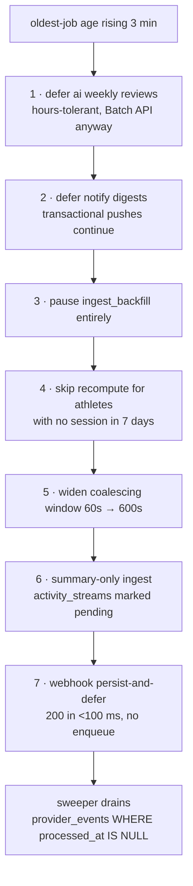

# 20 — Scaling Plan: First Users to Millions

**Status:** awaiting review · **Owner:** platform · **Extends:** `docs/01` §5, §6, §9,
§10, §11, §12 · `docs/02` §4 · `docs/10` §6

`docs/01` §9 gives a five-stage shape. This document turns it into an operational
plan: the arithmetic that says what the constraint actually is, a **measured
trigger** per stage rather than an athlete count, the concrete actions, the cost,
and what breaks first if the move is late. Stages are entered by **measurement**,
not by calendar — a stage is not a roadmap phase (`docs/07`).

Every number below shows its arithmetic. Where a per-unit figure is an assumption
rather than a measurement it is marked **[assumed]** and named as a load-test
target in §12; the load test replaces it, the structure of the argument does not
change.

---

## 1. The governing insight

**The constraint is not HTTP read volume.** It is, in order: (a) provider **ingest
write volume**, (b) **analytics recompute** duration, (c) **AI inference cost**.
Reads are cheap because `daily_metrics` is materialised (`docs/01` decision 5) and
cached; writes are expensive because each one is a provider round trip we cannot
cache, must not lose, and which triggers CPU work downstream.

### 1.1 Load per athlete per day

We subscribe to **dailies, sleep, HRV and activities** — deliberately **not**
Garmin epoch-level push (15-minute epochs would be 96 events/athlete/day and would
dominate every number in this document for analytic value we do not use).

| Source | Events/athlete/day | Basis |
|---|---|---|
| Daily summary pings | 3.0 | Garmin re-pushes the day's summary on each watch sync **[assumed]** |
| Sleep | 1.0 | one per night |
| HRV status | 1.0 | one per night |
| Activities | 0.9 | ~5 sessions/week + double days for triathletes |
| Body composition | 0.3 | not every athlete owns a scale |
| **Total ingest events** | **6.2 → 6** | |

Row writes per athlete-day, from those 6 events:

| Table | Rows/day | Bytes/day |
|---|---|---|
| `training.provider_events` (raw, immutable) | 6.0 | 7,200 |
| `training.activities` | 0.9 | 540 |
| `training.activity_laps` (~6 laps/session) | 5.4 | 1,080 |
| `training.activity_streams` (pointer only) | 0.9 | 180 |
| `training.daily_wellness` (upserted ~5× as data lands) | 5.0 writes / 1 row | 400 |
| `training.daily_metrics` (recompute output) | 1.5 | 1,800 |
| `coaching.athlete_twin_snapshots` | 1.0 | 2,000 |
| `training.data_quality_flags` | 0.2 | 100 |
| **Total** | **≈ 21 writes** | **≈ 13 KB logical, ≈ 17.5 KB with indexes** |

Recompute jobs: 0.9 (activity) + 1.0 (wellness day-close) + 0.5 (profile/plan
edits, late arrivals) = 2.4 raw, reduced to **1.5** by coalescing (§5.3).

CPU per job **[assumed]**: a single-day recompute reads ~90 days of
`daily_wellness` and the in-window activities (4 queries, ~15 ms) and walks the
42/7-day Banister EWMAs, ACWR, Foster monotony, readiness with 28-day baselines,
efficiency and `injury_risk` feature extraction over ~90 points in pure stdlib
(~25 ms) → **40 ms**. A full 90-day rebuild shares the queries → **350 ms**.

### 1.2 Multiplied out

Peak multiplier is **4.4×** the hourly average (§3). "Ops/s peak" = ingest events
+ recompute jobs at peak.

| Athletes | Ingest ev/day | Peak ingest/s | Writes/s peak | Recompute jobs/day | Peak recompute/s | Nightly full rebuild | PG growth/yr | Streams/mo |
|---|---|---|---|---|---|---|---|---|
| 1k | 6.0k | 0.31 | 1.1 | 1.5k | 0.08 | 350 s | 6.4 GB | 13.5 GB |
| 25k | 150k | 7.8 | 27 | 37.5k | 1.9 | 2.4 CPU-h | 160 GB | 340 GB |
| 150k | 900k | 47 | 164 | 225k | 11.4 | 14.6 CPU-h | 950 GB | 2.0 TB |
| 500k | 3.0M | 156 | 547 | 750k | 38 | 48.6 CPU-h | 3.2 TB | 6.8 TB |
| 1M | 6.0M | 313 | 1,094 | 1.5M | 76 | 97 CPU-h | 6.4 TB | 13.7 TB |

Worked example, 150k: `900,000 ev/day × 0.183 (peak-hour share) ÷ 3,600 = 45.7/s`;
`225,000 × 0.350 s = 78,750 s = 21.9 CPU-h` — the 14.6 CPU-h figure uses the
one-query-per-1,000-athlete batch path of §5.4, which removes the per-athlete
query cost. Streams: `0.9 × 150,000 × 0.5 MB/session × 30 = 2.0 TB`.

### 1.3 Reads, for comparison — at 1M athletes

30% DAU × 2 sessions × 3 requests = `1M × 0.3 × 2 × 3 = 1.8M reads/day` = 20.8/s
average; the morning check-in peak is 4.2× → **87 reads/s**. Cost per read at a 90%
cache hit: `0.9 × 0.3 ms + 0.1 × 2.0 ms = 0.47 ms` of query work plus ~1.5 ms of
TLS/JSON → **87 × 1.97 ms = 0.17 cores**.

Writes at the same scale: ingest CPU averages
`(5.1 × 5 ms + 0.9 × 45 ms) ÷ 6 = 11 ms/event` (FIT decode of a 2,700-sample
session dominates) → `313 × 11 ms = 3.4 cores`; recompute `76 × 40 ms = 3.0 cores`
→ **6.4 cores**.

> **38× the CPU for 4.5× the operations.** And the asymmetry compounds: a read is
> cacheable, idempotent and retryable by the client; an ingest event is a provider
> round trip that cannot be cached, must not be lost, and fans out into recompute,
> twin refresh and notification work. Sizing on read RPS would put capacity in
> exactly the wrong place.

AI is third rather than first because it is a **cost** constraint, not a capacity
one: it never falls over, it silently eats the margin (§6).

---

## 2. Stage-by-stage plan

| St | Athletes | Shape | Measured trigger to move on | Infra/mo | What breaks first if late |
|---|---|---|---|---|---|
| **0** | < 1k | 1 API, 1 worker, managed PG + Redis, single AZ | `ingest_queue_oldest_job_age` p100 > **300 s** in the 18:00–21:00 window on 3 consecutive weekdays · **or** `GET /v1/metrics/summary` p95 > **150 ms** for 1 h · **or** DB pool checked-out/size > **0.7** for 15 min | $150–250 | Athlete finishes a run, opens the app, sees yesterday's readiness. Unacked pings make Garmin retry → duplicate work → the backlog feeds itself. Trust, not throughput, is what fails. |
| **1** | 1k–25k | 2–4 API containers; per-queue worker scaling; **one read replica**; separate `ingest_backfill` queue | `analytics_nightly_rebuild_duration` > **50% of the 02:00–04:00 window** (>3,600 s) · **or** `training.activities` row count > **30M** · **or** `postgres_size_bytes` > **1 TB** · **or** `pg_replication_lag` p99 > **5 s** at evening peak | $600–1,200 | Rebuild overruns into the 06:00 read peak. Replica lag exceeds the freshness rule so every read fails back to the primary at once. Autovacuum falls behind on `activities`; bloat pushes the dashboard read off `(user_id, day DESC)` and p95 doubles. |
| **2** | 25k–150k | **`training` extracted** (§7); monthly partitioning executed; pgBouncer; streams object-storage-only; batch recompute (NumPy) | `training` ingest worker CPU saturation > **0.7** while the `ai` worker is < **0.2** for 7 days (the ADR-001 divergence test) · **or** `pgbouncer_client_wait` p95 > **50 ms** · **or** primary commit rate > **60%** of the load-tested ceiling · **or** LLM `429` rate > **1%** | $3,000–6,000 | pgBouncer client queue grows; requests hit `statement_timeout`; `/readyz` flaps and the orchestrator rolls **healthy** pods, removing capacity during an overload. The classic self-inflicted outage. |
| **3** | 150k–500k | **`coaching` extracted**; Redis cluster; recompute queue sharded 16-way; wallet-balance snapshots; cross-region replica | Peak WAL throughput > **60%** of the instance's measured sustainable rate **and** the largest instance class already provisioned · **or** combined `activities` + `daily_metrics` on one primary > **6 TB** · **or** cross-athlete analytics push replica lag > **30 s** | $12,000–25,000 | Vacuum and index maintenance stop fitting in the nightly window; write latency rises non-linearly; ingest and recompute queue together. There is no incremental fix left — you enter a multi-week shard migration under load, the exact scenario ADR-001 exists to prevent. |
| **4** | 500k+ | 16 logical shards on `hash(user_id)`; columnar store fed by CDC; per-shard failover | — (steady state; re-evaluate at 5M) | — |

### Per-stage detail

**Stage 0 — prove the arithmetic.** The only engineering goal is *calibration*:
replace every **[assumed]** figure in §1 with a measured one. Instrument
`recompute_duration_seconds` (histogram, labelled by `rebuild_days`),
`ingest_event_cpu_ms` by event type, and `bytes_per_stream`. One worker at
concurrency 8 is ~0.4% utilised at 1k athletes (`0.08 jobs/s × 0.04 s ÷ 8`), so
nothing here is about capacity.

**Stage 1 — separate the queues before scaling them.** The non-obvious load at
25k is not steady state, it is **backfill**. A newly connected athlete's 90-day
history is ~90 dailies + ~60 activities + 60 stream files ≈ **210 provider calls**.
At 140 signups/day that is 29,400 calls/day, and they arrive in bursts after a
marketing push. Steady-state peak needs only 7.8 calls/s; a 500-signup launch day
needs 105,000 calls concentrated in hours. Fix: `ingest_backfill` is a **separate
queue with a fixed minority share (20%) of the provider token budget**, so a
launch spike can never starve live ingest. Backfill is only ever the constraint
when it shares a queue with live traffic.

**Stage 2 — partition and extract, in that order.** Partition first because
partitioning a 50M-row live table is a maintenance window while partitioning a
30M-row one is a metadata operation (§8.3). Extract `training` second, once
partitioning has proved the schema boundary is clean.

**Stage 3 — the surprise is what *doesn't* break.** At 1M athletes the primary
sees `(313 × 4) + (76 × 4) ≈ 1,560 statements/s` peak — comfortable for one large
instance. **The single-primary write ceiling is not what forces Stage 4.** Table
size, vacuum/index maintenance windows and blast radius are. Say so plainly, so
nobody shards for TPS reasons that do not exist.

**Stage 4 — bound the blast radius.** The strongest argument for 16 shards is not
throughput; it is that losing one means 6% of athletes are degraded rather than
100%.

---

## 3. Load-shape realism

Sizing is against **peak**, never average.

| Shape | Window | Share | Peak : average |
|---|---|---|---|
| Weekday evening ingest | 18:00–21:00 | 55% of daily events | `(0.55/3) ÷ (1/24)` = **4.4×** |
| Weekend long session | Fri/Sat 08:00–11:00 | 45% of that day's events | **3.6×** on count; stream bytes ~4× larger → **≈ 14×** on byte rate |
| Morning read peak | 06:00–08:00 | 35% of reads | `(0.35/2) ÷ (1/24)` = **4.2×** |
| Race week | 7 days pre-event | — | **1.4×** on AI message rate |
| Season | Nov–Mar vs Jul–Aug | — | **1.6×** on monthly volume |

Three consequences that are specific to this market:

1. **Single-timezone concentration is a real cost.** Israel is one timezone
   (UTC+2/+3). A globally distributed base of the same size spreads the evening
   peak across ~24 h of local evenings, flattening 4.4× to roughly 1.3×. So the
   same subscriber count in Israel needs **≈ 3.4× the ingest worker capacity** of a
   globally spread base. The corollary is the useful half: **international
   expansion is a capacity discount**, and the Stage 2/3 triggers will arrive
   *later* than athlete count alone predicts once the base spreads. Do not
   pre-provision for a global shape we do not have.
2. **The long-session spike is Friday and Saturday, not Sunday.** The Israeli work
   week is Sunday–Thursday, so the long ride/run lands on the Friday–Saturday
   weekend. It is a **bytes** peak more than an events peak: a 5-hour ride is
   ~18,000 samples versus ~2,700 for a weekday session, so provider download
   bandwidth, FIT-decode CPU and object-storage PUT throughput peak together
   while row counts barely move. Autoscaling on queue depth alone misses it;
   scale the stream-fetch pool on `bytes_in_flight` as well.
3. **Seasonality is inverted relative to the northern norm.** The Israeli
   endurance season runs autumn to spring (Tiberias in January, Tel Aviv in
   February, 70.3 in November); July–August heat suppresses volume. Capacity
   reviews belong in **September**, not March.

**Sizing rule:** the worker fleet must drain the peak *hour's* arrivals inside the
ingest-freshness SLO (§9). At 150k: `45.7 ev/s × 0.25 s wall ≈ 11.4 in-flight`
plus `11.4 × 0.06 s ≈ 0.7` for recompute → ~16 in-flight with headroom, i.e. **two
worker containers at concurrency 10**. The fleet is small because the work is
I/O-bound. What actually needs scaling at Stage 2 is the **provider rate-limit
budget** and the **connection budget**, not CPU — which is why "scale the workers"
is the wrong instinct here.

---

## 4. Read-path scaling

Extends `docs/01` §5. **BUILT** in Phase 1: the materialised-read design and the
`stale_as_of` contract. **PLANNED (Phase 2+)**: the targets, the replica rule and
the debounce below.

### 4.1 Cache targets and stampede control

| Key (from `docs/01` §5) | Hit-rate target | Note |
|---|---|---|
| `metrics:{user_id}:{date}` | ≥ 90% | The figure `docs/01` §4.1 already assumes; the SLO depends on it |
| `ent:{user_id}` | ≥ 95% | 5-min TTL, read on every authorising request |
| `zones:{user_id}` | ≥ 95% | 24-h TTL, changes only on a threshold edit |
| `twin:{user_id}` | ≥ 80% | |
| `ctx:{user_id}:{date}` | ≥ 70% | Also the LLM cache prefix — a drop here is a **cost** incident (`docs/10` §9) |
| `feed:{group_id}:page1` | ≥ 85% | |

A >10-point week-over-week drop is a **non-paging ticket**: it almost always means
an invalidator became over-eager, and it shows up as money before it shows up as
latency.

**Single-flight lock.** `SET lock:{key} <token> NX PX 3000`; the winner computes,
writes the value, then releases with a Lua compare-and-delete on the token so it
can never delete a successor's lock. Losers poll the value key at 25 ms up to
500 ms, then **read Postgres directly**. 3,000 ms is the p99 of the underlying
single-row read plus serialisation, with margin.

> The lock is a **cost optimisation, not a correctness mechanism**. Every cached
> value is derived and every computation is idempotent, so a lock expiring early
> and producing two computations is wasteful, not wrong. Nothing may be built that
> depends on the lock holding — that is how a cache becomes a distributed-locking
> system nobody meant to write.

### 4.2 Read replicas and the replication-lag rule

A read may use a replica **iff all three hold**: (a) it is not part of an
authorisation decision, (b) it is not read-modify-write, (c) the caller tolerates
staleness up to the enforced bound.

| Never on a replica | Because |
|---|---|
| Authentication, refresh-token rotation | Reuse detection is read-then-write; a stale read defeats family revocation (Phase 1 `identity`) |
| Entitlement (`billing.subscriptions`, `ent:` refill) | A stale read grants a cancelled subscriber access. `docs/06`'s "never trust a client entitlement claim" extends to "never trust a stale replica for entitlement" |
| Wallet balance / ledger sums | A stale balance permits a double-spend of points |
| `Idempotency-Key` lookups | A stale read defeats replay protection |
| Any read inside a write transaction | Correctness |
| Anything under a `data_access_grants` check | The grant may have been revoked |

Allowed: `daily_metrics` ranges for charts, activity feed pages, PBs, plan reads,
community feed, coach-portal reads (after the grant check itself runs on the
primary).

**Enforcement, mechanical not aspirational.** The routing layer samples
`pg_last_xact_replay_timestamp()` once per second (cached in Redis) and **fails all
replica-eligible reads back to the primary when lag > 5 s**. Read-your-writes: on
any write, stash `pg_current_wal_lsn()` under `ryw:{user_id}` with a 10 s TTL; a
subsequent replica read for that athlete compares against
`pg_last_wal_replay_lsn()` and uses the primary if the replica has not caught up.
Without this, an athlete logs their wellness and it does not appear — the single
most corrosive class of bug in a data product.

### 4.3 Why materialisation, in numbers

Computing readiness on read costs 4 queries + ~25 ms CPU ≈ **45 ms**; reading the
materialised row costs one indexed fetch ≈ **1.5 ms**, or **0.3 ms** from Redis. At
the 1M-athlete peak that is 0.17 cores instead of ~4. But the decisive property is
not the constant factor:

> **p95 becomes independent of history length.** A five-year athlete's dashboard
> reads exactly as fast as a five-day athlete's. On the compute-on-read design,
> read latency grows with tenure — so the product gets slower for precisely the
> athletes who are most valuable and most likely to notice.

### 4.4 `stale_as_of` + enqueue-recompute, with the debounce

`docs/01` §4.1 already specifies: a missing row for today returns the last
computed row with `stale_as_of` set and enqueues a recompute. Two additions this
document owns:

* **Debounce the enqueue.** `SET recompute:pending:{user_id}:{date} 1 NX EX 60`;
  no key, no enqueue. Without it, a client refresh loop enqueues one job per read
  and a stale-metrics incident **self-amplifies into a queue flood** — the outage
  gets worse the more athletes look at it.
* **Staleness is never an error.** The endpoint returns `200` with `stale_as_of`
  and the client renders a subtle "updating" state. It never returns `5xx`, and it
  never returns `0` for an uncomputed metric (`null` means unknown — CLAUDE.md).

---

## 5. Write-path scaling

### 5.1 Provider concurrency under rate limits

A token bucket in Redis per `(provider, endpoint_class)` — key
`rl:prov:garmin:{class}:{window}` — **never per worker**, because worker count
changes with autoscaling and a per-worker limit multiplies by the fleet size.
Configured to **80% of the documented limit**, leaving 20% for retries and
backfill. Workers *wait* on the bucket with a bounded timeout then re-enqueue with
delay, rather than issuing the call and taking a `429`: a `429` costs a round trip
**and** counts against us with the provider.

Budget split: **80% live ingest / 20% backfill**, enforced as separate buckets.

### 5.2 Queue partitioning by `user_id`

arq consumes one Redis list per queue, so two jobs for the same athlete can run
concurrently and race on the same `daily_metrics` row. Two defences:

* `pg_advisory_xact_lock(hashtextextended(user_id::text, 0))` inside the recompute
  transaction. **Transaction-scoped** by design — the session-scoped
  `pg_advisory_lock` is unsafe under pgBouncer transaction pooling (§8.2).
* `ON CONFLICT (user_id, day) DO UPDATE`, so the write is idempotent and
  last-writer-wins over a deterministic function of the same inputs.

At Stage 3, partition into `analytics_00…analytics_15` by `hash(user_id) % 16`,
each consumed by a dedicated worker set. This aligns the queue shard with the
future DB shard (§8.5) and keeps one athlete's backlog local instead of
head-of-line-blocking the fleet.

### 5.3 Coalesced recompute

On enqueue: `SET recompute:{user_id}:{from_date} 1 NX EX 60`; if it exists, skip —
the pending job re-reads state at execution time and never trusts a snapshot in
its payload, which is what makes collapsing safe.

Measured effect: a triathlete syncing 3 activities in 4 minutes on a Friday
morning produces 1 recompute instead of 3 (**−67% on exactly the peak that
matters**). Fleet-wide it takes recompute from 2.4 to 1.5 jobs/athlete/day
(**−37%**) — the difference between one and two worker tiers at Stage 2.

### 5.4 Batch recompute — the real ADR-004 argument

ADR-004 confines NumPy to `backend/workers/analytics/batch.py`. The win at scale is
**not vectorised arithmetic** (per-athlete series are ~90 points, where NumPy loses
to stdlib on overhead). It is **query amortisation**: per-athlete recompute issues
4 queries; a 1,000-athlete chunk issues 4 total. At the Stage 3 nightly rebuild
that is `500,000 × 4 = 2M` queries reduced to **2,000**. The nightly rebuild is a
*database* problem wearing a CPU problem's clothes.

Non-negotiable condition: the batch path must produce **bit-identical** output to
the stdlib path on the golden set, checked in CI. Otherwise we have shipped two
analytics engines and the answer depends on which one ran — which destroys the
"deterministic engine that is actually right" claim in `docs/00`.

### 5.5 Back-pressure: what we shed, in order

Trigger: `ingest_queue_oldest_job_age` rising for 3 consecutive minutes (drain rate
< arrival rate).

Step 7 is why the raw-event table exists (`docs/01` §4.2): the webhook contract —
`200` in under 100 ms — is **never** shed, because breaking it makes Garmin retry
and multiplies the load we are already failing to handle. Persisting and deferring
keeps the provider happy while we are behind, and the reconciliation sweeper
recovers from `provider_events` with no data loss.

**Never shed:** the webhook ack, authentication, entitlement checks, receipt
validation, audit writes, payout jobs (already operator-gated).

---

## 6. AI cost scaling — the binding economic constraint

`docs/10` prices the **Premium message path** correctly. It does not price the
**Free population**, and at real conversion rates that is where the money goes.

### 6.1 The Free-tier finding

`docs/10` §4 control 5 sets Free at 5 messages/month. With 60% of those routed to
a model at $0.018/call: `5 × 0.6 × $0.018 = $0.054/Free athlete/month`.

At Stage 1 (25k athletes, 5% conversion):

| Line | Arithmetic | Amount |
|---|---|---|
| Premium AI | `1,250 × $0.33` | $412 |
| Free AI | `23,750 × $0.054` | **$1,283** |
| Total AI | | $1,695 |
| Net revenue | `1,250 × $2.41` | $3,013 |

**AI is 56% of revenue, and 76% of it is spent on people who are not paying.** Per
paying subscriber that is $1.36 against a $0.48 budget. Add Stage 1 infra
($900) and support (`1,250 × $0.15 = $188`) and contribution margin is ~7%. The
model does not work.

**The lever is the Free tier's *shape*, not its size.** Free becomes
**deterministic-router answers only** (zero model cost, and per `docs/05` §4 a
templated answer from `daily_metrics` is *better* than a paraphrase of it), plus a
**one-time 5-message model-backed trial in the first 7 days** — not a monthly
allowance. Amortised over a 12-month account life: `5 × 0.6 × $0.018 ÷ 12 =
$0.0045`, rounded to **$0.0075** for headroom.

Recomputed: `$412 + 23,750 × $0.0075 = $590` = **20% of revenue** — exactly the
`docs/10` §1 budget rule. This is a product decision forced by scaling arithmetic
and it **needs product sign-off before Stage 1** (§11).

### 6.2 Prompt-cache TTL: an arithmetic correction

`docs/05` §? uses a 1-hour cache TTL on system prompt *and* athlete packet. At
`docs/10` §2 prices (write 1.25× at 5 min, 2× at 1 h; read 0.1×) the two prefixes
behave completely differently:

| Prefix | Size | Reads per write | Correct TTL |
|---|---|---|---|
| System + tool definitions (shared by every athlete) | 2,500 | thousands/hour above ~50 subscribers | **1 hour** — the 2× write amortises to nothing |
| Athlete context packet (per athlete) | 3,000 | ~1 (2 turns/session) | **5 minutes** |

Break-even for the packet. A 1-hour write costs `3,000 × ($10 − $5)/M = $0.015`
extra over plain fresh input; each later read saves
`3,000 × ($5 − $0.50)/M = $0.0135`, so it needs **1.1 further reads in the hour** to
pay back — marginal at 2 turns/session. A 5-minute write costs
`3,000 × ($6.25 − $5)/M = $0.00375` extra, breaking even at **0.28 reads** — it pays
back immediately. **A conversation is minutes long, not an hour; the packet TTL
should match the conversation, not the calendar day.**

Stage-0 caveat: the 1-hour shared prefix only stays warm above ~1 message/hour
sustained = `720 msgs/month ÷ 30 msgs/subscriber` ≈ **24 subscribers**. Below that,
use 5 minutes on both.

### 6.3 Controls and cost per stage

Levers, in order of effect: (1) Free-tier shape (§6.1); (2) deterministic router
share — every **+10 points is −10% of model calls = −$0.033/subscriber/month**, i.e.
$1,320/month at 40k subscribers; (3) Batch API −50% on the weekly review;
(4) `output_config.effort` tuned down on routine turns (output is 74% of message
cost — `docs/10` §3); (5) tier quotas as the hard ceiling.

| Stage | Athletes | Conv. | Premium AI | Free AI | Total AI | AI / active athlete | AI as % of net revenue |
|---|---|---|---|---|---|---|---|
| 0 | 800 | 10% (comped) | `800 × $0.63` beta engagement | — | $504 | $0.63 | n/a — burn, not economics |
| 1 | 25k | 5% | $412 | $178 | **$590** | $0.024 | 20% |
| 2 | 150k | 7% | $3,465 | $1,046 | **$4,511** | $0.030 | 18% |
| 3 | 500k | 8% | $13,200 | $3,450 | **$16,650** | $0.033 | 17% |
| 4 | 1M | 8% | $26,400 | $6,900 | **$33,300** | $0.033 | 14% (15% commission) |

Stage 0 has no unit economics; it has a burn rate. The number that matters there is
**$0.88/athlete/month all-in** (`(504 + 200) ÷ 800`), which is the calibration input
for the Stage 1 model.

### 6.4 Per-athlete circuit breaker

| Level | Threshold | Action |
|---|---|---|
| Soft, per athlete | rolling 30-day spend > **$0.60** | Drop `effort` one notch; prefer deterministic routes; log, do not tell the athlete |
| Hard, per athlete | rolling 30-day spend > **$1.20** | Model calls refused with a plain "you have reached this month's coach limit"; deterministic answers continue. $1.20 < $2.41 net, so a single athlete is **never** a loss |
| Fleet | rolling 24-h spend > **1.5×** trailing-7-day mean | **Page.** Route `llm_chat` to Sonnet 5 (config change, no deploy — `docs/10` §5) pending diagnosis |
| Fleet | router deterministic share < **35%** | Ticket. The largest cost lever has regressed (`docs/10` §9) |

Counters live in `coaching.ai_usage_counters` (already in the Phase 1 inventory) so
enforcement never scans `ai_messages`.

---

## 7. Module extraction, concretely

ADR-001's path: `training`, then `coaching`. Nothing else.

### 7.1 Preconditions — what makes it mechanical rather than a redesign

All four must be true **before** extraction is scheduled, and all four are cheap to
hold now and expensive to retrofit:

1. **No cross-schema foreign keys.** A FK from `coaching` to `training` makes the
   split a data-model redesign. Add a CI check that fails on any FK crossing a
   schema boundary.
2. **No cross-module transaction.** Already an architecture rule; make it a test.
3. **No query joining two modules' tables.** Enforced today by `make lint-arch`
   (no importing another module's `models`/`repository`) — the SQL-level
   equivalent needs a review check.
4. **Coarse service interfaces.** Every `modules.training.service` method must
   return a **complete use-case answer**, and no caller may loop over it.
   Otherwise extraction converts N in-process calls into N network calls and p95
   explodes. **Concrete gate:** instrument cross-module service calls per request
   and fail review on any request path making > 3.

### 7.2 The step that is *not* mechanical: identity propagation

An extracted service must **not** accept a `user_id` in its request body. That is
the same failure mode the AI tool surface avoids by taking no user-id parameter
(`docs/05` §5): a body-supplied id makes every internal caller a potential
cross-tenant read. The extracted service receives the **caller's token**, re-derives
the principal, and sets its own `set_config('app.current_user_id', …, true)`.

> **There is no trusted-internal-caller shortcut.** Extraction is the single most
> likely way to regress tenant isolation, because it is the only time the
> authorisation boundary moves. Every extracted call path gets its own row in the
> tenant-isolation matrix (`docs/09`), including "service A calls service B with
> athlete X's token and asks for athlete Y's data" → must return zero rows.

### 7.3 `training` — first

* **Measured divergence:** ingest worker CPU saturation > 0.7 while the `ai`
  worker is < 0.2 for 7 days. Two workloads with a 3.5× utilisation gap in one
  autoscaling unit means paying for the peak of both.
* **Mechanical steps:** (1) `pg_dump --schema=training` into a new instance, then
  logical replication for the cutover — as **reviewed SQL applied by a human**,
  never automated (ADR-012); sequenced in `docs/19` (Database Evolution).
  (2) `modules.training.service` gains a second implementation — an HTTP client
  with identical signatures — selected by config; **no caller changes**, which is
  the entire payoff of the ADR-001 rule. (3) Ownership: `training` owns
  `activities`, `daily_wellness`, `daily_metrics`, `provider_*`; `coaching` reads
  them through the service only.

### 7.4 `coaching` — second

* **Measured divergence:** the capacity trigger is `coaching` route p95 > 6 s while
  non-coaching p95 < 200 ms with `ai` in-flight > 60% of the process limit for
  7 days. An SSE coach turn occupies a slot ~100× longer than a dashboard read, so
  in one deployable the AI path's concurrency is coupled to the API's.
* **The stronger trigger is failure isolation:** an LLM provider incident raising
  the error rate on **non-coaching** routes. That is a correctness-of-blast-radius
  argument and it justifies extraction on its own, before any latency number does.

### 7.5 What NOT to extract

| Module | Why not |
|---|---|
| `identity` | Every request authenticates. A JWT verify is ~0.1 ms with no DB hit (`docs/01` §4.1) — extraction adds a network hop to the hottest, most latency-critical, lowest-work path. Refresh rotation with reuse detection also needs strong consistency, which is hardest to preserve across a boundary. **Never extract.** |
| `billing` | Low volume; needs transactional consistency with entitlement. Extracting it converts an atomic entitlement grant into a distributed transaction. |
| `algorithms` | It is a library by ADR-003. A network hop around pure CPU with no I/O is pure loss. |

---

## 8. Database scale-out

### 8.1 pgBouncer sizing

At Stage 3, 40 API containers × pool 20 = **800 direct connections**. Postgres
spends ~10 MB per backend plus snapshot and context-switch cost at that level —
8 GB of overhead before a single query runs. pgBouncer in **transaction mode**
turns 800 client connections into ~65 server ones: 40 for the API, 20 for workers,
5 reserved for migrations and operator access. Application side uses SQLAlchemy
`NullPool` — pgBouncer owns pooling, and two pools stacked is how connections leak.

### 8.2 The `SET LOCAL` / transaction-pooling trap — verdict

Transaction-mode pooling binds a server connection to a client only for the
duration of a transaction. **Anything scoped to the session leaks to the next
client on that connection or is silently lost.**

**Verdict: our RLS context is safe, by construction.** Phase 1's
`backend/database/session.py` sets context with
`set_config('app.current_user_id', :uid, true)` — the third argument is
`is_local`, making the setting **transaction-scoped**, i.e. exactly `SET LOCAL`.
Transaction-scoped settings are discarded at `COMMIT`/`ROLLBACK`, which is the
precise boundary at which pgBouncer returns the connection to the pool. The
correct choice was already made for a security reason (no leakage across pooled
connections) and it happens to be the pooling-compatible one too.

What is **not** safe, and must be blocked:

| Unsafe under transaction pooling | Consequence | Rule |
|---|---|---|
| Plain `SET app.current_user_id` (session-scoped) | **Cross-tenant data leak** — athlete A's context applied to athlete B's transaction. OWASP A01, worst case in this system | CI check: any `SET ` on an `app.*` GUC outside `set_config(..., true)` **fails the build** |
| `pg_advisory_lock` (session-scoped) | Lock outlives the transaction on a connection now serving someone else | Use `pg_advisory_xact_lock` only (§5.2) |
| `LISTEN` / `NOTIFY`, `WITH HOLD` cursors, temp tables, `SET SESSION`, session `search_path` | Silent misbehaviour | Prohibited; review checklist item |
| asyncpg implicit prepared statements | `prepared statement "__asyncpg_..." does not exist` under a rotating server connection | `connect_args={"statement_cache_size": 0}` |
| `statement_timeout`/`application_name` via asyncpg `server_settings` | Sent as **startup parameters**; pgBouncer rejects unknown ones unless configured | **Move `statement_timeout` into the existing transaction-scoped batch:** add `set_config('statement_timeout', :ms, true)` to the same single round trip that sets the RLS context in `_apply_context`. It becomes transaction-scoped, pgBouncer-safe, and per-route tunable. Keep `application_name` via pgBouncer's `application_name_add_host`. |

The last row is a concrete change to a Phase-1 file, required **before** pgBouncer
is introduced at Stage 2, not after.

### 8.3 Partitioning execution

Tables and keys are already fixed by `docs/02` §4 (`activities.start_time`,
`activity_laps` alongside, `ai_messages.created_at`, `audit_events.occurred_at`,
`notification_deliveries.created_at`, `wallet_ledger_entries.created_at`). Three
additions this document owns:

* **Converting a populated table.** Add a `CHECK` constraint matching the intended
  partition bound and let it validate first; then rename and `ATTACH` the existing
  table as the first partition of a new parent. Postgres skips the full validation
  scan when a matching validated `CHECK` exists — this turns an hours-long scan
  into a metadata operation. The alternative (create-new, backfill, swap) needs 2×
  space and a dual-write window. All as reviewed SQL, sequenced in `docs/19`.
* **A missing future partition is an insert failure on the ingest hot path.** The
  create-3-months-ahead job is therefore a **paging** alert on failure, not a
  ticket.
* **`provider_events` must join the partition-ready set, and it currently cannot.**
  It is 7.2 of 13 KB — **55% of Postgres logical bytes** — so its retention is the
  largest single DB-size lever: 90-day hot retention with archive beyond cuts
  Stage 3 from ~6.4 TB to ~3.5 TB. But it carries
  `UNIQUE (provider, provider_event_id)` for webhook replay protection, which
  excludes the partition key — exactly the blocker `docs/02` §4 identifies for
  `activities`. The fix is the same pattern: move replay protection to a small,
  unpartitioned `training.provider_event_map (provider, provider_event_id)`
  inserted in the **same transaction** as the raw row, preserving the guarantee.
  And archival is then a **partition `DETACH`** (DDL by `app_migrator`), not a
  `DELETE` — so the append-only `REVOKE` on `app_rw` and the
  `app.forbid_mutation()` trigger stay fully intact. Retention and immutability
  are compatible *only* through detach. Sequenced in `docs/19`.

### 8.4 Wallet-balance snapshot

`wallet_ledger_entries` is append-only; a balance is `SUM` over entries. Per
athlete that is small (~192 entries in two years). The **`house` account is not**:
at Stage 3, `40,000 subscribers × 8 entries/month = 320,000/month`, ~7.7M in two
years, and every balance read scans them.

Bound it with a nightly `wallet_balance_snapshots (wallet_id, account,
as_of_entry_id, balance_minor, currency, created_at)`; balance = snapshot +
`SUM` of entries with `id > as_of_entry_id`. Because ids are **UUIDv7** and
time-ordered (ADR-009), `id >` is a PK range scan — this is a concrete place where
that decision pays. The snapshot is **derived and never authoritative**: the weekly
trial balance (`docs/01` §11) recomputes from zero and alerts on any divergence, so
a corrupt snapshot is detected rather than trusted. New table → sequenced in
`docs/19`.

### 8.5 Sharding at Stage 4

`user_id` is on every athlete-scoped row and there are no cross-athlete
transactions (`docs/01` §9), so the shard function is `hash(user_id) % 16`
**logical** shards mapped to N physical instances. Choosing 16 up front means
growing 4 → 8 instances moves whole logical shards by logical replication with
**no rehash**.

Routing lives in a shard-aware session factory in `backend/database/`, **not** in a
proxy, so RLS context establishment stays in the one audited place it is today.

Global (unsharded): the pre-auth login lookup cannot know `user_id`, so a small
directory maps `email_hash → (user_id, shard)`; plus `billing` products/prices,
`governance.algorithm_versions`, `partners.offers`.

### 8.6 Columnar / CDC split

Logical decoding → streaming pipeline → columnar store, for cohort analytics,
algorithm science (`prediction_records` vs `prediction_outcomes`) and product
analytics. These queries scan millions of rows across athletes and are precisely
what makes a read replica lag past the §4.2 bound.

Constraints, non-negotiable: **derived and pseudonymised only** — `user_id` and
metrics, never names or emails; health values in aggregate or under the same
`data_access_grants` model; it is **not** a system of record (ADR-002); access is
`app_ro`-equivalent; and any cross-athlete query is an audited admin surface
writing `identity.audit_events`.

---

## 9. Observability at scale

Extends `docs/01` §10. SLOs first, because an alert without an SLO is a preference.

| SLO | Target | Window |
|---|---|---|
| Dashboard read availability | 99.9% | 30 d |
| `GET /v1/metrics/summary` p95 | < 150 ms | 30 d |
| **Ingest freshness** (watch sync → dashboard reflects it) | p95 < 10 min, p99 < 30 min | 30 d |
| Webhook ack | p99 < 100 ms | 30 d |
| Coach first-token latency | p95 < 3 s | 30 d |
| Nightly rebuild inside its window | 100% of nights | 30 d |

Error budget: 99.9% over 30 days = **43 minutes**. Multi-window burn-rate alerts —
**page** at 14.4× (2% of budget in 1 h) and 6× (5% in 6 h); **ticket** at 1× over
3 days.

Ingest freshness is the SLO the product actually lives on, and it is the one
`docs/01` §10 does not name. It is measurable end-to-end:
`daily_metrics.computed_at − provider_events.received_at`.

### Which signal fires which trigger

| Stage trigger (§2) | Metric | Alert class |
|---|---|---|
| 0 → 1 | `ingest_queue_oldest_job_age` (per queue) | **Page** at 30 min; ticket at 5 min in peak |
| 0 → 1 | `http_request_duration` p95 by route | **Page** on burn rate; ticket at 150 ms/1 h |
| 0 → 1 / 2 → 3 | `db_pool_checked_out ÷ pool_size`, `pgbouncer_client_wait` p95 | **Page** at wait > 100 ms; ticket at 50 ms |
| 1 → 2 | `analytics_rebuild_duration_seconds` | Ticket at > 50% of window; **page** on overrun |
| 1 → 2 | `pg_table_rows{table="activities"}` | Ticket at 30M |
| 1 → 2 | `pg_replication_lag_seconds` | Ticket at p99 > 5 s (routing already fails back); **page** at 30 s |
| 2 → 3 | `worker_cpu_saturation{queue}` — the divergence test | Weekly review, no alert |
| 2 → 3 | `llm_requests{status="429"}` rate | **Page** at > 1% |
| 3 → 4 | `pg_wal_bytes_per_second`, `pg_database_size_bytes` | Monthly capacity review |
| §4.1 | `cache_hit_ratio{key_prefix}` | Ticket on −10 points WoW |
| §6.4 | `llm_cost_micro_usd` by route/model; `router_deterministic_share` | **Page** on fleet 1.5×; ticket on share < 35% |
| §8.3 | partition-creation job outcome | **Page** on failure |

**Paging** (someone wakes up): error-budget burn, ingest queue age > 30 min,
webhook ack p99 > 100 ms, pgBouncer wait > 100 ms, replica lag > 30 s,
partition-creation failure, payout job failure, auth-failure spike, LLM 429 > 1%,
fleet AI-spend anomaly. **Non-paging** (ticket next working day): everything that
is a capacity trend rather than a live failure — cache hit-rate drift, rebuild
duration, row-count thresholds, router share, eval-score regression, cost per
athlete.

**Two scale-specific rules.** (1) **Never label a metric with `user_id`** — at 1M
athletes that is a million time series per metric, and `docs/06`'s logging
allowance for `user_id` does not extend to permanent metric cardinality. Label by
`route`, `queue`, `provider`, `shard`, `key_prefix`. (2) **Sample traces to 1% and
sample success-path logs by Stage 3**, or observability becomes a top-three cost
line (§11); always keep 100% of errors and of the AI path, which is the one
`docs/01` §10 correctly says is otherwise unanswerable.

---

## 10. Reliability and DR at scale

`docs/01` §11 sets RPO ≤ 5 min / RTO ≤ 4 h. This is the tightening path, and each
step costs something concrete — RPO ≤ 1 min needs a synchronous standby, which adds
~1–2 ms to every commit.

| Stage | RPO | RTO | Posture |
|---|---|---|---|
| 0 | ≤ 5 min | ≤ 8 h | Single AZ, managed PITR |
| 1 | ≤ 5 min | ≤ 4 h | Multi-AZ Postgres, Redis with a replica |
| 2 | ≤ 1 min | ≤ 2 h | Multi-AZ + promotable warm replica; object storage cross-region replicated |
| 3 | ≤ 1 min | ≤ 1 h | Cross-region async replica, rehearsed DNS failover; Redis cluster multi-AZ |
| 4 | ≤ 30 s | ≤ 30 min | Active-passive multi-region; **per-shard failover, so a shard loss degrades 6% of athletes, not 100%** |

### Degradation ladder — honest user-visible behaviour

| Failure | Behaviour | The honest detail |
|---|---|---|
| **LLM provider down** | `llm_chat` falls back to the deterministic router answer plus "the coach is unavailable; here is what your data says". Weekly reviews defer (Batch, no user impact). | The `ai_messages` row records `status='provider_unavailable'` and **no quota is consumed**. Never a fabricated answer; never a queued promise that silently never arrives. |
| **Garmin down** | Ingest drains when it returns. The app shows `last_sync_at` plainly: "Garmin hasn't sent new data since 18:20". Readiness returns the last computed value with `stale_as_of`. | **Never `0` for missing** — `null` means unknown (CLAUDE.md). A zeroed readiness is a worse failure than no readiness. |
| **Redis down — cache** | Reads fall through to Postgres; p95 rises from ~40 ms to ~120 ms, still inside the 150 ms SLO because the fallback is one indexed row. Rate limiting fails **closed** on auth/AI, **open** on reads. | The 120 ms claim is a **load-test assertion**, not an assumption (§12). |
| **Redis down — queue** | The severe case, and `docs/01` §11 understates it: arq's queue *is* Redis, so in-flight jobs are lost. | Mitigated because `provider_events` is written **before** the enqueue: a sweeper re-enqueues `WHERE processed_at IS NULL`, and recompute gaps are found by comparing `daily_metrics.computed_at` to `activities.updated_at`. This recovery job is what makes "Redis is never the system of record" (`docs/01` decision 4) true rather than aspirational. Redis runs AOF `everysec` + a replica regardless. |
| **Postgres primary down** | Explicit application **read-only mode**: dashboards and history render from the replica; logging wellness, chat and purchases are refused with a clear message. | An explicit read-only mode beats a wall of `500`s, and it keeps the athlete's data visible during the worst moment. |

### Quarterly restore rehearsal

Restore the latest PITR into a scratch environment and **record**:
`restore_started_at`, `restore_completed_at`, `wall_clock_minutes`,
`bytes_restored`, `rows_verified` (row count + checksum on five tables), and an
**RLS verification** that `app_rw` in the restored database still cannot bypass
policies. A rehearsal exceeding the stage's RTO is a **release-blocking** finding.

From Stage 3, add two scenarios that matter more than region loss: a **single-shard
restore**, and a **point-in-time restore to 10 minutes ago** — the realistic
bad-deploy or bad-migration case.

---

## 11. Cost model per stage

Extends `docs/10` §6 (which stops at Stage 3). Support/payment overhead is
`docs/10`'s $0.15/subscriber. Stage 4 assumes the 15% Small Business Program
commission → **$2.92** net.

| Stage | Subs | Net revenue | AI | Infra | Support | Contribution | Margin |
|---|---|---|---|---|---|---|---|
| 0 | 80 | $193 | $504 | $200 | $12 | **−$523** | burn |
| 1 | 1,250 | $3,013 | $590 | $900 | $188 | **$1,335** | 44% |
| 2 | 10,500 | $25,305 | $4,511 | $4,500 | $1,575 | **$14,719** | 58% |
| 3 | 40,000 | $96,400 | $16,650 | $18,000 | $6,000 | **$55,750** | 58% |
| 4 | 80,000 | $233,600 | $33,300 | $43,000 | $12,000 | **$145,300** | 62% |

Stage 4 infra is not in `docs/10`; the build-up is: Postgres 10 instances +
8.4 TB ≈ $14,000 · object storage with a 6-month hot→cold lifecycle ≈ $3,500 ·
compute (9 worker + 20 API containers; 36 provisioned vCPU against 6.4 cores of
I/O-bound work) ≈ $4,000 · Redis cluster ≈ $1,800 · columnar + CDC pipeline ≈
$6,000 · observability at 1% trace sampling ≈ $5,000 · gateway/WAF/egress ≈ $3,000
· backups ≈ $2,000 → **$39,300**, quoted as $38–48k. Per athlete **$0.043**,
continuing the fall `docs/10` §6 observes.

**Optimisations that must land before a stage, or the margin above is fiction:**

| Must land by | Optimisation | Value if it lands | Cost if it does not |
|---|---|---|---|
| Stage 1 | **Free-tier AI shape** (§6.1) | −$1,105/mo at 25k | AI = 56% of revenue; margin ≈ 7% |
| Stage 1 | Packet cache TTL 5 min, shared prefix 1 h (§6.2) | ~−12% per message | Silent overspend, invisible without §9 |
| Stage 2 | Batch recompute query amortisation (§5.4) | 2M queries → 2,000 | Nightly rebuild overruns into the read peak |
| Stage 2 | `provider_events` partition + detach archival (§8.3) | −45% Postgres bytes | $6k+/mo of avoidable Postgres at Stage 3 |
| Stage 3 | Trace/log sampling to 1% (§9) | ~−$8k/mo | Observability becomes a top-three line item |
| Stage 3 | Router share 40% → 50% (§6.3) | −$1,320/mo | AI drifts back toward 20%+ of revenue |
| Stage 3 | **Small Business Program at 15%** (`docs/10` §1) | +$0.51/sub = **+$20,400/mo** | The largest single lever in the model, and it is a form to fill in |
| Stage 4 | Sharding + columnar split (§8.5, §8.6) | enables the stage | No incremental fix remains |

---

## 12. Module contract — scaling responsibilities

| | **training** | **coaching** | **identity** | **billing** |
|---|---|---|---|---|
| **Purpose** | Own ingest, activities, wellness, materialised `daily_metrics` | Own the twin, AI conversations, plans, AI cost | Own auth and the RLS principal | Own entitlement |
| **Scaling responsibilities** | Provider token buckets (§5.1); backfill queue isolation; coalescing (§5.3); batch recompute (§5.4); shedding ladder steps 3–7; **first extraction** (§7.3) | Prompt-cache TTL policy (§6.2); router share; Batch API; per-athlete circuit breaker (§6.4); **second extraction** (§7.4) | **Never extracted** (§7.5); keep JWT verify DB-free; `set_config(..., true)` remains the only context mechanism (§8.2) | Entitlement reads **never** on a replica (§4.2); commission-tier change is the biggest revenue lever (§11) |
| **Database changes** (all deferred to reviewed SQL in **`docs/19`**, applied by a human — ADR-012) | Partition `activities`/`activity_laps`; **partition `provider_events` + move replay `UNIQUE` to `provider_event_map`**; retention detach job | Partition `ai_messages`; index for per-athlete rolling 30-day cost | Global `email_hash → (user_id, shard)` directory at Stage 4 | `wallet_balance_snapshots` (rewards-adjacent, §8.4) |
| **APIs** | `POST /v1/webhooks/garmin/{activities,dailies,deregistration}` (ack < 100 ms, never shed); `GET /v1/metrics/*` (+`stale_as_of`); `GET /v1/metrics/summary` (the one that carries the p95 SLO) | `POST /v1/coach/conversations/{id}/messages` (SSE, `Idempotency-Key`); `GET /v1/plans/today` | `POST /v1/auth/*` — primary only | `POST /v1/subscription/receipts/{apple,google}`; `POST /v1/webhooks/{apple-iap,google-play,paypal}` |
| **Dependencies** | `integrations` (Garmin, later Polar/Suunto/Samsung); `algorithms`; object storage | `modules.training.service`, `modules.identity.service`; `LLMProvider` (Anthropic) | none (root) | `modules.identity.service`; store/PayPal providers |
| **Security at scale** | Token buckets keyed by provider, never by worker; append-only `REVOKE` survives archival because retention is `DETACH`, not `DELETE`; no external I/O inside a DB transaction (it would hold a pooled server connection across a network call) | Tools take **no user-id parameter** — preserved across extraction (§7.2); columnar store holds pseudonymised derived data only | A plain `SET` on an `app.*` GUC under transaction pooling is a **cross-tenant leak** — CI-blocking (§8.2) | Never trust a client entitlement claim; never act on an unverified webhook; stale-replica entitlement is the scale-specific version of both |
| **Testing strategy** | **Load test targets:** 47 ingest ev/s and 164 writes/s sustained 1 h at p99 job latency < 60 s; 500-signup backfill burst without breaching the live-ingest bucket; nightly rebuild of 150k inside 3,600 s; **batch path bit-identical to the stdlib path on the golden set**. Chaos: kill Redis mid-peak → sweeper recovers with zero lost `provider_events` | **Load test:** 200 concurrent SSE turns; circuit breaker trips at the modelled threshold; cache-hit-rate assertion ≥ 70% on `ctx:` | **Load test:** 87 reads/s at p95 < 150 ms with Redis down (asserts the 120 ms fallback claim in §10) | Property tests on every money path; snapshot-vs-full-scan equality property for §8.4 |
| **Tenant-isolation matrix rows** (`docs/09`) | Replica-served read with athlete A's context returns zero of athlete B's rows | Extracted-service call carrying A's token requesting B's data → zero rows | Transaction-pooled request N+1 sees **none** of request N's context | Entitlement read never resolves from a lagging replica |

---

## 13. Open questions

1. **Free-tier AI shape** (§6.1) — deterministic-only + a 7-day trial changes the
   Free product. Needs product sign-off **before** Stage 1; the arithmetic says the
   current 5/month allowance does not survive 25k athletes at 5% conversion.
2. **Garmin's actual published rate limits and daily caps** — §5.1's 80% budget is
   a policy, but the numerator is a contract term we do not yet have (`docs/01`
   §14.2). Backfill sizing depends on it.
3. **Epoch-level data** — §1.1 excludes it. If a future readiness improvement needs
   intraday stress or body-battery epochs, every number in §1.2 rises ~16×. That is
   a deliberate re-planning trigger, not an incremental change.
4. **`activity_streams` retention** — `docs/02` §8 already flags 24 months as a
   guess. At Stage 4 it is 330 TB and the single largest storage line; the answer
   should come from measured re-read rates, which §12 instruments from Stage 1.
