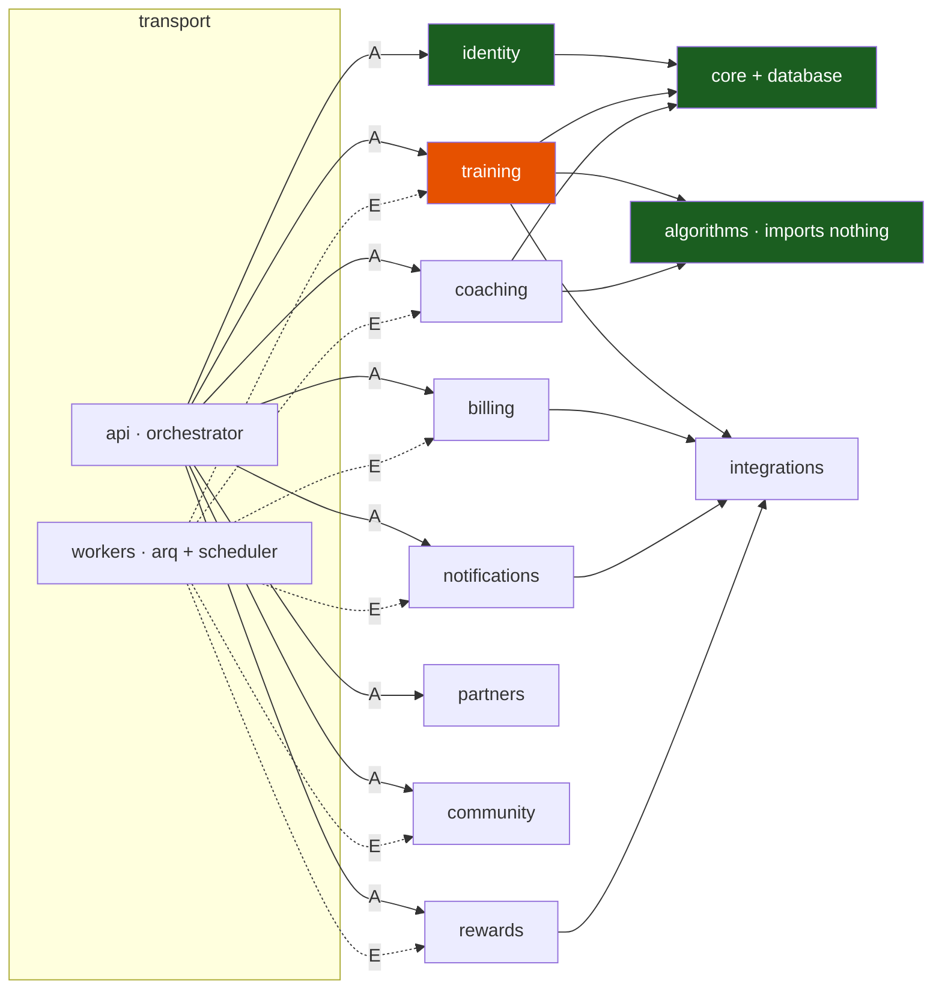

# 21 — Module Contracts

**Status:** awaiting review · **Owner:** platform · **Supersedes:** nothing

The consolidated, uniform reference for every module. `docs/01` §3 defines the
decomposition, `docs/02` §2 the tables, `docs/03` the endpoint surface; each topic
doc covers the modules it touches. **This document covers all of them, in the same
seven headings, so nothing falls between two docs.** It is the index a new engineer
reads to learn who owns what.

Every section: **Purpose · Responsibilities · Database changes · APIs required ·
Dependencies · Security considerations · Testing strategy.**

Legend: **BUILT** (Phase 1 complete) · **PARTIAL** (Phase-1 slice only) ·
**PLANNED (Phase N)** per `docs/07`. Every schema change named here is deferred:
it becomes a reviewed SQL file **sequenced in `docs/19` (Database Evolution)** and
is applied by a human, never by the app, CI, or the deploy pipeline (ADR-012).
This document assigns no migration numbers and contains no code.

| # | Module | Schema | Status | First phase |
|---|---|---|---|---|
| 1 | `identity` | `identity` | BUILT | 1 |
| 2 | `training` | `training` + `analytics` | PARTIAL | 1 |
| 3 | `coaching` | `coaching` (+ `analytics` governance) | PLANNED | 1 wk 7–8 |
| 4 | `billing` | `billing` | PLANNED | 2 |
| 5 | `rewards` | `rewards` | PLANNED | 4 |
| 6 | `partners` | `partners` | PLANNED | 4 |
| 7 | `community` | `community` | PLANNED | 4 |
| 8 | `notifications` | `notifications` | PLANNED | 2 |
| 9 | `algorithms` | — none | BUILT (209 tests) | 0 |
| 10 | `integrations` | — none | PLANNED | 1 wk 3–4 |
| 11 | `api` | — none | PARTIAL | 1 |
| 12 | `workers` | — none | PLANNED | 1 wk 3 |
| 13 | `core` + `database` | `app` (helpers only) | BUILT | 0 |

---

## 1. `identity` — BUILT

### Purpose
Answers "who is this, may they be here, and what have they agreed to". It is the
root of both tenancy axes (`user_id`, `org_id`) and the home of the append-only
audit trail. It is deliberately **not** the source of truth for what a user may
*access commercially* (that is `billing.entitlements`) and holds no physiology.

### Responsibilities
Owns: credentials (Argon2id); refresh-token families with rotation and reuse
detection (a reused token revokes the family); sessions; RBAC roles (`athlete`,
`coach`, `partner`, `admin`, `support`); organisations and memberships; versioned
consents; `data_access_grants` — the *only* mechanism by which one person reads
another's health data; `audit_events`.

Not this module's job: entitlements and tier → `billing`; thresholds and goals →
`training`; device tokens and quiet hours → `notifications`; trust/fraud score →
`rewards`.

### Database changes
Owns `identity`: `organizations`, `users` (`email` is `CITEXT UNIQUE`),
`org_memberships`, `refresh_tokens` (SHA-256 hash + `family_id`),
`mfa_credentials`, `consents`, `data_access_grants`, `audit_events`.
**Append-only:** `consents` and `audit_events` — both a `forbid_mutation()`
trigger *and* `REVOKE UPDATE, DELETE` from `app_rw`. **RLS:** `users_self`,
`refresh_tokens_self`, `mfa_self`, `consents_self`; three grant policies
(`grants_visible` read, `grants_managed_by_grantor` insert,
`grants_revoked_by_grantor` update — a grantee can never create or extend a
grant); `org_memberships_visible`. `organizations` and `audit_events` are
deliberately not athlete-RLS'd: one is a directory, the other is written by the
app and read only through `app_ro` admin tooling.
Pre-auth lookups run through `SECURITY DEFINER` functions
(`identity.lookup_user_for_authentication`, `identity.lookup_refresh_token`,
`identity.revoke_token_family`) because at login time there is no principal for
RLS to key on.
Phase 2+ additions, each **sequenced in `docs/19`**: activate `mfa_credentials`
(encrypted TOTP secret + `key_id`); password-reset and email-verification token
tables; erasure/export request state to back `GET /v1/me/deletion` and
`GET /v1/me/export/{job_id}`.

### APIs required
BUILT: `POST /v1/auth/register|login|refresh|logout|logout-all`,
`GET /v1/auth/sessions`, `GET|PATCH /v1/me`, `GET /v1/me/consents`,
`PUT /v1/me/consents/{purpose}`.
PLANNED (Phase 2): `DELETE /v1/auth/sessions/{id}`,
`POST /v1/auth/password/forgot|reset`, `POST /v1/auth/email/verify`,
`POST /v1/auth/mfa/enroll|verify`, `POST /v1/me/export`,
`GET /v1/me/export/{job_id}`, `DELETE /v1/me`, `GET /v1/me/deletion`.
PLANNED (Phase 4): `GET|POST /v1/me/data-access`,
`DELETE /v1/me/data-access/{id}`, `GET /v1/coach-portal/athletes`,
`GET /v1/admin/users`.

### Dependencies
None on any other module — it is the source node of the graph, by design.
`core.security`, `core.context`, `core.ids`, `core.errors`, `database.session`.
No `integrations`, no external provider. Phase 2 verification email is a queued
`notify` event, not a call. **Independence contract:** trivially satisfied — the
only module for which that is free.

### Security considerations
OWASP A01 (RBAC + grants with mandatory expiry), A07 (rotation, reuse detection,
lockout, enumeration resistance — `/password/forgot` always `202`), A02 (Argon2id,
hashed refresh tokens, ES256 with an explicit algorithm allowlist), A09 (the audit
trail itself). Rate class `auth`: 5/min/IP **and** 10/hour/account, counted on
failures, so neither a distributed nor a single-IP attack slips through. Never log
email or name — `user_id` only. **Never an RLS exemption for admin or support.**
Must write `audit_events` for: grant issue and revoke, role change, admin action,
entitlement or wallet change reported by another module. Fraud surface:
credential stuffing, account enumeration, grant-scope escalation.

### Testing strategy
Unit: refresh rotation revokes the whole family on reuse; the JWT verifier rejects
`alg: none` and an HS256 confusion attempt; Argon2 parameters are the configured
ones. Integration: `tests/integration/test_auth.py`,
`tests/integration/test_consents.py`. Isolation matrix:
`test_me_returns_only_the_caller` is built; each new route above needs its own row
or the build fails. Grant lifecycle (`docs/09` §3.3) is a security-marked test.
No money paths, no AI paths.

---

## 2. `training` — PARTIAL

### Purpose
The athlete's factual record and the materialised output of the analytics engine.
It stores what happened and what was computed; it does **not** compute
(`algorithms` does) and does **not** decide what to train (`coaching` does).

### Responsibilities
Owns: profile and thresholds; goals; personal bests; provider connections with
column-encrypted OAuth tokens; raw inbound `provider_events`; activities, laps and
stream pointers; `daily_wellness`; the materialised `daily_metrics` row the
dashboard reads; `data_quality_flags`; zone derivation.

Not this module's job: speaking a provider's wire protocol → `integrations`; plan
generation and adaptation → `coaching`; the push for a new PB →
`notifications`; the reward for a workout → `rewards`; the entitlement that
unlocks an advanced analyzer → `billing`.

### Database changes
Owns `training`: `athlete_profiles`, `athlete_goals`, `personal_bests`,
`provider_connections`, `provider_events`, `activities`, `provider_activity_map`,
`activity_laps`, `activity_streams`, `daily_wellness`. Also owns
`analytics.daily_metrics` and `analytics.data_quality_flags` (created in 0004 in
the `analytics` schema — see §15, item 1).
**RLS:** `activities`, `daily_wellness` and `daily_metrics` carry an owner policy
plus a `granted_read` `SELECT` policy driven by `app.has_grant()`; every other
table is owner-only via the 0009 loop. A coach can never *write* through a grant.
**Immutable:** `provider_events` has `provider_events_no_delete`; `UPDATE` is
permitted only to stamp `processed_at`, so a parser bug stays replayable.
**Partition-ready, not partitioned:** `activities.start_time` is the monotonic
key and there is deliberately no business `UNIQUE` excluding it — ingest
idempotency lives in the small, unpartitioned `provider_activity_map`. Executing
the partitioning migration is roadmap 5.5.
Phase 2+ additions, each **sequenced in `docs/19`**: an injury/pain report table
(roadmap 3.4 — labels precede models, so this ships before 3.5); gated advanced
analyzer outputs (2.5); a downsampled series store so phones do not fetch 3-hour
raw streams (`docs/03` §13 open question 2).

### APIs required
BUILT: `GET|PUT /v1/me/profile` (`If-Match` required), `GET /v1/me/zones`
(returns the **anchor** used), `GET|POST /v1/me/goals`,
`PATCH|DELETE /v1/me/goals/{id}`, `GET|POST /v1/me/personal-bests`.
PLANNED (Phase 1 wk 3–6): `GET /v1/integrations`,
`POST /v1/integrations/{provider}/authorize|callback|sync|backfill`,
`DELETE /v1/integrations/{provider}`, `GET /v1/integrations/jobs/{job_id}`;
`POST /v1/webhooks/garmin/dailies|activities|deregistration`;
`GET|POST /v1/activities`, `GET|PATCH|DELETE /v1/activities/{id}`,
`GET /v1/activities/{id}/streams|laps|efficiency`; `GET /v1/metrics/readiness/today`,
`/v1/metrics/readiness`, `/training-load`, `/acwr`, `/injury-risk`, `/efficiency`,
`/predictions`, `/summary`. PLANNED (Phase 4): `GET /v1/admin/data-quality/review`.

### Dependencies
`algorithms` — directly imported, permitted by the `layers` contract, for load,
zones, readiness, ACWR, efficiency, prediction and `injury_risk`.
`integrations` — the Garmin adapter first; `apple_health`, `coros`, `polar`,
`suunto` at 5.2. External: Garmin Health + Activity API; object storage for
sample streams. `core.ids`, `core.etag`, `core.errors`, `database.session`.
**Independence contract:** it needs `identity` (does the principal hold
`health_data_processing` consent?) and `billing` (is this analyzer unlocked?) but
may not import either. Satisfied by (a) the `api` router resolving the principal
and the entitlement in dependencies and passing the result in, and (b) publishing
`events.py` domain events onto the queue — `activity.ingested` →
`analytics.recompute` → `coaching.refresh_twin` — rather than calling downstream.

### Security considerations
OWASP A01 (IDOR is structurally impossible: every read is RLS-filtered by owner),
A03 (bound parameters only; no generic query DSL), A08 (raw payload persisted
before parsing; `signature_verified` recorded), A10 (**this module's headline** —
provider endpoints are a fixed allowlist, no user-supplied URL is ever fetched
server-side, and the object-storage client cannot be repointed), A02 (AES-256-GCM
envelope encryption on provider tokens with `key_id` stored for rotation).
Webhook contract: verify signature → persist raw → enqueue → `200` in <100 ms; an
unverified signature is persisted and **never acted upon**. Never log HRV, heart
rate, weight or any other health value. Every grant-scoped read of `activities`,
`daily_metrics` or `daily_wellness` writes an `identity.audit_events` row with
actor, subject, scope and request id. Fraud surface: workout spoofing —
`data_quality_flags` feeds the trust score that gates `rewards` (sequencing rule
1: data quality precedes rewards).

### Testing strategy
Unit: normalisation and unit conversion per provider; `local_date` assignment for
a 23:30 session. Integration: `tests/integration/test_profile_and_training.py`
(built); provider contract tests replay recorded payloads through the adapter
(`docs/09` §4). Isolation matrix: goal and personal-best rows are built; **each
of `/v1/activities*` and `/v1/metrics/*` needs its own row or the build fails**,
asserting cross-tenant reads come back empty and cross-tenant writes `404` — never
`403`, which would confirm the resource exists. New analyzer → anchor case,
undefined case (returns `None`), and one hand-computed value. Webhook latency
asserted <100 ms. No money paths.

---

## 3. `coaching` — PLANNED (Phase 1 wk 7–8; deepened Phase 3)

### Purpose
Turns stored derived metrics into decisions and language. Owns the Athlete Context
Packet, the router, the model call, plans, adaptations and the digital twin. It
does **not** compute analytics and does **not** own the quota entitlement it
enforces.

### Responsibilities
Owns: deterministic context-packet assembly (age *band*, no name/email/GPS/raw
streams, sorted keys and fixed field order so prompt caching actually hits);
routing (`deterministic` | `llm_chat` | `tool_loop` | `llm_deep_review`) — the
primary cost control, answering ~40% of questions at **zero** model cost;
read-only server-scoped tools (`get_activity_detail`, `get_metric_series`,
`compare_efforts`, `get_plan_week`, `get_personal_bests`); plan generation and
persisted daily adaptation decisions; twin snapshots over time; per-message
provider, `model_id`, `prompt_version`, tokens and micro-USD cost; feedback;
usage counters.

Not this module's job: the mathematics → `algorithms`; the tier limit itself →
`billing`; delivering the weekly review → `notifications`; the metrics it reads →
`training`.

### Database changes
Owns `coaching`: `athlete_twin_snapshots`, `ai_conversations`, `ai_messages`,
`ai_message_feedback`, `ai_usage_counters`, `training_plans`, `plan_sessions`,
`plan_adaptations`. Co-owns the governance tables in `analytics`:
`algorithm_versions`, `prediction_records` (**append-only** —
`prediction_records_append_only` + `REVOKE UPDATE, DELETE`),
`prediction_outcomes`, `experiment_assignments`, `eval_runs`.
**RLS:** owner-only on all eight via the 0009 loop, plus `granted_read` on
`training_plans` and `plan_sessions` for the `plans` grant scope. Grant scopes
available: `activities`, `metrics`, `wellness`, `plans`, `goals`,
`conversations`.
Phase 2+ additions, each **sequenced in `docs/19`**: Batch-API job tracking for
the overnight weekly review (2.6); a prompt-version registry; `pgvector` for
semantic search over past conversations is explicitly *not* MVP (`docs/02` §8).

### APIs required
PLANNED (Phase 1): `GET|POST /v1/coach/conversations`,
`GET /v1/coach/conversations/{id}/messages`,
`POST /v1/coach/conversations/{id}/messages` (SSE `text/event-stream`,
`Idempotency-Key` **required**), `POST /v1/coach/messages/{id}/feedback`,
`GET /v1/coach/quota`, `GET /v1/coach/twin`; `GET /v1/plans/current|today`,
`POST /v1/plans`, `GET /v1/plans/{id}`, `POST /v1/plans/{id}/activate`,
`POST /v1/plans/sessions/{id}/complete|skip`, `GET /v1/plans/{id}/compliance`,
`GET /v1/plans/adaptations`. PLANNED (Phase 2): `GET /v1/coach/weekly-review`.
PLANNED (Phase 3): `GET /v1/admin/algorithms`,
`POST /v1/admin/algorithms/{name}/activate`.

### Dependencies
`algorithms` for plan generation, daily adaptation and readiness. `training`'s
derived metrics — **never a direct import**; the `api` router reads the metric
projection and hands it to the packet builder, and the write path arrives as the
queued `coaching.refresh_twin` event. `billing` for the quota tier — resolved in
an `api` dependency. External: Anthropic, default `claude-opus-5` — adaptive
thinking is on and thinking tokens bill as **output** (size `max_tokens`
accordingly), depth is `output_config.effort` and `budget_tokens` is rejected,
`temperature`/`top_p` are rejected, `stop_reason` is checked **before** reading
content, prompt-cache minimum is 512 tokens. **Recommendation for review:** the
`LLMProvider` implementation should live at `integrations/llm/` so the Anthropic
SDK never enters `modules/`; `docs/05` §7 defines the protocol but not its home.

### Security considerations
OWASP A01 — the load-bearing property is that tools **take no user-id parameter**
and execute under the caller's identity, so even a fully successful prompt
injection has no argument through which to reach another athlete; every tool
result is additionally RLS-filtered. A03 — injection delimiting plus a malicious
corpus test. A09 — every `ai_messages` row carries full cost and provenance,
without which cost control and the eval harness are both impossible. PII: the
model never receives raw data and never computes; the packet carries derived
metrics only. Never log packet contents. A coach reading the `conversations`
scope writes an audit event. Abuse surface: cost. The `ai` rate class is Free
5/month, Premium 100/month plus a 10/min burst; exhaustion returns `429` with
`Retry-After` and a quota `code` — the request **never silently degrades to a
cheaper model** without telling the client which model answered.

### Testing strategy
Unit: router classification; packet determinism — identical inputs must produce a
byte-identical packet or prompt caching never hits; `stop_reason` handled before
content is read. Integration: the SSE contract including `citation` events, so
every number is traceable to a metric and a day. AI evals: 40 golden
`(context_packet, question, assertions)` cases under the `ai_eval` marker,
nightly not per-commit — grounding (every number present in the packet), safety
(medical red flags), and refusal below `data_quality` 0.35. Prompt-injection
corpus (`docs/09` §3.7) must produce no cross-tenant tool call and no instruction
leak. Isolation matrix: one row per `/v1/coach/*` and `/v1/plans/*` route. Any new
twin parameter fit is an algorithm → anchor, undefined and one hand-computed
value. Money-adjacent: cost accounting gets a property test — micro-USD is integer,
never negative, and always recorded.

---

## 4. `billing` — PLANNED (Phase 2)

### Purpose
The authoritative answer to "what may this user access right now", mirrored from
the store provider and reconciled nightly. It is **not** the rewards wallet, and
**no card data ever touches our servers** — provider-hosted flows only, which
keeps us out of PCI-DSS scope by construction.

### Responsibilities
Owns: the plan catalogue; subscription state mirroring the provider; settled
payments; raw provider webhooks with their verification verdict; entitlement
resolution and its cache invalidation; server-side receipt validation; nightly
reconciliation against each provider.

Not this module's job: the wallet ledger → `rewards`; partner commission →
`partners`; the paywall copy → clients.

### Database changes
Owns `billing`: `subscription_plans`, `subscriptions`, `payments`,
`payment_webhook_events`, `entitlements`. **RLS:** owner-only on
`subscriptions`, `payments`, `entitlements`; `subscription_plans` is intentionally
global with no RLS (a catalogue), and `payment_webhook_events` is system-owned
with `payment_webhook_no_delete`. Replay protection is
`UNIQUE (provider, provider_event_id)` on webhooks and
`UNIQUE (provider, provider_transaction_id)` on payments. Money is `BIGINT` minor
units plus a currency column, never a float.
Phase 2+ additions, **sequenced in `docs/19`**: a shared 24-hour
`Idempotency-Key` store (needed by `billing`, `rewards` and `coaching` alike, so
it should be created once); a reconciliation-run report table.

### APIs required
PLANNED (Phase 2): `GET /v1/subscription`, `GET /v1/subscription/plans`,
`POST /v1/subscription/receipts/apple`, `POST /v1/subscription/receipts/google`,
`POST /v1/subscription/paypal/agreement`, `POST /v1/subscription/cancel`,
`GET /v1/entitlements`; webhooks `POST /v1/webhooks/apple-iap|google-play|paypal`.
PLANNED (Phase 4): `GET /v1/admin/subscriptions`, `GET /v1/admin/revenue`.

### Dependencies
`integrations` adapters for the Apple App Store Server API, the Google Play
Developer API and PayPal. External: those three. `core.errors`,
`database.session`, and Redis `ent:{user_id}` with a **5-minute** TTL — nothing
user-authorising is cached longer, so a cancellation loses access promptly.
**Independence contract:** it publishes `billing.entitlement_changed` onto the
queue; `coaching` (quota reset) and `notifications` (renewal notice) consume it.
It never imports them, and it never imports `identity` — the `api` layer resolves
the principal.

### Security considerations
OWASP A08 is the headline: signed webhooks and server-side receipt validation. Two
absolutes — **never trust a client entitlement claim** (a client-supplied "I am
premium" is the single most common IAP bypass), and **never act on an unverified
webhook** (persist with `signature_verified = false` and never mutate
entitlement). A01 on the admin revenue routes; A04 (the mirror-and-reconcile
design, rather than treating our row as truth); A09 (alert on any unverified
webhook, and audit every entitlement change into `identity.audit_events`). Fraud
surface: receipt replay across accounts, sandbox receipts presented in
production, refund abuse, family-sharing abuse.

### Testing strategy
Unit: an entitlement resolution truth table per tier and per individually
unlocked sensor. Integration: receipt validation against recorded store payloads.
Security suite, per provider: **an invalid signature never mutates entitlement**
(`docs/09` §3.5) — asserted separately for each, since each has a different
signing scheme and each is a free-subscription vulnerability if wrong. Money
property tests: minor-unit arithmetic never becomes a float; currencies are never
mixed in one sum; a replay of a receipt `POST` with the same `Idempotency-Key`
changes nothing and returns the original response. Isolation matrix: a row per
subscription and entitlement route. Webhook handlers asserted <100 ms.

---

## 5. `rewards` — PLANNED (Phase 4)

### Purpose
An auditable, append-only double-entry ledger for earned value. There is **no
mutable balance column anywhere** — balance is `SUM(credits) - SUM(debits)`,
derived, never stored as truth. It is not subscription entitlement (`billing`) and
not the partner's commercial record (`partners`).

### Responsibilities
Owns: wallets (holding no balance); transactions that must each sum to zero;
immutable ledger entries recording the `reward_policy_version` that applied;
versioned reward policies (the split percentages must be changeable, so
versioning them means a change never rewrites history); deduplicated earn events
(one workout cannot be claimed twice); redemptions; payouts with an
`eligibility_snapshot` and an explicit human decision record; fraud signals.

Not this module's job: subscription state → `billing`; commission owed to a
partner → `partners`; the trust-score inputs → `training`'s
`data_quality_flags`; telling the athlete → `notifications`.

### Database changes
Owns `rewards`: `reward_policies`, `wallets`, `wallet_transactions`,
`wallet_ledger_entries`, `reward_events`, `redemptions`, `payouts`,
`fraud_signals`. Accounts: `earned`, `promotional`, `redeemable`, `withdrawable`,
`spent`, `expired`, `reversed`, `house`. **Immutable:**
`wallet_ledger_entries` has both `wallet_ledger_append_only` and
`REVOKE UPDATE, DELETE` from `app_rw` — a reversal is a new mirrored transaction,
never an update. **RLS:** owner-only on the six athlete-scoped tables;
`reward_policies` is intentionally global.
Phase 4+ additions, each **sequenced in `docs/19`**: the
`wallet_unbalanced_transactions` view that `docs/09` §3.6 asserts stays empty; a
periodic balance-snapshot row to bound the ledger scan (`docs/02` §3);
multi-currency remains an open question (`docs/02` §8) and ILS-only removes an FX
problem from Phase 4.

### APIs required
PLANNED (Phase 4): `GET /v1/wallet`, `GET /v1/wallet/transactions?cursor=`,
`GET /v1/wallet/rewards`, `POST /v1/wallet/payouts` (`Idempotency-Key`
**required**), `GET /v1/wallet/payouts`;
`POST /v1/partners/offers/{id}/redeem` (`Idempotency-Key`) is a shared surface
whose ledger half is owned here. Admin: `GET /v1/admin/payouts/queue`,
`POST /v1/admin/payouts/{id}/decide`, `GET /v1/admin/fraud/signals`.

### Dependencies
`training`'s trust/data-quality signal (sequencing rule 1) and `partners`' offer
inventory — both via `api` orchestration or a queued event, never a direct import.
`integrations` for PayPal Payouts. External: PayPal. `core.ids` — UUIDv7 keeps
ledger entries time-ordered, which is what makes the balance scan cheap. The
`payout` queue runs at low concurrency and is **never auto-retried on an
ambiguous failure**: a duplicated payout is worse than a delayed one, so an
ambiguous result parks in manual review and requires an operator decision.

### Security considerations
The highest-value abuse surface in the product. Payout eligibility (KYC state,
minimum balance, account age, fraud score, cooling-off period) is a gate that
produces an auditable decision record; execution is single-attempt against a
provider-held idempotency key. OWASP A04 (the append-only design is the control),
A01, A08, A09 (every wallet change and payout decision is audited). Fraud surface:
workout spoofing (gated on trust score), self-referral rings, redemption
double-spend, and a negative-`withdrawable` race. Legal gate: roadmap 4.8 —
points-to-cash conversion needs counsel sign-off in Israel before it is enabled,
and the ledger is deliberately designed so partner-credit-only can ship first.

### Testing strategy
**Property tests first, before any earning rule** (`docs/09` §3.6): over random
sequences of earn / redeem / reverse / payout, every transaction's entries sum to
zero; no sequence produces a negative `withdrawable`; replaying any operation with
the same idempotency key changes nothing; `wallet_unbalanced_transactions` stays
empty. Property-based rather than example-based, because the bug will be in the
sequence nobody thought to write down. Nightly trial balance in production. Unit:
policy-version selection and the 50/50 split worked example from `docs/02` §6.
Isolation matrix: a row per wallet and payout route, plus an explicit assertion
that athlete B can neither read A's ledger nor request a payout against A's
wallet. Every route here is a new money path, so every route brings a property
test.

---

## 6. `partners` — PLANNED (Phase 4)

### Purpose
The commercial counterparty side of rewards: who accepts redemptions, what they
are owed, and what they are allowed to see. Its defining property is a negative
one — **no partner surface may ever reach athlete health data.**

### Responsibilities
Owns: partner accounts with status and `commission_rate` in basis points; offers
with validity windows and inventory; attributed conversions with gross and
commission amounts; aggregate reporting.

Not this module's job: the athlete's wallet and the redemption's ledger entry →
`rewards`; subscription revenue → `billing`; the athlete's identity → `identity`.

### Database changes
Owns `partners`: `partners`, `partner_offers`, `partner_conversions`.
**RLS:** `partners` is intentionally global (a directory readable by authenticated
athletes); `partner_offers` and `partner_conversions` are partner-scoped, keyed on
the partner principal rather than `app.current_user_id()`. Commission money is
`BIGINT` minor units plus currency.
Phase 5 additions, **sequenced in `docs/19`**: the marketplace tables
`coach_profiles`, `plan_products`, `plan_purchases`. Note a documentation
discrepancy — `docs/02` §2 lists them as "schema only" and roadmap 5.1 says
"schema already exists", but **they are not present in migrations 0002–0008**;
they must actually be created.

### APIs required
PLANNED (Phase 4): `GET /v1/partners`, `GET /v1/partners/{slug}/offers`,
`POST /v1/partners/offers/{id}/redeem` (`Idempotency-Key`; the ledger half is
`rewards`'). Partner portal: `GET /v1/partner-portal/offers`,
`POST /v1/partner-portal/conversions`, `GET /v1/partner-portal/reports`.
PLANNED (Phase 5): a separate `/partner/v1` OAuth2 client-credentials surface —
deliberately not the athlete API with a different token.

### Dependencies
`rewards` for the redemption's ledger transaction and for commission accrual —
via `api` orchestration on the request path and a queued
`partner.conversion_recorded` event on the accounting path. `identity` for the
`partner` role. No `integrations` and no external provider in Phase 4.

### Security considerations
A partner is a **hostile-by-default tenant**, which makes OWASP A01 the dominant
risk. The control is structural, not procedural: partner routes are mounted on a
router that has no dependency capable of resolving a health resource, and that is
tested explicitly (`docs/03` §10). The partner surface returns aggregate and
conversion data only. Conversion rows carry a pseudonymous athlete reference —
never a name, email or health value. A04 (basis-point commission stored as
integers so rounding is explicit); A09 (commission adjustments audited). Fraud
surface: inflated or fabricated conversions, offer-inventory overdraw,
self-dealing between a partner and an athlete account.

### Testing strategy
A dedicated **negative-surface test**: enumerate every route mounted on the
partner router and assert none of them resolves a health dependency — this is the
test that must fail loudly if someone adds a convenient shortcut. Isolation matrix
rows: partner A cannot read partner B's conversions, and a partner token reaches
neither `/v1/activities` nor `/v1/metrics/*`. Money property test on commission:
basis points applied to minor units, with rounding that neither creates nor
destroys value across a batch. Unit: attribution-window logic and inventory
decrement under concurrency.

---

## 7. `community` — PLANNED (Phase 4)

### Purpose
Group context and social motivation, with sharing that is opt-in per item. It is
not a general social network, and it must not become a second path to health data.

### Responsibilities
Owns: groups and memberships (roles, `left_at`); challenges and participant
progress; achievements linked to the activity that earned them; `activity_shares`
recording what an athlete chose to share and with whom.

Not this module's job: the activity itself → `training`; the prize → `rewards`;
the leaderboard push → `notifications`; sponsorship money → `partners`.

### Database changes
Owns `community`: `groups`, `group_members`, `challenges`,
`challenge_participants`, `achievements`, `activity_shares`.
**RLS:** this is the one module where a policy is not a single-column predicate —
`groups_visible` / `groups_owner_write`, `group_members_visible` /
`group_members_self_write`, and `challenges_visible` derived from membership;
`achievements`, `challenge_participants` and `activity_shares` are owner-only.
Phase 4+ additions, each **sequenced in `docs/19`**: a sponsored-challenge link to
`partner_offers`; a materialised leaderboard so a group read is not an aggregate
scan (served alongside the `feed:{group_id}:page1` 60-second cache).

### APIs required
PLANNED (Phase 4): `GET|POST /v1/groups`, `GET|POST /v1/groups/{id}/members`,
`GET|POST /v1/challenges`, `POST /v1/challenges/{id}/join`,
`GET /v1/challenges/{id}/leaderboard`, `GET /v1/achievements`,
`POST /v1/activities/{id}/share`.

### Dependencies
`training` for the shared activity's projected fields and for challenge progress —
via `api` orchestration on read and the queued `activity.ingested` event on
write. Group challenges are the **one** cross-athlete aggregation in the domain
and they aggregate asynchronously by design (`docs/01` §9), so there is no
cross-athlete transaction anywhere — which is what keeps the future shard by
`user_id` viable. `rewards` for prizes and `notifications` for leaderboard
changes, both via queued events.

### Security considerations
This is the module where an over-permissive policy leaks health data socially,
making OWASP A01 the dominant risk and the membership-derived policies the hardest
thing here to get right. The invariant: **a share grants read on the projected
fields the athlete chose, never on the underlying activity row.** A04 (sharing is
per item and explicit, never a global "public profile" flag); A09. Fraud surface:
fabricated activities inflating a leaderboard (gated on the trust score from
`training`), and sock-puppet group members.

### Testing strategy
Isolation matrix rows for every group and challenge route, plus two specific
tests that the generic matrix will not catch: a non-member sees neither the
challenge nor its leaderboard; and sharing activity X does **not** make activity X
itself readable to the recipient. Unit: progress aggregation, tie-breaking, and
deterministic leaderboard ordering — no randomness in fixtures. If prizes are
ledger-backed, their property tests belong to `rewards`.

---

## 8. `notifications` — PLANNED (Phase 2)

### Purpose
Deliver a small number of high-value messages at a time the athlete tolerates. It
does not decide what a message *says* — `training` and `coaching` own content —
and it does not own marketing consent, which is `identity.consents`.

### Responsibilities
Owns: device tokens per device; per-kind, per-channel preferences and quiet hours;
the delivery log with its provider reference; fan-out on the `notify` queue; and
enforcement of preference and quiet hours **at send time**, not at enqueue time.

Not this module's job: the readiness number → `training`; the narrative →
`coaching`; the marketing lawful basis → `identity`; gating a premium
notification → `billing`.

### Database changes
Owns `notifications`: `device_tokens`, `notification_preferences`,
`notification_deliveries`. **RLS:** owner-only on all three via the 0009 loop.
`notification_deliveries.created_at` is the partition-ready time column
(`docs/02` §4).
Phase 2+ additions, each **sequenced in `docs/19`**: a notification-kind and
template registry with locale (Hebrew first); a suppression/bounce list so a hard
bounce is not retried forever; scheduled-digest state.

### APIs required
PLANNED (Phase 2): `GET|PUT /v1/me/notification-preferences` (a mutable resource,
so `ETag` + `If-Match` per `docs/03` §1); `POST /v1/me/devices`,
`DELETE /v1/me/devices/{id}`.
**Gap flagged:** `docs/03` does not currently enumerate any notification path.
These are the delta this document proposes, and `docs/03` should be amended to
carry them rather than leaving the module's surface implicit.

### Dependencies
`integrations` adapters for APNs, FCM and an email provider. External: those
three. It consumes queued events from nearly every module —
`metrics.recomputed`, `billing.entitlement_changed`,
`coaching.weekly_review_ready`, `community.leaderboard_changed`,
`rewards.payout_decided` — and calls almost nothing. That asymmetry (many inbound
events, no outbound dependencies, trivially stateless) is exactly why `docs/01`
§3 names it the easiest early extraction.

### Security considerations
The rule that shapes the module: **never put a health value or a name in a push
payload.** The payload renders on a lock screen and traverses APNs/FCM, so we send
a title and a deep link and let the app fetch the number over an authenticated
request. That is why `notification_deliveries` stores a reference, not a body.
Quiet hours are computed from the athlete's timezone and `local_date`, never UTC —
a 22:00 quiet hour in Israel is not a UTC hour. OWASP A02 (a device token is a
credential; treat it as a secret and never log it), A01, A09 (preference changes
audited). Abuse surface: token harvesting, notification spam as a griefing vector,
and unsubscribes that must be honoured within one send cycle.

### Testing strategy
Unit: quiet-hour boundary arithmetic across a DST transition and across
timezones; preference precedence; per-kind opt-out. Integration: a digest is
delivered exactly once per `(user, kind, local_date)` even when the job runs
twice. Security: a payload assertion that the serialised push body contains no
numeric health field and no email or name — a structural test, not a review
comment. Isolation matrix rows for the device and preference routes. No money
paths.

---

## 9. `algorithms` — BUILT (209 tests, zero dependencies)

### Purpose
The deterministic analytics engine and the product's core IP. Pure functions, no
I/O, no state. It is deliberately **not** a service and is deliberately unaware
that a database exists — which is why it could be completely verified before any
infrastructure existed.

### Responsibilities
Owns: Banister CTL/ATL/TSB; Coggan TSS/NP/IF; ACWR; Foster monotony and strain;
load normalisation such that 1 h @ threshold = 100 across power, HR, pace and RPE;
readiness with ordered drivers and Plews smallest-worthwhile-change HRV gating;
efficiency including aerobic decoupling; `injury_risk` (heuristic-v0 logistic,
`is_clinically_validated = false`, with an `extract_features` / `predict` seam for
a future model); performance prediction (per-athlete Riegel exponent, Critical
Speed/Power); plan generation and daily adaptation; zones (Friel, Coggan,
Daniels).

Not its job: persistence, caching, entitlement, HTTP, the LLM, or deciding *when*
to recompute — all of that belongs to callers.

### Database changes
**None. It owns no schema and never touches Postgres.** Its inputs are plain
dataclasses (`AthleteProfile`, `DailyWellness`) that mirror table shapes; a CI
drift check compares the two.

### APIs required
None of its own. It is reached only through `/v1/me/zones` (BUILT),
`/v1/metrics/*`, `/v1/plans/*` and `/v1/coach/*`.

### Dependencies
**Nothing.** Standard library only. The `forbidden` contract in `pyproject.toml`
names `backend.api`, `backend.modules`, `backend.integrations`,
`backend.workers`, `backend.database` and `backend.core` explicitly, and
`make check-no-deps` additionally asserts the package imports with no third-party
package installed. An import of `numpy` or `sqlalchemy` here fails CI.

### Security considerations
No direct surface, but two safety properties are load-bearing across the product.
(1) **Missing data is `None`, never `0`** — a function that cannot compute a
meaningful answer returns `None` rather than a plausible fake, and callers must
translate that into `422 readiness_insufficient_data` below `data_quality` 0.35
rather than a confident-looking score. (2) **Every composite score returns its
drivers**, so no endpoint can return a bare number. `injury_risk` stays labelled
unvalidated until a trained model beats `heuristic-v0` on held-out data — labels
precede models (roadmap 3.4 before 3.5).

### Testing strategy
The cheapest loop in the repository:
`python3 -m unittest discover -s tests -t .` — ~32 ms, **zero dependencies**, and
it must stay that way. Per `CLAUDE.md`, every new algorithm brings three tests:
the anchor case, the undefined case (returns `None`), and one hand-computed value
with its source named. No randomness in fixtures — a flaky physiology test is
worse than no test. `mypy --strict` on the package; coverage gated at 90%.

---

## 10. `integrations` — PLANNED (Phase 1 wk 3–4)

### Purpose
Everything that speaks a third party's wire protocol, behind our own interface, so
that no module ever imports a vendor SDK and swapping a provider is a new file
rather than a refactor.

### Responsibilities
Owns: a `ProviderAdapter` protocol and its implementations (Garmin first;
`apple_health`, `coros`, `polar`, `suunto` at 5.2); OAuth authorize / callback /
refresh / revoke; webhook signature verification; payload → normalised DTO mapping
with unit conversion and timezone handling; retry with exponential backoff and
jitter, and per-provider rate limiting; a **mock adapter driven by recorded
payloads** so development is not blocked on Garmin Developer Program approval.
Store and payment adapters (Apple App Store Server API, Google Play Developer
API, PayPal including Payouts) and push adapters (APNs, FCM) live here too, as
should the `LLMProvider` implementation (see §3).

Not its job: deciding what to do with a payload, or persisting it — both belong to
the owning module; retry policy for *our* jobs → `workers`.

### Database changes
**None — it owns no schema and no table.** It returns DTOs. Token *storage* is
`training.provider_connections`, owned by `training`.

### APIs required
None of its own. It sits behind `/v1/integrations/*` and `/v1/webhooks/*`, both
owned by the module whose data arrives.

### Dependencies
It is the lowest optional layer above `algorithms` in the `layers` contract
(`(backend.integrations)`), so it may import `core` but **must not import
`modules`** — a provider adapter reaching into a module is precisely the coupling
this layer exists to prevent. External: Garmin, Apple, Google, PayPal, APNs, FCM,
LLM providers, object storage.

### Security considerations
OWASP A10 is this layer's headline: no user-supplied URL is ever fetched
server-side, provider endpoints are a fixed allowlist, and the object-storage
client cannot be pointed at an arbitrary host. A02: OAuth client secrets come from
config, never the repository; tokens are encrypted on write with the `key_id`
recorded for rotation. A08: signature verification lives here and returns a
**verdict**, but the decision to act on that verdict belongs to the module — an
adapter must never be able to declare a payload trusted on its own authority.
Never log a payload containing health values.

### Testing strategy
Provider contract tests (`docs/09` §4): recorded real payloads with secrets
scrubbed, replayed through the adapter with `respx`, asserting field mapping, unit
conversion, timezone handling, idempotency on redelivery, and graceful handling of
missing optional fields. When Garmin changes a payload the recorded fixture is
updated and the diff shows exactly what changed. Signature-verification tests per
provider, including a tampered body and a replayed event id. No isolation-matrix
rows (it mounts no routes) and no money paths of its own — the receipt *decision*
is `billing`'s.

---

## 11. `api` — PARTIAL

### Purpose
Transport: validate, resolve the principal, call one or more services, serialise.
It holds no business rule and no SQL. Given the `independence` contract (§15), it
is also the **only legitimate place a cross-module workflow is composed
synchronously** — which is why it appears in almost every row of §14's matrix.

### Responsibilities
Owns: the FastAPI app and routers; dependencies for auth, RLS session context,
entitlement, rate-limit class, `Idempotency-Key` and `ETag`/`If-Match`; RFC 9457
error handlers with a stable machine `code`; `X-Request-Id` correlation; cursor
pagination (`{data, next_cursor}` — never offset); OpenAPI 3.1 generation, from
which TS clients are generated in CI and never hand-written; SSE framing for coach
chat. **Cross-module orchestration:** where a request needs two modules — a gated
metric read is a `billing` entitlement check plus a `training` metric fetch — the
router calls both services in order. That is the mechanism that keeps the
independence contract satisfiable without inventing a shared god-service.

Not its job: SQL, business rules, computing anything, or deciding entitlement
*policy* — `billing` owns the policy; `api` only asks.

### Database changes
None. It never imports a `repository` or a `models` module — enforced by the
fourth contract in `pyproject.toml`, which sets `allow_indirect_imports = true`
so that calling a service (which legitimately imports its own repository) stays
legal while `api` writing `import ...repository` itself does not.

### APIs required
It *is* the API surface. BUILT: `/healthz`, `/readyz`, `/v1/auth/*` (register,
login, refresh, logout, logout-all, `GET /sessions`), `GET|PATCH /v1/me`,
`/v1/me/consents`, `/v1/me/profile`, `/v1/me/zones`, `/v1/me/goals`,
`/v1/me/personal-bests`. Everything else in `docs/03` is PLANNED at its module's
phase; `GET /v1/meta` is specified in `docs/03` §12 and not yet built.

### Dependencies
Every module's `service`; `core.context`, `core.errors`, `core.etag`;
`database.session` for the RLS-scoped transaction. It may not reach `algorithms`
for business purposes — if a router needs a computed value, a service computes it.

### Security considerations
Every request-level control lands here, so a missing dependency here is a
vulnerability in a module that is itself correct. Fail-closed ordering:
authenticate → set the RLS session variables → authorise → rate-limit → validate
→ call. **A cross-tenant write returns `404`, never `403`** — a `403` confirms the
resource exists, which is itself a small leak. Security headers (CSP, HSTS,
`X-Content-Type-Options`, `Referrer-Policy`), a strict CORS allowlist, and CSRF
double-submit (`X-CSRF-Token`) for the web refresh cookie. OWASP A01, A03
(Pydantic on every input; explicit named filters only, no generic query DSL),
A05, A07.

### Testing strategy
The tenant-isolation matrix lives here —
`tests/security/test_tenant_isolation.py` alongside
`tests/security/test_rls_enforcement.py`, both under the `security` marker, which
cannot be skipped. **Every new athlete-scoped endpoint gets a row in that matrix
or the build fails** (`docs/07` exit criterion). Contract tests over the generated
OpenAPI: no unsuffixed numeric field, and no money field that is not
`{amount_minor, currency}`. Error-shape tests: every problem response carries a
stable `code` and a `request_id`.

---

## 12. `workers` — PLANNED (Phase 1 wk 3+)

### Purpose
Everything that must not happen inside a request: arq consumers plus a scheduler.
It is also the **asynchronous half of cross-module communication** — the mechanism
by which one module causes work in another without importing it.

### Responsibilities

| Queue | Jobs | Concurrency | Retry |
|---|---|---|---|
| `ingest` | fetch activity, fetch dailies, backfill window, deregistration | high | 5, exp backoff + jitter |
| `analytics` | recompute metrics from date, rebuild baselines | medium | 3, coalesced per athlete |
| `ai` | weekly deep review (Batch API), twin refresh, eval runs | low | 2 |
| `notify` | push, email, digest fan-out | high | 3 |
| `billing` | receipt validation, subscription reconciliation | medium | 5 |
| `payout` | eligibility check, payout execution | low | **manual only** |

Scheduler: nightly recompute; the overnight batch review; nightly subscription
reconciliation; the daily ledger trial balance; the weekly orphaned-record sweep;
prediction scoring at horizon. A dead-letter queue per queue with an admin
surface — a job exhausting retries alerts rather than disappearing.

Not its job: business rules (call a service) or holding state (Postgres and Redis
hold it).

### Database changes
None of its own; it writes through module services.

### APIs required
None inbound. Job status is surfaced by `api` at
`GET /v1/integrations/jobs/{job_id}` (PLANNED).

### Dependencies
`workers → modules` only, and it may not import another module's `repository` any
more than `api` may. It runs under the `SYSTEM_PRINCIPAL` sentinel where there is
no human caller and must call `apply_principal` explicitly before touching
athlete-scoped tables. **Independence contract:** a worker consuming module A's
event and calling module B's service is the sanctioned asynchronous bridge — the
worker imports both, neither module imports the other.

### Security considerations
A worker is the one place code runs without a request principal, so it is the one
place RLS can be accidentally widened. Rules: a job never accepts a `user_id` from
an untrusted payload without re-verifying it against the row it claims to own;
every job is idempotent on a deterministic key (a review requirement, not a
hope); the `payout` queue never auto-retries an ambiguous failure. A worker that
forgets to set a principal reads **zero** rows — the correct failure. OWASP A01,
A04, A08, A09. Never log health values in job context.

### Testing strategy
Unit: for each handler, running twice equals running once — the idempotency
property asserted per handler, not assumed. Integration: enqueue → consume →
assert the row, against a real Redis. Security: a worker running with no principal
reads zero athlete rows; a worker given athlete A's id cannot write athlete B's
row. Money: the payout handler is covered by `rewards`' property suite plus an
explicit case — an ambiguous provider response leaves the payout in manual review
and writes **no** ledger entry.

---

## 13. `core` + `database` — BUILT

### Purpose
The primitives every module needs and none may fork. `core` knows nothing of our
domain; `database` owns the RLS-scoped session and nothing else.

### Responsibilities
`core`: `Settings` with production-safety validators (including "must connect as
`app_rw`"); the RFC 9457 error hierarchy (`AppError`, `NotFound`, `Conflict`,
`InsufficientData`, `PermissionDenied`, `PreconditionFailed`, `RateLimited`,
`Unauthenticated`, `ValidationFailed`, `UpstreamUnavailable`, `AccountLocked`,
`AccountNotActive`, `InvalidCredentials`, `ConfigurationError`); `Principal` and
`RequestContext`; security (`PasswordService` Argon2id, `TokenService` ES256 with
an explicit algorithm allowlist, refresh-token generate/hash,
`constant_time_equals`); structlog logging with the PII scrubber; UUIDv7 `ids`;
`etag`. `database`: `Database`, the RLS-scoped async session, `Base`, and the
`created_at_column` / `updated_at_column` helpers.

Not their job: any business rule, any domain table, any provider knowledge.

### Database changes
No business tables. `database` is the application-side counterpart of the `app`
helper schema — `app.current_user_id()`, `app.current_org_id()`,
`app.current_role_name()`, `app.has_grant()`, `app.forbid_mutation()`,
`app.set_updated_at()` — and of the `app_rw` / `app_ro` / `app_migrator` role
split. Every table is owned by `app_migrator`, so `app_rw` owns nothing and
therefore cannot bypass RLS by ownership; both `app_rw` and `app_ro` are verified
non-superuser and non-`BYPASSRLS` by the post-apply queries at the foot of the
RLS migration.

### APIs required
None.

### Dependencies
`core` imports nothing from `modules`, `api`, `integrations` or `database`.
`database` imports `core`. Both sit below `modules` — but note neither is named in
the `layers` contract today (§15).

### Security considerations
The single most important property in this layer: the session sets
`app.current_user_id` and friends via `set_config(..., is_local => true)`, so the
variables die with the transaction and a pooled connection cannot leak a principal
to the next request. The PII scrubber is a logging-pipeline processor rather than a
per-call-site call, because a call site can be forgotten. The JWT algorithm
allowlist is explicit, so `alg: none` and an HS256/ES256 confusion attack are both
rejected. OWASP A02, A05, A07, A09.

### Testing strategy
Unit: token verification rejects a wrong algorithm, an expired token and a
tampered signature; Argon2 parameters are the configured ones; UUIDv7 is
monotonic within a millisecond; ETag comparison handles weak and strong
correctly. Security: `tests/security/test_rls_enforcement.py` asserts the session
sets and clears the variables and that an unset principal reads zero rows —
the automated equivalent of step 4 of the migration's post-apply checklist.
`constant_time_equals` is not timing-asserted; that would be a flaky test
pretending to be a guarantee, so the guarantee is the implementation and this
document says so plainly.

---

## 14. Cross-module dependency matrix

Rows = caller, columns = callee. **No cell is ever a direct import.**

* **A** — `api`-layer orchestration: one router calls both services, in order,
  inside one RLS-scoped transaction.
* **E** — domain event: `events.py` → arq queue → worker → the callee's service.
  One-way and asynchronous.
* **—** — not permitted / no interaction.

| caller ↓ callee → | identity | training | coaching | billing | rewards | partners | community | notifications |
|---|---|---|---|---|---|---|---|---|
| **identity** | · | — | — | — | — | — | — | E verify-email, security alert |
| **training** | A principal + consent | · | E refresh twin after recompute | A analyzer entitlement | E workout eligible for reward | — | E activity → challenge progress | E new PB, sync failed |
| **coaching** | A principal | A derived metrics for the packet | · | A quota tier | — | — | — | E weekly review ready |
| **billing** | A principal | — | E quota reset on tier change | · | E promotional credit on upgrade | — | — | E renewal, receipt failed |
| **rewards** | A principal | A trust / data-quality score | — | — | · | A offer inventory on redeem | E challenge prize | E payout decided, reward earned |
| **partners** | A partner principal | — | — | — | E conversion → commission ledger | · | — | — |
| **community** | A principal + membership | A shared-activity projection | — | — | E prize | A sponsored offer | · | E leaderboard change |
| **notifications** | A principal + marketing consent | — | — | A premium-notification gate | — | — | — | · |

Three properties of this matrix are deliberate. It is **sparse** — `identity` is a
source with no dependencies and `notifications` is very nearly a sink, which is
why those two are the cheapest to extract. Every **A** cell is a router composing
two service calls, so the coupling lives in transport where it is visible. Every
**E** cell is one-way, so no module waits on another and a cycle in the graph
cannot deadlock a request.

Solid = synchronous `api` orchestration. Dashed = queued domain event. There is no
edge from one business module directly to another, in either diagram or matrix.

---

## 15. The boundary rules, restated

1. **One schema per module** — so extraction is `pg_dump --schema=<name>`. There is
   one live exception that needs a decision: the **`analytics` schema is shared.**
   Migration 0004 creates `daily_metrics` and `data_quality_flags` there, while
   `docs/02` §2 lists them under **training**; the five governance tables
   (`algorithm_versions`, `prediction_records`, `prediction_outcomes`,
   `experiment_assignments`, `eval_runs`) are listed under a "governance" group
   with no owning module at all. As written, `pg_dump --schema=training` would
   leave the dashboard's own table behind. **Recommendation:** assign
   `analytics.daily_metrics` and `analytics.data_quality_flags` to `training` and
   the five governance tables to `coaching`, record the split so the extraction
   runbook lists two schemas for `training`, and decide before roadmap 5.4.
2. **`service`-only access** — no module imports another module's `models.py` or
   `repository.py`. Every interaction is a cell in §14.
3. **`api` never touches `repository` or `models`** — validate, call a service,
   serialise.
4. **`algorithms` imports nothing** — not this project, not a third-party package.

### What `make lint-arch` enforces today versus what `docs/01` §3 says

`pyproject.toml` `[tool.importlinter]` is the authority in CI. It does not match
the prose, and the gap is worth knowing before six more modules land.

| `docs/01` §3 / `backend/README.md` prose | `pyproject.toml` today |
|---|---|
| "`modules/*` may not import each other's internals, **only** `modules.<other>.service`" | The contract is `type = "independence"` over the module list. `independence` forbids **every** import between the listed modules in either direction — **including `modules.training.service` from `modules.identity`**. It is strictly *stronger* than the prose, and it is the reason §14 contains no direct service-to-service calls. |
| `api → modules → algorithms`; `modules → core, database, integrations`; `workers → modules` | The `layers` contract lists only `backend.api`, `backend.modules`, `(backend.integrations)`, `backend.algorithms`. **`backend.workers`, `backend.core` and `backend.database` are absent**, so nothing today stops `core` from importing `modules`, or `api` from importing `workers`. The `forbidden` contract does bar `algorithms` from importing `core`, `database` and `workers`, which is the case that matters most. |
| Eight modules with hard boundaries | The `independence` list names only `backend.modules.identity` and `backend.modules.training`. **Six of eight modules are unenforced** until someone adds them — `independence` has no optional-module syntax, so an unbuilt module cannot be pre-declared the way `(backend.integrations)` is in the `layers` contract. The same applies to the api-forbidden list, which names only the two built modules' `repository` and `models`. |
| The file's own comment: "the drift check in `tests/architecture` guards against exactly that omission" | **`tests/architecture/` does not exist.** The guard the comment relies on is not implemented, so adding `backend/modules/coaching/` without touching `pyproject.toml` lands silently and the contract stays green while enforcing nothing. |

**Resolution.** Until one side changes, plan every cross-module interaction as if
direct module→module imports are banned outright — which §14 already does. Then
pick one, before `coaching` lands:

* **(a) Keep `independence`** and formalise `api` orchestration plus queued events
  as the only two mechanisms. **Recommended:** it is the stricter and more
  extraction-safe option, it is what the matrix assumes, and it costs nothing to
  adopt because no cross-module call exists yet.
* **(b) Replace `independence`** with per-module `forbidden` contracts naming each
  other module's `models` and `repository`. This matches the prose and permits
  `service` imports, at the cost of in-process coupling that becomes a network
  call at extraction time.

Either way, three fixes are independent of that choice: add `backend.workers`,
`backend.core` and `backend.database` to the `layers` contract; extend both
module-name lists as each module is created; and **implement the
`tests/architecture` drift check the comment already promises** — assert that
every directory under `backend/modules/` appears in the `independence` list and
that its `repository` and `models` appear in the api-forbidden list. None of this
is a schema change, so none of it goes to `docs/19`; it is a `pyproject.toml` and
test change and it should ship before the next module does.
